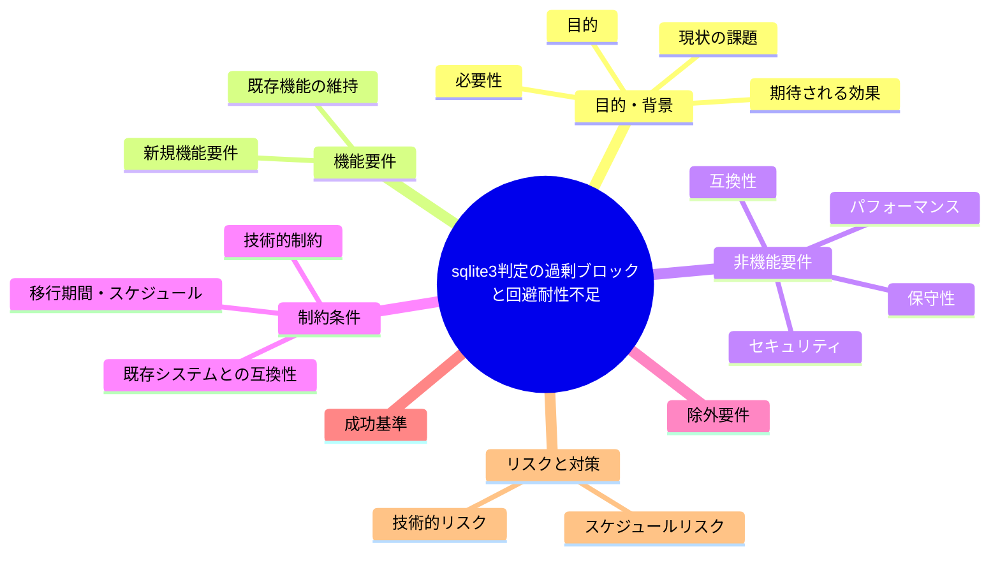

# 要求定義書: R6 の sqlite3 判定が部分文字列 regex で過剰ブロック・回避耐性不足

**プロジェクト名**: R6 の sqlite3 判定が部分文字列 regex で過剰ブロック・回避耐性不足
**作成日**: 2026年07月14日
**最終更新**: 2026年07月14日

---

## 要求定義の全体像

---

## 1. 目的・背景

### 1.1 目的（必須）

R6のsqlite3判定精度を改善するか判断する

### 1.2 背景

出典: 2026-07-14 fableによる本システムの自己調査で検出。

- **現状の課題**:
  - `[[ "$CMD" =~ sqlite3 ]]` は文字列 "sqlite3" を含むあらゆるコマンド（例: `grep sqlite3 doc.md`）を一律ブロックしてしまう（過剰ブロック・false positive）。
  - 逆に `python3 -c "import sqlite3 as s"` のような別経路の sqlite3 アクセスは判定をすり抜ける（false negative）。
  - 過剰ブロックと貧弱な回避耐性が同居しており、判定精度・防御効果の両面で不十分な状態になっている。

- **必要性**:
  - 意図しない誤ブロックによる作業阻害と、意図的な回避への耐性不足の両方を改善する余地がある。

### 1.3 期待される効果（必須: 1 件以上）

- **効果 1**: sqlite3 コマンド起動そのもの（コマンド名としての `sqlite3` 実行）のみを正確に検知し、文字列としての言及（grep 対象等）は誤ブロックしない判定ロジックに改善される、または現状仕様が許容範囲内である旨が判断・記録される（○/×で判定可能）。

---

## 2. 機能要件

### 2.1 既存機能の維持（該当する場合）

- R6（sqlite3 直接操作の制限）というルールの目的自体は維持する。

### 2.2 新規機能要件

- （対応する場合）コマンドの先頭トークン・実行ファイル名としての `sqlite3` を判定するロジックへの改善、および `python3 -c "import sqlite3"` 等の代替経路への対応検討。

---

## 3. 非機能要件

### 3.1 パフォーマンス

- 特になし。

### 3.2 セキュリティ

- 回避耐性の向上により、意図的な DB 直接操作の抜け穴を減らす。

### 3.3 互換性

- 既存の R6 ルールを利用する他チェックとの整合が必要。

### 3.4 保守性

- 正規表現の複雑化に伴うメンテナンス性への影響を考慮する。

---

## 4. 制約条件

### 4.1 技術的制約

- シェルコマンド文字列の静的解析には限界があり、あらゆる回避経路を完全に防ぐことは困難である。

### 4.2 既存システムとの互換性

- 既存の PreToolUse.sh の他判定ロジックとの整合が必要。

### 4.3 移行期間・スケジュール

- 未定（対応要否は本 issue 起票後に判断）。

---

## 5. 除外要件

- sqlite3 以外のコマンド判定ロジックの見直しは対象外。

---

## 6. 成功基準（必須: 1 件以上）

- `grep sqlite3 doc.md` 等の非該当コマンドが誤ブロックされなくなる、または現状仕様の許容が判断・記録される。

---

## 7. リスクと対策

### 7.1 技術的リスク

- **リスク**: 判定を厳密化しすぎると、別の回避経路（例: エイリアス、別言語からの呼び出し）が新たに生まれる可能性がある。
  - **対策**: 対応する場合は完全な防御ではなく実用上のバランスを重視した改善とする。

### 7.2 スケジュールリスク

- **リスク**: 対応要否がユーザー判断待ちのため着手時期未定。
  - **対策**: 本 issue を起票済みとして保持し、優先度判断を待つ。

---

## 8. 参考資料

### プロジェクトドキュメント

- なし

### その他の参考資料

- `.agent-skill-chain/source/enforcement/claude/PreToolUse.sh:285-286, 333-337`

---

## 9. 次のステップ

この要求定義書の承認後、対応要否をユーザーが判断し、対応する場合は以下のドキュメントを作成します：

- **次**: `01_要件定義.md` - 要件定義フェーズ
