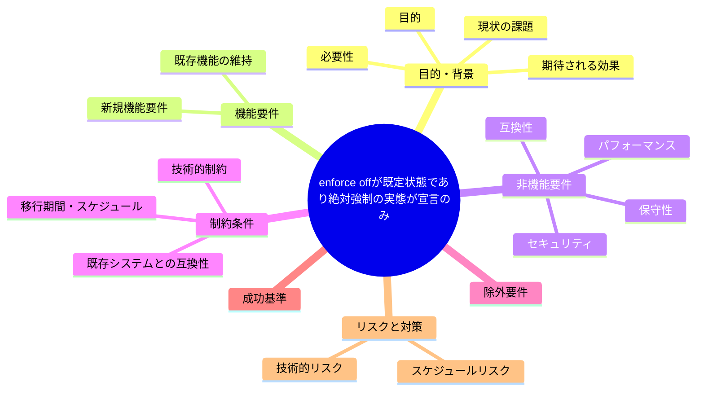
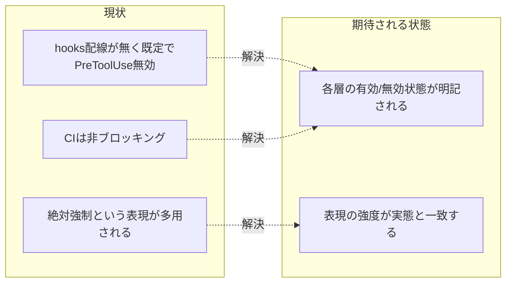

# 要求定義書: enforce off が既定状態であり「絶対強制」の実態が宣言のみ

**プロジェクト名**: enforce off が既定状態であり「絶対強制」の実態が宣言のみ
**作成日**: 2026 年 07 月 14 日
**最終更新**: 2026 年 07 月 14 日

> **重要**:
>
> - 要求定義書は、プロジェクトの全体像を把握するためのものです。詳細な技術仕様や実装方法は要件定義書以降で記載します。必要最低限の情報に収めることを心掛けてください。
> - **このドキュメントは常に更新**: 要求の変更や追加があった場合は、即座にこのドキュメントを更新してください。ドキュメントは「生きているドキュメント」として扱い、実装内容と常に同期させます。
> - **必須項目**: 以下の「必須」と明記した項目は空欄・抽象語のみ（例: 「{説明}」のまま）で提出しないこと。判定可能な形（目的は1文・成功基準は○/×で判定できる記載等）で記入すること。
>
> **用語**: [.agent-skill-chain/source/CONCEPTS.md §用語規約](../../../../.agent-skill-chain/source/CONCEPTS.md#用語規約) を参照。

---

## 要求定義の全体像

**注意**:

- 上記の「プロジェクト名」は例です。実際のプロジェクト名に置き換えてください。
- マインドマップは全体像を把握するためのものです。主要なセクション名程度に留め、詳細は記載しないでください。

---

## 1. 目的・背景

### 1.1 目的（必須）

runtime 強制の実効性（4層強制のうち実際に効いている層）を整理し「絶対強制」の記述実態と一致させる。

### 1.2 背景

2026-07-14 fable による本システムの自己調査で検出。

- **現状の課題**:
  - 現在の `.claude/settings.json` には hooks 配線が無く（deny 3行のみ）、`settings.json.bak` は `{}` である。
  - 本リポの通常セッションでは PreToolUse による orchestrator ブロックは動いておらず、「絶対強制」「例外なく拒否」は AI の自己規律（advisory）とレビューだけで支えられている。
  - CI が非ブロッキング・CI で DB 検査不能である点と合わせると、4層強制のうち実際に効いているのは wrapper と人手レビューのみという状態になっている。

- **必要性**:
  - 「絶対強制」という記述が実態（opt-in・現在は無効）と乖離している点を解消し、利用者の誤解を防ぐ必要がある。

### 1.3 期待される効果（必須: 1 件以上）

- **効果 1**: enforcement の各層について「常時有効」「opt-in」「advisory のみ」のいずれであるかが記述上明確になる。
- **効果 2**: 「絶対強制」等の強い表現が、実際に機械強制されている範囲にのみ使われる状態になる。

**現状と期待される状態の比較**（必要に応じて）:

---

## 2. 機能要件

### 2.1 既存機能の維持（該当する場合）

enforce on/off の opt-in 設計自体は維持する（本 issue は記述整合の課題）。

### 2.2 新規機能要件

{対応方針は 01 要件定義以降で検討。本書では課題の提起に留める}

---

## 3. 非機能要件

### 3.1 パフォーマンス

- {該当なし}

### 3.2 セキュリティ

- 誤った安全性認識（「絶対強制されている」と誤解した状態での運用）を避けること。

### 3.3 互換性

- 既存の enforce on/off 運用フローを変えないこと（本 issue は記述整合が主眼）。

### 3.4 保守性

- {01 要件定義以降で検討}

---

## 4. 制約条件

### 4.1 技術的制約

- {01 要件定義以降で検討}

### 4.2 既存システムとの互換性

- SETUP.md の enforce on が opt-in である既存設計と矛盾しないこと。

### 4.3 移行期間・スケジュール

- {未定}

---

## 5. 除外要件

対応方針の具体設計・実装（本 issue は課題の起票のみ）。CI のブロッキング化自体の実装。

---

## 6. 成功基準（必須: 1 件以上）

- enforcement/README.md 等の「絶対強制」宣言箇所について、実際の有効状態（既定 opt-in か常時強制か）が明記されていること。

---

## 7. リスクと対策

### 7.1 技術的リスク

- **リスク**: 表現を弱めると規約遵守への意識が下がる可能性がある。
  - **対策**: 表現の正確化と同時に、機械強制を既定で有効化する選択肢も 01 以降で検討する。

### 7.2 スケジュールリスク

- **リスク**: {特になし}
  - **対策**: {特になし}

---

## 8. 参考資料

### プロジェクトドキュメント

- 既存プロジェクトの場合は、[`00_システム理解.md`](./00_システム理解.md) - システム理解を参照

### その他の参考資料

- `.claude/settings.json`（hooks なし）
- `.agent-skill-chain/source/SETUP.md:103-113`（enforce on は opt-in）
- `.agent-skill-chain/source/enforcement/README.md` の「絶対強制」多数宣言

---

## 9. 次のステップ

この要求定義書の承認後、以下のドキュメントを作成します：

- **次**: [`01_要件定義.md`](./01_要件定義.md) - 要件定義フェーズ
