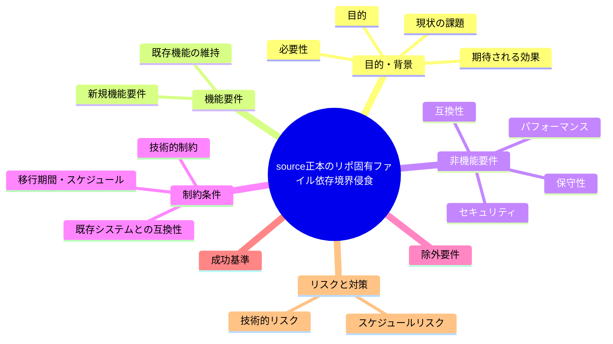
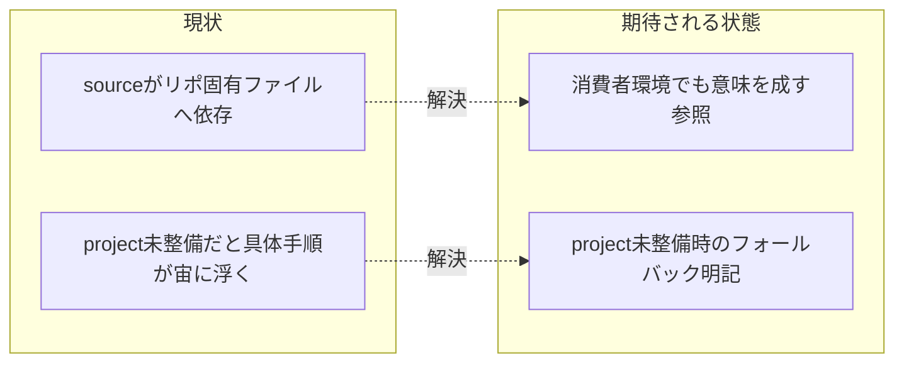

# 要求定義書: 汎用パッケージ正本（source/）がリポ固有ファイルへ依存する境界侵食

**プロジェクト名**: source 正本のリポ固有ファイル依存境界侵食
**作成日**: 2026 年 07 月 14 日
**最終更新**: 2026 年 07 月 14 日

> **重要**:
>
> - 要求定義書は、プロジェクトの全体像を把握するためのものです。詳細な技術仕様や実装方法は要件定義書以降で記載します。必要最低限の情報に収めることを心掛けてください。
> - **このドキュメントは常に更新**: 要求の変更や追加があった場合は、即座にこのドキュメントを更新してください。ドキュメントは「生きているドキュメント」として扱い、実装内容と常に同期させます。
> - **必須項目**: 以下の「必須」と明記した項目は空欄・抽象語のみ（例: 「{説明}」のまま）で提出しないこと。判定可能な形（目的は1文・成功基準は○/×で判定できる記載等）で記入すること。
>
> **用語**: [.agent-skill-chain/source/CONCEPTS.md §用語規約](../../../.agent-skill-chain/source/CONCEPTS.md#用語規約) を参照。

---

## 要求定義の全体像

**注意**:

- 上記の「プロジェクト名」は例です。実際のプロジェクト名に置き換えてください。
- マインドマップは全体像を把握するためのものです。主要なセクション名程度に留め、詳細は記載しないでください。

---

## 1. 目的・背景

### 1.1 目的（必須）

配布物である source/ から消費者環境に存在しない本リポ固有ファイルへの依存を解消する。

### 1.2 背景

2026-07-14 fable による本システムの自己調査で検出。

- **現状の課題**:
  - 配布物である `.agent-skill-chain/source/` 配下から、消費者環境には存在しない本リポ固有ファイルへの参照が複数ある（`source/skills/agent/run_command.md:48-50`、`source/workflow/PHASES.md:33`、`source/CONTEXT_EFFICIENCY.md:7,64`）。
  - 「コア＝抽象／project＝具体」という建付けは説明されているが、消費者が `init` した時点で参照先（本リポ固有の project ファイル等）が存在せず、必須ゲートの「具体手順」が宙に浮く。

- **必要性**:
  - 消費者が本パッケージを導入した際に、参照先不明のリンクや「具体手順は project 参照」という指示が機能しないと、必須ゲートを正しく実行できない。

### 1.3 期待される効果（必須: 1 件以上）

- **効果 1**: `source/skills/agent/run_command.md:48-50`、`source/workflow/PHASES.md:33`、`source/CONTEXT_EFFICIENCY.md:7,64` の参照が、消費者環境でも意味を成す形（フォールバック記載・条件付き参照・具体例をコア側に最小限含める等）に修正される。
- **効果 2**: 「コア＝抽象／project＝具体」の境界規約が、消費者が project 未整備の状態でも破綻しない設計になる。

**現状と期待される状態の比較**（必要に応じて）:

---

## 2. 機能要件

### 2.1 既存機能の維持（該当する場合）

「コア＝抽象／project＝具体」の建付け自体は維持する。

### 2.2 新規機能要件

- `source/skills/agent/run_command.md:48-50`、`source/workflow/PHASES.md:33`、`source/CONTEXT_EFFICIENCY.md:7,64` の参照内容を精査し、消費者環境（project 未整備）でも破綻しない記述（例: project 側に該当ファイルが無い場合のフォールバック文言）を追加する。

---

## 3. 非機能要件

### 3.1 パフォーマンス

- 特になし。

### 3.2 セキュリティ

- 特になし。

### 3.3 互換性

- 本リポ（自己拡張元）での既存動作を壊さないこと。

### 3.4 保守性

- 今後 source/ に新規追加する参照が同種の境界侵食を起こさないよう、レビュー観点を明確にする。

---

## 4. 制約条件

### 4.1 技術的制約

- source/ は配布物であり、消費者環境には本リポ固有の project ファイルが存在しない前提を踏まえる。

### 4.2 既存システムとの互換性

- 本リポ自身の自己拡張運用（project/自己拡張ワークフロー.md 参照）と矛盾しないこと。

### 4.3 移行期間・スケジュール

- 特になし。

---

## 5. 除外要件

- project/ 側のファイル内容自体の変更は対象外とする（source/ 側の参照方法の是正が主眼）。

---

## 6. 成功基準（必須: 1 件以上）

- `source/skills/agent/run_command.md:48-50`、`source/workflow/PHASES.md:33`、`source/CONTEXT_EFFICIENCY.md:7,64` について、project 未整備の消費者環境でも破綻しない記述に修正されている、または対応方針が明確に決定されている。

---

## 7. リスクと対策

### 7.1 技術的リスク

- **リスク**: フォールバック記載を追加すると source/ の抽象性（コアは具体を持たない原則）と矛盾する可能性がある。
  - **対策**: 具体値を書かず「project に無い場合はこの規約を適用しない」旨の条件分岐のみを記載する等、抽象性を保ったまま対応する。

### 7.2 スケジュールリスク

- **リスク**: 特になし。
  - **対策**: 特になし。

---

## 8. 参考資料

### プロジェクトドキュメント

- 既存プロジェクトの場合は、[`00_システム理解.md`](./00_システム理解.md) - システム理解を参照

### その他の参考資料

- `.agent-skill-chain/source/skills/agent/run_command.md:48-50`
- `.agent-skill-chain/source/workflow/PHASES.md:33`
- `.agent-skill-chain/source/CONTEXT_EFFICIENCY.md:7,64`

---

## 9. 次のステップ

この要求定義書の承認後、以下のドキュメントを作成します：

- **次**: [`01_要件定義.md`](./01_要件定義.md) - 要件定義フェーズ
