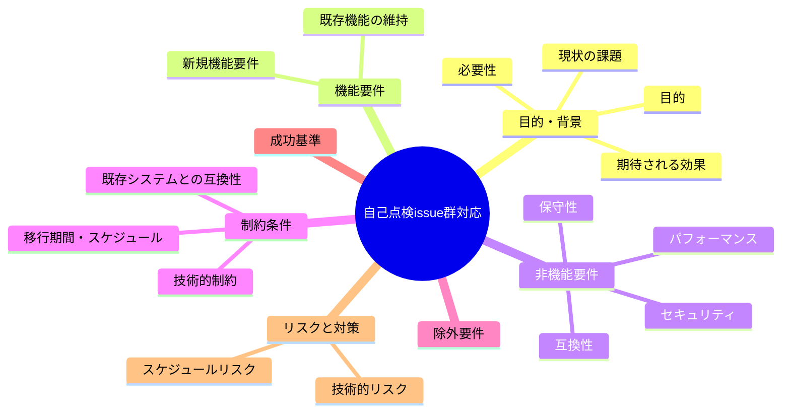
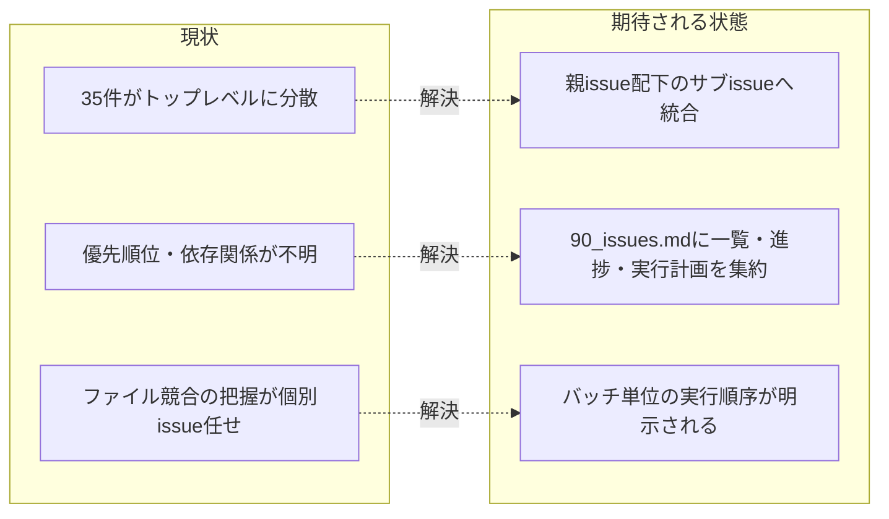

# 要求定義書: 自己点検issue群対応

**プロジェクト名**: 自己点検issue群対応
**作成日**: 2026年07月14日
**最終更新**: 2026年07月14日

> **重要**:
>
> - 要求定義書は、プロジェクトの全体像を把握するためのものです。詳細な技術仕様や実装方法は要件定義書以降で記載します。必要最低限の情報に収めることを心掛けてください。
> - **このドキュメントは常に更新**: 要求の変更や追加があった場合は、即座にこのドキュメントを更新してください。ドキュメントは「生きているドキュメント」として扱い、実装内容と常に同期させます。
> - **必須項目**: 以下の「必須」と明記した項目は空欄・抽象語のみ（例: 「{説明}」のまま）で提出しないこと。判定可能な形（目的は1文・成功基準は○/×で判定できる記載等）で記入すること。
>
> **用語**: [.agent-skill-chain/source/CONCEPTS.md §用語規約](../../../../.agent-skill-chain/source/CONCEPTS.md#用語規約) を参照。

---

## 要求定義の全体像

**注意**:

- 上記の「プロジェクト名」は例です。実際のプロジェクト名に置き換えてください。
- マインドマップは全体像を把握するためのものです。主要なセクション名程度に留め、詳細は記載しないでください。

---

## 1. 目的・背景

### 1.1 目的（必須）

fable調査で検出した35件の課題を一元管理し優先順位で順次対応する

### 1.2 背景

- **現状の課題**:
  - fable によるシステム自己調査（2026-07-14）により、`docs/maintainer/workflow/` 直下に 35 件のトップレベル issue（`00_要求定義.md` のみ、01〜04 未作成）が一括起票され、優先順位・依存関係・実行順序が個々の issue フォルダに分散していて全体像が把握できない。
  - 35 件は緊急度・難易度・修正対象ファイルが重なり合っており、並行作業時にファイル競合（同一ファイルへの複数 issue からの同時編集）が発生しうる状態にある。
  - トップレベルのまま個別に着手すると、着手順序の判断基準がなく、ユーザー判断が必要な項目（API 障害時運用ドラフト確定・enforce 配線方針・実装ゲート簡素化方針）の扱いが見落とされやすい。

- **必要性**:
  - fable によるシステム自己調査（2026-07-14）で検出した 35 件の課題を一元管理し、緊急度・難易度・ファイル競合を踏まえた優先順位で順次対応する必要がある。
  - 35 件を親 issue 配下のサブ issue（`90_issues/`）へ束ね直し、一覧・進捗・実行計画（並行実行バッチ）を単一の `90_issues.md` に集約することで、対応順序と依存関係を明示する。

### 1.3 期待される効果（必須: 1 件以上）

- **効果 1**: 35 件のトップレベル issue が親 issue 1 件・サブ issue 35 件の構造に整理され、`docs/maintainer/workflow/` 直下のトップレベル issue 一覧から個別に埋もれず追跡できる（`90_issues.md` の Issue 一覧に 35 件全件が記載されていることで判定）。
- **効果 2**: 各 issue の緊急度・難易度・対応方針・ファイル競合クラスタ・実行バッチが `90_issues.md` に記録され、着手順序（バッチ 1〜7、バッチ N はバッチ N-1 の全 PR マージ後に開始）が一意に判断できる。

**現状と期待される状態の比較**（必要に応じて）:

---

## 2. 機能要件

### 2.1 既存機能の維持（該当する場合）

- 35 件の各 issue の `00_要求定義.md` の内容（frontmatter・本文）はそのまま維持する（移動に伴う相対リンクの深度補正を除き内容変更しない）。

### 2.2 新規機能要件

- 親 issue フォルダ（`docs/maintainer/workflow/20260714_180751_自己点検issue群対応/`）の新設と `00_要求定義.md` の作成。
- 35 件の既存トップレベル issue フォルダを `git mv` により親 issue 配下の `90_issues/<元のフォルダ名>/` へ移動。
- 親 issue 直下への `90_issues.md`（Issue 一覧・進捗状況・実行計画（並行実行バッチ）・参考資料）の新規作成。

---

## 3. 非機能要件

### 3.1 パフォーマンス

- 該当なし（ドキュメント整理作業のため）。

### 3.2 セキュリティ

- 該当なし。

### 3.3 互換性

- 移動後も各サブ issue 内の相対リンク（`.agent-skill-chain/source/CONCEPTS.md` 等の issue ディレクトリ外参照）が正しく解決すること（階層が 2 段深くなるため `../` を 2 段補正、または移動後に正しく解決する深度へ是正）。

### 3.4 保守性

- `90_issues.md` に実行計画（トリアージ結果・ファイル競合クラスタ・バッチ計画）を記録し、以後の対応時に参照できるようにする。

---

## 4. 制約条件

### 4.1 技術的制約

- サブ issue 化の対象は `docs/maintainer/workflow/` 直下のトップレベル issue のみとし、`.agent-skill-chain/project/自己拡張ワークフロー.md` の上書き定義（単一 issue＝`docs/maintainer/workflow/<timestamp>_<title>/`、サブ issue＝`docs/maintainer/workflow/{parent}/90_issues/{ディレクトリ名}/`）に従う。
- 35 件のフォルダ名・`00_要求定義.md` の中身は変更しない（相対リンクの深度補正のみ実施）。

### 4.2 既存システムとの互換性

- 移動元パスを参照する外部ファイルが存在しないことを事前に確認済み（`docs/maintainer/workflow/close/` を除くリポジトリ全域で 35 フォルダ名への参照なし）。

### 4.3 移行期間・スケジュール

- 本対応は 1 回のコミット・PR で完結させる（マージは別途ユーザー判断）。

---

## 5. 除外要件

- 35 件のサブ issue 個別の実装（`01_要件定義.md`〜`04_review.md` の作成、実際のコード修正）は本 issue の対象外。各サブ issue 側で別途対応する。
- `90_issues.md` に記載する実行計画のバッチ割り当て・トリアージ結果自体の妥当性再検証は本 issue の対象外（fable による並行実行計画をそのまま転記する）。

---

## 6. 成功基準（必須: 1 件以上）

- 35 件全てのトップレベル issue フォルダが `docs/maintainer/workflow/20260714_180751_自己点検issue群対応/90_issues/` 配下へ `git mv` により移動済みであること。
- 親 issue 直下に `00_要求定義.md` と `90_issues.md`（Issue 一覧 35 件・進捗状況・実行計画（並行実行バッチ）・参考資料の全セクション）が存在すること。
- 上記変更が 1 コミットにまとめられ、リモートへ push され、`gh pr create` によって PR が作成されていること（マージは未実施）。

---

## 7. リスクと対策

### 7.1 技術的リスク

- **リスク**: 移動に伴い issue ディレクトリの深さが 2 段深くなり、issue 外部を指す相対リンクが解決しなくなる。
  - **対策**: 移動前に全 35 件を `grep -rn '\]\(\.\./' ` で検査し、実リンクが見つかった 24 件について移動前に深度補正（新しい階層で正しく解決する `../` の数へ是正）した上で `git mv` する。

### 7.2 スケジュールリスク

- **リスク**: 35 件のトリアージ結果・実行計画の記載漏れにより、以後の着手順序判断を誤る。
  - **対策**: `90_issues.md` にトリアージ結果全表・ファイル競合クラスタ・バッチ計画・却下/様子見の理由を省略せず転記する。

---

## 8. 参考資料

### プロジェクトドキュメント

- [`90_issues.md`](./90_issues.md) - 35 件のサブ issue 一覧・進捗状況・実行計画

### その他の参考資料

- 詳細な実行計画の可視化版（fable による並行実行計画。2026-07-14 作成）: https://claude.ai/code/artifact/84f366f2-e284-4218-b400-4e39c3731aab

---

## 9. 次のステップ

この要求定義書の承認後、以下を実施します：

- **次**: 35 件のサブ issue（`90_issues/` 配下）それぞれについて、`90_issues.md` の実行計画（並行実行バッチ）に従い、バッチ単位で `requirement-discovery` 以降を委譲・実施する。
