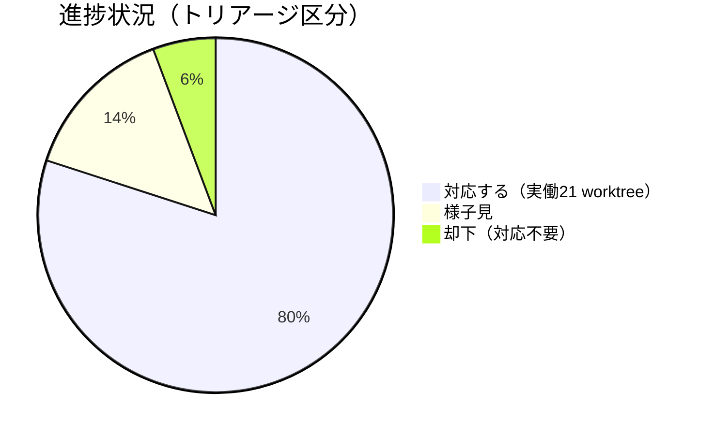

# Issue 一覧: 自己点検issue群対応

**プロジェクト名**: 自己点検issue群対応
**作成日**: 2026年07月14日
**最終更新**: 2026年07月14日

> **重要**: **このドキュメントは常に更新**: issue（またはタスク）の進捗状況、ステータス、優先度などの変更があった場合は、即座にこのドキュメントを更新してください。ドキュメントは「生きているドキュメント」として扱い、実装内容と常に同期させます。
>
> **用語**: [.agent-skill-chain/source/CONCEPTS.md §用語規約](../../../../.agent-skill-chain/source/CONCEPTS.md#用語規約) を参照。

---

## Issue 一覧

| Issue 名 | 概要 | 優先度 | ステータス | リンク |
| --- | --- | --- | --- | --- |
| 20260714_163129_CIaudit非ブロッキング化問題 | CI audit を「最後の砦」として実効的にブロッキング化するか判断する（PR #50 でマージ済み） | 高 | 完了 | [詳細](./90_issues/20260714_163129_CIaudit非ブロッキング化問題/00_要求定義.md) |
| 20260714_163203_workflowDB非追跡によるCI検知SKIP問題 | DB系チェックがCIで恒常的にSKIPされる構造を解消するか判断する（PR #70 でマージ済み） | 高 | 完了 | [詳細](./90_issues/20260714_163203_workflowDB非追跡によるCI検知SKIP問題/00_要求定義.md) |
| 20260714_163206_実装ゲート直列化過多 | 実装着手前ゲート（review-docs／GitHub Issue 起票／branch 記録／PR 紐づけ）の直列化を見直す（PR #84 でマージ済み） | 中 | 完了 | [詳細](./90_issues/20260714_163206_実装ゲート直列化過多/00_要求定義.md) |
| 20260714_163235_scribeロール検証unenforced問題 | AGENT_ROLE自己申告によるscribeなりすましを防止するか判断する | 中 | 未着手 | [詳細](./90_issues/20260714_163235_scribeロール検証unenforced問題/00_要求定義.md) |
| 20260714_163252_review-docs表外必須ゲート矛盾 | PHASE_COMMAND_MAP と review-docs の位置づけの矛盾を解消する（PR #53 でマージ済み） | 中 | 完了 | [詳細](./90_issues/20260714_163252_review-docs表外必須ゲート矛盾/00_要求定義.md) |
| 20260714_163305_直接作業検知の弱い間接検出問題 | check_25の永久PASS問題を解消するか判断する（PR #64 でマージ済み） | 高 | 完了 | [詳細](./90_issues/20260714_163305_直接作業検知の弱い間接検出問題/00_要求定義.md) |
| 20260714_163330_enforcement表セル長大重複 | enforcement ゲート記述の重複箇所を集約し、正本を一元化する（PR #81 でマージ済み） | 中 | 完了 | [詳細](./90_issues/20260714_163330_enforcement表セル長大重複/00_要求定義.md) |
| 20260714_163333_ゲート無効化envによる自己バイパス問題 | ゲート無効化envの自己バイパスリスクを低減するか判断する | 中 | 未着手 | [詳細](./90_issues/20260714_163333_ゲート無効化envによる自己バイパス問題/00_要求定義.md) |
| 20260714_163403_未実装強制項目の正本堆積問題 | 未実装のまま常駐する失敗条件群の扱いを整理するか判断する（PR #81 でマージ済み） | 中 | 完了 | [詳細](./90_issues/20260714_163403_未実装強制項目の正本堆積問題/00_要求定義.md) |
| 20260714_163408_オンボーディング読了義務過大 | オンボーディング読了義務の分量と検証手段の不在を見直す | 低 | 未着手 | [詳細](./90_issues/20260714_163408_オンボーディング読了義務過大/00_要求定義.md) |
| 20260714_163432_auditとREADME対応表のドリフト | 正本ドキュメントと実装のチェック項目一覧を一致させるか判断する（PR #81 でマージ済み） | 中 | 完了 | [詳細](./90_issues/20260714_163432_auditとREADME対応表のドリフト/00_要求定義.md) |
| 20260714_163447_run_command長大制約項目 | 委譲パケットの Constraints 項目の肥大化を整理する（PR #67 でマージ済み） | 低 | 完了 | [詳細](./90_issues/20260714_163447_run_command長大制約項目/00_要求定義.md) |
| 20260714_163502_配備hook陳腐化によるロックアウト再発リスク | 配備済みhookを正本と同期させるか判断する（PR #66 でマージ済み） | 高 | 完了 | [詳細](./90_issues/20260714_163502_配備hook陳腐化によるロックアウト再発リスク/00_要求定義.md) |
| 20260714_163525_ルートworkflow.db追跡バグ | ルート直下の追跡済み workflow.db（0バイト）を除去し .gitignore と整合させる | - | 対応不要 | [詳細](./90_issues/20260714_163525_ルートworkflow.db追跡バグ/00_要求定義.md) |
| 20260714_163531_allowlistにSkill欠如による自己ロックアウト | orchestrator allowlistへSkillツールを追加するか判断する（PR #55 でマージ済み） | 高 | 完了 | [詳細](./90_issues/20260714_163531_allowlistにSkill欠如による自己ロックアウト/00_要求定義.md) |
| 20260714_163600_sqlite3判定の過剰ブロックと回避耐性不足 | R6のsqlite3判定精度を改善するか判断する（PR #63 でマージ済み） | 中 | 完了 | [詳細](./90_issues/20260714_163600_sqlite3判定の過剰ブロックと回避耐性不足/00_要求定義.md) |
| 20260714_163601_memo非追跡ルール違反 | ルート直下 memo/test.md の追跡を解除し非追跡ルールと整合させる | - | 対応不要 | [詳細](./90_issues/20260714_163601_memo非追跡ルール違反/00_要求定義.md) |
| 20260714_163629_GIT_RANGE既定による複数コミットpush監査漏れ | 多コミットpush時の差分監査漏れを解消するか判断する（PR #57 でマージ済み） | 中 | 完了 | [詳細](./90_issues/20260714_163629_GIT_RANGE既定による複数コミットpush監査漏れ/00_要求定義.md) |
| 20260714_163639_templates配置がruntime名前空間同居 | 配布物であるテンプレートの配置場所と runtime/ 名前空間規約の整合を見直す | 低 | 未着手 | [詳細](./90_issues/20260714_163639_templates配置がruntime名前空間同居/00_要求定義.md) |
| 20260714_163640_リンク切れ大量発生の是正 | 正本ドキュメント間の相対リンク切れを解消し、参照網の整合を保つ | 中 | 未着手 | [詳細](./90_issues/20260714_163640_リンク切れ大量発生の是正/00_要求定義.md) |
| 20260714_163717_close済みissue参照アンバランス | 正本ドキュメントから close/ 配下（deny 対象）への経緯参照依存を見直す（PR #69 でマージ済み） | 低 | 完了 | [詳細](./90_issues/20260714_163717_close済みissue参照アンバランス/00_要求定義.md) |
| 20260714_163724_close移動リンク切れとRead制限の相互作用 | close/ 配下参照の切れたリンクを検証・修復できない構造的な行き詰まりを解消する（PR #69 でマージ済み） | 中 | 完了 | [詳細](./90_issues/20260714_163724_close移動リンク切れとRead制限の相互作用/00_要求定義.md) |
| 20260714_163756_auditPRBODYregex非POSIX依存 | audit.sh #6 の PR_BODY 内部参照検査 regex の過検知・移植性問題を修正する（PR #57 でマージ済み） | 低 | 完了 | [詳細](./90_issues/20260714_163756_auditPRBODYregex非POSIX依存/00_要求定義.md) |
| 20260714_163810_API障害時運用ドラフト注記の未解消 | 正本ルールに残る「暫定ドラフト・要人間確認」節の宙吊り状態を解消する（PR #60 でマージ済み） | 低 | 完了 | [詳細](./90_issues/20260714_163810_API障害時運用ドラフト注記の未解消/00_要求定義.md) |
| 20260714_163833_enforceoff既定で強制未配線 | runtime 強制の実効性（4層強制のうち実際に効いている層）を整理し「絶対強制」の記述実態と一致させる（PR #76 でマージ済み） | 高 | 完了 | [詳細](./90_issues/20260714_163833_enforceoff既定で強制未配線/00_要求定義.md) |
| 20260714_163852_旧ディレクトリ名残存による記述不整合 | 改名済みディレクトリ名（`.workflow`/`.agents`）が正本に残存し実体と食い違う状態を解消する（PR #72 でマージ済み） | 中 | 完了 | [詳細](./90_issues/20260714_163852_旧ディレクトリ名残存による記述不整合/00_要求定義.md) |
| 20260714_163913_GETTINGSTARTEDmemo指示食い違い | 初心者向け GETTING_STARTED の証跡運用記述を非推奨方針と整合させる（PR #51 でマージ済み） | 中 | 完了 | [詳細](./90_issues/20260714_163913_GETTINGSTARTEDmemo指示食い違い/00_要求定義.md) |
| 20260714_163931_HEARTBEAT読了強制推奨の記述矛盾 | HEARTBEAT 読了の強制/推奨に関する入口（AGENTS.md）と正本（CORE.md）の記述矛盾を解消する（PR #54 でマージ済み） | 低 | 完了 | [詳細](./90_issues/20260714_163931_HEARTBEAT読了強制推奨の記述矛盾/00_要求定義.md) |
| 20260714_163956_issue分類優先度過剰複雑 | 依頼分類・優先度規則の曖昧ケースにおけるダブルバインドを解消する | 低 | 未着手 | [詳細](./90_issues/20260714_163956_issue分類優先度過剰複雑/00_要求定義.md) |
| 20260714_164009_SKILLmdとrun_commandmd二重定義及びREBUILD_PLAN不在参照 | skills/agent/SKILL.md と run_command.md の二重定義・内容乖離、および実在しない REBUILD_PLAN 参照を解消する（PR #52 でマージ済み） | 高 | 完了 | [詳細](./90_issues/20260714_164009_SKILLmdとrun_commandmd二重定義及びREBUILD_PLAN不在参照/00_要求定義.md) |
| 20260714_164034_closedeny監査手順衝突 | close/ deny 設定と監査・検証作業との恒常的な衝突・非対称を見直す（PR #69 でマージ済み） | 中 | 完了 | [詳細](./90_issues/20260714_164034_closedeny監査手順衝突/00_要求定義.md) |
| 20260714_164050_行番号相互参照の脆弱性是正 | 行番号（`:18` `:33` `:57` 等）による正本間の相互参照をアンカー参照へ統一し脆弱性を解消する | 中 | 未着手 | [詳細](./90_issues/20260714_164050_行番号相互参照の脆弱性是正/00_要求定義.md) |
| 20260714_164128_source正本のリポ固有ファイル依存境界侵食 | 配布物である source/ から消費者環境に存在しない本リポ固有ファイルへの依存を解消する（PR #74 でマージ済み） | 中 | 完了 | [詳細](./90_issues/20260714_164128_source正本のリポ固有ファイル依存境界侵食/00_要求定義.md) |
| 20260714_164206_IO_CONTRACT契約見出し未統一の猶予放置 | IO_CONTRACT の「必須」見出しと「既存は追って揃える」猶予の同居による監査基準の曖昧さを解消する（PR #61 でマージ済み） | 低 | 完了 | [詳細](./90_issues/20260714_164206_IO_CONTRACT契約見出し未統一の猶予放置/00_要求定義.md) |
| 20260714_164245_AGENTSmd実在しない参照先の修正 | AGENTS.md:62 が指す「issue 作成関連ドキュメント」という実在しない参照先を是正する（PR #54 でマージ済み） | 低 | 完了 | [詳細](./90_issues/20260714_164245_AGENTSmd実在しない参照先の修正/00_要求定義.md) |

**Issue 詳細は各 issue ディレクトリ（`90_issues/{issue}/`）を参照すること。** 本ファイルは一覧・進捗・依存関係の index とする。

---

## 進捗状況

### 全体進捗

全 35 件のうち、内訳は次のとおり。

- **対応する**: 28 件（うち実装作業は統合により実働 21 worktree に集約）
- **様子見**: 5 件（他 issue の対応結果を待って再評価）
- **却下（対応不要）**: 2 件（前提が解消済みのため close 移動のみで完結）
- **完了**: 26 / 35（バッチ1・7並列＋バッチ2・4並列＋バッチ3・4並列＋バッチ4・3並列＋バッチ5・1並列＋バッチ6・1並列 worktree が全て mainへマージ済み。統合により実働 20 worktree、issue 単位では 26 件: 163129, 163203, 163206, 163252, 163305, 163330, 163403, 163432, 163447, 163502, 163531, 163600, 163629, 163717, 163724, 163756, 163810, 163833, 163852, 163913, 163931, 164009, 164034, 164128, 164206, 164245 / PR #50, #51, #52, #53, #54, #55, #57, #60, #61, #63, #64, #66, #67, #69, #70, #72, #74, #76, #81, #84）
- **進行中**: 0 / 35
- **未着手**: 7 / 35（却下 2 件・完了 26 件を除く残り）

**進捗状況の可視化**:

### 優先度別進捗

- **高優先度**: 7 / 8（163129, 163203, 163305, 163502, 163531, 163833, 164009, 及び統合先を含む。完了: 163129, 163203, 163305, 163502, 163531, 163833, 164009）
- **中優先度**: 12 / 16（完了: 163206, 163252, 163330, 163403, 163432, 163600, 163629, 163724, 163852, 163913, 164034, 164128）
- **低優先度**: 7 / 9（完了: 163447, 163717, 163756, 163810, 163931, 164206, 164245）
- **却下（優先度なし）**: 0 / 2

---

## 実行計画（並行実行バッチ）

**詳細な実行計画の可視化版**: https://claude.ai/code/artifact/84f366f2-e284-4218-b400-4e39c3731aab （fable による並行実行計画。2026-07-14 作成）

### トリアージサマリー

全 35 件中、対応する 28 件（統合により実働 21 worktree）、様子見 5 件、却下（前提解消済み）2 件。実行は 7 バッチ。バッチ N はバッチ N-1 の全 PR マージ後に開始。

### 各issueのトリアージ結果（緊急度・難易度・方針・理由・競合ファイル）

| # | issueフォルダ名 | 緊急度 | 難易度 | 対応方針 | 理由 | 主な競合ファイル |
|---|---|---|---|---|---|---|
| 1 | 163129_CIaudit非ブロッキング化問題 | 高 | 中 | 対応する（完了・PR #50） | 「最後の砦」が実際は何もブロックしない状態は enforcement 全体の実効性を毀損する筆頭 | `.github/workflows/self-enforce.yml`, `source/enforcement/README.md`, `project/自己拡張ワークフロー.md` |
| 2 | 163203_workflowDB非追跡によるCI検知SKIP問題 | 高 | 大 | 対応する（完了・PR #70） | DB系チェック約20項目がCIで構造的に無効 | `source/enforcement/ci/audit.sh`, `source/enforcement/README.md`, `self-enforce.yml` |
| 3 | 163206_実装ゲート直列化過多 | 中 | 大 | 対応する（完了・PR #84） | 委譲コストが日常的な実害。quick/fullモード設計はユーザー方針確認が前提のため最終盤 | `source/skills/agent/run_command.md`, `source/workflow/PHASES.md`, `source/RULES.md`, `PHASE_COMMAND_MAP.md` |
| 4 | 163235_scribeロール検証unenforced問題 | 中 | 大 | 様子見 | enforce off の現状では実害が顕在化しない。#163833の帰結を待って再評価 | `platforms/claude/settings.enforce.json`, `source/enforcement/claude/PreToolUse.sh`, `scripts/write-workflow-log.sh` |
| 5 | 163252_review-docs表外必須ゲート矛盾 | 中 | 小 | 対応する（完了・PR #53） | 表に行を追加するだけで決着可能 | `source/workflow/PHASE_COMMAND_MAP.md`, `source/workflow/PHASES.md` |
| 6 | 163305_直接作業検知の弱い間接検出問題 | 高 | 大 | 対応する（完了・PR #64） | 「絶対強制」#25がほぼ永久PASSの検知ロジック | `source/enforcement/ci/audit.sh`（check_25）, `source/enforcement/README.md` |
| 7 | 163330_enforcement表セル長大重複 | 中 | 大 | 対応する（#163403・#163432を統合・完了・PR #81） | 6箇所重複は#37で同期漏れ実績あり。挙動変更系issueの後に直列実施 | `source/enforcement/README.md`, `audit.sh`（ヘッダ）, `run_command.md`, `AGENT_CONDUCT.md` |
| 8 | 163333_ゲート無効化envによる自己バイパス問題 | 中 | 中 | 様子見 | #163833・#163203のenforcement再設計の帰結に依存 | `source/enforcement/ci/audit.sh:64-92`, `project/自己拡張ワークフロー.md` |
| 9 | 163403_未実装強制項目の正本堆積問題 | 中 | 中 | 対応する（#163330へ統合・完了・PR #81） | #163330と同一ファイル群のため統合が合理的 | `source/enforcement/README.md:59-82,253-259`, `source/AGENT_CONDUCT.md` |
| 10 | 163408_オンボーディング読了義務過大 | 低 | 大 | 様子見 | 情報アーキテクチャ全体の再設計。README集約・#163206の帰結を見てから着手 | `AGENTS.md`, `source/boot/CORE.md`, `source/boot/LOAD_POLICY.md`, `enforcement/README.md` |
| 11 | 163432_auditとREADME対応表のドリフト | 中 | 小 | 対応する（#163330へ統合・完了・PR #81） | #37行欠落の補完は#163330の中で行うのが二度手間回避になる | `source/enforcement/README.md:227-304`, `audit.sh` |
| 12 | 163447_run_command長大制約項目 | 低 | 中 | 対応する（完了・PR #67） | 委譲パケットの恒常的コンテキスト圧迫。1ファイル完結で対応可能 | `source/skills/agent/run_command.md` |
| 13 | 163502_配備hook陳腐化によるロックアウト再発リスク | 高 | 小 | 対応する（完了・PR #66） | 配備hookと正本の差分254行を現物確認。既知のロックアウト事故を再現しうる。`.claude/`再生成はユーザー許可要 | `.claude/hooks/PreToolUse.sh`（再配備） |
| 14 | 163525_ルートworkflow.db追跡バグ | − | − | 対応不要（却下） | 前提解消済み。git ls-filesにルートworkflow.dbは出現しない（現物確認） | なし |
| 15 | 163531_allowlistにSkill欠如による自己ロックアウト | 高 | 小 | 対応する（完了・PR #55） | allowlistにSkillが無いことを現物確認。1行修正 | `source/enforcement/claude/PreToolUse.sh` |
| 16 | 163600_sqlite3判定の過剰ブロックと回避耐性不足 | 中 | 中 | 対応する（完了・PR #63） | 日常作業を阻害。#163531と同ファイルのため直列 | `source/enforcement/claude/PreToolUse.sh:285-286,333-337` |
| 17 | 163601_memo非追跡ルール違反 | − | − | 対応不要（却下） | 前提解消済み。memo/test.mdは追跡されておらずmemo/は空（現物確認） | なし |
| 18 | 163629_GIT_RANGE既定による複数コミットpush監査漏れ | 中 | 中 | 対応する（#163756を統合・完了・PR #57） | 多コミットpushは頻発し監査漏れが実際に起きる | `source/enforcement/ci/audit.sh:106`, `runtime/templates/github/workflows/audit.yml` |
| 19 | 163639_templates配置がruntime名前空間同居 | 低 | 大 | 様子見 | 実害限定的。ディレクトリ移動は参照網全体に波及する破壊的変更 | `.agent-skill-chain/runtime/templates/`, `自己拡張ワークフロー.md`, `PreToolUse.sh`, `run_command.md` |
| 20 | 163640_リンク切れ大量発生の是正 | 中 | 大 | 対応する（#164050を統合） | 約97箇所のリンク切れは実害。全バッチの最後に単独実施 | `CORE.md`, `RULES.md`, `PHASES.md`, `GETTING_STARTED.md`, `CONTEXT_EFFICIENCY.md`, `project/*`, `skills/*` ほぼ全域 |
| 21 | 163717_close済みissue参照アンバランス | 低 | 中 | 対応する（#163724へ統合・完了・PR #69） | close/ deny方針という同一の設計判断の一側面 | `project/MODEL_TIER_TABLE.md`, `.claude/settings.json` |
| 22 | 163724_close移動リンク切れとRead制限の相互作用 | 中 | 中 | 対応する（#163717・#164034の代表・完了・PR #69） | 「読めないから直せない」構造的行き詰まりが移動のたび悪化する | `.claude/settings.json`, `project/自己拡張ワークフロー.md`, `project/MODEL_TIER_TABLE.md` |
| 23 | 163756_auditPRBODYregex非POSIX依存 | 低 | 小 | 対応する（#163629へ統合・完了・PR #57） | 外部URL過検知と移植性の局所修正 | `source/enforcement/ci/audit.sh:363-369` |
| 24 | 163810_API障害時運用ドラフト注記の未解消 | 低 | 小 | 対応する（完了・PR #60） | 正本ルールの宙吊り状態。ユーザーの明示確認を得て節を確定させる | `project/自己拡張ワークフロー.md:104-111` |
| 25 | 163833_enforceoff既定で強制未配線 | 高 | 大 | 対応する（完了・PR #76） | 「絶対強制」の実態はwrapperと人手レビューのみ。中核判断 | `.claude/settings.json`, `source/SETUP.md`, `enforcement/README.md` |
| 26 | 163852_旧ディレクトリ名残存による記述不整合 | 中 | 小 | 対応する（完了・PR #72） | 設定値誤認による運用ミスに直結するため機械的に一掃 | `enforcement/README.md:25,149,275`, `boot/CORE.md:74`, `boot/LOAD_POLICY.md:13`, `AGENTS.md:125`, `self-enforce.yml`, `audit.sh` |
| 27 | 163913_GETTINGSTARTEDmemo指示食い違い | 中 | 小 | 対応する（完了・PR #51） | 新規参入者が最初に読む文書が非推奨経路を教えている | `source/GETTING_STARTED.md` |
| 28 | 163931_HEARTBEAT読了強制推奨の記述矛盾 | 低 | 小 | 対応する（#164245と同一worktreeで実施・完了・PR #54） | 強制/推奨でenforcement上の意味が異なるため放置不可 | `AGENTS.md:10`, `source/boot/CORE.md:111` |
| 29 | 163956_issue分類優先度過剰複雑 | 低 | 中 | 様子見 | #22/#23未実装で機械強制されず実害未顕在 | `AGENTS.md:39,55-62` |
| 30 | 164009_SKILLmdとrun_commandmd二重定義及びREBUILD_PLAN不在参照 | 高 | 中 | 対応する（完了・PR #52） | 配備されるSKILL.mdが旧ポリシーを実行時に適用させるリスク | `source/skills/agent/SKILL.md`, `run_command.md`, `RULES.md`, `skills/requirements/{extract-goals,write-bdd}/*`, `commands/requirement-discovery.md` |
| 31 | 164034_closedeny監査手順衝突 | 中 | 中 | 対応する（#163724へ統合・完了・PR #69） | audit.shはclose/を走査できるのにエージェントは読めない非対称 | `.claude/settings.json`, `project/自己拡張ワークフロー.md:226-246` |
| 32 | 164050_行番号相互参照の脆弱性是正 | 中 | 中 | 対応する（#163640へ統合） | 行番号参照はサイレントにずれて誤誘導する | `CLAUDE.md`, `PHASES.md`, `project/自己拡張ワークフロー.md`, `run_command.md` |
| 33 | 164128_source正本のリポ固有ファイル依存境界侵食 | 中 | 中 | 対応する（完了・PR #74） | 消費者が`init`した時点で必須ゲートの具体手順が宙に浮く | `source/skills/agent/run_command.md:48-50`, `source/workflow/PHASES.md:33`, `source/CONTEXT_EFFICIENCY.md:7,64` |
| 34 | 164206_IO_CONTRACT契約見出し未統一の猶予放置 | 低 | 小 | 対応する（完了・PR #61） | 「必須」と「追って」の同居は監査基準を曖昧にする | `source/IO_CONTRACT.md:29-46`, `source/skills/agent/SKILL.md` |
| 35 | 164245_AGENTSmd実在しない参照先の修正 | 低 | 小 | 対応する（#163931と同一worktreeで実施・完了・PR #54） | AGENTS.md:62の参照先不在を現物確認 | `AGENTS.md:62` |

### ファイル競合クラスタ

- `source/enforcement/README.md`（7issue）: #163330を代表に#163403・#163432を統合。挙動変更系（163129→163305→163203→163852）をバッチをまたいで直列化し、README全面集約はバッチ5に配置。
- `source/enforcement/ci/audit.sh`（6issue）: 機械的小修正の163629+163756を先行（バッチ1）。163305（バッチ2）→163203（バッチ3）→163852（バッチ4）→163330（バッチ5）の順に直列化。
- `source/enforcement/claude/PreToolUse.sh`（3issue）: 163531（バッチ1）→163600（バッチ2）の順。163235は保留。正本修正完了後に163502で配備を1回にまとめる。
- `AGENTS.md`/`boot/CORE.md`（5issue）: 163931+164245を1worktreeに統合（バッチ1）。163852は別バッチ（4）。163408・163956は保留。
- `skills/agent/run_command.md`・`SKILL.md`（6issue）: 最長の直列チェーン。164009（バッチ1）→164206・163447（バッチ2・3）→164128（バッチ4）→163330（バッチ5）→163206（バッチ6）。
- `project/自己拡張ワークフロー.md`（6issue）: 163129（バッチ1）→163810（バッチ2）→163724統合（バッチ3）で直列化。163333・163639は保留。
- `.claude/settings.json`（4issue）: close/ deny三兄弟（163717+163724+164034）を1つの設計判断に統合（バッチ3）。enforce配線の163833はバッチ4で後続。
- 参照網全域（リンク・行番号、163640+164050）: ほぼ全ファイルに触れるため必ず最終バッチ（7）で単独実施。

### 並行実行バッチ計画

- **バッチ1（7並列・優先度最高）**: 163129 / 163531 / 163629+163756統合 / 163913 / 163252 / 163931+164245統合 / 164009 — **完了**（PR #50, #55, #57, #51, #53, #54, #52 が全て main へマージ済み）
- **バッチ2（4並列）**: 163600 / 163305 / 163810（要ユーザー確認） / 164206 — **完了**（PR #63, #64, #60, #61 が全て main へマージ済み）
- **バッチ3（4並列）**: 163502（`.claude/`再生成は要許可） / 163203 / 163724+163717+164034統合 / 163447 — **完了**（PR #66, #70, #69, #67 が全て main へマージ済み）
- **バッチ4（3並列）**: 163852 / 164128 / 163833（要ユーザー判断） — **完了**（PR #72, #74, #76 が全て main へマージ済み）
- **バッチ5（単独・直列）**: 163330+163403+163432統合 — enforcement/README.md全面集約 — **完了**（PR #81 が main へマージ済み）
- **バッチ6（単独・直列）**: 163206（要ユーザー方針確認） — 実装ゲート直列化の見直し — **完了**（PR #84 が main へマージ済み）
- **バッチ7（最終・単独）**: 163640+164050統合 — 参照網全域の整合是正・CIリンク検査導入

バッチNはバッチN-1の全PRマージ後に開始。着手前にユーザー判断が必要な3件: 163810（API障害時運用ドラフト確定）、163833（enforce配線方針）、163206（実装ゲート簡素化方針）。

### 却下・様子見の内訳

却下（対応不要・close移動のみ）: 163525（ルートworkflow.db追跡、前提解消済み）、163601（memo非追跡ルール、前提解消済み）。

様子見（再評価タイミング付き）: 163235（163833の帰結後）、163333（163833・163203の帰結後）、163408（バッチ5・6の帰結後）、163639（バッチ7完了後）、163956（バッチ5の帰結後）。

---

## 参考資料

### プロジェクトドキュメント

このプロジェクトの全体ドキュメント：

- [`00_要求定義.md`](./00_要求定義.md) - 要求定義

### その他の参考資料

- 詳細な実行計画の可視化版（fable による並行実行計画。2026-07-14 作成。非公開ページのため閲覧にはこの URL へのアクセス権が必要）: https://claude.ai/code/artifact/84f366f2-e284-4218-b400-4e39c3731aab
