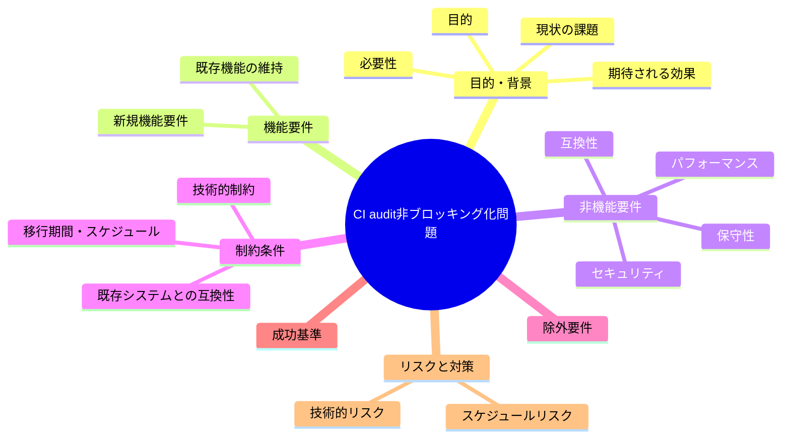

# 要求定義書: CI audit の非ブロッキング化問題（最終保証層の形骸化）

**プロジェクト名**: CI audit の非ブロッキング化問題（最終保証層の形骸化）
**作成日**: 2026年07月14日
**最終更新**: 2026年07月14日

---

## 要求定義の全体像

---

## 1. 目的・背景

### 1.1 目的（必須）

CI audit を「最後の砦」として実効的にブロッキング化するか判断する

### 1.2 背景

出典: 2026-07-14 fableによる本システムの自己調査で検出。

- **現状の課題**:
  - enforcement/README.md は「最終保証は CI audit（最後の砦・全ツール共通）」「絶対強制」「必ず FAIL」と繰り返し宣言している。
  - 本リポジトリの CI（`.github/workflows/self-enforce.yml`）は `audit.sh` を `continue-on-error: true` かつ `|| echo "non-blocking"` で呼んでおり、audit が FAIL しても CI 全体は緑（成功）のままマージ可能になる。
  - ドッグフーディング元自身（本リポジトリ）で最終強制層が事実上無効化されており、正本ドキュメントの文言と実運用が乖離している。

- **必要性**:
  - 「最後の砦」を謳う機構が実際には何もブロックしないまま放置されると、他の enforcement 層（pre-push・PreToolUse 等）がすべて回避された場合の最終防波堤が存在しないことになる。
  - ドキュメントと実装の乖離はフレームワーク自体の信頼性・自己整合性を損なう。

### 1.3 期待される効果（必須: 1 件以上）

- **効果 1**: CI audit の FAIL が実際に CI のステータスをブロック（赤）にするか、あるいは「非ブロッキングである」旨が正本ドキュメントに明記され文言と実運用が一致した状態になる（○/×で判定可能）。

---

## 2. 機能要件

### 2.1 既存機能の維持（該当する場合）

- 現行の audit.sh によるチェック内容自体は維持する（本課題はブロッキング化の要否判断が対象であり、チェックロジックの変更は対象外）。

### 2.2 新規機能要件

- （対応する場合）`.github/workflows/self-enforce.yml` の audit step から `continue-on-error: true` および `|| echo "non-blocking"` を除去し、FAIL 時に CI が失敗扱いとなるようにする。または、正本ドキュメント（enforcement/README.md 等）に「本リポジトリの CI では audit は非ブロッキングである」旨を明記し矛盾を解消する。

---

## 3. 非機能要件

### 3.1 パフォーマンス

- 特になし。

### 3.2 セキュリティ

- 特になし。

### 3.3 互換性

- ブロッキング化した場合、既存の未解消 FAIL 項目（DB 不在による SKIP 等）が新たに CI を赤くする可能性があるため、他課題（A-2 等）との依存関係を考慮すること。

### 3.4 保守性

- ドキュメント（enforcement/README.md）と実装（self-enforce.yml）の記載が常に一致するようにする。

---

## 4. 制約条件

### 4.1 技術的制約

- workflow.db が CI では非追跡のため（A-2 参照）、ブロッキング化しても DB 系チェックは CI では発火しない点に留意が必要。

### 4.2 既存システムとの互換性

- ブロッキング化により既存 PR フローが止まる可能性があるため、段階的移行（warning → blocking）等の検討が必要な場合がある。

### 4.3 移行期間・スケジュール

- 未定（対応要否は本 issue 起票後に判断）。

---

## 5. 除外要件

- audit.sh のチェックロジック自体の追加・変更は対象外（別課題）。

---

## 6. 成功基準（必須: 1 件以上）

- CI audit の FAIL 時に CI ステータスが失敗（赤）になる、または「非ブロッキングである」旨が正本ドキュメントに明記され矛盾が解消されている。

---

## 7. リスクと対策

### 7.1 技術的リスク

- **リスク**: ブロッキング化により、DB 不在等で恒常的に SKIP/FAIL していたチェックが顕在化し、既存 PR フローが停止する可能性がある。
  - **対策**: A-2（workflow.db 非追跡問題）の解消状況と合わせて段階的に対応する。

### 7.2 スケジュールリスク

- **リスク**: 対応要否がユーザー判断待ちのため着手時期未定。
  - **対策**: 本 issue を起票済みとして保持し、優先度判断を待つ。

---

## 8. 参考資料

### プロジェクトドキュメント

- なし

### その他の参考資料

- `.github/workflows/self-enforce.yml`（「Enforcement audit (non-blocking)」step）
- `.agent-skill-chain/source/enforcement/README.md:101-103`（「最終保証はここ」）
- `.agent-skill-chain/project/自己拡張ワークフロー.md:168-171`（PR_BODY 未配線・#36 は本リポで inert と自認）

---

## 9. 次のステップ

- **対応方針を確定（着手済み）**: 「非ブロッキング運用は意図的な暫定状態である」旨を正本ドキュメント（enforcement/README.md・自己拡張ワークフロー.md）に明記し、文言と実運用の矛盾を解消する方針を採用した。理由: `20260714_163203_workflowDB非追跡によるCI検知SKIP問題` が未解決の状態で即座にブロッキング化すると、DB 系チェックの恒常的 SKIP/FAIL が顕在化し既存 PR フローを不必要に止める可能性が高いため（§7.1 リスク）。真のブロッキング化は当該課題の解消後に改めて判断する（申し送り）。
- **次**: `01_要件定義.md` 以降を作成し、実装・verify-and-close まで完了させる。
