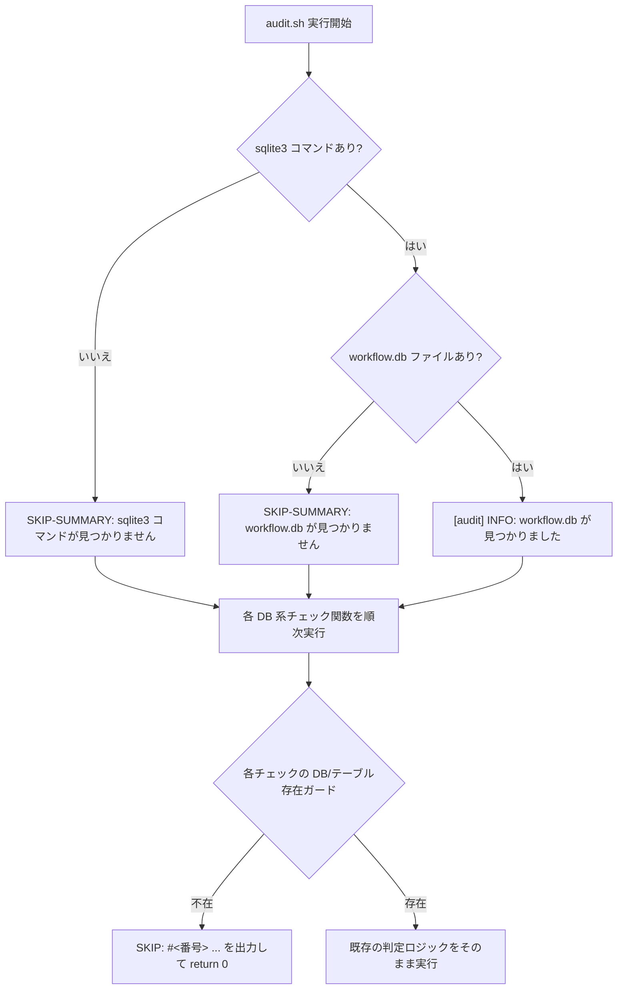

# 設計書: A-2（workflow.db 非追跡による CI 側 DB 系チェックの構造的全 SKIP）

**プロジェクト名**: A-2（workflow.db 非追跡による CI 側 DB 系チェックの構造的全 SKIP）
**作成日**: 2026年07月14日
**最終更新**: 2026年07月14日

---

## 1. 設計概要

### 1.1 設計方針

workflow.db を CI 上で再構築・アーティファクト化する方針は採用しない。理由は 00/01 のとおり、workflow.db は「ローカルで実際に行われた作業の実行証跡」を記録する累積型のローカルストアであり、CI のクリーンな checkout 上でゼロから正当な内容を再現することが原理的に不可能なため（CI にはローカル作業の実施証跡そのものが存在しない）。

したがって本 issue の対応は次の 2 点に限定する。

1. **CI ログ上の可視化**: `audit.sh` の冒頭で workflow.db・sqlite3 の有無を判定し、影響を受けるチェック番号を列挙した要約行（`SKIP-SUMMARY:` / `[audit] INFO:`）を出力する。加えて、個々の DB 系チェックの SKIP 発生箇所に `SKIP: #<番号> ...` の個別行を追加する。
2. **正本ドキュメントの明記**: `enforcement/README.md` の「workflow.db の扱い」節に、構造的 SKIP の事実・理由・実効的な検知経路（ローカル pre-push）を追記する。`self-enforce.yml` の該当コメントも整合させる。

判定ロジック自体（FAIL/SKIP の条件分岐）は一切変更しない。既存の各 check 関数の冒頭ガード（`if ! command -v sqlite3 ... || [[ ! -f "$WF_DB" ]]; then return 0; fi` 等）に、`return 0` の直前へ `echo "SKIP: ..." >&2` を追加するのみの最小差分とする。

### 1.2 設計原則（本プロジェクトで適用するもの）

- **単一責務**: 追加するのは「ログ出力」のみであり、判定ロジック・SKIP 条件そのものには一切手を加えない。判定ロジックの正本は既存の各 check 関数のままとし、二重化しない。
- **既存回帰テストとの非衝突**: 追加する SKIP メッセージの文言は、既存の FAIL メッセージ文字列と部分一致しないよう設計する（`test/test-audit.sh` の既存テストは FAIL メッセージを `grep` で検出しており、文言が重複すると誤って既存テストを壊すため）。
- **fail-open 優先の安全側の維持**: 本変更は SKIP 時の可視性を高めるのみであり、既存の fail-open（DB 不在時は FAIL にしない）という安全側の設計思想は変更しない。

---

## 2. アーキテクチャ設計

### 2.1 責務・境界・参照関係

#### 2.1.1 責務一覧

| コンポーネント | 責務（1 文） |
| --- | --- |
| 冒頭の SKIP-SUMMARY ブロック（audit.sh） | 実行冒頭で workflow.db・sqlite3 の有無を 1 回判定し、影響を受けるチェック番号一覧を要約表示する。 |
| 各 DB 系チェック関数の SKIP echo（audit.sh） | 各チェックが DB 不在・テーブル不在で `return 0` する直前に、当該チェック単体の SKIP を明示する 1 行を出力する。 |
| `enforcement/README.md`「CI における DB 系チェックの構造的 SKIP と実効的な検知経路」節 | 構造的 SKIP の事実・理由・実効的な検知経路（ローカル pre-push）を正本として記述する。 |
| `self-enforce.yml` step 7 コメント | non-blocking 運用が構造的制約（証跡 DB が CI checkout に存在しない）を踏まえた意図的な運用であることを、外部参照禁止規約に抵触しない文言で記述する。 |

#### 2.1.2 境界

- **入力**: `command -v sqlite3`（コマンド存在判定）、`[[ -f "$PROJECT_ROOT/$WORKFLOW_DIR/workflow.db" ]]`（DB ファイル存在判定）、既存の `sqlite3 ... workflow_log` テーブル存在判定（各チェック関数内の既存クエリを再利用）。
- **出力**: 標準エラーへの `SKIP-SUMMARY:` / `[audit] INFO:` / `SKIP: #<番号> ...` 行。`EXIT_CODE` には一切影響しない（既存の SKIP は非 FAIL のまま）。
- **他責務との境界**: 判定ロジック（FAIL 条件）の変更は行わない。GIT_RANGE の解決・検証、他の failure check（#1/#2/#4–#7/#26–#28/#36/#37 等、DB 非依存のチェック）とは非交差。

#### 2.1.3 参照関係

- 冒頭の SKIP-SUMMARY ブロックは、各チェック関数より前に配置し、既存の `WF_DB` 変数（チェック #8 付近で定義）とは独立した局所変数（`_audit_db_probe_path`）で判定する。これにより、既存の変数初期化順序（`WF_DB` の定義位置）を変更せずに済む。
- 各チェック関数内の SKIP echo は、既存の早期 `return 0` ガード条件の直前に追加するのみで、関数のシグネチャ・呼び出し順序・他関数との参照関係は変更しない。

### 2.2 システムアーキテクチャ

- **採用パターン**: 既存の `#26`（`check_code_comment_external_ref`）が持つ「見つからない場合に `WARN:` を出して `return 0`」というパターンを踏襲し、DB 不在時にも同様に明示的なメッセージを出してから `return 0` する。
- **根拠**: 本リポジトリの既存コードには「SKIP 時に何も出さず黙って `return 0` する」関数と「明示的にメッセージを出してから `return 0` する」関数が混在している（例: `#26` は `WARN:` を出す、`#1` は `SKIP: no workflow scan directory found` を出す）。本 issue は後者のパターンを DB 系チェックにも一貫して適用する。

#### 2.2.1 アーキテクチャ図

### 2.3 横断設計判断（ADR）

#### ADR-1: workflow.db の CI アーティファクト化を採用するか

- **コンテキスト**: 00 の期待される効果には「DB 系チェックが CI 上でも発火する」という選択肢と「構造的に SKIP される旨を明記する」という選択肢の両方が示されている。
- **検討した選択肢**:
  1. CI ワークフロー内で workflow.db を都度生成・アーティファクトとして受け渡す。
  2. 構造的に SKIP されることを正本ドキュメントに明記し、実効的な検知経路（ローカル pre-push）を明示する。
- **決定**: 選択肢 2 を採用する。
- **根拠**: workflow.db は「ローカルで実際に行われた作業の実行証跡」を記録するものであり、CI のクリーンな checkout 上でゼロから正当な内容を再構築することはできない（証跡の実体である「ローカルでの作業実施」自体が CI 環境には存在しないため）。仮に CI 内で空の workflow.db を生成しても、それは「証跡が無いこと」の追認にしかならず、DB 系チェック（因果監査・順序監査・実装前ゲート検知等）の目的（実行経路の正当性の検証）を達成できない。選択肢 1 は 00 §7.1 のリスク（ローカルとの状態不整合・機微情報の意図しない露出）も抱える。
- **帰結**: 本 issue はドキュメント整備とログ可視化に限定し、DB の CI 発火自体は実現しない。

#### ADR-2: SKIP の可視化をどの粒度で行うか（冒頭の要約 vs 各チェックの個別表示）

- **コンテキスト**: DB 系チェックは `#3`、`#8`–`#25`、`#29`、`#31`–`#35` と多数にわたり、すべてを均等に扱うと変更範囲が大きくなる。
- **検討した選択肢**:
  1. 冒頭の要約行（`SKIP-SUMMARY`）のみを追加する。
  2. 各チェック関数の SKIP 発生箇所すべてに個別メッセージを追加する。
  3. 冒頭の要約行に加え、ADR で明示的に名前が付けられた「ゲート」系チェック（`#3`、`#8`、`#9`、`#11`、`#29`、`#31`–`#35`）にのみ個別メッセージを追加する。
- **決定**: 選択肢 3 を採用する。
- **根拠**: 選択肢 1 のみでは、CI ログの途中を見た読者が「今どのチェックが SKIP されているか」を判別しにくい。選択肢 2 は `#12`–`#19`（新スキーマ列存在で判定する共通ヘルパー `audit_has_column` 経由の関数群）・`#18`/`#19`/`#25`（複数の SKIP 理由が絡み合う git 依存チェック）まで網羅すると、SKIP 理由の切り分けが複雑化し変更リスクが増す一方、冒頭の要約行で「DB が無いためこれらは全て SKIP される」という情報は既に得られており実益が乏しい。選択肢 3 は、00 の判断材料で名指しされている「実装前ゲート検知」（`#29`/`#31`–`#35`）と、証跡監査の入口となる `#3`/`#8`/`#9`/`#11` に限定して個別可視化することで、変更範囲を抑えつつ実益の大きい箇所を優先する。
- **帰結**: `#12`–`#25`（`#18`/`#19`/`#25` を含む）は冒頭の要約行でカバーし、個別メッセージは追加しない。将来的に必要性が生じれば別途拡張できる（本設計は単一責務の原則にも整合する）。

#### ADR-3: SKIP メッセージの文言設計（既存 FAIL メッセージとの非衝突）

- **コンテキスト**: 実装初版では SKIP メッセージに FAIL メッセージと同じ説明的フレーズ（例: 「実装前 review-docs 未実行」）を流用したところ、`test/test-audit.sh` の既存回帰テスト（FAIL メッセージを `grep` で検出するテスト）が、SKIP メッセージ中の同一部分文字列に誤ってマッチし、テストが false-negative で失敗した。
- **検討した選択肢**:
  1. SKIP メッセージの文言をチェック番号と括弧書きの短い機能名のみに変更し、FAIL メッセージの説明文とは異なる語彙を使う。
  2. 既存の `test/test-audit.sh` のテストの `grep` パターンに `FAIL: ` 等の接頭辞を追加し、SKIP メッセージと衝突しないようにする。
- **決定**: 選択肢 1 を採用する。
- **根拠**: 選択肢 2 は既存テストへの変更範囲が広がり、他の意図しないテストの弱体化（`grep -q "文言"` を `grep -q "FAIL: 文言"` に変えることで、メッセージ側の文言変更に対する検出力が変わりうる）のリスクがある。選択肢 1 は SKIP メッセージ側のみの調整で完結し、既存テストの検出意図（FAIL メッセージの内容確認）を変えない。
- **帰結**: 例えば `#34` の SKIP メッセージは「実装前 GitHub Issue 起票ゲート未通過検知をスキップします」ではなく「（GitHub Issue 起票の記録有無の検知）をスキップします」という、FAIL メッセージの断定的な説明文とは異なる語彙を用いる。

---

## 3. テスト戦略

### 3.1 対象ごとのテスト割り当て

| 対象 | 単体 | 結合/API | E2E | クリティカル観点 | バリデーション観点 | 未達理由/補足 |
| --- | --- | --- | --- | --- | --- | --- |
| SKIP-SUMMARY 冒頭ブロック | ○ | ○（tmp 隔離 audit.sh 実行） | × | DB 不在時に `SKIP-SUMMARY:` を出す・DB 存在時は `INFO:` のみで `SKIP-SUMMARY:` を出さない | sqlite3 コマンド自体の不在パスも文言分岐する | E2E（実 GitHub Actions での目視確認）は本 issue のスコープの検証手段としては tmp 隔離 + 既存 CI 実行ログの目視で代替可能なため対象外 |
| 個別チェックの SKIP echo | ○ | ○（既存 test-audit.sh フル実行で回帰確認） | × | 追加した SKIP メッセージが既存 FAIL メッセージの grep パターンと衝突しないこと（ADR-3） | 既存 123 件（追加前 120 件 + 新規 3 件）の全 PASS を回帰確認 | なし |
| `enforcement/README.md` の追記 | ○（grep による記述内容確認） | × | × | 旧説明（誤解を招く記述）が残っていないこと | 新設節の内容が audit.sh の実装と一致していること | なし |
| `self-enforce.yml` コメント更新 | ○ | ○（`check-comment-refs.sh` による外部参照禁止チェック） | × | 追記したコメントが外部参照禁止規約（章節番号・追跡番号・仕様ドキュメント名）に抵触しないこと | なし | なし |

### 3.2 監査・レビューでの確認（証跡）

`03_実装計画.md` のテスト観点・単体テスト節、および実施した tmp 隔離検証（`test/test-audit.sh` の新規シナリオ追加・実行結果、`check-comment-refs.sh` の実行結果）を証跡とする。

---

## 4. 参考資料

### プロジェクトドキュメント

- [`01_要件定義.md`](./01_要件定義.md) - 要件定義

---

## 5. 前のステップ

- **前**: [`01_要件定義.md`](./01_要件定義.md) - 要件定義フェーズ

---

## 6. 次のステップ

- **次**: [`03_実装計画.md`](./03_実装計画.md) - 実装計画フェーズ
