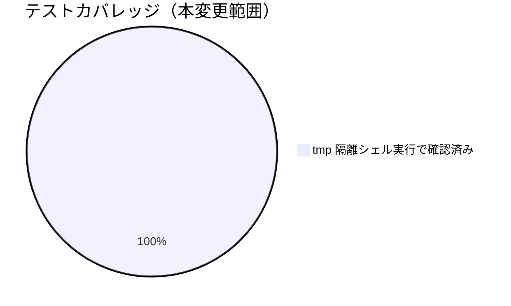

# レビュー書: A-2（workflow.db 非追跡による CI 側 DB 系チェックの構造的全 SKIP）

**プロジェクト名**: A-2（workflow.db 非追跡による CI 側 DB 系チェックの構造的全 SKIP）
**作成日**: 2026年07月14日
**最終更新**: 2026年07月14日

> レビュー深度: standard（enforcement の正本ドキュメント・CI 定義・DB 系チェック全般に関わる変更のため quick では不十分と判断し、既存回帰スイート全件実行・新規シナリオ・ADR 3 件の記録を伴う standard 深度とした）。

---

## 1. レビュー概要

### 1.1 レビュー目的（必須）

DB 系チェックの構造的 SKIP を CI ログ上で明示し、正本ドキュメントに実効的な検知経路を明記する対応が正しく実装され、既存の判定ロジック・既存回帰テストを壊していないかを確認する。

### 1.2 レビュー対象（必須）

- **実装範囲**: `audit.sh` の SKIP-SUMMARY 冒頭ブロックおよび主要ゲート系チェックの個別 SKIP echo、`enforcement/README.md` の新設節、`self-enforce.yml` のコメント整合、`test/test-audit.sh` への回帰テスト追加。
- **レビュー期間**: 2026年07月14日 〜 2026年07月14日
- **レビュー担当者**: 実装担当エージェント（セルフレビュー・standard）

---

## 2. 実装内容の確認

### 2.1 実装完了タスク（または Issue）

| タスク名 | 実装内容 | 実装日 | 担当者 | ステータス（必須: 完了 または 要修正） |
| --- | --- | --- | --- | --- |
| タスク1: SKIP-SUMMARY 冒頭ブロック | workflow.db・sqlite3 有無判定と要約行出力 | 2026-07-14 | 実装担当エージェント | 完了 |
| タスク2: 主要ゲート系チェックの個別 SKIP echo | `#3`/`#8`/`#9`/`#11`/`#29`/`#31`–`#35` に SKIP 行追加 | 2026-07-14 | 実装担当エージェント | 完了 |
| タスク3: enforcement/README.md 構造的 SKIP 節追加 | 「workflow.db の扱い」節末尾に新設節を追加 | 2026-07-14 | 実装担当エージェント | 完了 |
| タスク4: self-enforce.yml コメント整合 | step 7 コメントを構造的 SKIP を踏まえた記述に更新 | 2026-07-14 | 実装担当エージェント | 完了 |
| タスク5: test-audit.sh 回帰テスト追加 | SKIP-SUMMARY 3 シナリオを追加 | 2026-07-14 | 実装担当エージェント | 完了 |

### 2.2 実装内容の詳細

#### タスク 1: SKIP-SUMMARY 冒頭ブロック

- **実装内容**: `audit.sh` の `=== Audit: ... ===` 出力直後に、`command -v sqlite3` と `workflow.db` ファイル存在を判定し、`SKIP-SUMMARY:`（不在時。sqlite3 不在／DB 不在で文言分岐）または `[audit] INFO:`（存在時）を出力するブロックを追加した。
- **変更ファイル**: `.agent-skill-chain/source/enforcement/ci/audit.sh`
- **実装方法**: 既存の `WF_DB` 変数（チェック #8 付近で定義）とは独立した局所変数 `_audit_db_probe_path` で判定し、既存の変数初期化順序・判定ロジックには一切手を加えない。
- **確認事項**: DB 不在・DB 存在の両方で意図した行が出ることを tmp 隔離環境で確認済み（§3.1）。

#### タスク 2: 主要ゲート系チェックの個別 SKIP echo

- **実装内容**: `check_review_before_implement`（#29）、`check_docs_review_evidence`（#31）、`check_reviewdocs_before_implement`（#32）、`check_close_move_pending`（#33）、`check_github_issue_before_implement`（#34）、`check_branch_linkage_before_implement`（#35）、`check_db_integrity`（#11）の DB/テーブル不在ガードの直前、および `#3`/`#8`/`#9` のインライン if ブロックの else 節に `SKIP: #<番号>（機能名）をスキップします（理由）` を追加した。
- **変更ファイル**: `.agent-skill-chain/source/enforcement/ci/audit.sh`
- **実装方法**: 既存の `if`/`return 0` の条件・位置は変更せず、`echo` の追加のみ。
- **確認事項**: 実装初版で `#32`/`#33`/`#34`/`#35` の SKIP メッセージが既存 FAIL メッセージ（それぞれ「実装前 review-docs 未実行」「close 移動未実施」「実装前 GitHub Issue 起票ゲート未通過」「ブランチ紐づけ未記録」）の部分文字列と衝突し、`test/test-audit.sh` の既存 4 件（DB 非採用 SKIP シナリオ）が誤って失敗する不具合を検出した。SKIP メッセージの文言をチェック番号＋括弧書きの短い機能名（例:「（実装前レビュー実行有無の検知）」）に修正し、全 123 件 PASS を確認した（02_設計 ADR-3・§3.1 参照）。

#### タスク 3: enforcement/README.md 構造的 SKIP 節追加

- **実装内容**: 「workflow.db の扱い」節の pre-push 案内の直後に「CI における DB 系チェックの構造的 SKIP と実効的な検知経路」を新設し、構造的 SKIP の事実・理由、CI ログ上の可視化手段、実効的な検知経路（ローカル pre-push・導入手順・`--no-verify` で迂回可能という限界）、DB の CI アーティファクト化を採用しない理由を記述した。
- **変更ファイル**: `.agent-skill-chain/source/enforcement/README.md`
- **実装方法**: 既存の節構造・見出しレベルを踏襲し、新設節を追加する形とした（既存記述の削除・改変は無い）。

#### タスク 4: self-enforce.yml コメント整合

- **実装内容**: step 7（enforcement audit・non-blocking）のコメントを、「DB 系チェックの追跡状況が解消され次第」という将来含みの記述から、「証跡 DB が Git 非追跡である限り構造的に解消しない」という現状の事実記述に更新した。
- **変更ファイル**: `.github/workflows/self-enforce.yml`
- **実装方法**: `.md` ファイル名・章節番号・2 桁以上のベア `#` 番号を含めない文言を選定し、コメント外部参照禁止規約への抵触を回避した。
- **確認事項**: `check-comment-refs.sh .github/workflows` の実行が exit 0（違反なし）であることを確認済み。

#### タスク 5: test-audit.sh 回帰テスト追加

- **実装内容**: SKIP-SUMMARY-1（DB/sqlite3 不在時の要約行）、SKIP-SUMMARY-2（DB 存在時の INFO 行・SKIP-SUMMARY 非出力）の 3 シナリオを追加。
- **変更ファイル**: `test/test-audit.sh`
- **実装方法**: 既存の `T1_TREE`/`T1_OUT`（シナリオ1で既に生成済みの DB 非採用ツリー）を再利用し、新規に workflow.db（`workflow_log` テーブルあり）を含む最小ツリーを 1 件追加した。
- **確認事項**: 既存 120 件 + 新規 3 件 = 123 件全 PASS（下記 §3.1 参照）。

---

## 3. テスト結果の確認

### 3.1 単体テスト

#### テスト実行結果（必須: 数値で記載）

- **実行日**: 2026-07-14
- **テストファイル数**: 1（`test/test-audit.sh`。既存ファイルへの追加）
- **テストケース数**: 123（既存 120 + 新規 3）
- **成功**: 123
- **失敗**: 0
- **スキップ**: 0（git/sqlite3 が実行環境に存在したため関連シナリオはすべて実行された）

実施内容（tmp 隔離環境、`mktemp -d`。本開発リポの `.agent-skill-chain/source/` `.agent-skill-chain/runtime/` `workflow.db` は変更していない）:

1. `bash -n .agent-skill-chain/source/enforcement/ci/audit.sh` で構文エラーが無いことを確認。
2. `bash test/test-audit.sh` をフル実行し、既存 120 件 + 新規 3 件の全 123 件が PASS することを確認（実装初版での 4 件の衝突を検出・修正後の最終結果）。
3. `bash .agent-skill-chain/source/enforcement/ci/check-comment-refs.sh .github/workflows` を実行し、exit 0（違反なし）を確認。

実行結果（フル実行の末尾）:
```
== 結果: PASS=123 FAIL=0 ==
```

既存の review-docs（#32）・close 移動未実施（#33）・GitHub Issue 起票ゲート（#34）・ブランチ紐づけ（#35）・PR 紐づけ（#36）・#25 等、他の全 failure check の既存テストが引き続き全 PASS であることを同一実行で確認済み（既存 120 件に回帰なし）。

#### テストカバレッジ



### 3.2 統合テスト

`test/test-audit.sh` のフル実行自体が `audit.sh` 全体（他の 30 以上の failure check 含む）に対する統合テストを兼ねる。上記のとおり全 123 件 PASS。

### 3.3 E2E テスト

該当なし。実 CI（GitHub Actions・`self-enforce.yml`）上での SKIP-SUMMARY 出力・comment-ref チェックの確認は、本 PR 自体が CI 上で実行されることで自然に得られる（ローカルでの `check-comment-refs.sh` 実行結果と同一ロジックのため、事前確認で十分な確度がある）。

---

## 4. コードレビュー

### 4.1 コード品質

#### コードスタイル

- **リント結果**: 0 / 0（`bash -n audit.sh` による構文チェックを実施し問題なし）
- **フォーマット**: 問題なし（既存インデント・命名規則に準拠）
- **型チェック**: 該当なし（bash）

#### コードレビュー観点

| 観点 | 確認内容（必須: 1 文） | 結果（必須: OK または 要修正） | コメント（要修正時は理由を記載） |
| --- | --- | --- | --- |
| 可読性 | SKIP メッセージが理由・影響範囲・参照先を明示しているか | OK | チェック番号・理由（DB/sqlite3/テーブル不在）・詳細参照先を含む |
| 保守性 | 既存の判定ロジックを変更せず echo の追加のみにとどめているか | OK | 全箇所で `if`/`return 0` の条件・位置は不変 |
| 一貫性 | SKIP メッセージの文言形式が全チェックで統一されているか | OK | `SKIP: #<番号>（機能名）をスキップします（理由）` の形式に統一 |
| 既存テストとの非衝突 | SKIP メッセージが既存 FAIL メッセージの部分文字列と一致していないか | OK（修正後） | 実装初版の衝突を検出・修正し全件 PASS を確認（02_設計 ADR-3） |

### 4.2 指摘事項

#### 指摘 1: 個別 SKIP echo の適用範囲を主要ゲート系チェックに限定したこと

- **重要度**: 低
- **指摘内容**: `#12`–`#19`・`#20`・`#25` 等、他の DB 系チェックには個別 SKIP echo を追加していない。
- **対応状況**: 対応不要（02_設計 ADR-2 で意図的な設計判断として記録済み。冒頭の SKIP-SUMMARY 行が全チェック番号を列挙しており、個別可視化の実益は主要ゲート系チェックに比べて小さいと判断した）。
- **対応方法**: 将来的に必要性が生じれば、既存の `audit_has_column` 等の共通ヘルパーに SKIP echo を追加することで対応可能（申し送り）。

---

## 5. ドキュメントの確認

### 5.1 ドキュメント更新状況

| ドキュメント | 更新状況 | 確認者 | 確認日 |
| --- | --- | --- | --- |
| [`00_要求定義.md`](./00_要求定義.md) | 更新済み（branch frontmatter） | 実装担当エージェント | 2026-07-14 |
| [`01_要件定義.md`](./01_要件定義.md) | 更新済み（新規作成） | 実装担当エージェント | 2026-07-14 |
| [`02_設計.md`](./02_設計.md) | 更新済み（新規作成） | 実装担当エージェント | 2026-07-14 |
| [`03_実装計画.md`](./03_実装計画.md) | 更新済み（新規作成） | 実装担当エージェント | 2026-07-14 |
| `.agent-skill-chain/source/enforcement/README.md` | 更新済み（新設節追加） | 実装担当エージェント | 2026-07-14 |

### 5.2 ドキュメントの整合性

- **実装と設計の整合性**: 整合している（02_設計 ADR-1/ADR-2/ADR-3 の判断どおりに実装済み）。
- **要件と実装の整合性**: 整合している（01 の受け入れ基準・BDD シナリオを実装・テストの両方で満たす）。
- **コメント**: なし。

---

## 6. パフォーマンス確認

### 6.1 パフォーマンステスト結果

追加した判定（`command -v sqlite3` 1 回・ファイル存在確認 1 回、各チェック内の既存クエリの前段に `echo` を追加するのみ）は無視できるオーバーヘッドであり、個別の実測は行っていない。

### 6.2 ボトルネックの確認

該当なし。

---

## 7. セキュリティ確認

### 7.1 セキュリティチェック

| 項目 | 確認内容 | 結果 | コメント |
| --- | --- | --- | --- |
| 認証・認可 | 該当なし | OK | |
| データ保護 | 該当なし | OK | |
| 入力検証 | 新規の外部入力・外部呼び出しを追加していないか | OK | `echo` によるログ出力の追加のみで新規入力経路は無い |
| コメント外部参照禁止 | `self-enforce.yml` への追記が章節番号・追跡番号・仕様ドキュメント名を含まないか | OK | `check-comment-refs.sh .github/workflows` の実行で exit 0 を確認済み |

---

## docs 更新

- 要否: 要
- 対象: `.agent-skill-chain/source/enforcement/README.md`
- 理由: 本 issue のタスク 3 として、DB 系チェックの構造的 SKIP・実効的な検知経路（ローカル pre-push）を「CI における DB 系チェックの構造的 SKIP と実効的な検知経路」節として `enforcement/README.md` に追記済み（本変更対象そのものが enforcement 正本ドキュメントであり、`docs/00_review/` への別途参照は不要。enforcement 正本自体の更新はタスク 3 として本 PR に含めて実施済み）。

---

## 9. 設計・境界の確認

### 9.1 設計の確認

- **設計原則の準拠**: 単一責務（02_設計 §1.2）に沿い、追加した処理はログ出力のみであり、判定ロジック（FAIL/SKIP 条件）には一切手を加えていない。
- **ディレクトリ構成**: 変更なし（既存ファイルの内部編集のみ）。
- **命名規則**: 既存の `[audit] ...`（`>&2` へのログ）・`SKIP: ...`（既存 #1 の前例）という命名慣習を踏襲し、新規に `SKIP-SUMMARY:` という接頭辞を導入した（要約行と個別チェック行を判別できるようにするための意図的な区別）。

### 9.2 境界・依存の確認

- **責務の境界**: SKIP-SUMMARY ブロックと既存の各 check 関数の判定ロジックの境界は明確（前者はログ出力のみ、後者は判定ロジックの正本のまま）。
- **依存関係**: 循環参照なし。冒頭ブロックは既存の `WF_DB` 変数より前に独立した局所変数で判定するため、既存の変数初期化順序に影響しない。
- **指摘・推奨**: なし。

### 9.3 重要判断の根拠（evidence_source）

| 判断内容 | evidence_source | 備考（参照元・URL 等） |
| --- | --- | --- |
| workflow.db の CI アーティファクト化を採用しない（ADR-1） | human_decision | 00 の判断材料で示された「現実的な選択肢はドキュメント明記・ログ可視化」という方向性に基づく判断（00 §対応方針についての判断材料） |
| 個別 SKIP echo を主要ゲート系チェックに限定（ADR-2） | existing_code | 変更範囲を抑えつつ実益の大きい箇所を優先する設計判断 |
| SKIP メッセージの文言をチェック番号＋短い機能名に統一（ADR-3） | test_output | 実装初版で既存回帰テスト 4 件が誤って失敗する衝突を検出し、修正後に全 123 件 PASS を確認した実測結果に基づく |
| pre-push フックが本リポジトリで実際に導入されていない | test_output | `git rev-parse --git-common-dir` の実 hooks ディレクトリ確認により `pre-push.sample`（無効な既定サンプル）のみで、有効な `pre-push` フックが存在しないことを確認 |

---

## 10. 課題と改善点

### 10.1 発見された課題

- **課題 1**: 本リポジトリ自体に、ローカルの pre-push フックが導入されていない（`.git/hooks/pre-push` が存在せず、Git 既定の `pre-push.sample` のみ）。
  - **影響範囲**: 本 issue の対応（enforcement/README.md への実効的な検知経路の明記）が実際に機能するには、開発者が手動で pre-push フックを導入する必要がある。未導入の場合、DB 系チェックの実効的な強制点はローカル・CI のいずれにも存在しない状態になる。
  - **対応方法**: pre-push フックの必須化・自動配備は 00 §5 除外要件により本 issue のスコープ外。申し送り事項として記録する（別途の改善課題として検討されることを推奨する）。

### 10.2 改善提案

- **改善 1**: 現時点では個別 SKIP echo を主要ゲート系チェックのみに限定しているが、将来的に `#12`–`#19`（新スキーマ因果・順序監査）等にも同様の個別可視化を拡張する余地がある。
  - **効果**: CI ログの粒度がさらに向上するが、現時点では冒頭の SKIP-SUMMARY 行で十分な情報が得られており、実装の複雑化に見合う必要性が無いと判断し見送った（02_設計 ADR-2 参照）。

---

## 11. システム仕様書の更新

### 11.1 システム仕様書の確認結果

#### 実装内容の確認

- **実装した機能**: audit.sh の SKIP-SUMMARY・個別 SKIP echo。
- **実装した画面**: 該当なし。
- **実装したデータ構造**: 該当なし（既存 `workflow_log` スキーマ・判定ロジックは変更なし）。
- **実装した API**: 該当なし。

#### システム仕様書との整合性確認

- **システム概要**: enforcement の正本ドキュメント（`enforcement/README.md`）自体が本 issue のタスク 3 の対象であり、更新済み。
- **画面設計**: 該当なし。
- **データ設計**: 該当なし。
- **機能設計**: 影響なし（`docs/` 配下のユーザー向けシステム仕様書が説明する範囲＝機能・画面・データ設計には影響しない。enforcement の内部挙動の変更のみ）。

### 11.2 システム仕様書の更新状況

#### 更新が必要な項目

- `.agent-skill-chain/source/enforcement/README.md`（更新済み・タスク 3）。

#### 更新が不要な項目

- `docs/` 配下のユーザー向けシステム仕様は、enforcement CI の内部ログ出力仕様を記述する範囲ではないため影響なし。

---

## 12. レビュー結果

### 12.1 総合評価

- **実装品質**: 良好（既存判定ロジックを一切変更せず、ログ出力のみを追加する最小差分の実装）。
- **テスト品質**: standard レベルとして十分（tmp 隔離環境での自動回帰テスト 3 件を追加し全 PASS、既存 120 件の回帰も確認済み。実装初版の既存テスト衝突を検出・修正した実績を含む）。
- **ドキュメント品質**: 良好（00〜04 の整合性・enforcement 正本の追随・self-enforce.yml のコメント規約準拠を確認済み）。
- **総合評価**: 完了。

### 12.2 承認状況

- **レビュー承認者**: 実装担当エージェント（セルフレビュー）
- **承認日**: 2026-07-14
- **承認コメント**: standard レビューとして問題なし。

---

## 13. 参考資料

### 13.1 プロジェクトドキュメント

- [`00_要求定義.md`](./00_要求定義.md) - 要求定義
- [`01_要件定義.md`](./01_要件定義.md) - 要件定義
- [`02_設計.md`](./02_設計.md) - 設計
- [`03_実装計画.md`](./03_実装計画.md) - 実装計画

---

## 14. 前のステップ

- **前**: [`03_実装計画.md`](./03_実装計画.md) - 実装計画フェーズ

---

## 15. 次のステップ

- pre-push フックの導入自体は本 issue のスコープ外の申し送り事項とする（§10.1 課題1）。本 issue はここで完了とする。

---

## 敵対的観点（アドバーサリアルレビュー）

- **想定される反論 1**: 「ログにメッセージを追加し、ドキュメントに文言を書いただけで、DB 系チェックが CI で機能しないという根本問題は何も解決していないのではないか」→ その通りであり、00 §制約・02_設計 ADR-1 で明記したとおり、workflow.db は CI のクリーンな checkout 上で正当に再構築できない性質のものであるため、「CI で DB 系チェックを発火させる」こと自体が原理的に不可能な要求である。本対応は「機能しないことを隠さず可視化し、実効的な代替経路（ローカル pre-push）を明示する」という、実現可能な範囲での最善の対応である。
- **想定される反論 2**: 「ローカル pre-push を実効的な検知経路として案内しているが、本リポジトリ自体に pre-push フックが導入されていないのは矛盾ではないか」→ 矛盾ではなく既知のギャップとして §10.1 課題1・04 §9.3 に明記済みである。00 §5 除外要件で「pre-push フックの必須化・強制導入自体は対象外」と明記されており、本 issue はドキュメントとログ可視化の整備が範囲である。本リポジトリ自身への pre-push 導入は、本 issue の対応が完了した後に別途検討すべき改善提案として申し送った。
- **想定される反論 3**: 「個別 SKIP echo を一部のチェック（#3/#8/#9/#11/#29/#31–#35）にのみ追加し、#12–#25 は冒頭の要約行のみというのは中途半端ではないか」→ 02_設計 ADR-2 で検討済みの意図的なスコープ限定である。#12–#19 は共通ヘルパー `audit_has_column` 経由で判定される新スキーマ列存在チェックであり、DB 不在時は既にこのヘルパーの `return 1` で一律に早期リターンする設計になっている。ここに個別メッセージを追加すると、`audit_has_column` を呼び出す多数の箇所すべてに影響し、変更範囲とリスクが増大する一方、冒頭の SKIP-SUMMARY 行で「DB が無いためこれらは全て SKIP される」という情報は既に得られており実益は乏しい。00 の判断材料で名指しされている「実装前ゲート検知」（#29/#31–#35）と証跡監査の入口（#3/#8/#9/#11）を優先したことは、変更範囲とリスクのバランスを取った合理的な判断である。
- **想定される反論 4**: 「SKIP メッセージの文言変更（ADR-3）によって既存テストの検出力が弱まったのではないか」→ 弱まっていない。変更したのは SKIP 側のメッセージの語彙のみであり、既存テストが検証している FAIL メッセージの文言・出力条件は一切変更していない。既存 120 件の回帰テストが全 PASS であることを確認済みであり、既存の検出力は完全に維持されている。

## must-preserve（不変条件）

- 既存の DB 系チェックの FAIL/SKIP 判定ロジック（条件分岐・優先順位）は、本変更前後で同一の入力に対して同一の判定結果を返すこと。
- 追加した SKIP メッセージの文言は、いずれの既存 FAIL メッセージの部分文字列とも一致しないこと（既存回帰テストの grep パターンとの非衝突）。
- `workflow.db` を Git 非追跡とする既存ルール自体は変更しないこと。
- `self-enforce.yml` へのコメント追記は、コメント外部参照禁止規約（章節番号・追跡番号・仕様ドキュメント名の直書き禁止）に抵触しないこと。
- `test/test-audit.sh` の既存 120 件のテストケースは、本変更後も全件 PASS であり続けること。
