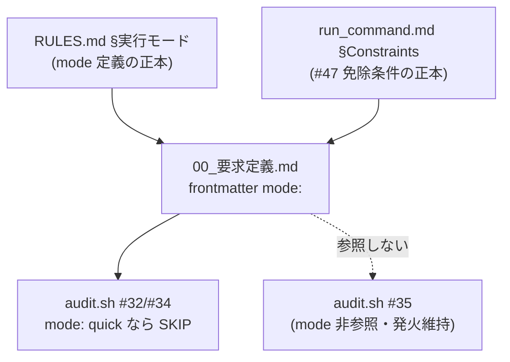

# 設計書: 実装着手前ゲートの直列化過多（quick モード免除）

**プロジェクト名**: 実装着手前ゲートの直列化過多
**作成日**: 2026 年 07 月 14 日
**最終更新**: 2026 年 07 月 14 日

> 本 issue は spec/regs（規約ドキュメント）と enforcement（audit.sh）の変更である。コード的な新規モジュールは無い。実装は sonnet ティアの別 Agent が本設計に従って行う。

---

## 1. 設計概要

### 1.1 設計方針

ユーザー判断（00 §ユーザー判断）を、**「実行モードとゲート群の適用条件を整合させる」**という一点に集約して実装する。核となる設計判断は次の 3 つ。

1. **単一正本の mode 信号**: 実行モードを機械可読にする単一正本を 00_要求定義.md frontmatter `mode:` に置く（memo frontmatter に既存の `mode:` 前例あり）。人間の進行役判断（RULES.md §実行モード）と機械監査（audit.sh）が同じ 1 か所を参照する。
2. **免除は #32・#34 のみ・#35 は非対象**: quick モードは review-docs ゲート（#32）と GitHub Issue 起票ゲート（#34）を免除する。branch 紐づけゲート（#35）は mode を一切参照せず従来どおり発火する。
3. **免除＝軽量化であって省略ではない**: quick モードでも RULES quick 最小セット（設計メモ＋変更理由）と workflow.db 証跡は残す。免除するのは review-docs の反復手続きと GitHub Issue 起票という「重い手続き」のみ。

### 1.2 設計原則（本プロジェクトで適用するもの）

- **1 ファイル 1 責務・正本 1 か所**: 実行モードの定義正本は RULES.md §実行モード。ゲートの免除条件は各ゲート記述（run_command.md）に置き、他ファイル（PHASES.md・PHASE_COMMAND_MAP.md・design-feature.md）は参照または短い整合記述に留める。二重定義しない。
- **fail-open / fail-safe**: mode 判定不能・欠落は standard 扱い（免除しない安全側）。DB 不在・非 git は従来どおり SKIP。ロックアウトしない。
- **後方互換**: 既存 issue（mode 欠落）は standard 相当で挙動不変。grandfather 発効日・既存 frontmatter を破壊しない。
- **relaxation に grandfather 不要**: 免除はゲートを緩める変更のため、遡及適用しても害が無い。新規の EFFECTIVE_FROM は設けない。

---

## 2. アーキテクチャ設計

### 2.1 責務・境界・参照関係

| 対象ファイル | 責務（本 issue での変更） | 正本/参照の別 |
|--------------|---------------------------|----------------|
| `RULES.md` §実行モード | quick 行に「#32 review-docs・#34 GitHub Issue 起票を免除、#35 branch は維持、免除は軽量化（記録は残す）」を明記。mode 信号（00 frontmatter `mode:`）の定義を追加。 | **実行モードとmode信号の正本** |
| `skills/agent/run_command.md` §Constraints #47（review-docs） | 「全 issue 一律・規模比例の免除なし」→「full/standard は一律必須。quick（`mode: quick`）は免除（軽量化：設計メモ＋変更理由で代替記録）」。 | **review-docs ゲート免除条件の正本** |
| `run_command.md` §Constraints #48（GitHub Issue） | quick モード免除規定を追記（GitHub Issue 起票を要しない。変更理由・workflow.db で追跡）。 | **GitHub Issue ゲート免除条件の正本** |
| `run_command.md` §Constraints #49（branch） | 「規模・モードに関係なく維持（quick でも必須）」を明記（挙動は不変。誤解防止の明文化）。 | branch ゲート（変更なし・明文化のみ） |
| `workflow/PHASES.md` §レビュー成果物の配置ルール #65（review-docs） | 「全 issue 一律」→ mode 別適用へ改め、正本（run_command §Constraints・PHASE_COMMAND_MAP §横断的必須ゲート）を参照。 | 参照（正本は run_command） |
| `PHASES.md` #66（GitHub Issue） | quick 免除を追記し正本参照。 | 参照 |
| `workflow/PHASE_COMMAND_MAP.md` §横断的必須ゲート | review-docs「全 issue 一律・規模比例の免除なし」→「full/standard 一律必須・quick 免除」。 | 参照（正本は run_command） |
| `commands/design-feature.md` DoD #61・注意 #73 | 「全 issue 一律・免除なし」→ mode 別適用（quick 免除）へ整合。 | 参照 |
| `enforcement/README.md` 失敗条件レジストリ #32/#34 行 | quick モード SKIP 条件を追記。#35 行は「mode 非参照＝quick でも発火」を明記。 | ゲート強制仕様の記述（正本は audit.sh 実装＋本表） |
| `enforcement/ci/audit.sh` `check_reviewdocs_before_implement`（#32）・`check_github_issue_before_implement`（#34） | 対象 issue の 00 frontmatter `mode:` を読み、`quick` なら当該 issue を SKIP（continue）。#35（`check_branch_linkage_before_implement`）は変更しない。 | **機械強制の実体** |
| `.agent-skill-chain/runtime/templates/00_要求定義.md` | frontmatter に `mode:` フィールド（既定 standard・コメントで意味を説明）を追加。 | mode 信号の記入場所テンプレ |

### 2.2 システムアーキテクチャ

規約層（人間の進行役が読む正本）と強制層（CI の機械監査）を、単一の mode 信号（00 frontmatter `mode:`）で貫通させる。これにより §6 成功基準の「実行モードとゲート群の記述に矛盾がない状態」を、人間可読・機械可読の両面で満たす。



### 2.3 コンポーネント構成

- **規約ドキュメント群（advisory）**: RULES.md／run_command.md／PHASES.md／PHASE_COMMAND_MAP.md／design-feature.md。人間・AI が読むルール。矛盾を除去し mode 別適用へ統一する。
- **enforcement レジストリ（enforcement/README.md）**: 失敗条件 #32/#34/#35 の記述。quick 免除条件を追記。
- **enforcement 実体（audit.sh）**: #32/#34 に mode ガードを追加。#35 は不変。
- **テンプレート（00_要求定義.md）**: `mode:` 記入欄を追加。

### 2.4 データフロー

1. 進行役が要求の規模から実行モードを決定（RULES.md §実行モード）。
2. requirement-discovery が 00_要求定義.md frontmatter に `mode:` を記入（quick/standard/full）。
3. implement-feature 着手前、進行役は mode に応じて review-docs／GitHub Issue 起票ゲートを実施（standard/full）または免除（quick）。branch ゲートは常に実施。
4. CI（audit.sh）が各 issue の 00 frontmatter `mode:` を読む。`quick` なら #32/#34 を SKIP。それ以外（standard/full/欠落/不明）は従来判定。#35 は mode を読まず従来判定。

### 2.5 横断設計判断（ADR）

- **ADR-1: mode 信号を 00_要求定義.md frontmatter `mode:` に置く（代替: memo frontmatter／別ファイル／DB 列）。**
  - 決定: 00 frontmatter。理由: (a) #34 は既に 00 を走査し frontmatter（`github_issue`）を読む。#32 は 03 を走査するが同一 issue_dir の 00 を read すれば足りる。(b) `mode:` は memo frontmatter に前例があり自然。(c) 単一 issue に 1 つ、要求定義の最上流で決まる値であり 00 が最適。DB 列や別ファイルは二重管理・スキーマ変更を招く。
  - evidence_source: 既存 audit.sh `check_github_issue_before_implement` が 00 frontmatter を awk で抽出している実装（audit.sh L1128-1131）。既存 memo（close/20260712_190721.../memo/*.md）に `mode: standard` の前例。
- **ADR-2: quick のみを免除トリガーとし、欠落・不明値は standard 扱い（fail-safe）。**
  - 決定: `mode` の値を正規化し、小文字化して `quick` に厳密一致する場合のみ SKIP。それ以外（standard/full/空/不明/キー無し）は免除しない。理由: 免除は緩和であり、判定不能時に緩める（fail-open で SKIP）と品質担保が抜ける。ここは「疑わしきは適用（standard 相当で従来どおりゲート発火）」の安全側に倒す。RULES.md §実行モードの「モードを省略した場合は standard」と一致。
- **ADR-3: #35（branch）は mode を一切参照しない。**
  - 決定: `check_branch_linkage_before_implement` は無変更。理由: ユーザー判断で「#35 は規模に関係なく維持」。branch 記録コストは 1 行で低く、追跡可能性の基盤。mode ガードを入れない。
- **ADR-4: 免除に新規 grandfather（EFFECTIVE_FROM）を設けない。**
  - 決定: mode:quick の SKIP は発効日で区切らず即時適用。理由: 緩和の遡及適用は既存 issue を FAIL から救う方向でしか働かず害が無い。既存 #32/#34 の EFFECTIVE_FROM はそのまま（厳格化の遡及防止用）維持し、mode ガードはそれらより前段の SKIP として評価する（トグル SKIP と同列の早期リターン）。
- **ADR-5: mode ガードの評価順序は「per-issue ループ内・grandfather と同段」。**
  - 決定: #32/#34 の per-issue ループで、issue_dir 確定後・implement ログ判定の前後いずれでもよいが、**grandfather 判定の直後**に 00 frontmatter mode を読み `quick` なら `continue`。理由: プロジェクト全体トグル（#34 の GITHUB_ISSUE_GATE_ENABLED）は関数冒頭の最優先 SKIP のまま維持し、per-issue の mode ガードはループ内に置く（トグル＝プロジェクト単位、mode＝issue 単位の粒度差を保つ）。
- **ADR-6: 免除は「軽量化」であり記録を省略しない（00 §7.1 リスク対策の充足）。**
  - 決定: RULES.md quick 行と run_command #47/#48 に「quick でも変更理由・設計メモ（RULES quick 最小セット）と workflow.db 証跡は残す」と明記する。理由: 品質担保（レビュー・追跡可能性）の低下を回避する。免除するのは review-docs 反復・GitHub Issue 起票という重い手続きのみ。

---

## 3. 機能設計

### 3.1 機能 1: 規約ドキュメントの mode 別適用への改訂

- **RULES.md §実行モード**: quick 行の「必須成果物・必須行為」に、実装着手前ゲートの適用を追記する。趣旨: 「quick は #32 review-docs・#34 GitHub Issue 起票ゲートを免除する（軽量化：設計メモ＋変更理由と workflow.db 証跡で代替記録し、review-docs 反復・GitHub Issue 起票は行わない）。#35 branch 紐づけゲートは規模・モードに関係なく維持する。full/standard は全ゲート適用。」加えて表の下に mode 信号（00 frontmatter `mode:`。欠落時 standard）の 1 文を追加する。
- **run_command.md §Constraints #47（review-docs）**: 「（全 issue 一律・規模比例の免除なし）」を「（full/standard は一律必須。**quick モード（00_要求定義.md frontmatter `mode: quick`）は本ゲートを免除**する＝軽量化。免除時も RULES quick 最小セットの設計メモ＋変更理由と workflow.db 証跡で追跡し、記録は省略しない）」へ改める。enforcement #32 の FAIL 記述に「quick モードは #32 の対象外（SKIP）」を追記。
- **run_command.md §Constraints #48（GitHub Issue）**: 「デフォルトは起票」の説明の末尾に「**quick モード（`mode: quick`）は本 GitHub Issue 起票ゲートを免除する**（GitHub Issue を起票せず、変更理由・workflow.db 証跡で追跡）。full/standard は現行どおり。」を追記。enforcement #34 の FAIL 記述に quick SKIP を追記。
- **run_command.md §Constraints #49（branch）**: 「（空/null/未記載は不可・全 issue 一律）」に「（**規模・実行モードに関係なく維持。quick モードでも必須**）」の趣旨を補足。挙動は不変、誤解防止の明文化。
- **PHASES.md #65（review-docs 横断ゲート）**: 「全 issue 一律に必須の横断的必須ゲート」を「full/standard で必須の横断的必須ゲート（**quick モードは免除**。詳細は PHASE_COMMAND_MAP §横断的必須ゲートと run_command §Constraints）」へ改める。
- **PHASES.md #66（GitHub Issue ゲート）**: 「必須とする（トップレベル issue のみ・デフォルトは起票・GitHub 非採用環境は非発火）」に「**・quick モードは免除**」を加える。
- **PHASE_COMMAND_MAP.md §横断的必須ゲート**: review-docs の「（全 issue 一律・規模比例の免除なし）」を「（full/standard は一律必須・**quick モードは免除**）」へ改める。「省略可・任意を意味しない」の趣旨は full/standard に対して維持。
- **design-feature.md DoD #61・注意 #73**: 「（全 issue 一律・免除なし）」「（規模比例の免除なし）」を「（full/standard は必須・**quick モードは免除**。正本は run_command §Constraints）」へ整合。

### 3.2 機能 2: enforcement レジストリと audit.sh の mode ガード

- **enforcement/README.md 失敗条件レジストリ**:
  - #32 行「実装状態」列の SKIP 条件に「＋当該 issue の 00 frontmatter `mode: quick` は SKIP（免除。full/standard は従来どおり）」を追記。
  - #34 行の SKIP 条件に同様に「＋`mode: quick` は SKIP」を追記。
  - #35 行に「（**mode は参照しない＝quick モードでも発火**。ユーザー判断により規模非依存で維持）」を明記。
  - 判定ルール一覧（#32/#34 の「説明」）にも quick 免除の 1 文を反映。
- **audit.sh `check_reviewdocs_before_implement`（#32）**: per-issue ループ内、grandfather 判定直後に、同一 issue_dir の `00_要求定義.md` から frontmatter `mode:` を抽出し、正規化（前後空白・クオート除去・小文字化）した値が `quick` なら `continue`。00 が無い・`mode` キー無し・不明値は非 quick として従来判定（fail-safe）。抽出は既存 #34 と同一の awk（先頭 `---`〜次の `---`）＋ `grep -m1 -E '^mode:'` ＋ `sed` トリムを流用する。
- **audit.sh `check_github_issue_before_implement`（#34）**: 同ループ内、grandfather 判定直後に、走査中の `00_要求定義.md`（＝`$f`）から `mode:` を抽出し `quick` なら `continue`。プロジェクト全体トグル（`GITHUB_ISSUE_GATE_ENABLED`）の冒頭 SKIP は不変。
- **audit.sh `check_branch_linkage_before_implement`（#35）**: 無変更。

---

## 4. データ設計

### 4.1 データモデル

00_要求定義.md frontmatter に 1 キー追加。

```yaml
# mode: 実行モード（quick / standard / full）。省略時は standard。
#   quick は実装前ゲート #32(review-docs)・#34(GitHub Issue 起票) を免除する（#35 branch は維持）。
mode: standard
```

- 値域: `quick` | `standard` | `full`（小文字）。クオート有無許容。
- 欠落・不明値: standard 相当（免除しない）。

### 4.2 データ構造

- 既存 frontmatter（document_id・issue_id・branch・github_issue）に `mode:` が加わるのみ。既存キーの意味・順序は変えない。

---

## 5. API 設計

### 5.1 API 一覧

- 新規 API なし。audit.sh の内部判定入力に 00 frontmatter `mode:` が加わる。

### 5.2 API 詳細

- 該当なし。

---

## 6. テスト戦略

### 6.1 対象ごとのテスト割り当て

audit.sh の #32/#34 mode ガードは、リポジトリの CI テスト（`enforcement` のテストハーネスがあれば）または一時ディレクトリ（`mktemp -d`）に最小の workflow.db＋issue ツリーを再現して検証する（RULES §テスト隔離）。BDD シナリオ（01 §2.2）に対応する検証観点:

| # | 検証観点（BDD 対応） | 手段 |
|---|----------------------|------|
| T-1 | mode: quick かつ review-docs ログ 0 件＋implement ログあり → #32 SKIP（FAIL しない） | 一時 DB＋issue で audit.sh #32 を実行し exit/出力を確認 |
| T-2 | mode: quick かつ github_issue null＋implement ログあり → #34 SKIP | 同上 #34 |
| T-3 | mode: quick かつ branch null＋implement ログあり → #35 FAIL（mode 非参照） | 同上 #35（FAIL 維持を確認） |
| T-4 | mode: standard（および mode 欠落）→ #32/#34 従来どおり FAIL | 同上 #32/#34 |
| T-5 | mode: full → #32/#34 従来どおり FAIL | 同上 |
| T-6 | 既存の grandfather／トグル SKIP が mode ガード追加後も従来どおり効く（回帰） | cutoff 未満 issue・トグル off で SKIP を確認 |

- 規約ドキュメント（RULES/run_command/PHASES/PHASE_COMMAND_MAP/design-feature）の改訂は、記述レビュー（review-docs／人手監査）で「全 issue 一律・免除なし」等の旧断定が残っていないこと・4 ファイル間で矛盾が無いことを確認する。

### 6.2 監査・レビューでの確認（証跡）

- audit.sh 変更は BDD インラインコメント（ユースケース・シナリオ・Given/When/Then）を伴うテストで検証し、04_review でテスト再実行結果を記載する（RULES §テスト戦略／PHASES 監査観点）。
- ドキュメント整合は、旧断定文言（`grep -rn "全 issue 一律\|免除なし\|規模比例の免除なし"` の残存が意図した箇所のみ）を確認する。

---

## 7. UI 設計

該当なし（CLI/規約のみ）。

---

## 8. セキュリティ設計

該当なし。免除は品質手続きの軽量化であり権限・認可には無関係。

---

## 9. 非機能要件への対応

### 9.1 パフォーマンス

- audit.sh に issue あたり 00 frontmatter 1 read（awk）が加わる程度。無視できる。

### 9.2 可用性

- fail-open／fail-safe を維持。mode 判定不能・DB 不在・非 git は従来どおり SKIP／standard 扱いでロックアウトしない。

---

## 10. 参考資料

### プロジェクトドキュメント

- [`00_要求定義.md`](./00_要求定義.md)
- [`01_要件定義.md`](./01_要件定義.md)
- [`03_実装計画.md`](./03_実装計画.md)

### その他の参考資料

- `.agent-skill-chain/source/enforcement/ci/audit.sh`（L978-1015 #32・L1085-1151 #34・L1163- #35）
- `.agent-skill-chain/source/RULES.md`（§実行モード L7-19）

---

## 11. 前のステップ

- [`01_要件定義.md`](./01_要件定義.md)

## 12. 次のステップ

- [`03_実装計画.md`](./03_実装計画.md)
