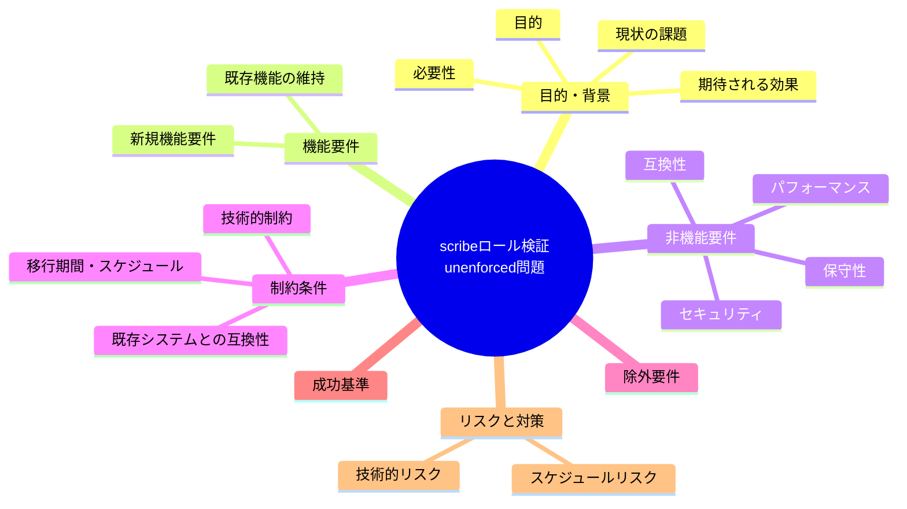

# 要求定義書: AGENT_ROLE 自己申告による scribe なりすまし・防御デッドコード化問題

**プロジェクト名**: AGENT_ROLE 自己申告による scribe なりすまし・防御デッドコード化問題
**作成日**: 2026年07月14日
**最終更新**: 2026年07月14日

---

## 要求定義の全体像

---

## 1. 目的・背景

### 1.1 目的（必須）

AGENT_ROLE自己申告によるscribeなりすましを防止するか判断する

### 1.2 背景

出典: 2026-07-14 fableによる本システムの自己調査で検出。

- **現状の課題**:
  - `settings.enforce.json` は env `AGENT_ROLE=orchestrator` を固定注入するため、hook が見る ROLE は常に orchestrator である。
  - scribe はコマンド内で `AGENT_ROLE` を自己申告する実運用であり、hook 側の scribe 分岐は実運用では一度も通らない（防御としてデッドコード化している）。
  - 役割の自己申告（env）に依存した検証は、呼び出し元の真正性を検証しないため、なりすましに対して脆弱である。wrapper の役割チェックが自己申告 env のみに依存する構造である限り、任意の呼び出し元が正規の役割になりすまして workflow.db への書き込み制御を通過できる余地が残る。

- **必要性**:
  - 役割ベースの書き込み制御が事実上機能しておらず、workflow.db への不正な直接書き込みを技術的に防止できていない。
  - なりすまし耐性のある役割検証（呼び出しコンテキストに基づく検証等）の要否検討が必要。

### 1.3 期待される効果（必須: 1 件以上）

- **効果 1**: `AGENT_ROLE=scribe` の自己申告のみでは workflow.db への書き込みが成立しない状態になる、または現状のリスクが許容可能である旨の判断・記録がなされる（○/×で判定可能）。

---

## 2. 機能要件

### 2.1 既存機能の維持（該当する場合）

- scribe による正規の write-workflow-log.sh 経由の記録フローは維持する。

### 2.2 新規機能要件

- （対応する場合）呼び出し元コマンド・呼び出しコンテキストに基づく role 検証の強化、または AGENT_ROLE の自己申告に依存しない代替の権限検証手段の検討。

---

## 3. 非機能要件

### 3.1 パフォーマンス

- 特になし。

### 3.2 セキュリティ

- 役割なりすましによる証跡改ざん・不正記録のリスクを低減する。

### 3.3 互換性

- 既存の scribe 委譲フロー（run_command.md の書記依頼の強制）との整合を保つ。

### 3.4 保守性

- hook 側の scribe 分岐が実運用で通るように整理し、デッドコードを解消する。

---

## 4. 制約条件

### 4.1 技術的制約

- Claude Code の hook 実行環境では、サブエージェント自身が起動時 env を制御できる範囲が広く、完全な偽装防止は困難な可能性がある。

### 4.2 既存システムとの互換性

- `platforms/claude/settings.enforce.json` の AGENT_ROLE 固定注入の設計意図（orchestrator 固定）との整合が必要。

### 4.3 移行期間・スケジュール

- 未定（対応要否は本 issue 起票後に判断）。

---

## 5. 除外要件

- workflow.db 自体の暗号化・署名等の高度な改ざん防止機構は対象外（別課題）。

---

## 6. 成功基準（必須: 1 件以上）

- AGENT_ROLE 自己申告のみに依存しない役割検証が導入される、またはリスクを許容する判断とその理由が記録される。

---

## 7. リスクと対策

### 7.1 技術的リスク

- **リスク**: 役割検証を強化すると、正規の scribe 委譲フローまで誤ってブロックする可能性がある。
  - **対策**: 対応する場合は既存 scribe フローでの回帰テストを実施する。

### 7.2 スケジュールリスク

- **リスク**: 対応要否がユーザー判断待ちのため着手時期未定。
  - **対策**: 本 issue を起票済みとして保持し、優先度判断を待つ。

---

## 8. 参考資料

### プロジェクトドキュメント

- なし

### その他の参考資料

- `platforms/claude/settings.enforce.json`（AGENT_ROLE 固定）
- `.agent-skill-chain/source/enforcement/claude/PreToolUse.sh:148-167, 278-330`
- `.agent-skill-chain/source/scripts/write-workflow-log.sh:46-49`
- `.agent-skill-chain/runtime/templates/agents/scribe_claude.md`

---

## 9. 次のステップ

この要求定義書の承認後、対応要否をユーザーが判断し、対応する場合は以下のドキュメントを作成します：

- **次**: `01_要件定義.md` - 要件定義フェーズ

---

## 判断結果

**判断日**: 2026年07月15日
**判断**: 却下（対応不要）

### 判断理由

- 起票時点（2026-07-14）では「様子見」として保留し、#163833（enforce配線既定on化）の帰結を待って再評価する方針だった。#163833 が PR #76 で main へマージ済みとなり、再評価トリガー条件が成立したため、2026-07-15 に再評価を実施した。
- 本 issue が懸念していた核心（「AGENT_ROLE の自己申告のみに依存しない役割検証」）は、既存の nonce 機構（commit d79545c）で既に実装済みであることを確認した。呼び出し元の自己申告 env だけに依存しない検証手段が既にコードベースに存在するため、本 issue が想定していた「防御デッドコード化」の状態は解消されている。
- #163833（PR #76）により、enforcement の配線が新規配備では既定 on となった。これにより実運用でも role 検証（nonce 機構含む）が機能する状態になる。
- 本リポジトリ自身が enforce off で運用されているのは、上記とは別の意図的な運用判断であり、本 issue（scribe ロール検証の実装可否）固有の追加対応を要する事由ではない。

### 結論

- §6 成功基準（「AGENT_ROLE 自己申告のみに依存しない役割検証が導入される、またはリスクを許容する判断とその理由が記録される」）は、既存のなりすまし対策（nonce 機構）と #163833 の既定on化により満たされていると判断する。
- 追加の実装・設計・実装計画（01〜03）の作成は行わず、本 issue はこの判断をもってクローズする。
