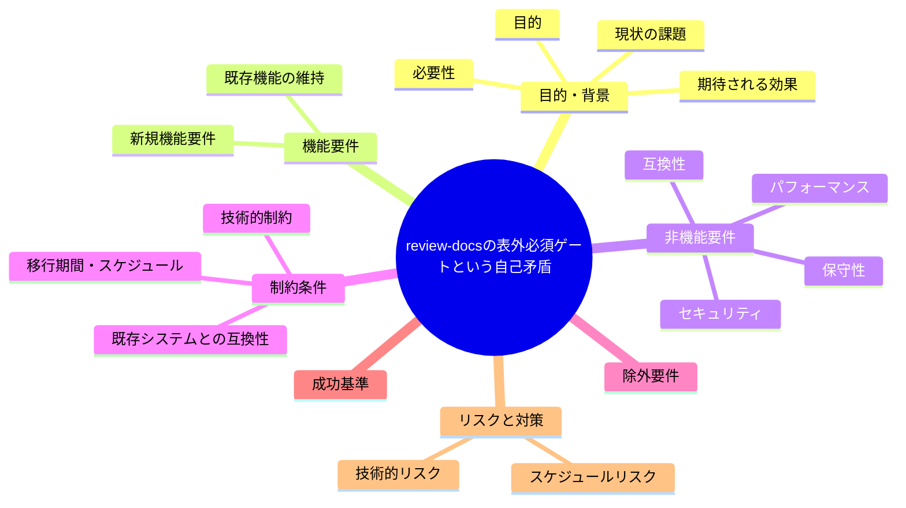
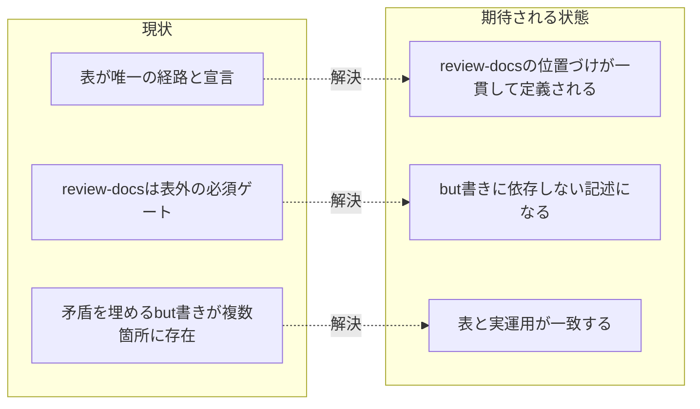

# 要求定義書: review-docs の表外必須ゲートという自己矛盾

**プロジェクト名**: review-docs の表外必須ゲートという自己矛盾
**作成日**: 2026 年 07 月 14 日
**最終更新**: 2026 年 07 月 14 日

> **重要**:
>
> - 要求定義書は、プロジェクトの全体像を把握するためのものです。詳細な技術仕様や実装方法は要件定義書以降で記載します。必要最低限の情報に収めることを心掛けてください。
> - **このドキュメントは常に更新**: 要求の変更や追加があった場合は、即座にこのドキュメントを更新してください。ドキュメントは「生きているドキュメント」として扱い、実装内容と常に同期させます。
> - **必須項目**: 以下の「必須」と明記した項目は空欄・抽象語のみ（例: 「{説明}」のまま）で提出しないこと。判定可能な形（目的は1文・成功基準は○/×で判定できる記載等）で記入すること。
>
> **用語**: [.agent-skill-chain/source/CONCEPTS.md §用語規約](../../../../../../.agent-skill-chain/source/CONCEPTS.md#用語規約) を参照。

---

## 要求定義の全体像

**注意**:

- 上記の「プロジェクト名」は例です。実際のプロジェクト名に置き換えてください。
- マインドマップは全体像を把握するためのものです。主要なセクション名程度に留め、詳細は記載しないでください。

---

## 1. 目的・背景

### 1.1 目的（必須）

PHASE_COMMAND_MAP と review-docs の位置づけの矛盾を解消する。

### 1.2 背景

2026-07-14 fable による本システムの自己調査で検出。

- **現状の課題**:
  - PHASE_COMMAND_MAP は「本表にない command の起動は禁止」「本表が唯一の経路」と宣言している一方、review-docs は表に載せないまま実装着手前の必須ゲートとしている。
  - この矛盾を解消するための説明（but 書き）が PHASE_COMMAND_MAP と PHASES の両方に必要となっており、ルール体系が自分自身の例外を説明するための文章を増やし続ける構造になっている。

- **必要性**:
  - 「本表が唯一の経路」という宣言と、表外の必須ゲートが実在するという事実の間の矛盾を解消し、規約の一貫性を回復する必要がある。

### 1.3 期待される効果（必須: 1 件以上）

- **効果 1**: review-docs の位置づけ（表に載せるか、表外ゲートとしての例外を正式に定義するか）が確定し、but 書きに依存しない記述になる。
- **効果 2**: PHASE_COMMAND_MAP と PHASES の記述が矛盾しない状態になる（相互参照のみで完結する）。

**現状と期待される状態の比較**（必要に応じて）:

---

## 2. 機能要件

### 2.1 既存機能の維持（該当する場合）

review-docs ゲート自体の機能（実装着手前レビュー）は維持する。

### 2.2 新規機能要件

{対応方針は 01 要件定義以降で検討。本書では課題の提起に留める}

---

## 3. 非機能要件

### 3.1 パフォーマンス

- {該当なし}

### 3.2 セキュリティ

- {該当なし}

### 3.3 互換性

- 既存の enforcement #32 との後方互換性を維持すること。

### 3.4 保守性

- 「重複禁止・正本1か所」という既存原則に整合する記述構造にすること。

---

## 4. 制約条件

### 4.1 技術的制約

- {01 要件定義以降で検討}

### 4.2 既存システムとの互換性

- 既存 issue の記録済みフローを破壊しないこと。

### 4.3 移行期間・スケジュール

- {未定}

---

## 5. 除外要件

対応方針の具体設計・実装（本 issue は課題の起票のみ）。

---

## 6. 成功基準（必須: 1 件以上）

- PHASE_COMMAND_MAP と PHASES の記述を読んだ第三者が、review-docs の位置づけ（表に載らない理由・必須である根拠）を矛盾なく説明できる状態になっていること。

---

## 7. リスクと対策

### 7.1 技術的リスク

- **リスク**: 表の唯一性原則を厳密化しすぎると review-docs のような横断的ゲートを表現できなくなる。
  - **対策**: 「表＝フェーズ遷移の経路」「横断ゲート＝別カテゴリ」として概念を分離する等、01 以降で検討する。

### 7.2 スケジュールリスク

- **リスク**: {特になし}
  - **対策**: {特になし}

---

## 8. 参考資料

### プロジェクトドキュメント

- 既存プロジェクトの場合は、[`00_システム理解.md`](./00_システム理解.md) - システム理解を参照

### その他の参考資料

- `.agent-skill-chain/source/workflow/PHASE_COMMAND_MAP.md:23-25, 36-38`
- `.agent-skill-chain/source/workflow/PHASES.md:65`

---

## 9. 次のステップ

この要求定義書の承認後、以下のドキュメントを作成します：

- **次**: [`01_要件定義.md`](./01_要件定義.md) - 要件定義フェーズ
