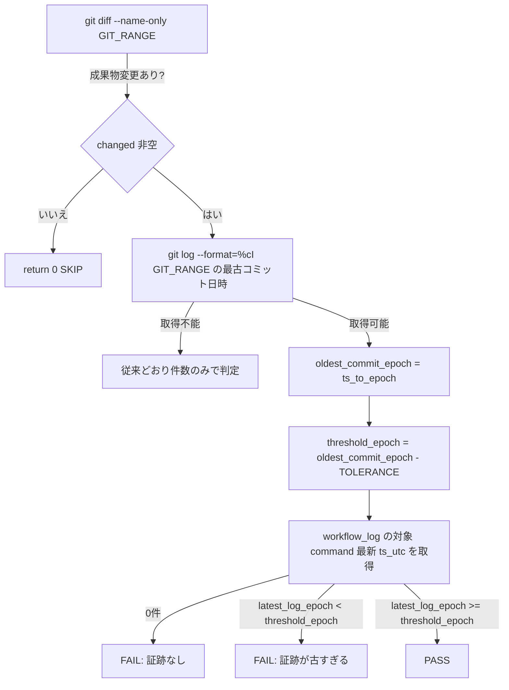

# 設計書: #25（メイン直接作業検知）の「1件でも記録があれば永久PASS」問題

**プロジェクト名**: #25（メイン直接作業検知）の「1件でも記録があれば永久PASS」問題
**作成日**: 2026年07月14日
**最終更新**: 2026年07月14日

---

## 1. 設計概要

### 1.1 設計方針

`check_25_main_did_real_work()` の判定を、既存の「対象 command ログの件数（COUNT）が 0 件か」という判定から、「対象差分（GIT_RANGE）に含まれる最古コミットの日時を基準に、対象 command の**最新** ts_utc が許容窓内にあるか」という**時系列突合**判定へ拡張する。既存の関数・呼び出しシグネチャ・SKIP 条件（git 不在・DB 不在・sqlite3 不在・成果物変更なし）は変更せず、判定ロジック本体のみを差し替える最小差分の変更とする。

### 1.2 設計原則（本プロジェクトで適用するもの）

- **単一責務**: check_25 は「成果物変更 × workflow_log の時系列対応」の検証のみを担う。GIT_RANGE の解決・検証（既定値フォールバック・注入対策）は既存の上流ロジックの責務のまま変更しない。
- **fail-open 優先の安全側**: 判定不能（コミット日時取得不能・ts_utc 解析不能）な場合は、誤検知（false positive）を避けるため従来の件数判定 or SKIP にフォールバックする。既存消費者環境を壊さないことを優先する。

---

## 2. アーキテクチャ設計

### 2.1 責務・境界・参照関係

#### 2.1.1 責務一覧

| コンポーネント | 責務（1 文） |
| --- | --- |
| `check_25_main_did_real_work()`（audit.sh） | 対象差分の最古コミット日時と workflow_log 対象 command の最新 ts_utc を突合し、時系列的な対応関係が無ければ FAIL する。 |
| `ts_to_epoch()`（audit.sh・既存関数の再利用） | ISO8601 文字列 / `YYYYMMDD_HHMMSS` 形式を epoch 秒に変換する。#33（close 移動未実施検知）で既に使われている既存ヘルパーをそのまま再利用する（新規実装しない）。 |

#### 2.1.2 境界

- **入力**: `git -C "$PROJECT_ROOT" log --format=%cI $GIT_RANGE`（対象差分のコミット日時列）、`sqlite3 "$WF_DB"`（workflow_log の対象 command 最新 ts_utc）、環境変数 `MAIN_WORK_GATE_TOLERANCE_SECONDS`（許容窓・秒、既定 172800）。
- **出力**: 標準エラーへの `[audit] ERROR: ...` メッセージ、`EXIT_CODE=1` の設定（既存と同一の失敗通知経路）。
- **他責務との境界**: GIT_RANGE の妥当性検証（オプション注入対策等）は本設計の変更対象外。他の failure check（#12/#13/#29 等）とも非交差（それぞれ別の証跡・スコープを検証する）。

#### 2.1.3 参照関係

- `check_25_main_did_real_work()` → `ts_to_epoch()`（既存関数を呼び出すのみ、循環参照なし）。
- 呼び出し順序（`ts_to_epoch` の定義 → `check_25_main_did_real_work` の定義・呼び出し）は既存ファイル内で `ts_to_epoch` が先に定義されているため、変更不要でそのまま利用できる。

### 2.2 システムアーキテクチャ

- **採用パターン**: 既存の #33（close 移動未実施検知）が採用する「コミット/ログの ISO8601 タイムスタンプを `ts_to_epoch` で epoch 化し、猶予秒数と比較する」パターンをそのまま踏襲する（新規パターン導入なし）。
- **根拠**: #33 で既に実証済みのタイムスタンプ比較パターンを再利用することで、新規の失敗モードを持ち込まずに一貫した実装にできる。

#### 2.2.2 アーキテクチャ図

### 2.5 横断設計判断（ADR）

#### ADR-1: 時系列突合の基準を「最古コミット」にするか「最新コミット（HEAD）」にするか

- **コンテキスト**: 対象差分（GIT_RANGE）に複数コミットが含まれる場合（push で複数コミットがまとめて送られる等）、基準時刻をどのコミットに置くかで判定の厳しさが変わる。
- **検討した選択肢**:
  1. 最古コミット（GIT_RANGE 内で最も古い委譲者日時）を基準にする。
  2. 最新コミット（HEAD）の日時を基準にする。
- **決定**: 選択肢 1（最古コミット基準）を採用する。
- **根拠**: 選択肢 2（HEAD 基準）だと、GIT_RANGE に古いコミットが含まれる場合（例: 複数コミット push の先頭コミットが数日前）、その古いコミットに対応する証跡が実際にはもっと前に記録されていても、HEAD 基準では許容窓を超えて誤 FAIL しやすくなる。最古コミットを基準にすることで、「対象差分の作業がいつ始まったか」からの経過時間で証跡の有無を判定でき、正当な作業でも誤検知しにくい安全側の設計になる。
- **帰結**: 許容窓（既定 48h）は「最古コミットからログまでの間隔」を意味する値として運用される。

#### ADR-2: 許容窓（tolerance）を固定値にするか環境変数で上書き可能にするか

- **コンテキスト**: 実装 → ログ記録 → コミット の順序は一律ではなく（ログが先の場合・コミットが先の場合双方があり得る）、また消費者ごとに CI 実行間隔・運用速度が異なる。
- **検討した選択肢**:
  1. 固定値（例: 48 時間）をハードコードする。
  2. 環境変数 `MAIN_WORK_GATE_TOLERANCE_SECONDS`（既定 172800 秒=48時間）で上書き可能にする。
- **決定**: 選択肢 2 を採用する。
- **根拠**: 既存の類似ゲート（`CLOSE_MOVE_GRACE_DAYS` 等）も env 上書き可能な設計であり、本リポジトリの既存慣習と整合する。消費者の運用速度（コミット頻度・CI 実行間隔）は環境依存であるため、固定値では過検知・過見逃しのどちらかに偏るリスクがある。
- **帰結**: 既定 48 時間は「1〜2 営業日以内の証跡記録」を許容する妥当な初期値と判断する（01 要件のリスク対策§参照）。

#### ADR-3: コミット日時取得不能時のフォールバック方針

- **コンテキスト**: GIT_RANGE が単一コミット参照で `git log --format=%cI` が空を返す等、時系列突合に必要なコミット日時が取得できないケースがありうる。
- **検討した選択肢**:
  1. 判定不能として SKIP（fail-open）する。
  2. 判定不能でも従来の件数（COUNT）のみの判定にフォールバックする。
  3. 判定不能なら安全側で常に FAIL する（fail-closed）。
- **決定**: 選択肢 2 を採用する。
- **根拠**: 選択肢 3（fail-closed）は、GIT_RANGE 解決の異常系（既存の GIT_RANGE 検証で無害化された既定値等）で誤って全消費者環境をロックアウトするリスクがあり、絶対強制ゆえに慎重を要する（enforcement/README.md の fail-open 優先方針）。選択肢 1（無条件 SKIP）は既存の「証跡皆無」検知能力（件数 0 件で FAIL）まで失われ、既存動作からの後退になる。選択肢 2 は、時系列突合という新機能が使えない場合に限り、既存の検知能力（件数 0 件で FAIL）を維持しつつ、それ以上に厳しい判定は行わない安全側の折衷案である。
- **帰結**: 通常運用（有効な GIT_RANGE と 1 件以上のコミット）では時系列突合が効き、異常系では最低限の既存検知能力を保つ。

---

## 6. テスト戦略

### 6.1 対象ごとのテスト割り当て

| 対象 | 単体 | 結合/API | E2E | クリティカル観点 | バリデーション観点 | 未達理由/補足 |
| --- | --- | --- | --- | --- | --- | --- |
| check_25 の時系列突合ロジック | ○ | ○（tmp git+sqlite3 実行） | × | 対象差分と無関係な古いログのみで FAIL する（新規検知）・直近ログでは FAIL しない（正常フロー回帰無し） | 許容窓 env 上書き・コミット日時取得不能時のフォールバック | E2E（実 GitHub Actions 実行）は A-2（workflow.db 非追跡）により CI では本チェック自体が SKIP されるため対象外（00 §4.1） |

### 6.2 監査・レビューでの確認（証跡）

`03_実装計画.md` のテスト観点・単体テスト節、および実施した tmp 隔離検証（`test/test-audit.sh` への回帰テスト追加・実行結果）を証跡とする。

---

## 10. 参考資料

### プロジェクトドキュメント

- [`01_要件定義.md`](./01_要件定義.md) - 要件定義

---

## 11. 前のステップ

- **前**: [`01_要件定義.md`](./01_要件定義.md) - 要件定義フェーズ

---

## 12. 次のステップ

- **次**: [`03_実装計画.md`](./03_実装計画.md) - 実装計画フェーズ
