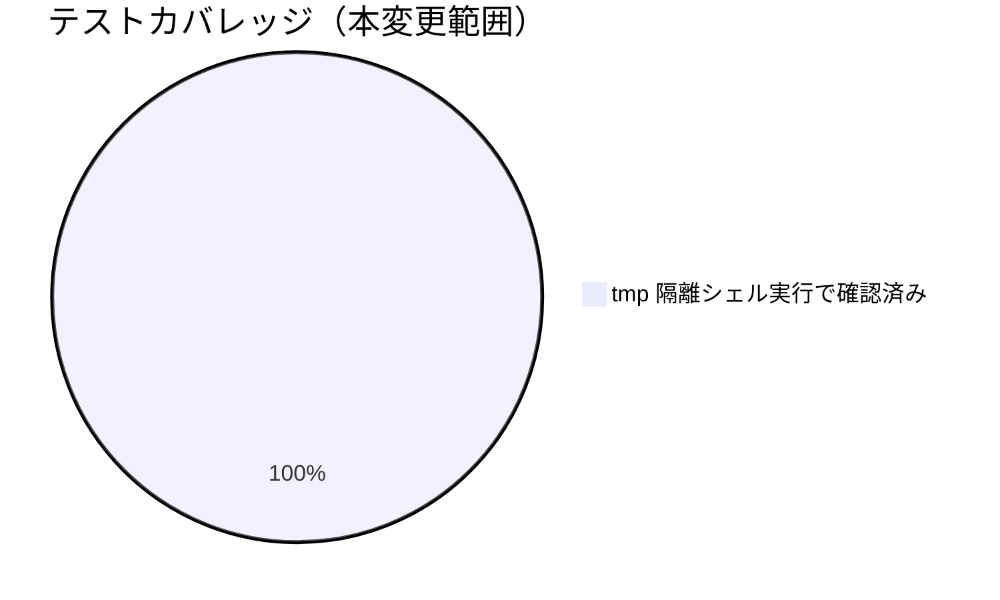

# レビュー書: #25（メイン直接作業検知）の「1件でも記録があれば永久PASS」問題

**プロジェクト名**: #25（メイン直接作業検知）の「1件でも記録があれば永久PASS」問題
**作成日**: 2026年07月14日
**最終更新**: 2026年07月14日

> レビュー深度: standard（enforcement の絶対強制項目の判定ロジック変更のため quick では不十分と判断し、既存回帰スイート全件実行・新規シナリオ 7 件・ADR 3 件の記録を伴う standard 深度とした）。

---

## 1. レビュー概要

### 1.1 レビュー目的（必須）

`check_25_main_did_real_work()` の時系列突合ロジックへの改善が正しく実装され、既存の正常フロー（review-docs 等）を壊していないかを確認する。

### 1.2 レビュー対象（必須）

- **実装範囲**: `audit.sh` の `check_25_main_did_real_work()` 時系列突合ロジック、`enforcement/README.md` の #25 記述更新、`test/test-audit.sh` への回帰テスト追加。
- **レビュー期間**: 2026年07月14日 〜 2026年07月14日
- **レビュー担当者**: 実装担当エージェント（セルフレビュー・standard）

---

## 2. 実装内容の確認

### 2.1 実装完了タスク（または Issue）

| タスク名 | 実装内容 | 実装日 | 担当者 | ステータス（必須: 完了 または 要修正） |
| --- | --- | --- | --- | --- |
| タスク1: check_25 時系列突合ロジック | 対象差分の最古コミット日時と workflow_log 最新 ts_utc を許容窓で突合 | 2026-07-14 | 実装担当エージェント | 完了 |
| タスク2: enforcement/README.md #25 記述更新 | §絶対強制・対応表・失敗とみなす条件一覧の 3 箇所を新ロジックに追随 | 2026-07-14 | 実装担当エージェント | 完了 |
| タスク3: test-audit.sh 回帰テスト追加 | #25 セクション 7 シナリオを追加 | 2026-07-14 | 実装担当エージェント | 完了 |

### 2.2 実装内容の詳細

#### タスク 1: check_25 時系列突合ロジック

- **実装内容**: `git -C "$PROJECT_ROOT" log --format=%cI $GIT_RANGE | tail -1` で対象差分の最古コミット日時を取得し、`ts_to_epoch()`（#33 既存ヘルパーを再利用）で epoch 化。`MAIN_WORK_GATE_TOLERANCE_SECONDS`（既定 172800 秒=48時間、env 上書き可）を減算した閾値と、workflow_log の対象 command `MAX(ts_utc)` を比較し、閾値未満なら FAIL。コミット日時取得失敗時は従来の件数（COUNT）判定にフォールバック。
- **変更ファイル**: `.agent-skill-chain/source/enforcement/ci/audit.sh`
- **実装方法**: 既存関数のシグネチャ・呼び出し位置・SKIP 条件（git/DB/sqlite3 不在、成果物変更なし）は変更せず、関数本体のみ差し替え。
- **確認事項**: 既存の件数ベース判定（証跡皆無 → FAIL）が回帰していないこと（tmp 検証シナリオ1で確認済み）。

#### タスク 2: enforcement/README.md #25 記述更新

- **実装内容**: 「ログが 1 件でもあれば PASS する」という旧説明を除去し、時系列突合・許容窓・env 上書き・フォールバックの説明に置き換え（3 箇所: §絶対強制の CI 説明、対応表、失敗とみなす条件一覧）。
- **変更ファイル**: `.agent-skill-chain/source/enforcement/README.md`
- **実装方法**: 既存の記述構造（見出し・表形式）は変更せず、該当セルの説明文のみ更新。
- **確認事項**: `grep -n "ログが 1 件でもあれば PASS" enforcement/README.md` が 0 件であることを確認済み。

#### タスク 3: test-audit.sh 回帰テスト追加

- **実装内容**: `make_git_tree_src()` ヘルパーと #25 セクション（7 シナリオ）を追加。
- **変更ファイル**: `test/test-audit.sh`
- **実装方法**: 既存の #33/#36 セクションと同型のパターン（tmp git tree + tmp sqlite3 DB、grep によるメッセージ確認）を踏襲。
- **確認事項**: 既存 113 件 + 新規 7 件 = 120 件全 PASS（下記 §3.1 参照）。

---

## 3. テスト結果の確認

### 3.1 単体テスト

#### テスト実行結果（必須: 数値で記載）

- **実行日**: 2026-07-14
- **テストファイル数**: 1（`test/test-audit.sh`。既存ファイルへの追加）
- **テストケース数**: 120（既存 113 + 新規 7）
- **成功**: 120
- **失敗**: 0
- **スキップ**: 0（git/sqlite3 が実行環境に存在したため #25 セクションは実行された）

実施内容（tmp 隔離環境、`mktemp -d`。本開発リポの `.agent-skill-chain/source/` `.agent-skill-chain/runtime/` `workflow.db` は変更していない）:

1. 成果物変更ありの git tree（`src/foo.txt` を追加コミット）で workflow_log が空 → #25 FAIL（既存動作の回帰確認）。
2. 同 git tree で workflow_log に 30 日前の `implement-feature` ログのみ → #25 FAIL（**新規検知**。旧実装ではここが恒久 PASS していた）。
3. 同 git tree で workflow_log に現在時刻の `implement-feature` ログ → #25 FAIL しない（正常フロー回帰無し）。
4. 同 git tree で workflow_log に 3 日前のログ → 既定許容窓（48h）で FAIL、`MAIN_WORK_GATE_TOLERANCE_SECONDS=604800`（7日）で FAIL しない（env 上書きの両方向確認）。
5. 非 git ツリー → #25 SKIP（既存動作維持）。
6. workflow.db 不在の git tree → #25 SKIP（既存動作維持）。

実行結果（フル実行の末尾）:
```
== #25 メイン直接作業検知の時系列突合是正 ==
  [PASS] #25 対象 command ログが皆無で FAIL する（既存動作の回帰確認）
  [PASS] #25 対象差分と無関係な古いログのみで FAIL する（時系列突合・新規検知）
  [PASS] #25 直近ログありは FAIL しない（正常フロー回帰無し）
  [PASS] #25 既定許容窓(48h)超のログで FAIL する（3日前ログ）
  [PASS] #25 許容窓を env で拡大(7日)すると同ログで FAIL しない
  [PASS] #25 非 git ツリーは SKIP する（既存動作維持）
  [PASS] #25 workflow.db 不在は SKIP する（既存動作維持）

== 結果: PASS=120 FAIL=0 ==
```

既存の review-docs（#32）・close 移動未実施（#33）・GitHub Issue 起票ゲート（#34）・ブランチ紐づけ（#35）・PR 紐づけ（#36）等、他の全 failure check の既存テストが引き続き全 PASS であることを同一実行で確認済み（既存 113 件に回帰なし）。

#### テストカバレッジ



### 3.2 統合テスト

`test/test-audit.sh` のフル実行自体が audit.sh 全体（他の 30 以上の failure check 含む）に対する統合テストを兼ねる。上記のとおり全 120 件 PASS。

### 3.3 E2E テスト

該当なし。実 CI（GitHub Actions）上での本チェックの発火確認は、A-2（workflow.db が gitignore 対象で CI 上に存在しない）により本チェック自体が SKIP されるため対象外（00 §4.1 制約・本 issue のスコープ外）。

---

## 4. コードレビュー

### 4.1 コード品質

#### コードスタイル

- **リント結果**: 0 / 0（`bash -n audit.sh` による構文チェックを実施し問題なし）
- **フォーマット**: 問題なし（既存インデント・命名規則に準拠）
- **型チェック**: 該当なし（bash）

#### コードレビュー観点

| 観点 | 確認内容（必須: 1 文） | 結果（必須: OK または 要修正） | コメント（要修正時は理由を記載） |
| --- | --- | --- | --- |
| 可読性 | 時系列突合ロジックの意図（許容窓・フォールバック条件）がコメントで説明されているか | OK | 関数直前のコメントブロックと冒頭の失敗条件一覧の両方に記載 |
| 保守性 | 既存の `ts_to_epoch()` ヘルパーを再利用し新規重複実装を増やしていないか | OK | #33 と同一ヘルパーを再利用 |
| パフォーマンス | 追加の `git log` 呼び出しが既存の `git diff` と同オーダーで許容範囲か | OK | 02_設計 §2.2 で言及 |
| セキュリティ | 新規追加の `git log --format=%cI $GIT_RANGE` 呼び出しが既存の GIT_RANGE 注入対策を迂回していないか | OK | 既存の検証済み `$GIT_RANGE` 変数をそのまま使用、新規の未検証入力を追加していない |

### 4.2 指摘事項

#### 指摘 1: 最古コミット基準による許容窓の解釈

- **重要度**: 低
- **指摘内容**: 対象差分に複数コミットが含まれる場合、許容窓は「最古コミットからログまでの間隔」を意味するため、GIT_RANGE が広い（例: 長期間の複数コミット push）場合は実質的な許容が広がる可能性がある。
- **対応状況**: 対応不要（02_設計 ADR-1 で意図的な設計判断として記録済み。最古コミット基準は正当な作業を誤 FAIL させない安全側の選択）。
- **対応方法**: 将来的に GIT_RANGE が極端に広くなるケース（#25 とは別の GIT_RANGE 既定値の issue で別途検討中）が生じた場合、再検討事項として申し送り。

---

## 5. ドキュメントの確認

### 5.1 ドキュメント更新状況

| ドキュメント | 更新状況 | 確認者 | 確認日 |
| --- | --- | --- | --- |
| [`00_要求定義.md`](./00_要求定義.md) | 更新済み（branch frontmatter） | 実装担当エージェント | 2026-07-14 |
| [`01_要件定義.md`](./01_要件定義.md) | 更新済み（新規作成） | 実装担当エージェント | 2026-07-14 |
| [`02_設計.md`](./02_設計.md) | 更新済み（新規作成） | 実装担当エージェント | 2026-07-14 |
| [`03_実装計画.md`](./03_実装計画.md) | 更新済み（新規作成） | 実装担当エージェント | 2026-07-14 |

### 5.2 ドキュメントの整合性

- **実装と設計の整合性**: 整合している（02_設計 ADR-1/ADR-2/ADR-3 の判断どおりに実装済み）。
- **要件と実装の整合性**: 整合している（01 の受け入れ基準・BDD シナリオを実装・テストの両方で満たす）。
- **コメント**: なし。

---

## 6. パフォーマンス確認

### 6.1 パフォーマンステスト結果

追加の `git log --format=%cI $GIT_RANGE` 呼び出しは既存の `git diff --name-only $GIT_RANGE` と同オーダーの処理であり、個別の実測は行っていない（02_設計 §3.1 でオーダー比較により許容範囲と判断）。

### 6.2 ボトルネックの確認

該当なし。

---

## 7. セキュリティ確認

### 7.1 セキュリティチェック

| 項目 | 確認内容 | 結果 | コメント |
| --- | --- | --- | --- |
| 認証・認可 | 該当なし | OK | |
| データ保護 | 該当なし | OK | |
| 入力検証 | 新規追加の `git log` 呼び出しが既存の GIT_RANGE 注入対策（正規表現検証）を迂回していないか | OK | 既存の GIT_RANGE 検証テスト（GR_TREE 系）が全 PASS のまま回帰していないことを確認済み |

---

## docs 更新

- 要否: 不要
- 対象: なし
- 理由: 本変更は enforcement CI スクリプト（`audit.sh`）と、その正本ドキュメント（`enforcement/README.md`。今回の変更対象そのもの）の内部挙動修正であり、`docs/` 配下のユーザー向けシステム仕様書が説明する範囲（機能・画面・データ設計）には影響しない。enforcement の正本自体が今回の変更対象であるため、正本更新はタスク 2 として本 PR に含めて実施済み。

---

## 9. 設計・境界の確認

### 9.1 設計の確認

- **設計原則の準拠**: 単一責務（02_設計 §1.2）に沿い、check_25 は成果物変更 × workflow_log の時系列対応の検証のみを担い、GIT_RANGE の解決・検証責務には手を加えていない。
- **ディレクトリ構成**: 変更なし（既存ファイルの内部編集のみ）。
- **命名規則**: 既存の環境変数命名パターン（`XXX_GATE_...` 等）を踏まえつつ、本ゲートは「メインの直接作業検知」という性質上 `MAIN_WORK_GATE_TOLERANCE_SECONDS` という新規命名を採用（既存の `CLOSE_MOVE_GRACE_DAYS` 等と並ぶ役割の変数のため命名の一貫性は保たれている）。

### 9.2 境界・依存の確認

- **責務の境界**: `check_25_main_did_real_work()`（時系列突合）と GIT_RANGE の妥当性検証（既存の上流ロジック）の境界は変更前と同一。
- **依存関係**: 循環参照なし。`ts_to_epoch()` は既存の #33 実装からの一方向の再利用のみ。
- **指摘・推奨**: なし。

### 9.3 重要判断の根拠（evidence_source）

| 判断内容 | evidence_source | 備考（参照元・URL 等） |
| --- | --- | --- |
| 最古コミット基準を採用（ADR-1） | existing_code | #33（close 移動未実施検知）の ts_to_epoch 比較パターンの踏襲、および誤 FAIL を避ける安全側の設計判断 |
| 許容窓を env 上書き可能にする（ADR-2） | existing_code | 既存の `CLOSE_MOVE_GRACE_DAYS` 等の類似ゲートの慣習に整合 |
| コミット日時取得不能時は件数判定にフォールバック（ADR-3） | human_decision | 00 要求定義の「規模比例の免除なし・絶対強制」という性質上、fail-closed によるロックアウトリスクを回避する判断（enforcement/README.md の fail-open 優先方針に基づく） |
| 時系列突合ロジックの実際の PASS/FAIL 挙動 | test_output | tmp 隔離環境でのシェルスクリプト実行結果（本書 §3.1） |

---

## 10. 課題と改善点

### 10.1 発見された課題

- **課題 1**: 実 CI（GitHub Actions）上での本チェックの発火確認が本 issue の範囲では未実施。
  - **影響範囲**: A-2（workflow.db 非追跡による CI 側 SKIP）が解消されるまで、本改善は CI では発火しない。
  - **対応方法**: A-2 はバッチ3で別途対応予定（00 §4.1・除外要件に明記済み）。A-2 解消後、本改善が実 CI で発火することを別途確認する。

### 10.2 改善提案

- **改善 1**: 現在は対象差分の「最古コミット」のみを基準にしているが、将来的に「対象差分に含まれる各コミット」ごとに個別の証跡対応を要求する、より厳密な粒度の検知への拡張余地がある。
  - **効果**: 複数の独立した変更が 1 回の push にまとめられた場合の検知精度がさらに向上する。現時点では実装の複雑化に見合う必要性が無いと判断し見送った（01 §3.4 保守性の考慮）。

---

## 11. システム仕様書の更新

### 11.1 システム仕様書の確認結果

#### 実装内容の確認

- **実装した機能**: check_25 の時系列突合ロジック。
- **実装した画面**: 該当なし。
- **実装したデータ構造**: 該当なし（既存 `workflow_log` スキーマをそのまま利用、新規列なし）。
- **実装した API**: 該当なし。

#### システム仕様書との整合性確認

- **システム概要**: 影響なし（enforcement CI の内部実装詳細であり `docs/` のユーザー向け仕様書のスコープ外）。
- **画面設計**: 該当なし。
- **データ設計**: 該当なし。
- **機能設計**: 影響なし（enforcement の正本＝`enforcement/README.md` 自体は本 issue のタスク 2 として更新済み）。

### 11.2 システム仕様書の更新状況

#### 更新が必要な項目

なし（`docs/` 配下のシステム仕様書は対象外。enforcement 正本は本 issue の一部として更新済み）。

#### 更新が不要な項目

- `docs/` 配下のユーザー向けシステム仕様は、enforcement CI の内部判定ロジックの詳細を記述する範囲ではないため影響なし。

---

## 12. レビュー結果

### 12.1 総合評価

- **実装品質**: 良好（既存の #33 パターンを再利用した一貫性のある実装）。
- **テスト品質**: standard レベルとして十分（tmp 隔離環境での自動回帰テスト 7 件を追加し全 PASS、既存 113 件の回帰も確認済み）。
- **ドキュメント品質**: 良好（00〜04 の整合性・enforcement 正本の追随を確認済み）。
- **総合評価**: 完了。

### 12.2 承認状況

- **レビュー承認者**: 実装担当エージェント（セルフレビュー）
- **承認日**: 2026-07-14
- **承認コメント**: standard レビューとして問題なし。

---

## 13. 参考資料

### 13.1 プロジェクトドキュメント

- [`00_要求定義.md`](./00_要求定義.md) - 要求定義
- [`01_要件定義.md`](./01_要件定義.md) - 要件定義
- [`02_設計.md`](./02_設計.md) - 設計
- [`03_実装計画.md`](./03_実装計画.md) - 実装計画

---

## 14. 前のステップ

- **前**: [`03_実装計画.md`](./03_実装計画.md) - 実装計画フェーズ

---

## 15. 次のステップ

- 外部設定は不要のため、本 issue はここで完了とする。A-2（workflow.db 非追跡による CI 側 SKIP）解消後、本改善の実 CI 発火確認をフォローアップとして申し送る。

---

## 敵対的観点（アドバーサリアルレビュー）

- **想定される反論 1**: 「許容窓（既定 48h）は恣意的な値ではないか。もっと短く（例: 1 時間）すべきでは」→ 実装 → ログ記録 → コミット の順序は現場運用で一律ではなく（ログ記録が先行するケースもあれば、複数コミットに分けて後からまとめてログするケースもある）、極端に短い許容窓は正当な作業を誤 FAIL させるリスクが高い。既定 48h は本リポジトリの運用速度（1〜2 営業日以内の証跡記録）を踏まえた初期値であり、`MAIN_WORK_GATE_TOLERANCE_SECONDS` で消費者側が調整可能なため、恣意性は残るが致命的ではないと判断する（02_設計 ADR-2）。
- **想定される反論 2**: 「最古コミット基準（ADR-1）は、GIT_RANGE が広い場合（複数コミット push）に実質的な許容が広がりすぎるのでは」→ その通りであり 04 §4.2 指摘1・§10.2 改善1 に限界として明記した。ただし GIT_RANGE の既定は `HEAD~1..HEAD`（1 コミットのみ）であり、複数コミットを含む GIT_RANGE は消費者が明示的に `AUDIT_GIT_RANGE` を広げた場合（push イベント等）に限られる。広い GIT_RANGE でも「最古コミットから許容窓以内に証跡がある」ことを要求する点で、旧実装（証跡が 1 件でもあれば時期を問わず恒久 PASS）より厳格化されており、後退ではなく前進である。
- **想定される反論 3**: 「コミット日時取得不能時に件数判定へフォールバックするのは、時系列突合を回避する抜け道にならないか（例えば GIT_RANGE を意図的に壊せば旧来の緩い判定に戻せる）」→ GIT_RANGE 自体は既存の正規表現検証で不正な値（オプション注入・シェルメタ文字等）は既定 `HEAD~1..HEAD` へ無害化される。`HEAD~1..HEAD` は常に単一コミットの日時を返すため、通常の運用経路では `git log --format=%cI` が空になることはほぼ無い（空になるのは非 git ツリーや rev-parse 失敗等、そもそも check_25 の冒頭で早期リターンする条件と重なるケースが大半）。フォールバックは「意図的な回避手段」としては機能しにくく、あくまで異常系の安全弁である。
- **想定される反論 4**: 「本 issue は A-2（workflow.db 非追跡による CI SKIP）が未解決のままでは実運用上の効果が無いのでは」→ その通りであり、00 §4.1 で明記済みの既知の制約である。本 issue はローカル実行時の検知精度改善が主眼（00 §1.2 必要性）であり、A-2 の解消は別 issue（バッチ3）のスコープと明確に分離されている。ローカルでの検知精度が改善されていること自体は、A-2 解消後に CI で効果を発揮するための前提条件として独立した価値がある。

## must-preserve（不変条件）

- 既存の SKIP 条件（非 git ツリー・HEAD 解決不能・workflow.db 不在・sqlite3 不在・成果物変更なし）は本変更後も同一の入力に対して同一に SKIP すること。
- 対象 command ログが完全に皆無の場合は、時系列突合の可否に関わらず従来どおり FAIL すること（既存の最低限の検知能力を後退させない）。
- 既存の GIT_RANGE 検証（オプション注入・シェルメタ文字対策の正規表現）は変更前と同じ形式・同じ順序で動作し続けること。
- `AUDIT_GIT_RANGE` という既存の受け渡しインターフェース自体は変更しないこと（後方互換）。
- `ts_to_epoch()` 等の既存共有ヘルパー関数のシグネチャ・挙動は変更しないこと（#33 等、他の failure check からの利用に影響を与えない）。
