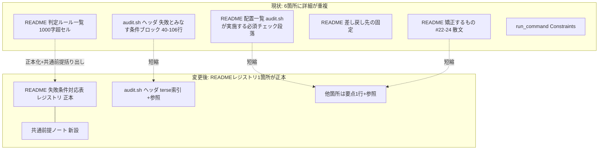

# 設計書: enforcement 失敗条件記述の重複解消・未実装ラベル・欠落行の統合設計

**プロジェクト名**: enforcement 失敗条件記述の一元化（バッチ5・統合設計）
**作成日**: 2026 年 07 月 14 日
**最終更新**: 2026 年 07 月 14 日

> 本 02 は**バッチ5の統合設計の正本**である。同時対応する 2 件（`163403` 未実装項目の明示・`163432` ドリフト解消）の 02_設計.md は本書を参照し、差分のみを記載する（重複させない）。
>
> **用語**: `.agent-skill-chain/source/CONCEPTS.md §用語規約` を参照。

---

## 1. 設計概要

### 1.1 設計方針

3 件の課題（重複解消 163330・未実装ラベル 163403・欠落行 163432）は、いずれも `enforcement/README.md §失敗条件と差し戻し` の**同じ表群**を対象とする。よって**3 件を別々に触るのではなく、失敗条件レジストリの 1 回の構造変更で 3 件の成功基準を同時に満たす**。中核は「失敗条件の詳細を README の 1 か所（失敗条件対応表）に正本化し、他 5 箇所は要点 1 行＋参照へ短縮する」ことである。

### 1.2 設計原則（本プロジェクトで適用するもの）

- **単一責務 / 正本 1 か所**: 各失敗条件の「概要・実装の所在・実装状態・強制レベル・差し戻し先」の正本を README の失敗条件対応表 1 か所に集約する。他ファイルは参照に徹する。これは本システム自身が掲げる「重複禁止・正本 1 か所」原則の自己適用である。
- **明確な境界**: 「抽象原則・判定ルールの正本＝コア `.agent-skill-chain/source/`」「具体手順の正本＝`.agent-skill-chain/project/`」の既存境界を維持する。project 側には判定ルールを再掲しない。
- **AIフレンドリー設計**: 1 セル 1,000 字超の巨大セルを解消し、共通前提（SKIP・grandfather・env トグル）を共有ノートへ括り出すことで、機械（および人間）が実装状態を一目で判別できる表にする。

---

## 2. アーキテクチャ設計

### 2.1 責務・境界・参照関係

#### 2.1.1 責務一覧

| コンポーネント | 責務（1 文） |
| -------------- | -------------- |
| `enforcement/README.md` 失敗条件対応表（レジストリ） | 全失敗条件の {概要・実装の所在・実装状態・強制レベル} の**唯一の正本**。 |
| `enforcement/README.md` 判定ルール一覧（Table B） | 各失敗条件の**失敗の意味（何を失敗とみなすか）**の正本。実装所在・強制レベルはレジストリを参照。 |
| `enforcement/README.md` 差し戻し先の固定（Table C） | 各失敗条件の**差し戻し手順**の正本。 |
| `enforcement/README.md` ゲート共通前提ノート（新設） | grandfather 発効日・env 無効化トグル・共通 SKIP パターンの**共有正本**。各行はこれを参照し重複記述しない。 |
| `enforcement/ci/audit.sh` ヘッダコメント | 実装チェックの**terse な索引**（1 行/チェック＋README 参照）。判定ルールの詳細は持たない。 |
| `skills/agent/run_command.md` Constraints | 実装前ゲートの**手続き的指示**（何を記録してから implement するか）。失敗条件の詳細は README を参照。 |
| `.agent-skill-chain/project/自己拡張ワークフロー.md` | 本リポ固有の**具体手順のみ**（`gh` コマンド・frontmatter 形式等）。判定ルールは再掲しない。 |

#### 2.1.2 境界

- **入力**: 既存の `enforcement/README.md`・`enforcement/ci/audit.sh`（ヘッダのみ）・`skills/agent/run_command.md`・`AGENT_CONDUCT.md`・`.agent-skill-chain/project/自己拡張ワークフロー.md`。
- **出力**: ドキュメント構造の変更のみ。**audit.sh の実行ロジック（関数本体）・CI 挙動・出力メッセージは一切変更しない**。
- **他責務との境界**: 7 つの未実装項目（#22/#23/#24/#30・系統A/C/E）の**個別 hook 実装は本スコープ外**（163403 は「未実装ラベルの付与」まで）。audit.sh のチェック追加・変更も本スコープ外（163432 は「既存実装済みチェックの表への記載」まで）。

#### 2.1.3 参照関係

- 変更後の参照の向き（すべて README のレジストリへ収れん）:
  - `audit.sh ヘッダ` → `README 失敗条件対応表`
  - `run_command.md Constraints` → `README §失敗条件と差し戻し #N`（既存どおり・維持）
  - `AGENT_CONDUCT.md` → `README §失敗条件 #22–#24 / #30`（既存どおり・維持）
  - `project/自己拡張ワークフロー.md` → `source/...`（既存どおり・維持）
- 循環参照は持たない。README のレジストリが末端の正本。

### 2.2 システムアーキテクチャ

- **採用パターン**: 単一正本 + 参照（Single Source of Truth）。ドキュメント間の情報配置における「1 概念 1 正本」。
- **根拠**: `spec/01_設計原則.md §単一責務`・本システムの enforcement 原則「重複禁止」。同期漏れ（#37 で実際に発生）の再発防止が目的。

#### 2.2.2 変更対象の構造（Before / After）

### 2.5 横断設計判断（ADR）

#### ADR-1: 失敗条件対応表（Table A）を全失敗条件の単一レジストリにする

- **コンテキスト**: 現状 `enforcement/README.md` には 3 つの表（A: 失敗条件→実装の所在→強制レベル対応表 / B: 判定ルール一覧 / C: 差し戻し先の固定）があり、加えて audit.sh ヘッダ・README 散文にも同内容が重複する。1 ゲート追加時に 6 箇所の同期が必要で、#37 で実際に同期漏れ（対応表 A・判定ルール B・差し戻し C に #37 行が無い）が発生した。
- **検討した選択肢**:
  1. **(採用) 表 A をレジストリ（正本）に格上げ**し `実装状態` 列を追加、全失敗条件の行を網羅。表 B/C は各々の固有情報（失敗の意味 / 差し戻し手順）に限定し、実装所在・強制レベルはレジストリ参照に。audit.sh ヘッダ・README 散文は要点 1 行＋参照へ短縮。
  2. 3 表を 1 表に完全統合（6 列の巨大表）。→ 却下: セルが再び長大化し、`§失敗条件と差し戻し` を参照する既存文書（DESIGN.md が「対応表」を名指し）との整合も崩れる。
  3. 詳細を audit.sh ヘッダに正本化し README を参照に。→ 却下: audit.sh ヘッダ line 3 が「判定ルール・差し戻し先は README に従う」と宣言済みで、方向が逆転する。外部文書は README を判定ルールの正本として参照している。
- **決定**: 選択肢 1。表 A を「失敗条件対応表（レジストリ・正本）」とし、`# / 対象 | 概要 | 実装の所在 | 実装状態 | 強制レベル | 差し戻し先（要点）` の列構成に拡張する。表 B・表 C は残置（既存参照・DESIGN.md 名指しを保全）しつつ、重複する実装所在・強制レベル・共通 SKIP 記述を削り、audit.sh ヘッダ／README 散文は参照へ短縮する。
- **根拠**: `spec/01_設計原則.md §単一責務`。外部参照（`§失敗条件と差し戻し` 見出し・`#N` 番号・DESIGN.md の「対応表」名）を破壊せず最小変更で 3 課題を同時解消できる（evidence_source: 本 issue 群 00・現物 README/audit.sh の読解）。
- **帰結**: 新ゲート追加時の同期は「README §失敗条件と差し戻しの隣接 3 表＋共通前提ノート」＋「audit.sh ヘッダの terse 索引 1 行」に収れんし、散在 6 箇所 → 実質 1 セクション + 索引 1 行へ削減される。

#### ADR-2: `実装状態` 列で「実装済み / 未実装 / 推奨」を機械可読に区別する（163403）

- **コンテキスト**: #22/#23/#24/#30・系統A/C/E の 7 項目が「未実装」のまま正本に抽象仕様として常駐し、「機械強制されている」との誤認を招く。現状は強制レベル列に「未実装・runtime/人手監査」と混在表記され、実装済みとの機械的判別が難しい。
- **検討した選択肢**:
  1. **(採用)** レジストリに独立した `実装状態` 列を追加し、統制語彙 `実装済み` / `未実装（人手監査）` / `未実装（抽象仕様のみ・将来hook）` / `推奨（未強制）` で全行に一貫付与する。
  2. 未実装項目を表から削除する。→ 却下: 系統A/C/E・#30 は「抽象仕様の正本」として意図的に記載されており（fail-open 設計方針・将来 hook 化の土台）、削除は情報損失。本 issue のスコープは「区別可能化」であり「実装 or 取り下げ」の二択ではない（00 §1.3）。
  3. 強制レベル列内の文言統一のみ。→ 却下: grep で機械抽出しづらく、列としての一貫性に欠ける。
- **決定**: 選択肢 1。`実装状態` 統制語彙を定義し全行へ付与。7 未実装項目は `未実装（...）` 系の値、#21 は `推奨（未強制）`、残りは `実装済み`。
- **根拠**: 「実装済み/未実装を対応表上で機械的に見分けられる状態にする」（本 issue 群の統合方針・163403 00 §6）。
- **帰結**: `grep -E '未実装' enforcement/README.md` 等で未実装項目を機械抽出可能になる。誤認リスクが構造的に低減。

#### ADR-3: 共通前提（SKIP・grandfather・env トグル）を共有ノートへ括り出す（1,000字セル解消）

- **コンテキスト**: #34/#35/#36 等のセルが 1,000 字超なのは、各行が「grandfather 発効日規約」「env 無効化トグル」「DB非採用/close/templates/90_issues の SKIP」という**共通ボイラープレート**を個別に反復しているため。
- **検討した選択肢**:
  1. **(採用)** `§失敗条件と差し戻し` 冒頭に「ゲート共通の前提（SKIP・grandfather・env トグル）」ノートを新設し、共通パターンをそこに 1 回記述。各行は「共通前提ノート参照」＋当該ゲート固有の差分のみを短く記載。
  2. 現状維持（セルに全記述）。→ 却下: 163330 の「1 セル 1,000 字超」を解消できない。
- **決定**: 選択肢 1。共有ノートを新設し、各ゲート固有でない記述をそこへ移す。
- **根拠**: DRY。セル長の主因が共通ボイラープレートの反復であることは現物 #34/#35/#36 セルの読解で確認。
- **帰結**: 各行セルが短縮され「1 セル 1,000 字超」が解消。共通前提の変更も 1 か所で済む。

#### ADR-4: audit.sh 実装ロジックは不変（ドキュメントのみ変更）

- **コンテキスト**: 3 課題はいずれもドキュメント整合の問題。audit.sh の関数本体を変えると CI 挙動が変わり回帰リスクが生じる。
- **決定**: audit.sh は**ヘッダコメントのみ**を短縮（`失敗とみなす条件` の冗長ブロックを terse 索引＋README 参照へ）。関数定義・呼び出し・出力メッセージ・SKIP ロジックは 1 文字も変更しない。
- **根拠**: 163330 00 §3.3「audit.sh の実装・CI 挙動を変えないこと」。
- **帰結**: 実装状態の「実装済み」判定はコード実体と一致し続ける。回帰リスクなし。

---

## 3. 機能設計

### 3.1 レジストリ（失敗条件対応表）の新列構成

変更後の表 A（`§失敗条件 → 実装の所在 → 実装状態 → 強制レベル 対応表`）の列:

| # / 対象 | 概要（1行） | 実装の所在 | 実装状態 | 強制レベル | 差し戻し先（要点） |
| -------- | ----------- | ---------- | -------- | ---------- | ------------------ |

- `実装状態` 統制語彙（4 値）:
  - `実装済み` — audit.sh または subagent-guard または PreToolUse に実体があり現に発火する。
  - `推奨（未強制）` — 記録が推奨されるが機械強制なし（#21）。
  - `未実装（人手監査）` — 機械検出不能につき AI 自律判断＋人手監査に委ねる（#22/#23/#24/#30）。
  - `未実装（抽象仕様のみ・将来hook）` — 抽象仕様のみ確定・hook 実体は将来の別 issue（系統A/C/E）。
- **セルは terse**（1 行/セル）。共通前提は「共通前提ノート参照」で代替。

### 3.2 レジストリに存在すべき全行（欠落行の補完・163432）

**現状の表 A に欠けており追加すべき行**（audit.sh 実装済みだが未掲載）:

| # | 概要 | 実装の所在 | 実装状態 | 強制レベル |
| - | ---- | ---------- | -------- | ---------- |
| #2 02/03 テスト観点不足 | 03 に `## テスト観点`/`## 単体テスト`/`## BDD` セクションと内容が無い | audit.sh check（テスト観点未記載） | 実装済み | CI FAIL |
| #4 docs 更新要否未記載 | 04 に `## docs 更新` と `- 要否:` が無い | audit.sh check（docs 更新要否未記載） | 実装済み | CI FAIL |
| #7 `TODO`/`FIXME` 残存 | 走査対象 `*.md`（templates 除く）に `TODO`/`FIXME` 残存 | audit.sh check（重要パス `TODO`/`FIXME`） | 実装済み | CI FAIL |
| #21 issue_id/review_id 未記録 | 新スキーマで issue_id/review_id が NULL（推奨） | audit.sh（監査任意・check 関数なし） | 推奨（未強制） | 案内のみ（推奨） |
| #37 docs 作業用issueフォルダ参照禁止 | docs/ 配下の仕様書が作業用 issue フォルダへのパス参照を含む | audit.sh `check_docs_transient_issue_ref` | 実装済み | CI FAIL |

**表 B（判定ルール一覧）・表 C（差し戻し先の固定）に欠けている行**: いずれも **#37 のみ**（#2/#4/#7/#21 は既に両表に存在）。#37 の行を両表へ追加する。

> 突合の根拠: `audit.sh` の実装済み check 関数一覧（`check_docs_transient_issue_ref`＝#37 を含む）と、README 表 A の現行行（#1,#3,#5,#6,#8–#20,#25–#36 と orchestrator reject / ログ frontmatter / #22–#24 / 系統A/C/E / #30）を照合し、表 A 欠落＝#2/#4/#7/#21/#37、表 B/C 欠落＝#37 を確定（03 のタスク T3 で全項目突合を再実行して確定させる）。

### 3.3 未実装 7 項目の実装状態ラベル（163403）

| # / 対象 | 実装状態（付与する値） |
| -------- | ---------------------- |
| #22 自立進行（許可確認） | 未実装（人手監査） |
| #23 自立進行（指示文案だけ） | 未実装（人手監査） |
| #24 高リスク確認省略 | 未実装（人手監査） |
| #30 AGENT_CONDUCT §3 進捗実証違反 | 未実装（人手監査） |
| 系統A 品質ゲートのモデルティア切り下げ検知 | 未実装（抽象仕様のみ・将来hook） |
| 系統C 進行役の Read/Grep 過大読込抑制 | 未実装（抽象仕様のみ・将来hook） |
| 系統E サブエージェント作業記録のリアルタイム強制 | 未実装（抽象仕様のみ・将来hook） |

`AGENT_CONDUCT.md §機構的強制の非対象` の #22–#24 / #30 の「未実装・runtime/人手監査」表記と本ラベルを整合させる（AGENT_CONDUCT 側は既にこの分類を明記済み。文言を `未実装（人手監査）` に揃える範囲で追随）。

### 3.4 各箇所の短縮（重複解消・163330）

| 箇所 | 現状 | 変更後 |
| ---- | ---- | ------ |
| `audit.sh` ヘッダ `失敗とみなす条件:` ブロック（概ね line 41–106） | 各チェックの冗長な判定ルール（SKIP/env/非交差）を全文再掲 | 1 行/チェックの terse 索引に短縮し「詳細は enforcement/README.md §失敗条件と差し戻し #N」を付す。`必須チェック:` の (1)–(37) 一覧（line 6–39）は terse なので維持。関数本体は不変。 |
| `README` §配置一覧「audit.sh が実施する必須チェック」段落（line 150 付近） | 全チェックをインラインで長文列挙 | 「audit.sh が実施する必須チェックの一覧は §失敗条件と差し戻しの失敗条件対応表（実装状態=実装済み の行）を参照」の 1 行に短縮。 |
| `README` §矯正するもの の #22/#23/#24 散文（line 215–216 付近） | 各項目の未実装理由を長文再掲 | 要点 1 行＋「詳細は §失敗条件と差し戻し #22–#24」参照に短縮。 |
| `run_command.md` Constraints（line 47–51） | 実装前ゲートの手続き指示（既に README #N を参照済み） | **手続き指示は維持**（これは重複ではなく実行手順）。失敗条件の詳細は既に参照形なので大きな変更不要。SKIP/toggle の内部詳細を再掲している箇所があれば参照へ寄せる。 |
| `project/自己拡張ワークフロー.md` | 既に「抽象原則の正本＝source、本節は具体手順のみ」を明記し #34/#35/#36 を参照 | **原則維持**。判定ルールの再掲があれば参照へ寄せる程度（大きな変更不要）。 |

### 3.5 must-preserve（不変条件）

- 見出し `## 失敗条件と差し戻し`（多数の外部文書が `§失敗条件と差し戻し` として参照）。
- 失敗条件番号 `#1`–`#37` の**番号体系**（多数の文書が `#N` で参照。番号の付け替え禁止）。
- 表 A の名称に「対応表」を残す（`enforcement/DESIGN.md:71` が「失敗条件→実装→強制レベル 対応表」を名指し）。
- `audit.sh` の関数名・呼び出し・出力メッセージ・SKIP ロジック（実装ロジック不変）。
- `subagent-guard` 実体パス参照・orchestrator reject 行・ログ frontmatter 行（既存の非 # 行）。
- 既存の相対リンク（他文書 → README への参照）を破壊しないこと。

---

## 6. テスト戦略

### 6.1 対象ごとのテスト割り当て

本件はドキュメント変更のため、「テスト」＝ grep ベースの検証観点。

| 対象 | 単体 | 結合/API | E2E | クリティカル観点 | バリデーション観点 | 未達理由/補足 |
| ---- | ---- | -------- | --- | ---------------- | ------------------ | ------------- |
| レジストリ欠落行の補完 | ○ | × | × | 表 A に #2/#4/#7/#21/#37 の行が存在 | 表 B/C に #37 が存在 | grep で確認 |
| 実装状態ラベル | ○ | × | × | 未実装 7 項目に `未実装（...）` ラベル | 統制語彙以外の値が無い | grep で確認 |
| 重複解消 | ○ | × | △ | audit.sh ヘッダ冗長ブロックが参照へ短縮 | README 散文が参照へ短縮 | 同期箇所が 6→1 セクションへ |
| 回帰非発生 | ○ | ○ | × | `audit.sh` 実行結果が変更前後で不変 | 関数 diff が空（ヘッダのみ変化） | audit.sh をローカル実行し出力比較 |

### 6.2 監査・レビューでの確認（証跡）

- `enforcement/ci/audit.sh` を変更前後でローカル実行し、PASS/FAIL/SKIP 出力が一致すること（実装ロジック不変の実証）。
- 本 02 §6.1 の観点と 03 のタスク別テスト観点・BDD が対応していること。

---

## 10. 参考資料

- `.agent-skill-chain/source/enforcement/README.md`（§失敗条件と差し戻し・表 A/B/C・§配置一覧・§矯正するもの）
- `.agent-skill-chain/source/enforcement/ci/audit.sh`（ヘッダ line 1–108・check 関数一覧）
- `.agent-skill-chain/source/enforcement/DESIGN.md:71`（「対応表」名指し・must-preserve）
- `.agent-skill-chain/source/skills/agent/run_command.md`（Constraints line 47–51）
- `.agent-skill-chain/source/AGENT_CONDUCT.md`（§機構的強制の非対象・64–72 行）
- `.agent-skill-chain/project/自己拡張ワークフロー.md`（具体手順の正本境界）

---

## 11. 前のステップ

- **前**: `00_要求定義.md`（01_要件定義は本統合設計では代表 issue に集約）

## 12. 次のステップ

- **次**: `03_実装計画.md`（本 issue）。実装は次工程 review-docs 後に implement-feature で行う。
