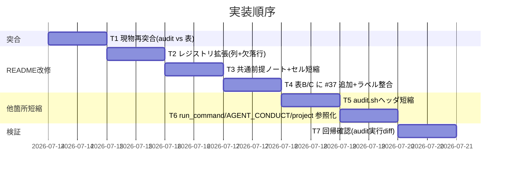

# 実装計画書: enforcement 失敗条件記述の一元化（統合）

**プロジェクト名**: enforcement 失敗条件記述の一元化（バッチ5・統合）
**作成日**: 2026 年 07 月 14 日
**最終更新**: 2026 年 07 月 14 日

> 本 03 はバッチ5・3 件（163330/163403/163432）の**統合実装計画の正本**。他 2 件の 03 は本書のタスクへの割当を参照する。実装は次工程（review-docs → implement-feature）で sonnet ティアが行う。

---

## 1. 実装概要

### 1.1 実装方針

`enforcement/README.md §失敗条件と差し戻し` を中心に、(A) 失敗条件対応表を単一レジストリへ拡張（実装状態列追加・欠落行補完）、(B) 共通前提ノート新設でセル短縮、(C) audit.sh ヘッダ・README 散文を参照へ短縮、の 3 系統を 1 PR で行う。audit.sh 関数本体は不変。

### 1.2 実装順序



---

## 2. タスク分解

### 2.1 タスク T1: audit.sh 実装済みチェックと README 3 表の全項目突合

#### 2.1.1 概要（必須）
audit.sh の全 check 関数と README 表 A/B/C の行を突合し、欠落行を確定する。

#### 2.1.2 実装内容（必須）
- `audit.sh` の check 関数一覧（`check_docs_transient_issue_ref`＝#37 等）を列挙。
- 表 A 欠落＝#2/#4/#7/#21/#37、表 B/C 欠落＝#37 を再確認（02 §3.2 の暫定結論を実測で確定）。
- **注意（番号系の非一致）**: audit.sh ヘッダの `必須チェック:` は独自の (1)–(37) 連番で、enforcement README の `#N` 失敗条件番号と一部ずれる（例: ヘッダ (3) テスト観点未記載 ≒ enforcement #2、ヘッダ (4) docs 更新要否 ≒ enforcement #4）。突合は README の `#N` 体系を基準に行い、audit.sh 側は関数実体の有無で「実装済み」を判定すること。

#### 2.1.3 テスト観点（必須）
##### 単体（必須 1 件以上）
- `grep -nE 'check_[a-z_]+\(\)' audit.sh` の関数集合と、表 A の `#N` 集合を突合し、差集合が {#2,#4,#7,#21,#37} と一致する。
##### 結合/API
- 該当なし。
##### E2E/受け入れ
- 該当なし（突合表を memo に残す）。
##### バリデーション
- 該当なし。

#### 2.1.4 単体テスト仕様（BDD）
```gherkin
Feature: 欠落行の確定
  Scenario: 実装済みチェックと表Aの差集合
    Given audit.sh の check 関数集合
    When 表A の #N 集合と突合する
    Then 差集合は #2 #4 #7 #21 #37 である
```
```bash
# Given: audit.sh の実装済みチェック番号集合
# When: README 表A の掲載番号と比較
# Then: 欠落は #2 #4 #7 #21 #37
```

### 2.2 タスク T2: 失敗条件対応表を単一レジストリへ拡張（列追加＋欠落行補完）

#### 2.2.1 概要（必須）
表 A に `実装状態` 列を追加し、欠落行 #2/#4/#7/#21/#37 を追加。02 §3.1–3.3 の内容を反映。

#### 2.2.2 実装内容（必須）
- 表 A ヘッダを `# / 対象 | 概要 | 実装の所在 | 実装状態 | 強制レベル | 差し戻し先（要点）` に変更。
- 全既存行に `実装状態` 値を統制語彙で付与（02 §3.1/§3.3）。
- 欠落 5 行を追加（02 §3.2 の内容）。
- 表 A の名称に「対応表」を維持。

#### 2.2.3 テスト観点（必須）
##### 単体（必須 1 件以上）
- 表 A に `#2` `#4` `#7` `#21` `#37` の行が存在する（grep）。
- 表 A の全データ行に `実装状態` セルが空でない。
##### 結合/API
- 該当なし。
##### E2E/受け入れ
- 該当なし。
##### バリデーション
- `実装状態` 列に統制語彙以外の値が現れない（`実装済み|推奨（未強制）|未実装（人手監査）|未実装（抽象仕様のみ・将来hook）` のいずれか）。

#### 2.2.4 単体テスト仕様（BDD）
```gherkin
Feature: レジストリ拡張
  Scenario: 欠落行と実装状態列
    Given 拡張後の失敗条件対応表
    When 表を検査する
    Then #2 #4 #7 #21 #37 の行があり全行に実装状態がある
```
```bash
# Given: 拡張後の enforcement/README.md
# When: 失敗条件対応表を grep
# Then: 欠落5行が存在し実装状態列が全行埋まっている
```

### 2.3 タスク T3: 共通前提ノート新設とセル短縮

#### 2.3.1 概要（必須）
`§失敗条件と差し戻し` 冒頭に「ゲート共通の前提（SKIP・grandfather・env トグル）」ノートを新設し、各行の共通ボイラープレートを参照へ置換して 1,000 字超セルを解消。

#### 2.3.2 実装内容（必須）
- 共通前提ノートを新設（grandfather 発効日規約・env 無効化トグル一覧・共通 SKIP パターン）。
- #25/#29/#31–#36 等のセルから共通記述を除去し「共通前提ノート参照」＋固有差分に短縮。

#### 2.3.3 テスト観点（必須）
##### 単体（必須 1 件以上）
- 共通前提の括り出し後、従来 1,000 字超だったセルが有意に短縮される（`awk` でセル長計測。目標 1,000 字未満。ゲート固有の必須記述で超える行は、共通前提へ移せる分を移したうえで許容）。
##### 結合/API
- 該当なし。
##### E2E/受け入れ
- 共通前提ノートが 1 つ存在し、複数行がそれを参照する。
##### バリデーション
- grandfather 発効日・env トグル名の記述が共通前提ノート 1 か所に集約（重複 grep が減少）。

#### 2.3.4 単体テスト仕様（BDD）
```gherkin
Feature: セル短縮
  Scenario: 1000字超セルの解消
    Given 共通前提を括り出した表
    When 各セル長を計測する
    Then 最長セルが1000字未満である
```
```bash
# Given: 短縮後の表
# When: セル長を計測
# Then: 1000字超セルが無い
```

### 2.4 タスク T4: 表 B/C への #37 追加と実装状態ラベル整合

#### 2.4.1 概要（必須）
表 B（判定ルール一覧）・表 C（差し戻し先の固定）に #37 行を追加。AGENT_CONDUCT.md の #22–#24/#30 分類とラベル文言を整合。

#### 2.4.2 実装内容（必須）
- 表 B に #37 の失敗条件説明行、表 C に #37 の差し戻し手順行を追加。
- 未実装 7 項目のラベル文言を `未実装（人手監査）`/`未実装（抽象仕様のみ・将来hook）` に統一（AGENT_CONDUCT.md の既存分類と齟齬が出ないこと）。

#### 2.4.3 テスト観点（必須）
##### 単体（必須 1 件以上）
- 表 B・表 C に `#37` 行が存在（grep）。
##### 結合/API
- 該当なし。
##### E2E/受け入れ
- 該当なし。
##### バリデーション
- AGENT_CONDUCT.md の #22–#24/#30 記述と README のラベルが矛盾しない。

#### 2.4.4 単体テスト仕様（BDD）
```gherkin
Feature: 表B/C の #37 と分類整合
  Scenario: #37 行の追加
    Given 表B と 表C
    When #37 を検索する
    Then 両表に #37 の行が存在する
```
```bash
# Given: enforcement/README.md
# When: 表B/表C を grep '#37'
# Then: 両表に #37 行がある
```

### 2.5 タスク T5: audit.sh ヘッダの冗長ブロック短縮

#### 2.5.1 概要（必須）
`失敗とみなす条件:` 冗長ブロック（概ね line 41–106）を 1 行/チェックの terse 索引＋README 参照へ短縮。関数本体は不変。

#### 2.5.2 実装内容（必須）
- `必須チェック:` の (1)–(37) 一覧（line 6–39）は維持。
- `失敗とみなす条件:` の各項目冗長記述を「N. <一行概要> → enforcement/README.md §失敗条件と差し戻し #M」に短縮。
- 関数定義・呼び出し・出力・SKIP ロジックは変更しない。

#### 2.5.3 テスト観点（必須）
##### 単体（必須 1 件以上）
- `git diff audit.sh` の変更行がヘッダコメント（`^#`）に限定される。
##### 結合/API
- audit.sh をローカル実行し、変更前後で PASS/FAIL/SKIP 出力が一致（回帰非発生）。
##### E2E/受け入れ
- 該当なし。
##### バリデーション
- ヘッダに `enforcement/README.md §失敗条件と差し戻し` への参照が含まれる。

#### 2.5.4 単体テスト仕様（BDD）
```gherkin
Feature: audit.sh ヘッダ短縮の無害性
  Scenario: 挙動不変
    Given ヘッダのみ短縮した audit.sh
    When 変更前後でローカル実行する
    Then 出力(PASS/FAIL/SKIP)が一致する
```
```bash
# Given: 変更前後の audit.sh
# When: 同一リポで実行し出力を diff
# Then: 出力差分が無い（コメントのみ変更）
```

### 2.6 タスク T6: run_command / AGENT_CONDUCT / project の参照化点検

#### 2.6.1 概要（必須）
README 散文（§配置一覧の必須チェック段落・§矯正するもの #22–#24）を参照へ短縮。run_command・project は手続き指示を残しつつ判定ルール再掲があれば参照へ寄せる。

#### 2.6.2 実装内容（必須）
- README §配置一覧「audit.sh が実施する必須チェック」段落 → 1 行参照。
- README §矯正するもの #22–#24 散文 → 要点 1 行＋参照。
- run_command Constraints・project 自己拡張ワークフロー.md は判定ルール再掲の有無を点検し、あれば参照へ（手続き指示は維持）。

#### 2.6.3 テスト観点（必須）
##### 単体（必須 1 件以上）
- README §配置一覧・§矯正するもの から失敗条件の長文再掲が除去され参照リンクへ置換されている。
##### 結合/API
- 該当なし。
##### E2E/受け入れ
- 失敗条件詳細の同期対象が README §失敗条件と差し戻し 1 セクションへ収れん（6→1）。
##### バリデーション
- 既存の相互参照リンクが壊れていない（相対パス健全性）。

#### 2.6.4 単体テスト仕様（BDD）
```gherkin
Feature: 散文の参照化
  Scenario: 同期箇所の削減
    Given 短縮後の各ファイル
    When 失敗条件の詳細記述の所在を数える
    Then 正本は README §失敗条件と差し戻し のみ
```
```bash
# Given: 変更後の source ツリー
# When: 失敗条件の詳細正本を探す
# Then: README §失敗条件と差し戻し 1 か所に収れん
```

### 2.7 タスク T7: 回帰確認と must-preserve 検証

#### 2.7.1 概要（必須）
must-preserve（見出し・番号体系・対応表名・audit 挙動・リンク）を最終検証。

#### 2.7.2 実装内容（必須）
- `## 失敗条件と差し戻し` 見出し存置、`#1`–`#37` 番号不変、「対応表」名存置を確認。
- audit.sh 実行 diff が空（ヘッダ以外）を確認。

#### 2.7.3 テスト観点（必須）
##### 単体（必須 1 件以上）
- 02 §3.5 の must-preserve 各項目を grep/実行で確認。
##### 結合/API
- audit.sh ローカル実行の出力一致。
##### E2E/受け入れ
- 3 issue の受け入れ基準（01 §2）が全て満たされる。
##### バリデーション
- DESIGN.md:71 の「対応表」参照が有効。

#### 2.7.4 単体テスト仕様（BDD）
```gherkin
Feature: must-preserve
  Scenario: 不変条件の保持
    Given 変更後の enforcement 一式
    When must-preserve を検査する
    Then 見出し・番号体系・対応表名・audit挙動・リンクが保持されている
```
```bash
# Given: 変更後ツリー
# When: must-preserve を grep/実行検証
# Then: 全不変条件が保持
```

---

## テスト観点

全タスクの検証は grep ベースの静的確認＋audit.sh のローカル実行 diff（回帰非発生）で構成する。核心は (1) 欠落行網羅 (2) 実装状態ラベルの機械可読性 (3) 重複解消（同期 6→1）(4) audit 挙動不変。

## 単体テスト

各タスク §2.x.4 の BDD に対応する grep/実行チェックを単体検証とする。

## BDD

上記各タスクの Gherkin を参照。Given/When/Then は静的検査で機械確認可能な形にしている。

---

## 5. リスク管理

### 5.1 実装リスク
- **リスク**: セル短縮の過程で固有の SKIP 条件・env トグル差分を落とす。
  - **対策**: 共通前提ノートへ移すのは「全行共通のパターン」のみ。ゲート固有値（発効日の既定値差・非交差関係）は行に残す。T3 のバリデーションで確認。
- **リスク**: 番号体系の付け替えで外部参照が切れる。
  - **対策**: 番号は不変（must-preserve）。行の追加のみで既存番号を動かさない。

---

## 6. 参考資料
- `02_設計.md`（本 issue・統合設計の正本）
- `.agent-skill-chain/source/enforcement/README.md` / `enforcement/ci/audit.sh` / `enforcement/DESIGN.md`

## 7. 前のステップ
- **前**: `02_設計.md`

## 8. 次のステップ
- 実装フェーズ（review-docs 完了後に implement-feature）。
