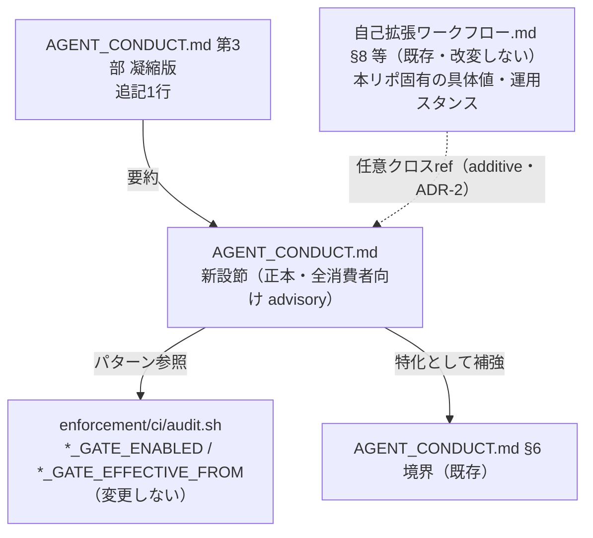
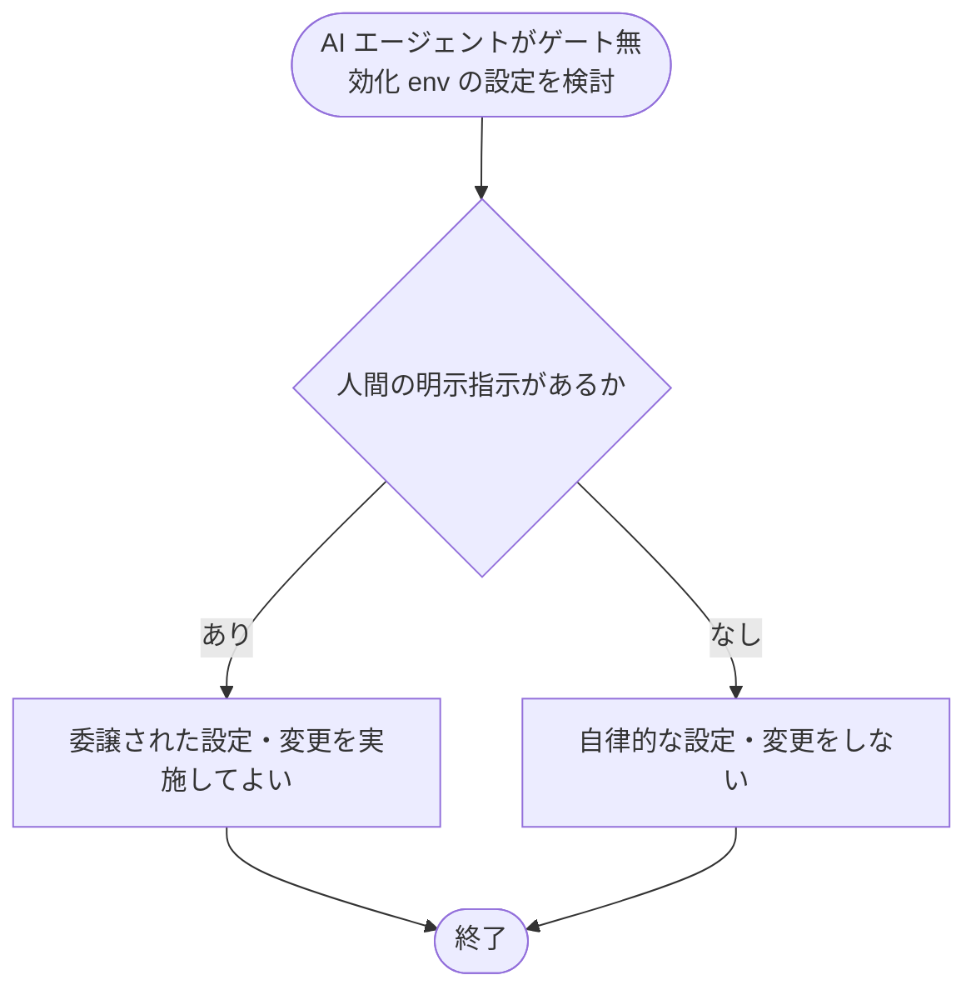

# 設計書: ゲート無効化 env・grandfather env による自己バイパス防止の運用ルール明文化

**プロジェクト名**: ゲート無効化env自己バイパス問題
**作成日**: 2026 年 07 月 15 日
**最終更新**: 2026 年 07 月 15 日

> **重要**: 本 issue は**技術的強制ではなく運用ルール（advisory）の明文化**を扱う（[`01_要件定義.md`](./01_要件定義.md) §重要 / 00 §4.1）。env 変数はシェル環境で自由に設定でき、AI エージェントが設定できないよう技術的に強制することは困難であるため、本設計のゴールは「AI エージェントが該当 env を自律的に設定・変更してはならず、人間の明示指示がある場合のみ設定可」という運用ルールを、**適切な正本ドキュメントに 1 か所で明記する**ことである。配置先は本書 §2.5 ADR-1 で確定する。
>
> **用語**: [.agent-skill-chain/source/CONCEPTS.md §用語規約](../../../../../../.agent-skill-chain/source/CONCEPTS.md#用語規約) を参照。

---

## 1. 設計概要

### 1.1 設計方針

[.agent-skill-chain/source/spec/01\_設計原則.md](../../../../../../.agent-skill-chain/source/spec/01_設計原則.md) の**単一責務**・**明確な境界**、および [spec/06\_設計判断の優先順位.md](../../../../../../.agent-skill-chain/source/spec/06_設計判断の優先順位.md)（可読性＞単一責務＞仕様整合、再利用のために責務を曖昧にしない）に従う。本 issue の成果物はドキュメント追記のみであり、ゲート無効化の自己バイパス禁止という**汎用の行動規範**を、その責務を担う既存の正本ドキュメント 1 か所へ**重複なく**追記する。

### 1.2 設計原則（本プロジェクトで適用するもの）

- **単一責務**: 自己バイパス禁止ルールの正本を **1 ファイル 1 か所**に置き、他ドキュメントは参照に留める（転記・重複再定義をしない。01 §5 制約）。
- **明確な境界**: 「汎用の行動規範（全消費者向け・source 側）」と「本リポジトリ固有の具体値・運用スタンス（project 側）」の境界を維持する（AGENT_CONDUCT §汎用/固有境界）。
- **AIフレンドリー設計**: 対象 env を**パターン表記**（`*_GATE_ENABLED`・`*_GATE_EFFECTIVE_FROM`）で一意に特定できる形にし、読み手（AI エージェント／人間レビュアー）が「どの env が対象か」「いつ設定してよいか」を具体的に判定できるようにする（01 §3.3）。

---

## 2. アーキテクチャ設計

### 2.1 責務・境界・参照関係

#### 2.1.1 責務一覧

| コンポーネント（ドキュメント/節） | 責務（1 文） |
| -------------------- | -------------------- |
| `AGENT_CONDUCT.md` の新設節（本 issue で追記） | AI エージェントが enforcement ゲートの無効化 env・grandfather env を**自律的に設定・変更してはならず、人間の明示指示がある場合のみ可**という行動規範（advisory）を、全消費者向けの正本として定義する |
| `AGENT_CONDUCT.md` 第 3 部 凝縮版の追記 1 行（本 issue で追記） | 上記規範を委譲時に各サブエージェントへ確実に伝えるため、Constraints へ転記される凝縮版へ 1 行追記する |
| `自己拡張ワークフロー.md` §8 等（既存・**本 issue で改変しない**） | 本リポジトリ固有の具体値（既定 `true`・発効日）と運用スタンス（「本リポジトリでは設定せず既定のまま」）を定義する既存記述。新設ルールの適用対象（正当なトグル運用）であり、削除・改変しない |
| `enforcement/ci/audit.sh`（既存・**本 issue で変更しない**） | ゲート判定ロジック（SKIP・grandfather）の実装。本 issue は機構強制を追加しない（01 §2.3・§5） |

#### 2.1.2 境界

- **入力**: 01_要件定義のビジネスルール（自律設定禁止＋人間明示指示のみ可）、対象 env 一覧（`*_GATE_ENABLED`／`*_GATE_EFFECTIVE_FROM`）。
- **出力**: `AGENT_CONDUCT.md` への新設節 1 つ＋凝縮版 1 行の追記（＝運用ルールの明文化）。
- **他責務との境界（本 issue の範囲外）**:
  - audit.sh のゲート判定ロジック・SKIP 条件・grandfather 判定の変更（技術的機構強制の追加）は範囲外（00 §5・01 §2.3）。
  - トグル機構自体の廃止は範囲外（00 §5 除外要件）。
  - `自己拡張ワークフロー.md` §8・§ブランチ紐づけ・§PR 紐づけの既存記述（本リポジトリでの既定値スタンス）の変更は範囲外（改変禁止・01 ストーリー 2）。

#### 2.1.3 参照関係

- `AGENT_CONDUCT.md` 新設節 →（参照）→ 対象 env を**パターン表記**で言及（`enforcement/ci/audit.sh` の env インターフェースを間接参照。具体の既定値・本リポスタンスは参照しない＝汎用/固有境界を跨がない）。
- `AGENT_CONDUCT.md` 新設節 →（隣接補強）→ 既存 §6 境界（「システム状態を変える操作の前に、証拠がその操作を支持しているか確認する」）の特化として位置づける。
- 第 3 部 凝縮版の追記 1 行 →（要約参照）→ 新設節本文。
- 循環参照なし。`自己拡張ワークフロー.md` 側から本規範への**任意のクロスリファレンス**（後述 ADR-2）は additive（既存文の改変を伴わない）で、逆方向の依存を新設しない。

### 2.2 システムアーキテクチャ

- **採用パターン**: 単一情報源（Single Source of Truth）＋汎用/固有の層分離。行動規範の**正本を source 側（全消費者向け）に 1 か所**置き、本リポジトリ固有の具体値は既存 project 側にそのまま残す。
- **根拠**: spec/06 §優先順位（単一責務・再利用のために責務を曖昧にしない）、spec/00 §spec と docs の違い（全プロジェクト向け＝source／個別プロジェクト＝docs・project）。自己バイパス対象の env は配布物 `source/enforcement/ci/audit.sh` に実装され全消費者へ配布されるため、リスクは**全消費者に共通**であり、正本は source 側が整合する（evidence_source: existing_code、§2.5 ADR-1 参照）。

#### 2.2.1 CQRS

- 該当なし（状態変更を伴わないドキュメント追記のみ）。

#### 2.2.2 アーキテクチャ図

### 2.3 コンポーネント構成

- **UI / Domain / Infrastructure といったコード上の層は無い**（ドキュメントのみ）。構成要素は「正本節（AGENT_CONDUCT 新設節）」「凝縮版の 1 行」「任意クロスリファレンス（自己拡張ワークフロー側・低優先）」の 3 つ。各要素は単一責務（正本の定義／委譲時伝達／発見性補助）を持つ。

### 2.4 データフロー

- 該当なし（イベント発行・データ永続化を伴わない）。運用フローとしては「AI エージェントがゲート無効化 env の設定を検討 → 本規範を参照 → 人間の明示指示が無ければ設定しない／指示があれば委譲設定」という判断フローが該当するが、これはドキュメント参照であり実行時データフローではない。

### 2.5 横断設計判断（ADR）

#### ADR-1: 自己バイパス禁止ルールの配置先を `.agent-skill-chain/source/AGENT_CONDUCT.md` に確定する

- **コンテキスト**: 01 §未検証・要人間確認事項（inference_only・要注意）で保留された「配置先の最終決定」を確定する必要がある。候補は (A) `.agent-skill-chain/source/AGENT_CONDUCT.md`（汎用・全消費者向け advisory）、(B) `.agent-skill-chain/project/自己拡張ワークフロー.md`（本リポジトリ固有・最優先）、(C) 両方。配置先により適用範囲（全消費者 vs 本リポ限定）と重複リスクが変わる。
- **検討した選択肢**:
  - **(A) AGENT_CONDUCT.md（source・汎用）**: 全消費者へ配布される行動規範の正本。advisory（機構強制しない）と明記済み。
  - **(B) 自己拡張ワークフロー.md（project・固有）**: §8 等で当該 env を既に扱っており隣接。ただし本リポジトリ限定でしか適用されない。
  - **(C) 両方**: 適用範囲は最大化するが、01 §5「重複再定義をしない」・spec/06「単一責務」に反し二重管理となる。
- **決定**: **(A) `.agent-skill-chain/source/AGENT_CONDUCT.md` に単一の正本として配置する**（(C) の二重配置は採らない。(B) の project 側には既存記述の改変を伴わない**任意のクロスリファレンスのみ**を許容＝ADR-2）。
- **根拠**（evidence_source: existing_code）:
  1. 自己バイパス対象の全 env（`GITHUB_ISSUE_GATE_ENABLED`:audit.sh L1120、`BRANCH_LINK_GATE_ENABLED`:L1202、`PR_LINK_GATE_ENABLED`:L1264、`MODEL_TIER_GATE_ENABLED`:L1392、grandfather 系 `*_GATE_EFFECTIVE_FROM`:L1005/1060/1133/1211/1277/1404）は、配布物 `.agent-skill-chain/source/enforcement/ci/audit.sh` に実装されている。同ファイルは `自己拡張ワークフロー.md §理由` の表で「パッケージ正本（配布物）／追跡する」に分類され、**全消費者へ配布される**。したがって「audit 実行主体（AI エージェント）が自ら env を設定してゲートを SKIP させる」自己バイパスリスクは、本リポジトリだけでなく**全消費者に共通**する（spec/00 §spec と docs の違い: 対象＝全プロジェクトは source 側）。よって正本は source 側（(A)）が整合する。
  2. 本ルールは「AI エージェントの行動様式（何をしてよい／いけないか）」であり、`AGENT_CONDUCT.md` の責務（サブエージェント行動規範）そのものである（同ファイル冒頭「責務」・§6 境界「システム状態を変える操作の前に証拠がその操作を支持しているか確認する」の特化に該当）。
  3. 本ルールは技術的強制ができず advisory である（00 §4.1・01 §2.3）。`AGENT_CONDUCT.md` は「§機構的強制の非対象」で全原則が advisory（CI 非強制）であると明記しており、advisory ルールの受け皿として整合する。逆に project 側 `自己拡張ワークフロー.md` は GitHub Issue 起票ゲート等の**具体手順・機械強制の具体値**を扱う doc であり、汎用の行動規範の正本には向かない。
  4. (C) 二重配置は 01 §5「既存節の重複再定義をしない」・spec/06「単一責務」に反する。
- **帰結**:
  - 追記は `AGENT_CONDUCT.md` に閉じ、`自己拡張ワークフロー.md` §8・§ブランチ・§PR の既存記述は**一切変更しない**（01 ストーリー 2・UC2 S1 の ○ 条件を構造的に満たす）。
  - 全消費者ランタイムが本規範を（配布物として）受け取る。
  - 対象 env はパターン表記（`*_GATE_ENABLED`／`*_GATE_EFFECTIVE_FROM`）で参照し、既定値や本リポスタンス（具体値）は AGENT_CONDUCT に持ち込まない（汎用/固有境界の維持）。
  - 01 で inference_only（要注意）だった配置判断は、本 ADR にて **existing_code 根拠で確定**し、要注意フラグは解消する。

#### ADR-2: `自己拡張ワークフロー.md` 側のクロスリファレンスは任意（additive・低優先）とする

- **コンテキスト**: `自己拡張ワークフロー.md` §8・§ブランチ紐づけ・§PR 紐づけは当該 env の既定値・本リポスタンスを扱う。読者がそこから自己バイパス禁止規範へ辿れると発見性が高まる一方、追記は「要点のみ・重複しない」（01 §5）・「既存記述を改変しない」（ストーリー 2）制約下にある。
- **検討した選択肢**: (a) クロスリファレンスを必須で追記、(b) 追記しない（source 側単一配置のみ）、(c) additive な 1 行クロスリファレンスを**任意（低優先タスク）**とする。
- **決定**: **(c)**。project 側には規範本文を**転記しない**。発見性補助として、既存文を改変しない additive な 1 行参照（「AI エージェントによる本トグルの自律設定禁止は AGENT_CONDUCT.md を参照」相当）を**任意・低優先**で許容する。実施しない選択でも受け入れ基準（ストーリー 1・3）は充足する。
- **根拠**（evidence_source: existing_code）: 01 §5・ストーリー 2 の受け入れ基準（既存記述の削除・改変禁止）。additive な参照 1 行は既存文の改変・重複再定義に当たらず、単一正本原則（ADR-1）を崩さない。必須化しない理由は、正本が source 側にある以上、発見性補助は nice-to-have でありスコープ規律（AGENT_CONDUCT §4）上も最小実装に倒すべきため。
- **帰結**: 実装計画では本クロスリファレンスを独立した低優先タスクとして分離し、実施判断を review-docs / 実装時に委ねる。未実施でも本 issue の成功基準は満たす。

#### ADR-3: 対象 env の表記は「パターン表記」を主とし、機械強制は追加しない

- **コンテキスト**: 01 UC3 は「対象 env が一意に特定できること」を要求する。表記方法として (a) パターン表記、(b) 全 env の具体列挙、(c) 両方が候補。また 00 §7.1 の技術的リスク（advisory のみでは実効性が限定的）に対し機構強制を追加するか判断が要る。
- **検討した選択肢**: 表記＝(a) パターン／(b) 列挙／(c) 併記。強制＝機構強制を追加する／advisory に留める。
- **決定**: 表記は **(a) パターン表記を主**とし（`*_GATE_ENABLED`・`*_GATE_EFFECTIVE_FROM`）、必要に応じ代表例を 1〜2 個**括弧内例示**する。機構強制は**追加しない（advisory に留める）**。
- **根拠**（evidence_source: existing_code）: 01 受け入れ基準（パターン表記 or 具体列挙のいずれかで一意特定できればよい）。パターン表記は audit.sh の命名規約（`GITHUB_ISSUE_GATE_` 接頭辞等、audit.sh L1119 コメントが命名パターン統一を明記）と一致し、将来ゲートが増えても追随する（変更容易性・spec/06）。機構強制の非追加は 00 §5・§4.1・01 §2.3（本 issue のスコープは運用ルール明文化）に従う。
- **帰結**: 対象 env が増減しても AGENT_CONDUCT 側の文言修正が原則不要（パターンで包含）。実効性の限界（advisory）は 00 §7.1 のとおり残るため、本文にその旨（技術強制ではなく人手監査・レビューで補完）を明記する。

---

## 3. 機能設計

### 3.1 機能 1: AGENT_CONDUCT.md への自己バイパス禁止節の新設

#### 3.1.1 概要

`.agent-skill-chain/source/AGENT_CONDUCT.md` に、ゲート無効化 env・grandfather env の自律的設定・変更を禁止し人間の明示指示のみ許容する行動規範節を新設する。

#### 3.1.2 処理フロー

#### 3.1.3 入力・出力

- **入力**: 対象 env パターン（`*_GATE_ENABLED`・`*_GATE_EFFECTIVE_FROM`）、人間の明示指示の有無。
- **出力**: AGENT_CONDUCT.md 内の新設節（テキスト）。

#### 3.1.4 エラーハンドリング

- 該当なし（実行時分岐ではなく規範テキスト）。判定は読み手（AI／人間レビュアー）が行う advisory。

### 3.2 機能 2: 第 3 部 凝縮版への 1 行追記

#### 3.2.1 概要

委譲時に Constraints 末尾へ転記される第 3 部 凝縮版へ、自己バイパス禁止を要約した 1 行を追加し、audit 実行主体になり得るサブエージェントへ確実に伝達する。

#### 3.2.2 入力・出力

- **入力**: 新設節の要約。
- **出力**: 凝縮版コードブロック内の追記 1 行。

### 3.3 機能 3（任意・低優先）: 自己拡張ワークフロー.md からのクロスリファレンス

- ADR-2 に基づく additive な 1 行参照。実施は任意。既存文を改変しない。

---

## 4. データ設計

- 該当なし（スキーマ・テーブル・永続データを持たない）。

---

## 5. API 設計

- 該当なし（コード API を追加・変更しない）。本 issue の「契約」は**ドキュメント文言の契約**であり、対象 env の表記（パターン）・例外条件（人間の明示指示のみ）・advisory 明示の 3 点が満たされることを契約とする（§6・03 の受け入れ基準で検証）。

---

## 6. テスト戦略

ドキュメント追記のみのため、コードの単体・結合・E2E テストは該当しない。検証は**ドキュメント受け入れ検査**（grep ベースの有無確認＋文言レビュー）で行い、01 の BDD ユースケースに 1:1 対応させる。

### 6.1 対象ごとのテスト割り当て

| 対象 | 単体 | 結合/API | E2E | クリティカル観点 | バリデーション観点 | 未達理由/補足 |
| --- | --- | --- | --- | --- | --- | --- |
| AGENT_CONDUCT 新設節（機能1） | × | × | × | 自律設定禁止＋人間明示指示のみ可の文言が存在（UC1 S1）／対象 env パターンが一意特定可能（UC3 S1） | 空虚な訓示でなく具体（どの env・いつ可）を含む（01 §3.3） | コード無しのため自動テストは grep 受け入れ検査で代替。理由=docs-only |
| 既存 §8 等の非改変（機能1 の副作用検証） | × | × | × | `自己拡張ワークフロー.md` §8/§ブランチ/§PR に差分が無い（UC2 S1） | 新設ルールが「一律禁止」でなく「AI 自律設定のみ」を対象（UC2 S2 回避） | git diff が §8 等に触れないことを確認 |
| 凝縮版 1 行（機能2） | × | × | × | 凝縮版コードブロック内に自己バイパス禁止の 1 行が存在 | 既存 8 バレット・規約優先バレットを壊さない | docs-only |

### 6.2 監査・レビューでの確認（証跡）

- review-docs（実装前ドキュメントレビュー・full/standard 必須）で §6.1 の受け入れ観点と 03 の BDD が揃っていることを確認する。
- 実装後は verify-and-close で 04_review を作成し、grep 受け入れ検査結果と git diff（§8 非改変）を証跡化する。

---

## 7. UI 設計

- 該当なし。

---

## 8. セキュリティ設計

- **自己バイパスによる enforcement 無力化リスクの低減**（00 §3.2）を目的とするが、技術的強制ではないため完全防止はしない（00 §7.1）。本文にこの限界（人手監査・レビューでの補完）を明記する（ADR-3 帰結）。
- トークン・秘匿値の取扱いは本 issue では新規発生しない（env 名の言及のみ、値は扱わない）。

---

## 9. 非機能要件への対応

### 9.1 パフォーマンス

- 影響なし（ドキュメント追記のみ、audit.sh 実行時性能は不変）。

### 9.2 可用性

- 既存のゲート判定ロジック（audit.sh の SKIP・grandfather）を変更しないため、既存挙動は不変（01 §3.4）。

---

## 10. 参考資料

### プロジェクトドキュメント

- [`00_要求定義.md`](./00_要求定義.md) - 要求定義
- [`01_要件定義.md`](./01_要件定義.md) - 要件定義

### その他の参考資料

- `.agent-skill-chain/source/enforcement/ci/audit.sh` L1005/1060/1120/1133/1202/1211/1264/1277/1392/1404（対象 env の読み取り実装・配布物、evidence_source: existing_code）
- `.agent-skill-chain/source/AGENT_CONDUCT.md`（配置先・§0 読み替え規則・§6 境界・§機構的強制の非対象・§汎用/固有境界・第 3 部 凝縮版）
- `.agent-skill-chain/project/自己拡張ワークフロー.md` §8・§ブランチ紐づけ・§PR 紐づけ・§理由（本リポ固有の具体値・配布物分類）
- [.agent-skill-chain/source/EVIDENCE_POLICY.md](../../../../../../.agent-skill-chain/source/EVIDENCE_POLICY.md) §節2 ADR 形式・§節4 inference_only の顕在化
- [.agent-skill-chain/source/spec/00_spec概要.md](../../../../../../.agent-skill-chain/source/spec/00_spec概要.md) §spec と docs の違い・[spec/06_設計判断の優先順位.md](../../../../../../.agent-skill-chain/source/spec/06_設計判断の優先順位.md)

---

## 11. 前のステップ

- **前**: [`01_要件定義.md`](./01_要件定義.md) - 要件定義フェーズ

---

## 12. 次のステップ

- **次**: [`03_実装計画.md`](./03_実装計画.md) - 実装計画フェーズ
