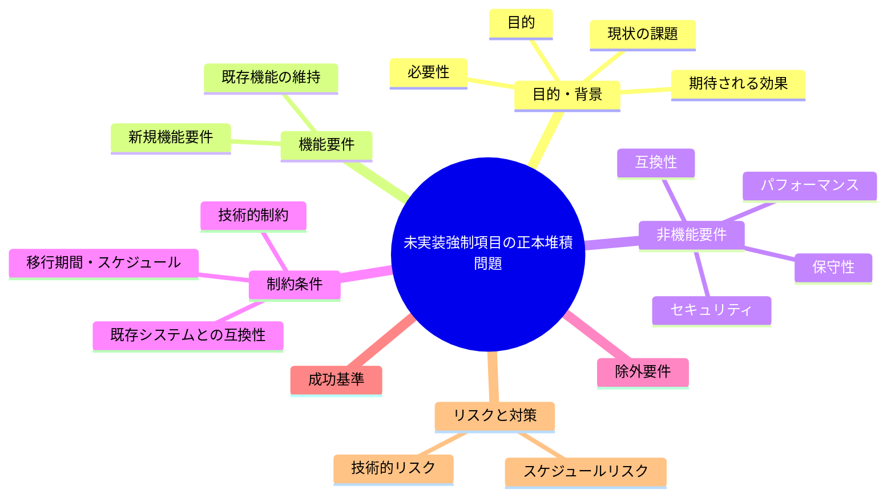

# 要求定義書: 未実装・人手監査のまま正本に常駐する失敗条件群（#22/#23/#24/#30、系統A/C/E）

**プロジェクト名**: 未実装・人手監査のまま正本に常駐する失敗条件群（#22/#23/#24/#30、系統A/C/E）
**作成日**: 2026年07月14日
**最終更新**: 2026年07月14日

---

## 要求定義の全体像

---

## 1. 目的・背景

### 1.1 目的（必須）

未実装のまま常駐する失敗条件群の扱いを整理するか判断する

### 1.2 背景

出典: 2026-07-14 fableによる本システムの自己調査で検出。

- **現状の課題**:
  - 自立進行違反（#22相当）、高リスク確認省略（#23相当）、進捗実証違反（#24相当）、モデルティア切り下げ検知（#30相当）、系統A（Read/Grep過大読込抑制）・系統C・系統E（サブ作業記録リアルタイム強制）の7項目が「未実装（実装・配備は将来の別 issue に委ねる）」のまま正本ドキュメント（enforcement/README.md・AGENT_CONDUCT.md）に抽象仕様として記載され続けている。
  - 強制対応表の相当部分が実効性ゼロの宣言のまま堆積しており、「機械強制されている」という誤認リスクと、ドキュメント肥大化の両方を招いている。

- **必要性**:
  - 未実装項目を明確に区別する表記（例: 「未実装」ラベルの一貫した付与、実装ロードマップの明示、または実装見込みが無い項目の削除・統合）の要否検討が必要。

### 1.3 期待される効果（必須: 1 件以上）

- **効果 1**: 未実装の失敗条件群が、実装済み項目と明確に区別可能な形でドキュメント上表記される、または実装するか正式に取り下げるかの方針が決定される（○/×で判定可能）。

---

## 2. 機能要件

### 2.1 既存機能の維持（該当する場合）

- 既に実装済みの失敗条件（audit.sh に実装があるもの）はそのまま維持する。

### 2.2 新規機能要件

- （対応する場合）未実装項目の一覧化・優先順位付け、および正本ドキュメント上での表記整理（未実装であることの明示的な強調表示等）。

---

## 3. 非機能要件

### 3.1 パフォーマンス

- 特になし。

### 3.2 セキュリティ

- 特になし。

### 3.3 互換性

- 既存の enforcement/README.md・AGENT_CONDUCT.md の構成との整合が必要。

### 3.4 保守性

- ドキュメント肥大化の抑制、実装状況の一目での把握性向上。

---

## 4. 制約条件

### 4.1 技術的制約

- 7項目それぞれの機械実装難易度が異なる（Read/Grep 過大読込抑制のように定量化が難しいものも含む）。

### 4.2 既存システムとの互換性

- 既存の強制対応表のフォーマットとの整合が必要。

### 4.3 移行期間・スケジュール

- 未定（対応要否は本 issue 起票後に判断）。

---

## 5. 除外要件

- 7項目それぞれの機械実装自体は本 issue のスコープ外（別途個別 issue 化を検討）。

---

## 6. 成功基準（必須: 1 件以上）

- 未実装の失敗条件群が実装済み項目と明確に区別され、対応方針（実装ロードマップ or 取り下げ）が正本ドキュメントに記載される。

---

## 7. リスクと対策

### 7.1 技術的リスク

- **リスク**: 7項目の一部は定量的な機械検知が本質的に困難な可能性がある。
  - **対策**: 機械実装が困難な項目は「人手監査項目」として明示的に位置づけを変更する選択肢を検討する。

### 7.2 スケジュールリスク

- **リスク**: 対応要否がユーザー判断待ちのため着手時期未定。
  - **対策**: 本 issue を起票済みとして保持し、優先度判断を待つ。

---

## 8. 参考資料

### プロジェクトドキュメント

- なし

### その他の参考資料

- `.agent-skill-chain/source/enforcement/README.md:253-259`
- `.agent-skill-chain/source/enforcement/README.md:59-82`
- `.agent-skill-chain/source/AGENT_CONDUCT.md:64-72`

---

## 9. 次のステップ

この要求定義書の承認後、対応要否をユーザーが判断し、対応する場合は以下のドキュメントを作成します：

- **次**: `01_要件定義.md` - 要件定義フェーズ
