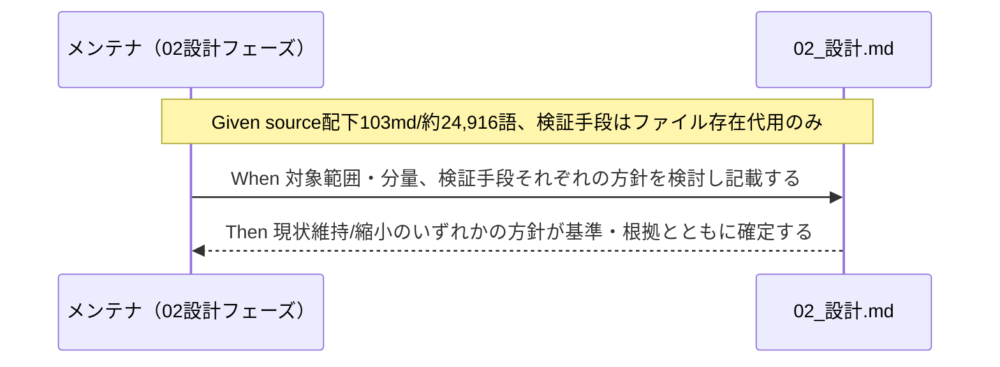

# 要件定義書: オンボーディング読了義務が重すぎる

**プロジェクト名**: オンボーディング読了義務が重すぎる
**作成日**: 2026 年 07 月 15 日
**最終更新**: 2026 年 07 月 15 日

> **重要**: **このドキュメントは常に更新**: 要件の変更や追加があった場合は、即座にこのドキュメントを更新してください。ドキュメントは「生きているドキュメント」として扱い、実装内容と常に同期させます。
>
> **用語**: [.agent-skill-chain/source/CONCEPTS.md §用語規約](../../../../../../.agent-skill-chain/source/CONCEPTS.md#用語規約) を参照。

---

## 1. 概要

### 1.1 システム概要

`.agent-skill-chain/source/` は AGENTS.md ワークフローの正本（skill chain の定義・読了義務規定）を格納するディレクトリである。2026-07-15 時点の実測で **103 md ファイル（.md のみ）・約 24,916 語**、非 md（スクリプト・設定等）を含めると **135 ファイル・約 46,346 語**に達している。AGENTS.md の読み順表（0〜7 の 8 行）に加え、command 実行時は run_command・該当 commands/{name}.md・記載された skill chain の各 skill・テンプレート・（存在すれば）project/ 上書きの読了が義務付けられる。CORE.md §禁止事項は「CORE / LOAD_POLICY / PHASES を読了するまでワークフロー開始・フェーズ進行・コード変更・command 実行・成果物作成を行ってはならない」と定めるが、**読了自体を機械的に検証する手段は存在しない**（enforcement/README.md の失敗条件レジストリ #1「必須参照」は `audit.sh §2（必須ファイル存在で代用）` であり、実装状態は「実装済み」だが検証内容は「該当ファイルへの参照・存在の有無」であって「実際に読んだか」ではない。self-report 依存という前提は変わっていない）。本要件では、この読了義務の対象範囲・分量について、現状維持または縮小のいずれかの方針を、判定可能な基準とともに確定するために必要な要件を定める。

### 1.2 用語集

| 用語               | 説明                                                                                                   |
| ------------------ | ------------------------------------------------------------------------------------------------------ |
| 読了義務           | CORE.md §禁止事項が定める、CORE/LOAD_POLICY/PHASES（および command 実行時の関連ファイル）を読んでからでないと作業を開始してはならないという規定 |
| 必須参照チェック（#1） | enforcement/README.md の失敗条件レジストリ #1。audit.sh §2 が「必須ファイルの存在」で代用する間接検証。実際の読了有無は検証しない        |
| 縮小方針           | 読了義務の対象ファイル数・分量を、明文化した基準（例: 影響範囲・トリガー頻度）に基づいて絞り込む対応                                       |
| 機械強制への置換   | 読了そのものの検証に固執せず、重要ルールを enforcement（PreToolUse 等の runtime reject）で強制することにより読了検証の代替とする対応       |

---

## 2. 機能要件

### 2.1 ユーザーストーリー

#### ストーリー 1: 読了義務の対象範囲・分量の方針確定

- **As a** 本ワークフローのメンテナ
- **I want to** 読了義務の対象範囲・分量について、現状維持または縮小のいずれかの方針を明文化された基準とともに確定したい
- **So that** オンボーディングコスト・コンテキスト消費量を適正化しつつ、規約遵守の実効性を維持できる

**受け入れ基準**:

- AC1-1: 02_設計.md に、読了義務の対象範囲について「現状維持」または「縮小」のいずれかの方針が明記されている（○ = 単一の方針が明記されている、× = 未記載または両論併記のまま確定していない）。
- AC1-2: 方針が「縮小」の場合、何を必須読了から外すか・外さないかを判定する基準（例: トリガー頻度、影響範囲、変更頻度等の観点）が 02_設計.md に列挙されている（○ = 基準が箇条書き等で列挙されている、× = 基準の記載がない、または「都度判断」等の非判定可能な記載のみ）。
- AC1-3: 方針が「現状維持」の場合、維持することの根拠（規約遵反リスクとの比較等）が 02_設計.md に記載されている（○ = 根拠が記載されている、× = 根拠なく「現状維持」とのみ記載）。

#### ストーリー 2: 読了検証手段の方針確定

- **As a** 本ワークフローの監査担当（audit.sh / CI）
- **I want to** 読了完了の検証手段について、現状の間接検証（ファイル存在で代用）を維持するか、より直接的な機構に強化するかの方針を確定したい
- **So that** 「読了するまで開始禁止」という規定の実効性を判断・監査できる

**受け入れ基準**:

- AC2-1: 02_設計.md に、現状の必須参照チェック（#1、audit.sh §2 の間接検証）を維持するか、強化する（例: 読了サマリの記録義務化、対象縮小による相対的な実効性向上等）かの方針が明記されている（○ = 方針が明記されている、× = 未記載）。
- AC2-2: 強化しない（現状維持）と判断する場合、その理由（費用対効果・実装コスト等）が 02_設計.md に記載されている（○ = 理由が記載されている、× = 理由なし）。

### 2.2 BDD ユースケース

#### ユースケース 1: 読了義務の対象範囲・分量の方針確定

02_設計フェーズにおいて、読了義務の対象範囲・分量に関する方針を「現状維持」「縮小」のいずれかに確定し、判定可能な基準とともに明文化する。

**シナリオ 1: 縮小方針を選ぶ場合**

```gherkin
Feature: 読了義務の対象範囲・分量の方針確定
  Scenario: 縮小方針を選ぶ場合
    Given source 配下が 103 md ファイル・約 24,916 語（非 md 含め 135 ファイル・約 46,346 語）であり
    And AGENTS.md の読み順表に 8 行、command 実行時にさらに run_command・command・skill・テンプレートの読了が積み増しされる現状があり
    When 02_設計フェーズで読了義務の対象範囲・分量の方針を「縮小」と定める
    Then 02_設計.md に、何を必須読了から外すかの判定基準（トリガー頻度・影響範囲等）が明記される
    And 縮小後も CORE / LOAD_POLICY / PHASES 等、規約遵守上必須の中核ファイルの読了は維持される
```

**シナリオ 2: 現状維持方針を選ぶ場合**

```gherkin
Feature: 読了義務の対象範囲・分量の方針確定
  Scenario: 現状維持方針を選ぶ場合
    Given 読了義務が担保している規約遵守（品質）の水準が存在し
    When 02_設計フェーズで読了義務の対象範囲・分量の方針を「現状維持」と定める
    Then 02_設計.md に、現状維持を選んだ根拠（縮小した場合の規約遵反リスクとの比較等）が明記される
```

#### ユースケース 2: 読了検証手段の方針確定

02_設計フェーズにおいて、読了完了の検証手段（現状は audit.sh §2 によるファイル存在の間接検証）について、維持するか機械強制の強化に置き換えるかを確定する。

**シナリオ 1: 検証手段を維持する場合**

```gherkin
Feature: 読了検証手段の方針確定
  Scenario: 検証手段を維持する場合
    Given 失敗条件レジストリ #1（必須参照）が audit.sh §2 のファイル存在チェックで代用され、実際の読了有無は検証できない現状があり
    When 02_設計フェーズで検証手段の方針を「現状維持」と定める
    Then 02_設計.md に、現状の間接検証で許容できると判断した理由が明記される
```

**シナリオ 2: 機械強制への置換を選ぶ場合**

```gherkin
Feature: 読了検証手段の方針確定
  Scenario: 機械強制への置換を選ぶ場合
    Given 読了そのものの検証が本質的に困難である現状があり
    When 02_設計フェーズで重要ルールを PreToolUse 等の runtime reject（機械強制）に一部置き換える方針を定める
    Then 02_設計.md に、どのルールを機械強制へ置換するか、および読了義務との役割分担が明記される
```

**処理フロー**（必要に応じて）:



### 2.3 ビジネスルール

- 読了義務が担保する規約遵守レベルを大きく低下させる方針は採用しない（00 §3.3 互換性要件）。
- 縮小方針を採る場合でも、CORE.md §禁止事項が定める CORE / LOAD_POLICY / PHASES の読了義務そのものは 02 設計フェーズで撤廃対象としない（縮小の対象は command 実行時に積み増しされる周辺ファイル・skill・テンプレート等の範囲・粒度に限る）。

---

## 3. 非機能要件

### 3.1 パフォーマンス要件

- 委譲パケット・サブエージェントへの初回コンテキスト投入量の削減効果を、方針確定時に定性的に見積もる（縮小方針の場合）。

### 3.2 セキュリティ要件

- 該当なし。

### 3.3 ユーザビリティ要件

- 新規参加者・fresh サブが必須読了ファイルを把握しやすい形（表形式・トリガー別の一覧等）を維持する。読了範囲を縮小する場合も、参照先の分かりにくさを増やさない。

### 3.4 可用性要件

- 該当なし。

---

## 4. 外部インターフェース要件

### 4.1 API 要件

- 該当なし。

### 4.2 データ形式要件

- 該当なし（02_設計.md への記載を対象とし、新規データ形式は伴わない）。

---

## 5. 制約事項

- 既存の LOAD_POLICY・CORE の読み順定義との整合を保つこと（00 §4.2）。
- 対応方針の具体設計・実装は本 issue の範囲外（00 §5 除外要件）。本 01 では方針決定のための受け入れ基準・BDD シナリオの確定までを扱う。
- 縮小方針・機械強制置換方針のいずれを選ぶかの最終決定は 02_設計.md に委ねる（本 01 では両論を検討候補として提示するに留める）。

---

## 6. 参考資料

### プロジェクトドキュメント

- [`00_要求定義.md`](./00_要求定義.md) - 要求定義

### その他の参考資料

- `AGENTS.md` §読み込み順・優先順位（絶対）の読み順表（0〜7 の 8 行）
- `.agent-skill-chain/source/boot/CORE.md` §禁止事項（読了するまでワークフロー開始禁止の規定）
- `.agent-skill-chain/source/boot/LOAD_POLICY.md`（トリガー→読むファイルの正本）
- `.agent-skill-chain/source/enforcement/README.md` §失敗条件 → 実装の所在 → 実装状態 → 強制レベル 対応表（#1 必須参照＝audit.sh §2 のファイル存在代用検証）
- `.agent-skill-chain/source/CONTEXT_EFFICIENCY.md`（コンテキスト効率の汎用原理。issue 起票局面が主眼だが、方向性としての参照）
- 実測値（2026-07-15 時点、本 issue 内で再実測）: `find .agent-skill-chain/source -type f | wc -l` = 135、`find .agent-skill-chain/source -type f -name "*.md" | wc -l` = 103、md ファイルの `wc -w` 合計 = 24,916、全ファイル（非 md 含む）の `wc -w` 合計 = 46,346

---

## 7. 前のステップ

この要件定義書は、以下のドキュメントを基に作成されています：

- **前**: [`00_要求定義.md`](./00_要求定義.md) - 要求定義フェーズ

---

## 8. 次のステップ

この要件定義書の承認後、以下のドキュメントを作成します：

- **次**: [`02_設計.md`](./02_設計.md) - 設計フェーズ
