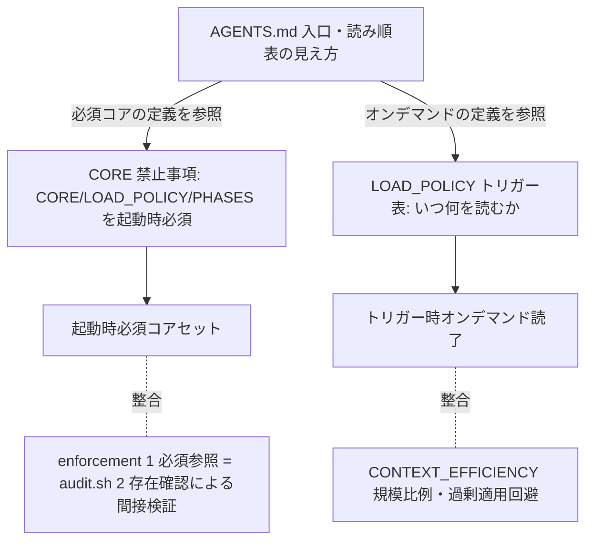
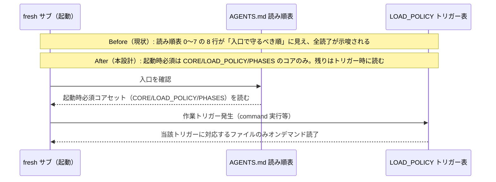
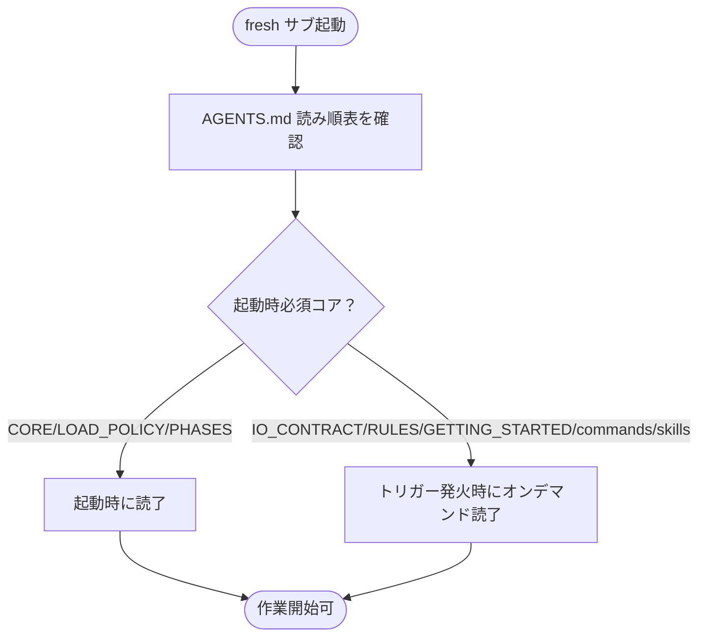

# 設計書: オンボーディング読了義務が重すぎる

**プロジェクト名**: オンボーディング読了義務が重すぎる
**作成日**: 2026 年 07 月 15 日
**最終更新**: 2026 年 07 月 15 日

> **重要**: **このドキュメントは常に更新**: 設計の変更や追加があった場合は、即座にこのドキュメントを更新してください。ドキュメントは「生きているドキュメント」として扱い、実装内容と常に同期させます。
>
> **用語**: [.agent-skill-chain/source/CONCEPTS.md §用語規約](../../../../../../.agent-skill-chain/source/CONCEPTS.md#用語規約) を参照。

---

## 1. 設計概要

### 1.1 設計方針

本 issue は新規機能・コードを伴わない **ドキュメント（実行契約・読み順ポリシー）の最小改訂**である。`spec/01_設計原則.md` のうち **UNIX 哲学（シンプルに保つ）**・**単一責務**・**明確な境界**・**AIフレンドリー設計**を適用し、既存の読み順表・読了義務規定を全廃せず、**「起動時必須のコアセット」と「トリガー時オンデマンド」の境界を明文化する**方向で最小改訂する。

### 1.2 設計原則（本プロジェクトで適用するもの）

- **UNIX哲学（シンプルに保つ）**: 起動時に強制的に読む対象を最小コアに絞り、残りはトリガー発火時に読む形へ「明文化」する。新機構は足さない。
- **単一責務**: 「起動時必須の読了範囲」は CORE §禁止事項を、「いつ何を読むか」は LOAD_POLICY を、「入口の読み順の見え方」は AGENTS.md を、それぞれ単一の正本として保つ（重複させない）。
- **明確な境界**: 「必須コアセット」と「オンデマンド」の境界を表上で明示する。
- **AIフレンドリー設計**: fresh サブが「起動時に必ず読む最小集合」を一目で把握できる形にし、コンテキスト投入量を適正化する。

---

## 2. アーキテクチャ設計

### 2.1 責務・境界・参照関係

本設計での「コンポーネント」は、読了義務・読み順ポリシーを規定する **ドキュメント正本**を指す。

#### 2.1.1 責務一覧

| コンポーネント（ドキュメント正本） | 責務（1 文） |
| -------------------- | -------------------- |
| `AGENTS.md` §読み込み順・優先順位 | 人間・AI の入口として「読む対象と優先順位、および読むタイミング（必須コア／オンデマンド）」の見え方を提示する |
| `boot/CORE.md` §禁止事項・§読了義務 | 起動時に必須で読了すべき最小集合（CORE / LOAD_POLICY / PHASES）を絶対制約として定義する |
| `boot/LOAD_POLICY.md` | 「いつ何を読むか」＝トリガー→読むファイルの対応（オンデマンド読了）の正本 |
| `enforcement/README.md` #1（必須参照） | 必須読了ファイルの参照有無を、`audit.sh §2` のファイル存在確認で間接検証する失敗条件を定義する |
| `CONTEXT_EFFICIENCY.md` | コンテキスト肥大防止の汎用原理（規模比例・過剰適用の回避）を提供する |

#### 2.1.2 境界

- **入力**: 現行の読み順表（AGENTS.md 0〜7 の 8 行）・CORE §禁止事項の必須読了規定・LOAD_POLICY のトリガー表・enforcement #1 の実装状態。
- **出力**: 「起動時必須コアセット」と「オンデマンド」の境界を明文化した読み順ポリシー（AGENTS.md 改訂＋関連正本の整合注記）。
- **他責務との境界**: 本 issue の**範囲外**とするもの＝(a) 読了検証を機構的に完全化する新規 hook の実装、(b) CORE/LOAD_POLICY/PHASES 自体の読了義務の撤廃、(c) `spec/` 配下の設計原則そのものの改訂、(d) `audit.sh` のチェックロジック変更。これらは扱わない。

#### 2.1.3 参照関係

- `AGENTS.md`（入口・見え方）→ `boot/CORE.md`（起動時必須の正本）→ `boot/LOAD_POLICY.md`（オンデマンドの正本）。
- 「読むタイミングの境界」の**正本は CORE §禁止事項＋LOAD_POLICY**であり、AGENTS.md は入口として**それを反映（参照）するだけ**で新定義を持たない（重複禁止・単一責務）。循環参照は持たない。

### 2.2 システムアーキテクチャ

- **採用パターン**: ドキュメント正本の**単一責務・参照集約**（レイヤ化された正本 + 入口からの参照）。
- **根拠**: `spec/06_設計判断の優先順位.md`（1.可読性 → 2.単一責務 → 3.仕様との整合性）に従い、「入口の分かりやすさ（可読性）」と「正本の単一化（単一責務）」を優先。新機構追加より既存規定間の整合を優先する（`spec/01_設計原則.md` §シンプルに保つ）。

#### 2.2.1 CQRS

該当なし（状態変更を伴わないドキュメント改訂）。

#### 2.2.2 アーキテクチャ図（読了ポリシーの階層）

### 2.3 コンポーネント構成

改訂対象は 4 ドキュメント。**主改訂は AGENTS.md 1 か所**、他 3 つは整合のための最小注記に留める（単一責務・重複禁止）。詳細な改訂内容・行番号は 03_実装計画 §2 に記す。

### 2.4 データフロー

該当なし（永続データ・イベント発行を伴わない）。fresh サブの読了フローの Before/After のみを示す。

### 2.5 横断設計判断（ADR）

#### ADR-1: 読了対象範囲・分量は「縮小（起動時必須コアの明文化）」とする

- **コンテキスト**: 00/01 の課題提起どおり、`AGENTS.md` の読み順表は 0〜7 の 8 行を「入口で守るべき順」として提示し（`AGENTS.md:77-92`）、あたかも起動時に 8 ファイル全読了が必須であるかのように読める。一方 `CORE.md §禁止事項`（`boot/CORE.md:121`）が起動時に必須と定めるのは **CORE / LOAD_POLICY / PHASES の 3 つのみ**であり、残りは `LOAD_POLICY.md` のトリガー表に従い**オンデマンド**に読む設計（`boot/LOAD_POLICY.md:11-32` は既にトリガー駆動）。この「入口の見え方」と「実際の必須範囲」の乖離が、読了義務過大の実体であり、`CONTEXT_EFFICIENCY.md`（規模比例・過剰適用回避）と方向性が逆行して見える原因である。source は実測 103 md ファイル・約 24,916 語（非 md 含め 135 ファイル・約 46,346 語）。
- **検討した選択肢**:
  1. **現状維持**: 読み順表・注記を変えない。乖離（見え方 vs 実必須）を放置。
  2. **全廃・全面再構成**: 読み順表を廃止し LOAD_POLICY へ一本化。
  3. **縮小（採用）**: 読み順表は残したまま、「起動時必須コアセット（CORE/LOAD_POLICY/PHASES ＋存在すれば project/）」と「トリガー時オンデマンド（IO_CONTRACT/RULES/GETTING_STARTED/commands/skills/テンプレート）」の境界を表上で明文化し、CORE §禁止事項・LOAD_POLICY の既存定義に一致させる。
- **決定**: **選択肢 3（縮小＝起動時必須コアの明文化）**を採用する。**縮小の対象は「起動時に一括読了が必須であるかのように見える範囲」の明確化に限り、CORE/LOAD_POLICY/PHASES の読了義務そのものは撤廃しない**（01 §2.3 ビジネスルール／00 §3.3 互換性に準拠）。
- **絞り込み基準（AC1-2 対応・何を必須コアに残し何をオンデマンドへ回すかの判定観点）**:
  1. **影響範囲（規約遵守上の中核性）**: 実行契約・読込順・フェーズ gate を定義し、これ無しでは「他に何を読むべきか／どのフェーズ gate が適用されるか」すら判定できないファイル → **起動時必須コア**（CORE / LOAD_POLICY / PHASES）。
  2. **トリガー依存性・発火頻度**: 特定トリガー（command 実行・レビュー・コード記述・issue 起票・docs 更新等）が発生して初めて必要になるファイル → **オンデマンド**（commands/{name}.md・IO_CONTRACT・RULES・各 skill・テンプレート等。LOAD_POLICY のトリガー表に従う）。
  3. **参照頻度・位置づけ（索引/要約性）**: 要約・索引・変更マップ的なファイル（GETTING_STARTED は「手順要約」、README は索引）→ **オンデマンド（必要時参照）**。
- **根拠**: `boot/CORE.md:121`（必須は CORE/LOAD_POLICY/PHASES の 3 つ）と `boot/LOAD_POLICY.md:11-32`（既にトリガー駆動）を実読して確認。縮小といっても新しい規範を追加するのではなく、**既存の 2 正本が既に定めている範囲へ入口の見え方を一致させる**だけであり、規約遵守レベルを一切下げない。`CONTEXT_EFFICIENCY.md §適用のスケーリング`（過剰適用の回避）とも整合する。**evidence_source: existing_code**（当該ファイル群を本 issue 内で実読）。
- **帰結**: AGENTS.md の読み順表に「読むタイミング（必須コア／オンデマンド）」の区別が明示され、fresh サブが起動時に読むべき最小集合が一目で分かる。CORE/LOAD_POLICY/PHASES 起動時必須は維持され規約遵守は不変。読み順表は全廃されない（01 制約・破壊的変更回避）。CONTEXT_EFFICIENCY との見かけ上の矛盾が解消する。

#### ADR-2: 読了検証手段は「維持（間接検証のまま）＋縮小による相対的実効性向上」とする

- **コンテキスト**: `enforcement/README.md` の失敗条件 #1「必須参照」は `audit.sh §2` の実装であり、その実体は **`boot/CORE.md`・`boot/LOAD_POLICY.md`・`workflow/PHASES.md`・`workflow/TEMPLATES.md` の「ファイル存在確認」**である（`audit.sh:250-258` を実読。存在すれば PASS、欠落なら FAIL）。すなわち「該当ファイルがリポジトリに存在するか」を見るだけで、「サブが実際に読んだか」は検証していない（self-report 依存）。enforcement README も「PreToolUse は完全物理強制ではない」「hook はツール名・コマンド文字列等しか受け取れない」と明記しており、**読了そのものの機械的完全検証は原理的に不能**である。
- **検討した選択肢**:
  1. **維持（採用）**: 現状の間接検証（#1 = 存在確認）を維持する。読了の完全機械検証は追わない。
  2. **軽量自己申告 strengthening**: 委譲パケット・memo・00 frontmatter 等の成果物に「読了した必須コアの一覧」を明記させる義務を新設する。
  3. **機構的強化（新規 hook）**: `SubagentStop` 等で読了を検査する新 hook を実装する。
- **決定**: **選択肢 1（維持）**を採用する。ただし ADR-1 の縮小により、間接検証（#1）の対象が「本当に起動時に読むべき最小集合」と一致するため、**同じ存在確認機構のまま相対的な実効性が向上する**（AC2-1 の「対象縮小による相対的な実効性向上」に該当）。加えて、**読了検証と機械強制の役割分担**を設計上明記する: 「実際に読んだか」の完全検証は追わず、規約遵守の実効性は **既存の機械強制**（PreToolUse による orchestrator 直接作業 reject、`audit.sh` #12/#13 actor_role・#25 メイン直接作業・#35 branch 紐づけ等）が担保する二段構え（runtime reject ＋ CI audit）に委ねる。
- **根拠（選択肢 2・3 を採らない理由・費用対効果／AC2-2 対応）**:
  - 選択肢 2（自己申告）は **gameable**（読まずに一覧だけ記載可能）で、存在確認を超える実質的保証を与えない一方、全委譲・全 memo に記載コストと維持コストを課し、`CONTEXT_EFFICIENCY.md` の「過剰適用の回避」に反する。効果に対し費用が見合わない。
  - 選択肢 3（新規 hook）は、enforcement README §系統E が明記するとおり **`SubagentStop` の入力には読了と 1:1 突合できるキーが無く**、実装しても fail-open な高信頼ケースのみの部分検知に留まる。「読了」検査そのものは記録行が無いため対象化すらできない。実装・保守コストが高く、本 issue（最小ドキュメント改訂）のスコープを超える。
  - 完全な機械検証が原理的に不能である以上、**追加投資の限界効用は小さく**、既存の間接検証（ほぼゼロコスト）＋既存の機械強制＋ADR-1 の縮小で費用対効果が最良と判断する。**evidence_source: existing_code**（`audit.sh §2`・enforcement README §系統E・§Layer2 を実読）。
- **帰結**: 新規 hook・新規義務は追加しない（実装コスト増なし）。#1 の間接検証は維持。ADR-1 の縮小で #1 の対象と「実際に読むべき最小集合」が一致し実効性が相対的に向上。読了検証（間接）と機械強制（PreToolUse/CI）の役割分担が設計として明記される。`audit.sh` のチェックロジックは変更しない（TEMPLATES.md は requirement-discovery 用として存在確認対象に残してよい）。

---

## 3. 機能設計

### 3.1 機能 1: 読み順表への「読むタイミング」明文化（AGENTS.md）

#### 3.1.1 概要

`AGENTS.md §読み込み順・優先順位（絶対）` の読み順表に「読むタイミング（起動時必須コア／オンデマンド）」の区別を追加し、起動時必須が CORE/LOAD_POLICY/PHASES（＋存在すれば project/）のコアのみである旨を注記する。表自体は残す。

#### 3.1.2 処理フロー

#### 3.1.3 入力・出力

- **入力**: 現行読み順表（8 行）と注記（`AGENTS.md:81-92`）。
- **出力**: 「読むタイミング」列（または注記）を加えた読み順表。起動時必須コアと on-demand の境界が明示された入口。

#### 3.1.4 エラーハンドリング

該当なし（ドキュメント記述。矛盾混入は 03 のテスト観点＝レビュー確認で検出）。

### 3.2 機能 2: 関連正本の整合注記（CORE / LOAD_POLICY / enforcement）

- **概要**: AGENTS.md の見え方変更に対し、正本間の整合を保つ最小注記を入れる。
  - `CORE.md`: §禁止事項/§読了義務が既に定める「起動時必須＝CORE/LOAD_POLICY/PHASES、残りは LOAD_POLICY に従いオンデマンド」を、AGENTS.md の読み順表と対応する旨を 1 行補足（新定義は足さない・重複禁止）。
  - `LOAD_POLICY.md`: トリガー表が「オンデマンド読了の正本」であること、起動時必須コアは CORE §禁止事項に一致することを冒頭に 1 行明記。
  - `enforcement/README.md` #1 行: 概要セルに「起動時必須コアの存在を間接検証する。読了そのものの完全検証は原理的に不能で、縮小により相対実効性を高める（ADR-2）」の趣旨を短く補う（判定ロジック・監査挙動は変更しない）。
- **入出力**: 入力＝各正本の該当箇所、出力＝整合注記を加えた各正本。

---

## 4. データ設計

該当なし（新規テーブル・データ構造なし）。

---

## 5. API 設計

該当なし（新規 API・エンドポイントなし）。

---

## 6. テスト戦略

本 issue はドキュメント改訂であり、実行時テストではなく **レビュー観点（ドキュメント検証）** で担保する。03_実装計画 §2 の各タスクにレビュー観点（受け入れ基準・BDD シナリオとの対応）を記載する。

### 6.1 対象ごとのテスト割り当て

| 対象 | 単体 | 結合/API | E2E | クリティカル観点 | バリデーション観点 | 未達理由/補足 |
| --------------------------- | ----- | -------- | ----- | ---------------- | ------------------ | ------------- |
| AGENTS.md 読み順表改訂 | ×（コードなし） | × | × | 起動時必須コア＝CORE/LOAD_POLICY/PHASES を維持（AC1-1/AC1-2） | 読み順表を全廃していない・両論併記が残っていない | ドキュメント検証はレビューで実施 |
| CORE/LOAD_POLICY/enforcement 整合注記 | × | × | × | 正本間の定義が矛盾しない（ADR-2 の役割分担が明記） | audit.sh 挙動を変えていない（AC2-1/AC2-2） | 同上 |

### 6.2 監査・レビューでの確認（証跡）

01 の 5 受け入れ基準（AC1-1〜AC2-2）と 4 BDD シナリオへの対応を 03 §2 に紐付ける。実装後の review-docs（実装前ドキュメントレビュー）で本 §6.1 の割当と 03 のタスク別観点が揃っていることを確認する。

---

## 7. UI 設計

該当なし。

---

## 8. セキュリティ設計

該当なし。

---

## 9. 非機能要件への対応

### 9.1 パフォーマンス（コンテキスト消費）

- ADR-1 の縮小により、fresh サブが起動時に読む必須対象が CORE/LOAD_POLICY/PHASES のコアに明確化され、初回コンテキスト投入量の適正化が**定性的に**見込める（01 §3.1）。残りはトリガー時に必要分のみ読む。

### 9.2 可用性・ユーザビリティ

- 読み順表は残し、「読むタイミング」列を足すのみのため、新規参加者・fresh サブの把握しやすさ（表形式）を維持する（01 §3.3）。参照先の分かりにくさは増やさない。

---

## 10. 参考資料

### プロジェクトドキュメント

- [`01_要件定義.md`](./01_要件定義.md) - 要件定義
- [`00_要求定義.md`](./00_要求定義.md) - 要求定義

### その他の参考資料

- `AGENTS.md:77-92`（読み込み順・優先順位）
- `.agent-skill-chain/source/boot/CORE.md:121`（§禁止事項）・`:151-154`（§読了義務）
- `.agent-skill-chain/source/boot/LOAD_POLICY.md:11-32`（トリガー表）
- `.agent-skill-chain/source/enforcement/README.md`（#1 必須参照・§Layer2・§系統E）
- `.agent-skill-chain/source/enforcement/ci/audit.sh:250-258`（§2 必須ファイル存在確認）
- `.agent-skill-chain/source/CONTEXT_EFFICIENCY.md`（規模比例・過剰適用の回避）
- 実測値（2026-07-15）: 135 ファイル / 103 md / 24,916 語（md）/ 46,346 語（全）

---

## 11. 前のステップ

- **前**: [`01_要件定義.md`](./01_要件定義.md) - 要件定義フェーズ

---

## 12. 次のステップ

- **次**: [`03_実装計画.md`](./03_実装計画.md) - 実装計画フェーズ
