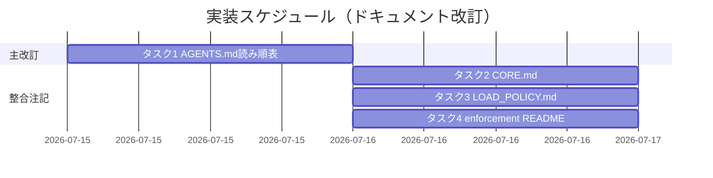

# 実装計画書: オンボーディング読了義務が重すぎる

**プロジェクト名**: オンボーディング読了義務が重すぎる
**作成日**: 2026 年 07 月 15 日
**最終更新**: 2026 年 07 月 15 日

> **重要**: **このドキュメントは常に更新**: 実装計画の変更、進捗状況の更新などがあった場合は、即座にこのドキュメントを更新してください。
> **必須項目**: 「必須」と明記した欄は空欄・抽象語のみで提出しないこと。テスト観点・BDD 仕様は具体ケースを 1 件以上記載すること。
>
> **用語**: [.agent-skill-chain/source/CONCEPTS.md §用語規約](../../../../../../.agent-skill-chain/source/CONCEPTS.md#用語規約) を参照。

---

## 1. 実装概要

### 1.1 実装方針（必須）

02_設計の ADR-1（縮小＝起動時必須コアの明文化）・ADR-2（読了検証は維持）に従い、**新規コード・新規 hook・新規義務を一切追加せず、4 ドキュメントの最小改訂のみ**で対応する。主改訂は `AGENTS.md` の読み順表 1 か所、残り 3 つ（CORE / LOAD_POLICY / enforcement）は正本間整合のための最小注記に留める。

**「変更しない／縮小する」の切り分け（明確化）**: `audit.sh` の挙動と、`CORE.md §禁止事項` が定める**起動時必須コアの正本定義（CORE / LOAD_POLICY / PHASES の 3 つ）自体は不変**とする。一方、**読み順表上で「起動時に必須」と読める読了範囲（＝入口の見え方）は、上記正本定義に一致させる形で縮小＝明確化する**。ここでの「縮小」は、8 行全読了が必須であるかのように見える現状の入口表現を、正本どおり「起動時必須はコアのみ・残りはオンデマンド」へ絞る**見え方の明確化**を指し、CORE/LOAD_POLICY/PHASES の読了義務そのものを撤廃するものではない。読み順表は**全廃しない**が、「読むタイミング」列と注記の**追加という改訂は行う**（表構造は保持しつつ起動時必須がコアのみである旨を明示する）。

### 1.2 実装順序（必須: 1 件以上）

1. **タスク 1**: `AGENTS.md` 読み順表への「読むタイミング」列＋注記追加（主改訂・AC1 充足）。
2. **タスク 2**: `CORE.md` §読了義務への整合注記（1 行）。
3. **タスク 3**: `LOAD_POLICY.md` 冒頭への整合注記（1 行）。
4. **タスク 4**: `enforcement/README.md` #1 行の概要セルへの整合注記（ADR-2・AC2 充足）。



---

## 2. タスク分解

**必須**: 各タスクには「テスト観点」（2.x.3）と「単体テスト仕様（BDD）」（2.x.4）を記載する。本 issue はドキュメント改訂のため、テスト観点は **review-docs（実装前ドキュメントレビュー）での確認観点**として記載し、BDD は 01 の受け入れ基準・シナリオへの対応を Gherkin で示す。

### 2.1 タスク 1: AGENTS.md 読み順表への「読むタイミング」明文化

#### 2.1.1 概要（必須）

読み順表を全廃せず、「読むタイミング（起動時必須コア／オンデマンド）」を明示して起動時必須が CORE/LOAD_POLICY/PHASES のコアのみであることを入口に反映する。

#### 2.1.2 実装内容（必須: 1 件以上）

- **対象ファイル**: `AGENTS.md`（プロジェクトルート）。
- **対象箇所**: §読み込み順・優先順位（絶対）。**行番号目安**: 見出し `## 読み込み順・優先順位（絶対）`（**77 行目付近**）、説明文（**79 行目付近**）、表（**81〜90 行目**）、委譲注記（**92 行目付近**）。
- **修正内容**:
  1. 表（現行の `| 順 | 対象 | 備考 |`）に **「読むタイミング」列を 1 列追加**する。各行の値の目安:
     - 順 0 `.agent-skill-chain/project/`: 「オンデマンド（存在すれば command 実行時等に確認・最優先）。起動時必須コアではない」
     - 順 1 `AGENTS.md`: 「入口（本ファイル）」
     - 順 2 `CORE.md`: 「**起動時必須（コア）**」
     - 順 3 `IO_CONTRACT.md`: 「オンデマンド（command/skill 入出力時）」
     - 順 4 `RULES.md`: 「オンデマンド（実行モード判定・レビュー・docs 時）」
     - 順 5 `GETTING_STARTED.md`: 「オンデマンド（手順要約・必要時）」
     - 順 6 `PHASES.md`: 「**起動時必須（コア）**」
     - 順 7 `commands/`: 「オンデマンド（command 実行時・LOAD_POLICY に従う）」
  2. 表の直後（**92 行目付近の委譲注記の前**）に注記を 1 段落追加する。内容の要旨: 「**起動時に必ず読了するのは CORE / LOAD_POLICY / PHASES のコアセットのみ**である（`boot/CORE.md §禁止事項` と一致）。`LOAD_POLICY.md` はこの表には行として現れないが、起動時必須コアに含まれる。**順 0 の `.agent-skill-chain/project/` は『最優先』だが起動時必須コアには含めない**——『最優先』は優先順位（precedence）であり読むタイミングではなく、`project/` は存在時に `LOAD_POLICY.md` トリガー表『command を実行するとき』行に従いオンデマンド確認する。IO_CONTRACT / RULES / GETTING_STARTED / commands / skills / テンプレートも同様に、`LOAD_POLICY.md` のトリガー表に従い**該当トリガー発生時にオンデマンドで読む**。これは `CONTEXT_EFFICIENCY.md` の規模比例・過剰適用回避と整合する。」（判断根拠は 02 ADR-1 の `project/` 位置づけ注記を参照）
  3. 説明文（79 行目付近「入口ではこの順を守ること」）は、「順＝優先順位であり、起動時に全 8 行を一括読了する意味ではない」旨に補正する（表の全読了示唆を除去）。
- **制約**: 読み順表そのものは削除しない（01 制約・破壊的変更回避）。`LOAD_POLICY.md` への「いつ何を読むか」の委譲（92 行目の既存注記）は維持する。

#### 2.1.3 テスト観点（必須）

**参照**: 観点定義は [02_設計 §6](./02_設計.md) を参照。以下は本タスクの具体ケース（review-docs での確認観点）。

##### 単体（本タスクの具体ケース・必須 1 件以上）

- 読み順表に「読むタイミング」列が存在し、順 2（CORE）・順 6（PHASES）が「起動時必須（コア）」と明示されている（AC1-1）。
- 注記に「何を必須コアに残し何をオンデマンドへ回すか」の判定（コア＝CORE/LOAD_POLICY/PHASES、残り＝トリガー時）が読み取れる（AC1-2 の基準が入口に反映）。

##### 結合/API（本タスクの具体ケース・該当時は必須 1 件以上）

- 該当なし（コード契約なし）。

##### E2E/受け入れ（本タスクの具体ケース・未達時は理由記載）

- 改訂後の AGENTS.md 読み順表が `boot/CORE.md:121`（必須＝CORE/LOAD_POLICY/PHASES）と矛盾しない（正本間整合）。

##### バリデーション（該当する場合の具体ケース）

- 読み順表が全廃されていない・両論併記（現状維持と縮小の併記）が残っていない（AC1-1 の「単一の方針が明記」）。

#### 2.1.4 単体テスト仕様（BDD）（必須）

```gherkin
Feature: 読了義務の対象範囲・分量の方針確定（縮小方針）
  Scenario: 縮小方針を選ぶ場合（01 UC1 シナリオ1 に対応）
    Given source 配下が 103 md ファイル・約 24,916 語であり読み順表 8 行が全読了を示唆している
    When AGENTS.md 読み順表に「読むタイミング」列と注記を加え起動時必須をコアに絞る
    Then 起動時必須が CORE / LOAD_POLICY / PHASES に明文化され残りはオンデマンドと示される
    And CORE / LOAD_POLICY / PHASES の読了義務そのものは維持される
```

ドキュメント改訂のため実行コードは無い。検証は review-docs による目視・正本間整合確認で行う（コード例は該当なし）。

#### 2.1.5 依存関係

- なし（タスク 2〜4 はタスク 1 の後に整合を取る）。

#### 2.1.6 見積もり

- **工数**: 0.5h / **優先度**: 高

### 2.2 タスク 2: CORE.md §読了義務への整合注記

#### 2.2.1 概要（必須）

CORE §禁止事項（起動時必須＝CORE/LOAD_POLICY/PHASES）と AGENTS.md 読み順表の対応を明示し、新定義を足さず整合を保つ。

#### 2.2.2 実装内容（必須: 1 件以上）

- **対象ファイル**: `.agent-skill-chain/source/boot/CORE.md`。
- **対象箇所**: §読了義務（**151〜154 行目**）。必要に応じて §禁止事項（**121 行目**）を参照補足。
- **修正内容**: §読了義務に 1 行追加。要旨: 「起動時に必須で読了するのは本 CORE / LOAD_POLICY / PHASES のコアのみであり、その他のファイルは LOAD_POLICY のトリガー表に従いオンデマンドで読む。AGENTS.md 読み順表の『読むタイミング』列はこの区別を反映したものである（重複定義ではなく本 §禁止事項が正本）。」
- **制約**: CORE §禁止事項（121 行目）の必須読了規定そのものは変更しない。

#### 2.2.3 テスト観点（必須）

##### 単体（必須 1 件以上）

- §読了義務に「起動時必須＝CORE/LOAD_POLICY/PHASES・残りはオンデマンド」を示す 1 行が追加され、AGENTS.md との対応が読み取れる。

##### 結合/API

- 該当なし。

##### E2E/受け入れ

- CORE §禁止事項（121 行目）が改変されていない（必須読了範囲の後退がない・互換性維持）。

##### バリデーション

- 新たな読了義務の「定義」を CORE に二重化していない（正本は §禁止事項 1 か所・単一責務）。

#### 2.2.4 単体テスト仕様（BDD）（必須）

```gherkin
Feature: 正本間整合（CORE と AGENTS.md）
  Scenario: 読み順表とCOREの必須読了範囲が一致する
    Given AGENTS.md 読み順表に読むタイミング列が追加された
    When CORE §読了義務に起動時必須コアの整合注記を 1 行加える
    Then CORE §禁止事項（必須＝CORE/LOAD_POLICY/PHASES）と読み順表が矛盾しない
```

#### 2.2.5 依存関係

- タスク 1 の後に実施（読み順表の表現に合わせる）。

#### 2.2.6 見積もり

- **工数**: 0.25h / **優先度**: 中

### 2.3 タスク 3: LOAD_POLICY.md 冒頭への整合注記

#### 2.3.1 概要（必須）

トリガー表が「オンデマンド読了の正本」であること、起動時必須コアは CORE §禁止事項に一致することを明記する。

#### 2.3.2 実装内容（必須: 1 件以上）

- **対象ファイル**: `.agent-skill-chain/source/boot/LOAD_POLICY.md`。
- **対象箇所**: 冒頭の責務説明（**3〜7 行目付近**）またはトリガー表の直前（**9〜11 行目付近**）。
- **修正内容**: 1 行追加。要旨: 「本トリガー表が『オンデマンド読了（いつ何を読むか）』の正本である。起動時に必須で読了するコアは CORE / LOAD_POLICY / PHASES のみ（正本は `CORE.md §禁止事項`）で、本表の各行はトリガー発生時に読む対象を定める。」
- **制約**: トリガー表の各行・既存の正本宣言（3 行目「最初に何を読むか」…「トリガー→読むファイル」の正本は本ファイルのみ）は変更しない。

#### 2.3.3 テスト観点（必須）

##### 単体（必須 1 件以上）

- 冒頭に「トリガー表＝オンデマンドの正本／起動時必須コアは CORE §禁止事項に一致」の 1 行がある。

##### 結合/API

- 該当なし。

##### E2E/受け入れ

- トリガー表（11〜32 行目）の行が削除・改変されていない（既存挙動不変）。

##### バリデーション

- 「起動時必須コアの定義」を LOAD_POLICY 側に新設していない（正本は CORE・参照のみ）。

#### 2.3.4 単体テスト仕様（BDD）（必須）

```gherkin
Feature: オンデマンド読了の正本明示（LOAD_POLICY）
  Scenario: トリガー表がオンデマンドの正本であると分かる
    Given 読み順表で残りファイルがオンデマンドと示された
    When LOAD_POLICY 冒頭にトリガー表＝オンデマンド正本・起動時必須はCOREに一致と明記する
    Then サブはトリガー発生時に必要ファイルのみ読む運用を一意に把握できる
```

#### 2.3.5 依存関係

- タスク 1 の後に実施。

#### 2.3.6 見積もり

- **工数**: 0.25h / **優先度**: 中

### 2.4 タスク 4: enforcement/README.md #1 行への整合注記（ADR-2）

#### 2.4.1 概要（必須）

失敗条件 #1（必須参照）が「起動時必須コアの存在を間接検証する」ものであり、読了の完全検証は原理的に不能で、縮小により相対実効性が上がることを明示する（ADR-2・AC2 充足）。判定ロジック・audit.sh 挙動は変更しない。

#### 2.4.2 実装内容（必須: 1 件以上）

- **対象ファイル**: `.agent-skill-chain/source/enforcement/README.md`。
- **対象箇所**: 失敗条件レジストリ表の **#1 必須参照 行**（**269 行目付近**）の「概要」セル、および必要なら「失敗とみなす条件」一覧の **#1 行**（**311 行目付近**）。
- **修正内容**: #1 の概要に短い注記を補う。要旨: 「本 #1 は起動時必須コア（CORE / LOAD_POLICY / PHASES。audit.sh §2 はこれらに加え requirement-discovery 用の TEMPLATES.md の存在も確認する）の**存在による間接検証**であり、実際に読んだかは検証しない（self-report 依存・読了の完全機械検証は原理的に不能）。読了義務範囲の縮小（コア明確化）により、検証対象と『実際に読むべき最小集合』が一致し相対的実効性が向上する。」
- **制約**: `audit.sh §2`（250〜258 行目）の判定ロジック（存在チェック対象 CORE/LOAD_POLICY/PHASES/TEMPLATES）は**変更しない**。#1 の強制レベル（CI FAIL・間接）も変えない。TEMPLATES.md は requirement-discovery 用途で存在確認対象に残す。

#### 2.4.3 テスト観点（必須）

##### 単体（必須 1 件以上）

- #1 行の概要に「間接検証（存在確認）である／読了の完全機械検証は不能／縮小で相対実効性向上」が読み取れる（AC2-1＝検証手段は維持、AC2-2＝維持理由＝完全検証不能・費用対効果）。

##### 結合/API

- 該当なし（audit.sh コード不変のため CI 挙動テスト対象外）。

##### E2E/受け入れ

- `audit.sh` の関数・存在チェック対象が変更されていない（レジストリの他行・実装状態列に影響なし）。

##### バリデーション

- 新規失敗条件・新規 hook をレジストリに追加していない（ADR-2 維持方針に一致）。

#### 2.4.4 単体テスト仕様（BDD）（必須）

```gherkin
Feature: 読了検証手段の方針確定（維持）
  Scenario: 検証手段を維持する場合（01 UC2 シナリオ1 に対応）
    Given #1 必須参照は audit.sh §2 のファイル存在チェックで代用され読了有無は検証できない
    When enforcement README の #1 概要に間接検証である旨と維持理由を明記する
    Then 現状の間接検証を維持しつつ縮小により相対実効性が上がる根拠が読み取れる
    And 新規 hook・新規義務を追加しない（費用対効果・完全検証不能を理由に）
```

なお 01 UC2 シナリオ2（機械強制への置換）は、ADR-2 で**採らない選択肢**として検討・棄却済み（既存の PreToolUse/CI 機械強制が役割分担を担う旨を #1 注記が示唆）。本タスクでは新規機械強制は追加しない。

#### 2.4.5 依存関係

- タスク 1 の後に実施（縮小方針の確定を反映）。

#### 2.4.6 見積もり

- **工数**: 0.25h / **優先度**: 中

---

## テスト観点

本実装計画全体のテスト観点は「ドキュメント改訂の正本間整合」と「01 受け入れ基準 5 項目の充足」に集約される。各タスク §2.x.3 に具体ケースを記載済み。監査（review-docs）では、02 §6.1 の割当表と本 §2 のタスク別観点が揃っていることを確認する。

---

## 単体テスト

実行コードを伴わないため機械的単体テストは無い。代替として review-docs（実装前ドキュメントレビュー）で、(1) AGENTS.md 読み順表の改訂が AC1 を満たすか、(2) CORE/LOAD_POLICY/enforcement の注記が正本間で矛盾しないか、(3) audit.sh 挙動・既存読了義務が不変か、を目視検証する。

---

## BDD

01 の受け入れ基準・BDD シナリオとの対応:

| 01 の受け入れ基準 / シナリオ | 対応タスク | 充足箇所 |
| ---------------------------- | ---------- | -------- |
| AC1-1（現状維持/縮小のいずれか明記＝縮小） | タスク 1 | 02 ADR-1・03 §2.1 |
| AC1-2（縮小の絞り込み基準を列挙） | タスク 1 | 02 ADR-1 絞り込み基準・03 §2.1.2 |
| AC1-3（現状維持の根拠） | — | 現状維持を採らないため N/A（ADR-1 で棄却理由を記載） |
| AC2-1（検証手段の維持/強化を明記＝維持） | タスク 4 | 02 ADR-2・03 §2.4 |
| AC2-2（強化しない理由） | タスク 4 | 02 ADR-2 根拠（費用対効果・完全検証不能） |
| UC1 シナリオ1（縮小方針） | タスク 1 | 03 §2.1.4 BDD |
| UC1 シナリオ2（現状維持方針） | — | ADR-1 棄却選択肢として検討 |
| UC2 シナリオ1（検証維持） | タスク 4 | 03 §2.4.4 BDD |
| UC2 シナリオ2（機械強制への置換） | — | ADR-2 棄却選択肢として検討（既存機械強制が役割分担） |

---

## 3. 実装スケジュール

### 3.1 マイルストーン

| マイルストーン | 期日 | 成果物 |
| ------------------ | ------ | -------- |
| 主改訂完了 | 2026-07-15 | AGENTS.md 読み順表改訂 |
| 整合注記完了 | 2026-07-15 | CORE / LOAD_POLICY / enforcement 注記 |

### 3.2 実装フェーズ

#### フェーズ 1: ドキュメント改訂

- **期間**: 1 日
- **タスク**: タスク 1〜4

---

## 4. テスト計画

### 4.1 テストの優先順位

- タスク 1（AGENTS.md 主改訂・AC1 充足）を最重点でレビューする。
- 正本間整合（タスク 2〜4）は「新定義の二重化がないこと」「既存挙動・既存義務の後退がないこと」を回帰観点として必ず確認する。

---

## 5. リスク管理

### 5.1 実装リスク

- **リスク**: 読み順表の表現変更で「起動時必須が緩んだ」と誤読され規約遵守が低下する。
  - **対策**: 注記で「CORE/LOAD_POLICY/PHASES の起動時必須は不変」を明記し、CORE §禁止事項（121 行目）を変更しない。
- **リスク**: 正本の二重定義（AGENTS.md 側に新たな読了義務を作る）。
  - **対策**: AGENTS.md は「反映（参照）」に留め、正本は CORE §禁止事項・LOAD_POLICY と明記（単一責務）。
- **リスク**: enforcement 注記が audit.sh 挙動を変えたと誤解される。
  - **対策**: 「判定ロジック・存在チェック対象は不変」を注記に明示し、コードは触らない。

---

## 6. 参考資料

### プロジェクトドキュメント

- [`02_設計.md`](./02_設計.md) - 設計
- [`01_要件定義.md`](./01_要件定義.md) - 要件定義

### その他の参考資料

- `AGENTS.md:77-92`
- `.agent-skill-chain/source/boot/CORE.md:121, 151-154`
- `.agent-skill-chain/source/boot/LOAD_POLICY.md:1-32`
- `.agent-skill-chain/source/enforcement/README.md`（#1 行 269 付近・311 付近）
- `.agent-skill-chain/source/enforcement/ci/audit.sh:250-258`

---

## 7. 前のステップ

- **前**: [`02_設計.md`](./02_設計.md) - 設計フェーズ

---

## 8. 次のステップ

- 本 issue は 1 issue で完結（サブ分割なし）。実装フェーズ（implement-feature）着手前に review-docs（実装前ドキュメントレビュー）を必ず経ること。
