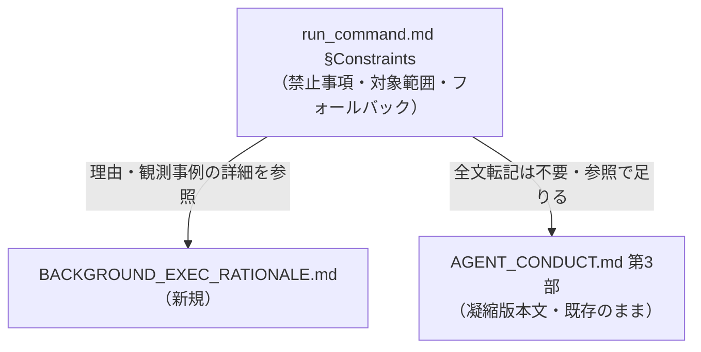
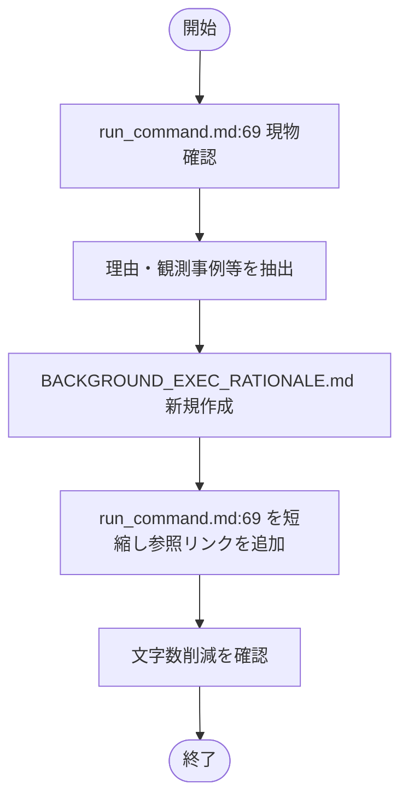
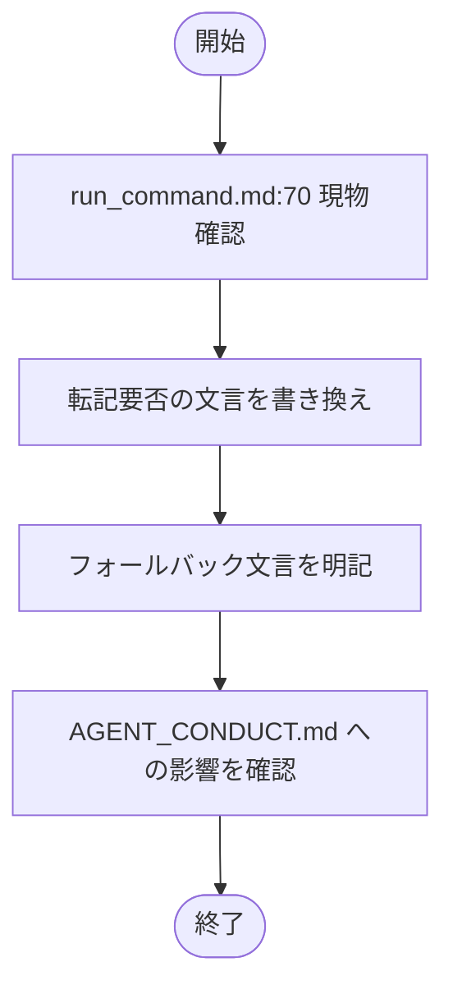

# 設計書: run_command.md Constraints の単一項目が異常に長大

**プロジェクト名**: run_command.md Constraints の単一項目が異常に長大
**作成日**: 2026 年 07 月 14 日
**最終更新**: 2026 年 07 月 14 日

> **用語**: [.agent-skill-chain/source/CONCEPTS.md §用語規約](../../../../../../.agent-skill-chain/source/CONCEPTS.md#用語規約) を参照。

---

## 1. 設計概要

### 1.1 設計方針

本 issue はドキュメント編集のみで、新規コンポーネント・API は発生しない。設計原則のうち「単一責務」（1 ファイル 1 責務）を適用し、run_command.md の Constraints 本文は「何を守るか（禁止事項・対象範囲・フォールバック条件）」のみを責務とし、「なぜそう決めたか（理由・観測事例）」は別ファイルへ切り出す。

### 1.2 設計原則（本プロジェクトで適用するもの）

- **単一責務**: run_command.md（規範の正本・何を守るか）と BACKGROUND_EXEC_RATIONALE.md（理由・観測事例の補足）に責務を分離する。
- **明確な境界**: 「本文＝強制力を持つ規範」「外部ファイル＝理由の補足（advisory）」という境界を、各ファイル冒頭に明記する。

---

## 2. アーキテクチャ設計

### 2.1 責務・境界・参照関係

#### 2.1.1 責務一覧

| コンポーネント（ファイル） | 責務（1 文） |
| --- | --- |
| `.agent-skill-chain/source/skills/agent/run_command.md`（該当 2 項目） | 禁止事項・対象範囲・フォールバック条件を簡潔に規定する正本 |
| `.agent-skill-chain/source/skills/agent/BACKGROUND_EXEC_RATIONALE.md`（新規） | バックグラウンド実行禁止の理由・観測事例・既存項目との関係を補足する参照先 |
| `.agent-skill-chain/source/AGENT_CONDUCT.md`（既存・本 issue では変更しない） | サブエージェント向け凝縮版本文の正本（第 3 部） |

#### 2.1.2 境界

- **入力**: run_command.md を読む委譲元（オーケストレーター）・委譲先（サブエージェント）。
- **出力**: 委譲パケットの Constraints セクションに転記・参照される文字列。
- **他責務との境界**: 164009 issue で一本化済みの「委譲の形」（Task/Constraints/OutputSpec の共通 I/F 定義）には触れない。AGENT_CONDUCT.md 第 3 部の本文（凝縮版の中身そのもの）は変更しない。変更するのは run_command.md 側の「転記の要否」の指示のみ。

#### 2.1.3 参照関係

- run_command.md §Constraints（バックグラウンド実行禁止項目）→ BACKGROUND_EXEC_RATIONALE.md（新規、詳細参照）
- run_command.md §Constraints（行動規範参照項目）→ AGENT_CONDUCT.md 第 3 部（既存、リンク先は変更なし）
- 循環参照なし。

### 2.2 システムアーキテクチャ

- **採用パターン**: ドキュメント分割（正本 = 禁止事項本文／補足 = 理由ファイル）。コード変更を伴わないため、アプリケーションアーキテクチャパターンは適用外。
- **根拠**: [01_設計原則.md](../../../../../../.agent-skill-chain/source/spec/01_設計原則.md) の「明確な境界」「単一責務」を、ドキュメント間の責務分離という形で適用した。

### 2.3 コンポーネント構成

- run_command.md の該当 2 項目（本文）: 短縮後もそれ単体で「何が禁止か」を判読できる自己完結性を持たせる。
- BACKGROUND_EXEC_RATIONALE.md（新規）: 理由・観測事例・判断基準の補足・フォールバックの根拠・既存項目との関係、の 5 節構成。

### 2.4 データフロー

コード変更なし。委譲パケット組み立て時にオーケストレーターが run_command.md の該当項目を読み、Constraints セクションへ反映する（従来と同じ流れ。転記量のみ変化）。

### 2.5 横断設計判断（ADR）

#### ADR-1: バックグラウンド実行禁止項目の分割方針

- **コンテキスト**: run_command.md:69 の該当項目が約 1,000 字超の長文になっており、委譲のたびにサブエージェントのコンテキストを圧迫していた（00 要求定義 §1.2）。
- **検討した選択肢**:
  1. そのまま全文を残す（変更しない）。
  2. 理由・観測事例のみを外部ファイルへ切り出し、本文は禁止事項・対象範囲・フォールバックに絞る。
  3. 禁止事項の記述自体も大幅に要約する（対象範囲の記述も削る）。
- **決定**: 選択肢 2。
- **根拠**: 00 要求定義 §7.1 のリスク対策（「要点は本文に残し、詳細な観測事例・理由説明は別ファイルへの参照に切り出す」）に従う。選択肢 3 は禁止事項の明確さを損なうため採用しない。evidence_source: `human_decision`（00 要求定義書のリスク対策記載に基づく）。
- **帰結**: run_command.md:69 の文字数は 997 字→ 679 字（約 32% 削減）。BACKGROUND_EXEC_RATIONALE.md（新規）に理由・観測事例・判断基準の補足・既存項目との関係を移設。

#### ADR-2: AGENT_CONDUCT 凝縮版の転記義務の見直し方針

- **コンテキスト**: run_command.md:70 が、委譲のたびに AGENT_CONDUCT.md 第 3 部（約 850 字）を委譲パケットへ逐語転記することを義務化しており、委譲パケットの肥大化要因になっていた。
- **検討した選択肢**:
  1. 転記義務を維持する（変更しない）。
  2. 転記を「参照リンクのみで足りる」仕様に変え、全文転記は必須ではないとする。リンク先を読めないランタイムのみ従来どおり全文転記するフォールバックを残す。
  3. AGENT_CONDUCT.md 第 3 部の凝縮版本文自体をさらに短縮する。
- **決定**: 選択肢 2。
- **根拠**: 本 issue の対象ファイルは run_command.md のみであり（00 要求定義・対象ファイル参照）、AGENT_CONDUCT.md 自体の編集はスコープ外。選択肢 2 は AGENT_CONDUCT.md を変更せずに、委譲パケットへの実転記コストを削減できる。evidence_source: `human_decision`（作業依頼の対象ファイル制約に基づく）。
- **帰結**: 委譲パケットの Constraints セクションに毎回 850 字程度の全文を書き写す必要がなくなり、リンク 1 行（run_command.md:70 内のリンク）で足りるようになる。

##### 補足: AGENT_CONDUCT.md 側の文言との整合性（申し送り）

`.agent-skill-chain/source/AGENT_CONDUCT.md:78`（第 3 部冒頭）には「進行役（orchestrator）は委譲パケット組み立て時、Constraints 末尾へ以下をそのまま転記する。」という記述が残っており、字面上は本 ADR-2 の決定（全文転記は不要）と矛盾する。ただし AGENT_CONDUCT.md 自身の **§0 読み替え規則**（「プロジェクトの実行契約（run_command.md 等）と矛盾する箇所はすべてプロジェクト側が優先され、本ファイルの該当箇所は無効となる」）により、この矛盾は AGENT_CONDUCT.md 側の記述が無効化される形で自動的に解消される。本 issue は対象ファイルが run_command.md に限定されているため AGENT_CONDUCT.md:78/105 の文言更新は行わないが、可読性のため将来的に文言を合わせる価値はある（オーケストレーターへの申し送り事項。本エージェントが独断で新規 issue を起票することはしない）。

---

## 3. 機能設計

### 3.1 機能 1: バックグラウンド実行禁止項目の分割

#### 3.1.1 概要

run_command.md:69 の本文を「禁止事項・対象範囲・フォールバック」のみに絞り、理由・観測事例・判断基準の補足・既存項目との関係を BACKGROUND_EXEC_RATIONALE.md（新規）へ移す。

#### 3.1.2 処理フロー

#### 3.1.3 入力・出力

- **入力**: run_command.md:69（既存本文）。
- **出力**: run_command.md:69（短縮後本文）、BACKGROUND_EXEC_RATIONALE.md（新規）。

#### 3.1.4 エラーハンドリング

該当なし（ドキュメント編集）。リンク切れが無いことを目視・grep で確認する。

### 3.2 機能 2: AGENT_CONDUCT 転記義務の見直し

#### 3.2.1 概要

run_command.md:70 の「そのまま転記する」義務を「参照リンクで足りる（全文転記は必須ではない）」へ変更し、リンク先を読めないランタイム向けのフォールバックを明記する。

#### 3.2.2 処理フロー

#### 3.2.3 入力・出力

- **入力**: run_command.md:70（既存本文）。
- **出力**: run_command.md:70（更新後本文）。

#### 3.2.4 エラーハンドリング

該当なし。AGENT_CONDUCT.md 自体は変更しないため、リンクアンカー（`#第-3-部-...`）が既存見出しと一致することを確認する。

---

## 4. データ設計

該当なし（データベース・データモデルの変更はない）。

---

## 5. API 設計

該当なし。

---

## 6. テスト戦略

本 issue はドキュメント編集のみであり、単体テスト（コード）は対象外。テスト戦略の観点定義は [RULES.md のテスト戦略必須要件](../../../../../../.agent-skill-chain/source/RULES.md#テスト戦略必須要件) を参照しつつ、ドキュメント変更向けの検証観点（文字数比較・リンク整合性・意味的な情報欠落の有無）を用いる。

### 6.1 対象ごとのテスト割り当て

| 対象 | 単体 | 結合/API | E2E | クリティカル観点 | バリデーション観点 | 未達理由/補足 |
| --- | --- | --- | --- | --- | --- | --- |
| run_command.md:69（バックグラウンド実行禁止） | × | × | × | 禁止事項・対象範囲・フォールバックが本文だけで判読できること | 変更前後の文字数比較（削減の実測） | コード無しのためコードレベルの単体/結合/E2E は該当なし |
| run_command.md:70（行動規範参照） | × | × | × | 全文転記が必須でなくなったこと・矛盾時の優先順位規定が残っていること | リンクアンカーが AGENT_CONDUCT.md の実見出しと一致すること | 同上 |
| BACKGROUND_EXEC_RATIONALE.md（新規） | × | × | × | 理由・観測事例が欠落なく移設されていること | run_command.md からのリンクが正しく解決すること | 同上 |

### 6.2 監査・レビューでの確認（証跡）

verify-and-close（04_review.md）にて、変更前後の文字数実測・リンク解決確認・情報欠落の有無（禁止事項がすべて本文に残っているか）を証跡として記録する。

---

## 7. UI 設計

該当なし。

---

## 8. セキュリティ設計

該当なし。

---

## 9. 非機能要件への対応

### 9.1 パフォーマンス

- run_command.md:69 の文字数を 997 字→ 679 字（約 32% 削減）。
- run_command.md:70 の転記義務を「参照で足りる」形にし、委譲パケットへの実転記コスト（従来 850 字程度）を実質的に削減。

### 9.2 可用性

該当なし。

---

## 10. 参考資料

### プロジェクトドキュメント

- [`01_要件定義.md`](./01_要件定義.md) - 要件定義

### その他の参考資料

- `.agent-skill-chain/source/skills/agent/run_command.md`
- `.agent-skill-chain/source/AGENT_CONDUCT.md`
- `.agent-skill-chain/source/spec/01_設計原則.md`

---

## 11. 前のステップ

この設計書は、以下のドキュメントを基に作成されています：

- **前**: [`01_要件定義.md`](./01_要件定義.md) - 要件定義フェーズ

---

## 12. 次のステップ

この設計書の承認後、以下のドキュメントを作成します：

- **次**: [`03_実装計画.md`](./03_実装計画.md) - 実装計画フェーズ
