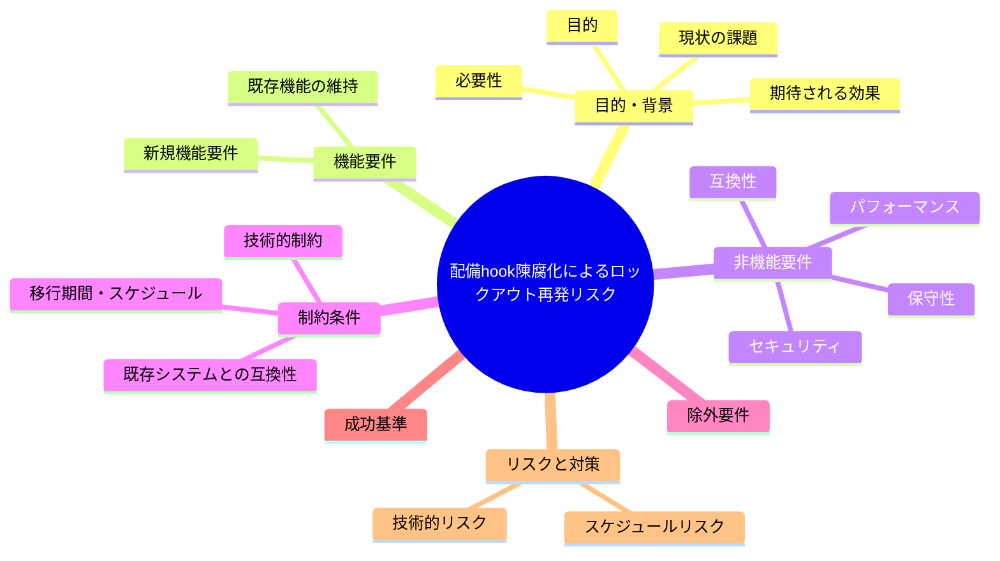

# 要求定義書: 配備済み PreToolUse.sh が正本より陳腐化しロックアウト既知バグ修正が未反映

**プロジェクト名**: 配備済み PreToolUse.sh が正本より陳腐化しロックアウト既知バグ修正が未反映
**作成日**: 2026年07月14日
**最終更新**: 2026年07月14日

---

## 要求定義の全体像

---

## 1. 目的・背景

### 1.1 目的（必須）

配備済みhookを正本と同期させるか判断する

### 1.2 背景

出典: 2026-07-14 fableによる本システムの自己調査で検出。

- **現状の課題**:
  - 配備済み `.claude/hooks/PreToolUse.sh` は正本 `.agent-skill-chain/source/enforcement/claude/PreToolUse.sh` と大きく差分があり、subagent worker 許可・project allowlist・Agent ツール許可等が無い旧版のままである。
  - 旧版は「非 scribe の Bash を全ブロック」する挙動のため、`enforce on` するとサブエージェントの実作業 Bash まで誤ってブロックされ、過去に実際に発生した orchestrator 完全ロックアウト（`feedback_enforce-on-lockout-incident` メモリ参照）を再現しうる。

- **必要性**:
  - 正本での修正が配備済み環境へ自動反映されない仕組みは、既知のバグを再発させるリスクを常態化させる。配備・アップグレード手順（`upgrade`）の実行漏れ、または自動同期の要否検討が必要。

### 1.3 期待される効果（必須: 1 件以上）

- **効果 1**: 配備済み `.claude/hooks/PreToolUse.sh` が正本 `enforcement/claude/PreToolUse.sh` と一致する、または既知の差分・その理由が明記され、ロックアウトの再発可能性が解消される（○/×で判定可能）。

---

## 2. 機能要件

### 2.1 既存機能の維持（該当する場合）

- 既存の hook 配備の仕組み（setup/upgrade スクリプトによる生成）自体は維持する。

### 2.2 新規機能要件

- （対応する場合）`upgrade` コマンドの実行、または配備済み hook と正本の差分検知・警告機構の検討。

---

## 3. 非機能要件

### 3.1 パフォーマンス

- 特になし。

### 3.2 セキュリティ

- ロックアウト再発防止によるフレームワーク運用継続性の確保。

### 3.3 互換性

- upgrade 実行によって他の配備済み設定（`.claude/settings.enforce.json` 等）にも影響が及ぶ可能性があるため確認が必要。

### 3.4 保守性

- 正本と配備物の乖離を定期的に検知する仕組みの要否検討。

---

## 4. 制約条件

### 4.1 技術的制約

- `.claude/` は `.gitignore` 対象（setup/build による生成物）であり、正本の変更が自動反映される仕組みが無い。

### 4.2 既存システムとの互換性

- upgrade 実行時の既存ローカル設定（settings.local.json 等）への影響を考慮する必要がある。

### 4.3 移行期間・スケジュール

- 未定（対応要否は本 issue 起票後に判断）。

---

## 5. 除外要件

- upgrade コマンド自体の新規実装は対象外（既存コマンドの実行または差分検知機構の追加が対象）。

---

## 6. 成功基準（必須: 1 件以上）

- 配備済み `.claude/hooks/PreToolUse.sh` が正本と一致する、または乖離が意図的であることと再発防止策が文書化される。

---

## 7. リスクと対策

### 7.1 技術的リスク

- **リスク**: upgrade 実行により、ローカルでカスタマイズした設定が上書きされる可能性がある。
  - **対策**: 対応する場合は事前にローカル差分を確認し、必要な設定はバックアップまたは再適用する。

### 7.2 スケジュールリスク

- **リスク**: 対応要否がユーザー判断待ちのため着手時期未定。
  - **対策**: 本 issue を起票済みとして保持し、優先度判断を待つ。

---

## 8. 参考資料

### プロジェクトドキュメント

- なし

### その他の参考資料

- `diff .claude/hooks/PreToolUse.sh .agent-skill-chain/source/enforcement/claude/PreToolUse.sh`
- `.agent-skill-chain/source/boot/CORE.md:125`

---

## 9. 次のステップ

この要求定義書の承認後、対応要否をユーザーが判断し、対応する場合は以下のドキュメントを作成します：

- **次**: `01_要件定義.md` - 要件定義フェーズ
