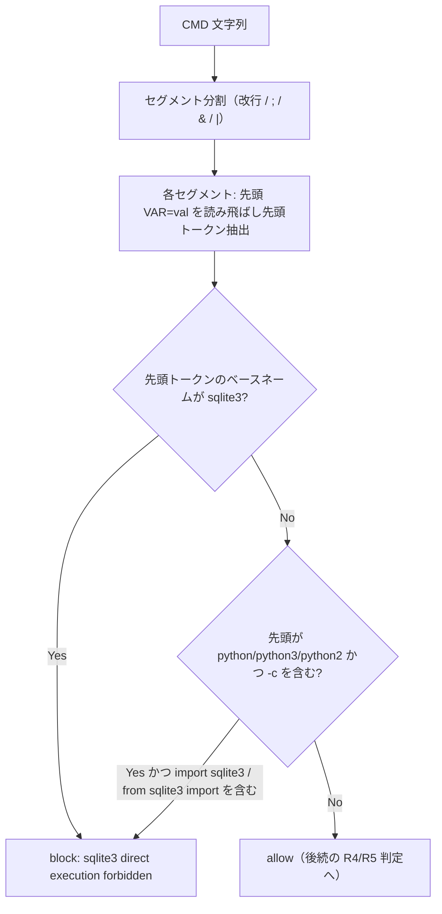

# 設計書: R6 の sqlite3 判定が部分文字列 regex で過剰ブロック・回避耐性不足

**プロジェクト名**: R6 の sqlite3 判定が部分文字列 regex で過剰ブロック・回避耐性不足
**作成日**: 2026年07月14日
**最終更新**: 2026年07月14日

---

## 1. 設計概要

### 1.1 設計方針

`PreToolUse.sh` に新規ヘルパー関数 `is_sqlite3_invocation()` を追加し、既存の 2 箇所（scribe 経路の先行判定・全ロール共通の後続判定）の `[[ "$CMD" =~ sqlite3 ]]` をこの関数呼び出しに置き換える。判定ロジック自体を 1 か所に集約することで、2 箇所の判定基準が将来ドリフトすることを防ぐ。

判定は次の 2 段階で行う。

1. **コマンド名判定**: `CMD` を区切り文字（改行・`;`・`&`・`|`）でセグメントに分割し、各セグメントの先頭トークン（`VAR=val` 形式の環境変数代入を読み飛ばした最初のトークン、パス付き実行はベースネームで比較）が厳密に `sqlite3` であるかを見る。
2. **回避耐性の簡易検知**: セグメントの先頭コマンドが `python` / `python3` / `python2` であり、かつコマンド文字列に `-c` オプションと `import sqlite3` または `from sqlite3 import` パターンが含まれる場合を検知する。

### 1.2 設計原則（本プロジェクトで適用するもの）

- **単一責務**: 「sqlite3 起動判定」というロジックを 1 関数（`is_sqlite3_invocation`）に集約し、呼び出し側（2 箇所）は判定結果の分岐のみを担う。
- **DRY（重複排除）**: scribe 経路・全ロール共通経路の 2 箇所が同一関数を呼ぶことで、判定基準の重複記述・将来のドリフトを防ぐ。
- **既存スタイルへの追従**: `json_get` / `is_in_project_allowlist` 等、既存ヘルパー関数と同じ配置・コメント密度・bash 記法（`[[ ]]` regex、`BASH_REMATCH`）に揃える。

---

## 2. アーキテクチャ設計

### 2.1 責務・境界・参照関係

#### 2.1.1 責務一覧

| コンポーネント | 責務（1 文） |
| --- | --- |
| `is_sqlite3_invocation(cmd)` | `cmd` がコマンド名としての sqlite3 起動（または python -c 経由の import sqlite3）を含むかを真偽値で返す。 |
| R6（scribe 先行判定、285-292 行目付近） | scribe ロールの Bash 実行前に `is_sqlite3_invocation` を呼び、真なら block する。 |
| R6（全ロール共通判定、337-343 行目付近） | 全ロール共通で `is_sqlite3_invocation` を呼び、真なら block する。 |

#### 2.1.2 境界

- **入力**: `CMD`（`parse_input` が確定させた Bash コマンド文字列。stdin JSON の `tool_input.command` または env 後方互換）。
- **出力**: 真偽値（`return 0`＝sqlite3 起動を検知＝block 対象、`return 1`＝非該当）。
- **他責務との境界**: R4（複合シェル禁止）・R5（write-workflow-log.sh 単独実行制約）とは独立した判定であり、判定順序（R6 が R4/R5 より先行）は変更しない。

#### 2.1.3 参照関係

- `parse_input`（CMD 確定）→ `is_sqlite3_invocation`（判定）→ `block` または後続処理。循環参照なし。
- 関数定義位置は `json_get` の直後・`parse_input` 定義の直前に置く（既存ヘルパー群と同じ並び順）。

### 2.2 システムアーキテクチャ

- **採用パターン**: 既存の「1 行 regex マッチ」から「専用判定関数への切り出し + 2 段階判定（コマンド名 + python -c 簡易検知）」への変更。新規外部依存の追加はなし（bash 組み込み機能のみ）。
- **根拠**: シェルコマンド文字列の完全な構文解析（真の shell parser）を導入すると `PreToolUse.sh` の「bash 標準機能のみで完結する」という既存方針から外れ、保守コストが跳ね上がる。セグメント分割 + 先頭トークン比較という簡易手法は、既存の R4（`case "$CMD" in *';'*|*'&&'*...)`）と同水準の簡易性を保ちながら、過剰検知・回避耐性の両方を実用上十分に改善できる（00 §7.1: 完全防御ではなく実用上のバランスを重視する方針と整合）。

#### 2.2.2 アーキテクチャ図

### 2.5 横断設計判断（ADR）

#### ADR-1: 判定ロジックの実装単位（正規表現 1 行 vs. 専用関数）

- **コンテキスト**: 過剰ブロック解消のためには「先頭トークンのみを見る」処理が必要だが、1 行の `[[ ]]` regex だけでは表現しづらい（セグメント分割・環境変数代入の読み飛ばし・ベースネーム比較・python -c 検知の 4 つの手続きが必要）。
- **検討した選択肢**:
  1. `is_sqlite3_invocation()` という専用 bash 関数を定義し、2 箇所の呼び出し元から共通利用する。
  2. 2 箇所それぞれに同等のロジックをインライン展開する。
  3. 外部コマンド（`awk`/`perl`等）を呼び出して判定する。
- **決定**: 選択肢 1 を採用する。
- **根拠**: 選択肢 2 は 2 箇所の判定基準が将来の修正でドリフトするリスクを負う（既存コードの `json_get`・`is_in_project_allowlist` 等も同様に「1 関数に集約 → 複数箇所から呼ぶ」設計が踏襲されており、既存スタイルに整合する）。選択肢 3 は新規外部プロセス起動のオーバーヘッドと環境依存（awk/perl の有無）を増やし、`PreToolUse.sh` の「bash 標準機能のみで完結する」という既存方針から外れる（evidence_source: existing_code、json_get/is_in_project_allowlist の既存実装パターンに基づく）。
- **帰結**: `is_sqlite3_invocation()` を新規関数として追加し、2 箇所の呼び出し元は `if is_sqlite3_invocation "$CMD"; then block ...; fi` の形に置き換える。

#### ADR-2: セグメント分割の実装方式（文字置換 vs. 正規表現分割）

- **コンテキスト**: `CMD` を `;`/`&`/`|`/改行で分割する必要があるが、bash には汎用の「複数文字セパレータでの分割」組み込み構文が無い。
- **検討した選択肢**:
  1. `${raw//;/$'\n'}` 等のパラメータ展開による文字単位の置換を連鎖させ、最終的に改行区切りにしてから `while read` で行ごとに処理する。
  2. `IFS` を `;&|` に設定して `read -ra` で単語配列展開する。
  3. `awk`/`tr` を外部コマンドとして呼び出して分割する。
- **決定**: 選択肢 1 を採用する。
- **根拠**: 選択肢 2 は `IFS` によるフィールド分割が空白も同時に分割対象にしてしまい、コマンド全体のトークン構造を壊すため今回の用途（セパレータ文字のみを区切りたい）に適さない。選択肢 3 は外部プロセス起動を増やす。選択肢 1 は bash 組み込みのパラメータ展開のみで完結し、既存の `norm_path()` 等と同じ「bash 標準機能に閉じる」設計方針に沿う。
- **帰結**: `&&`/`||` は同一文字（`&`/`|`）の連続としてそれぞれ分割され、結果として間に空セグメントが 1 つ挟まるが、空セグメントは trim 後に `continue` でスキップするため判定に影響しない。

#### ADR-3: python -c 経由の import sqlite3 検知の範囲

- **コンテキスト**: 00_要求定義.md の期待効果・成功基準は「文字列言及の誤ブロック解消」を主とし、回避耐性強化は「可能な範囲で」「過度な複雑化を避ける」ことが求められている（00 §7.1・対応方針）。
- **検討した選択肢**:
  1. `python(3)?/python2` の `-c` インライン実行に限定し、`import sqlite3` / `from sqlite3 import` パターンのみを検知する。
  2. 通常の python スクリプトファイル実行（`python3 script.py`）についても、スクリプト内容を読み取って import 文の有無を検査する。
  3. 検知を追加せず、コマンド名判定のみ改善する。
- **決定**: 選択肢 1 を採用する。
- **根拠**: 選択肢 2 はスクリプトファイルの内容を追加で読み取る必要があり、`PreToolUse.sh` が「ツール呼び出し前の軽量な文字列判定」という既存の責務範囲（ファイルシステムへの追加アクセスを伴わない）を逸脱し、実装・保守コストに見合わない（00 §7.1「対応する場合は完全な防御ではなく実用上のバランスを重視した改善とする」に基づく判断）。選択肢 3 は 00 が明示的に要求する「回避耐性向上」の期待効果を満たさない。選択肢 1 は `-c` インライン実行という頻出する具体的な回避経路（00 の背景に明記された例そのもの）を、追加のファイルアクセスなしに簡易検知でき、複雑化を最小限に抑えられる。
- **帰結**: `-c` を伴わない python スクリプト実行（`python3 script.py`）は本判定の対象外とし、01_要件定義.md ストーリー2で「スコープ外」として明記する。

---

## 6. テスト戦略

### 6.1 対象ごとのテスト割り当て

| 対象 | 単体 | 結合/API | E2E | クリティカル観点 | バリデーション観点 | 未達理由/補足 |
| --- | --- | --- | --- | --- | --- | --- |
| `is_sqlite3_invocation`（過剰ブロック解消） | ○ | ○（test-pretooluse-hook.sh フル実行） | × | grep 等の文字列言及を誤ブロックしないこと | 既存 sqlite3 直接実行検知の維持 | E2E は実 Claude Code hooks 実行環境での確認に委ねる（未達理由: ローカルに実 hooks 実行環境が無い） |
| `is_sqlite3_invocation`（回避耐性強化） | ○ | ○（test-pretooluse-hook.sh フル実行） | × | python -c 経由の import sqlite3 検知 | -c を伴わない実行を誤検知しないこと | 同上 |

### 6.2 監査・レビューでの確認（証跡）

`03_実装計画.md` のテスト観点・BDD 節、および `test/test-pretooluse-hook.sh`（UC12 新規追加分・既存 UC1〜UC11 の非劣化）・`test/test-c4-bypass-resistance.sh`（R6 sqlite3 回帰確認）のフル実行結果を証跡とする（04_review.md §3.1）。

---

## 10. 参考資料

### プロジェクトドキュメント

- [`01_要件定義.md`](./01_要件定義.md) - 要件定義

---

## 11. 前のステップ

- **前**: [`01_要件定義.md`](./01_要件定義.md) - 要件定義フェーズ

---

## 12. 次のステップ

- **次**: [`03_実装計画.md`](./03_実装計画.md) - 実装計画フェーズ
