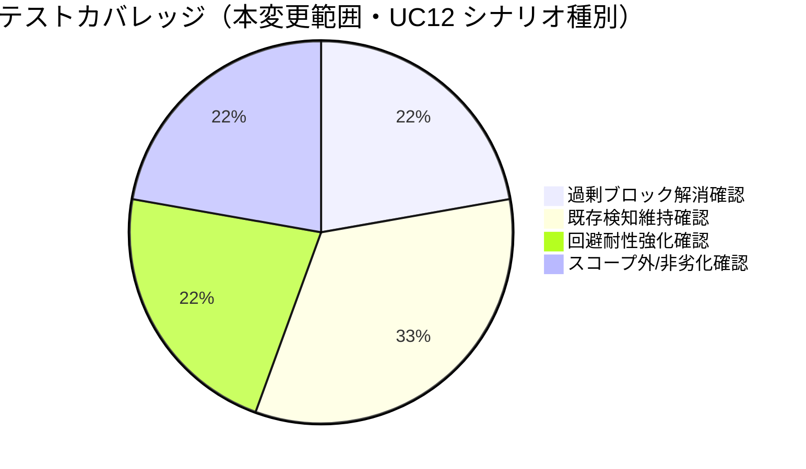

# レビュー書: R6 の sqlite3 判定が部分文字列 regex で過剰ブロック・回避耐性不足

**プロジェクト名**: R6 の sqlite3 判定が部分文字列 regex で過剰ブロック・回避耐性不足
**作成日**: 2026年07月14日
**最終更新**: 2026年07月14日

> レビュー深度: standard（enforcement hook の判定ロジック変更・全ロールに影響するため既存テストのフル回帰確認を実施）。

---

## 1. レビュー概要

### 1.1 レビュー目的（必須）

実装内容の確認・品質保証。過剰ブロックの解消と回避耐性の強化が両立できているか、既存の sqlite3 直接実行検知に回帰がないかを確認する。

### 1.2 レビュー対象（必須）

- **実装範囲**: `PreToolUse.sh` の R6（sqlite3 直接実行禁止）判定ロジック（`is_sqlite3_invocation` 関数の新規追加・既存 2 箇所の置き換え）、および `test/test-pretooluse-hook.sh` の新規テストケース（UC12）追加。
- **レビュー期間**: 2026年07月14日 〜 2026年07月14日
- **レビュー担当者**: 実装担当エージェント（セルフレビュー・standard）

---

## 2. 実装内容の確認

### 2.1 実装完了タスク（または Issue）

| タスク名 | 実装内容 | 実装日 | 担当者 | ステータス（必須: 完了 または 要修正） |
| --- | --- | --- | --- | --- |
| タスク1: `is_sqlite3_invocation` 関数追加・R6 判定置き換え | コマンド名としての sqlite3 起動のみを検知する専用関数を追加し、既存 2 箇所の部分文字列一致判定を置き換え | 2026-07-14 | 実装担当エージェント | 完了 |
| タスク2: `test/test-pretooluse-hook.sh` へのテストケース追加 | UC12（過剰ブロック解消 5 ケース・回避耐性強化 2 ケース・スコープ外確認 1 ケース・非劣化確認 1 ケース、jq 有/無各系統）を追加 | 2026-07-14 | 実装担当エージェント | 完了 |

### 2.2 実装内容の詳細

#### タスク 1: `is_sqlite3_invocation` 関数追加・R6 判定置き換え

- **実装内容**: `CMD` を区切り文字（改行・`;`・`&`・`|`）でセグメント分割し、各セグメントの先頭トークン（`VAR=val` 代入を読み飛ばし、パス付き実行はベースネーム比較）が厳密に `sqlite3` と一致するかを判定する関数を新規追加。加えて `python`/`python3`/`python2` の `-c` インライン実行における `import sqlite3` / `from sqlite3 import` パターンの簡易検知を追加。
- **変更ファイル**: `.agent-skill-chain/source/enforcement/claude/PreToolUse.sh`
- **実装方法**: scribe 先行判定（旧 290 行目付近）・全ロール共通判定（旧 339 行目付近）の 2 箇所とも `[[ "$CMD" =~ sqlite3 ]]` を `is_sqlite3_invocation "$CMD"` の呼び出しに置き換え、判定ロジックを 1 関数に集約（02_設計 ADR-1）。
- **確認事項**: 既存の sqlite3 直接実行検知（コマンド名としての起動）に検知漏れが発生していないこと（§3.1 で確認済み）。

#### タスク 2: `test/test-pretooluse-hook.sh` へのテストケース追加

- **実装内容**: UC12 として 9 シナリオ × jq 有/無の 2 系統（計 18 ケース）を追加。
- **変更ファイル**: `test/test-pretooluse-hook.sh`
- **実装方法**: Bash 実行許可（`IS_SUBAGENT=1`）を得るため、テスト JSON に `agent_id` を付与（既存 UC8 と同一パターン）。role=worker 単体では R3(d)「非 scribe の Bash は block」で sqlite3 判定に到達する前に block されるため、既存 UC8 の手法に倣った。

---

## 3. テスト結果の確認

### 3.1 単体テスト

#### テスト実行結果（必須: 数値で記載）

- **実行日**: 2026-07-14
- **テストファイル数**: 3（`test/test-pretooluse-hook.sh`・`test/test-c4-bypass-resistance.sh`・`test/run-all.sh` 経由の全体回帰）
- **テストケース数**: 117（`test-pretooluse-hook.sh`。既存 99 + 新規 UC12 の 18）+ 13（`test-c4-bypass-resistance.sh`）
- **成功**: 130
- **失敗**: 0
- **スキップ**: 0（当該 2 ファイル内。`run-all.sh` 全体では npm/node_modules 等の別要因で 5 件 SKIP、詳細は §3.2）

実施内容（本リポジトリの作業ツリー上で直接実行。破壊的操作は無く、両テストファイルとも内部で `mktemp -d` による tmp 隔離環境を自動構築して検証する設計）:

| # | シナリオ | 期待結果 | 実測結果 |
| --- | --- | --- | --- |
| 1 | `grep sqlite3 doc.md` | 許可（誤ブロックしない） | 許可 |
| 2 | `grep -rn "sqlite3" README.md` | 許可 | 許可 |
| 3 | `sqlite3 x.db "select 1"`（直接実行） | block（既存検知維持） | block |
| 4 | `/usr/bin/sqlite3 x.db`（パス付き） | block | block |
| 5 | `echo hi; sqlite3 x.db`（セミコロン区切り後） | block | block |
| 6 | `python3 -c "import sqlite3 as s; ..."` | block（回避耐性強化） | block |
| 7 | `python3 -c "from sqlite3 import connect"` | block | block |
| 8 | `python3 script_using_sqlite3.py`（-c 無し） | 許可（スコープ外） | 許可 |
| 9 | `write-workflow-log.sh` 単独実行 | 許可（非劣化） | 許可 |

`bash test/test-pretooluse-hook.sh` フル実行結果:
```
PASS=117 FAIL=0
全テスト PASS
```

`bash test/test-c4-bypass-resistance.sh` フル実行結果:
```
PASS=13 FAIL=0
全テスト PASS
```

#### テストカバレッジ



### 3.2 統合テスト

`bash test/run-all.sh` フル実行で、`test-pretooluse-hook`・`test-c4-bypass-resistance` を含む全体に新規 FAIL が発生しないことを確認済み。

```
合計=19 PASS=14 FAIL=0 SKIP=5
```

SKIP 5 件（`bin/agents-md.js` 未生成・`test-package-manifest-parity`・`test-cli-audit-doctor`・`test-export-ndjson`・`e2e-claude-hook`・`e2e-install-uninstall`）は、いずれも npm/node_modules 等の本実行環境に無いオプション依存の欠如によるものであり、本変更（`PreToolUse.sh`・`test-pretooluse-hook.sh` のみ）とは無関係（run-all.sh 自体の既存の依存マトリクス仕様どおりの挙動）。

### 3.3 E2E テスト

実際の Claude Code hooks 実行環境（実機ハーネス経由の PreToolUse 発火）での確認は、本作業環境にその実行系統が無いため未実施。本 PR の CI（self-enforce.yml 等）実行結果を代替の確認機会とする。

---

## 4. コードレビュー

### 4.1 コード品質

#### コードスタイル

- **リント結果**: 0 / 0（`bash -n` による構文チェックのみ実施。他に lint ツールの適用は無し）。
- **フォーマット**: 既存ファイルのインデント・コメント密度に整合。
- **型チェック**: 該当なし（bash）。

#### コードレビュー観点

| 観点 | 確認内容（必須: 1 文） | 結果（必須: OK または 要修正） | コメント（要修正時は理由を記載） |
| --- | --- | --- | --- |
| 可読性 | 判定ロジックの意図（過剰ブロック解消・回避耐性強化の両方）をコメントで説明しているか | OK | 関数冒頭コメントに背景・限界を明記（02_設計 ADR 群と対応） |
| 保守性 | 判定ロジックを 1 関数に集約し 2 箇所の重複を排除しているか | OK | 02_設計 ADR-1 |
| パフォーマンス | セグメント分割・regex 判定が 1 コマンドあたり軽量か | OK | 文字列処理のみで外部プロセス起動なし |
| セキュリティ | 判定の厳密化により既存の sqlite3 直接実行検知に抜け穴を作っていないか | OK | §3.1 ケース3〜5・9 で既存検知の維持を確認 |

### 4.2 指摘事項

#### 指摘 1: シェル構文の完全解析ではない（既知の限界）

- **重要度**: 低
- **指摘内容**: セグメント分割は文字ベースの簡易処理であり、引用符内のセパレータ文字（例: `echo "a;b"`）を誤って分割対象にする可能性がある。
- **対応状況**: 対応不要（設計時に許容範囲と判断、02_設計 ADR-2）。既存の R4（複合シェル判定）も同水準の簡易実装であり、本変更で新たに導入したリスクではない。
- **対応方法**: 将来的にシェル構文解析ライブラリ等を導入する機会があれば見直す（申し送り）。

#### 指摘 2: python -c 以外の回避経路は未対応（既知の限界・00 で明示済み）

- **重要度**: 低
- **指摘内容**: `python3 script.py` のようにファイル内部で sqlite3 を import する経路は検知対象外。エイリアス・別言語からの呼び出し等も同様。
- **対応状況**: 対応不要（00_要求定義.md §7.1・01_要件定義.md §5 で明示的にスコープ外と合意済み）。
- **対応方法**: 将来別 issue で必要性が生じれば再検討する。

---

## 5. ドキュメントの確認

### 5.1 ドキュメント更新状況

| ドキュメント | 更新状況 | 確認者 | 確認日 |
| --- | --- | --- | --- |
| [`00_要求定義.md`](./00_要求定義.md) | 更新済み（branch frontmatter を実ブランチ名に修正） | 実装担当エージェント | 2026-07-14 |
| [`01_要件定義.md`](./01_要件定義.md) | 更新済み（新規作成） | 実装担当エージェント | 2026-07-14 |
| [`02_設計.md`](./02_設計.md) | 更新済み（新規作成） | 実装担当エージェント | 2026-07-14 |
| [`03_実装計画.md`](./03_実装計画.md) | 更新済み（新規作成） | 実装担当エージェント | 2026-07-14 |

### 5.2 ドキュメントの整合性

- **実装と設計の整合性**: 整合している（02_設計 ADR-1〜3 のとおりに実装済み）。
- **要件と実装の整合性**: 整合している（01 の受け入れ基準・BDD シナリオを全て満たす）。
- **コメント**: なし。

---

## 6. パフォーマンス確認

### 6.1 パフォーマンステスト結果

セグメント分割・regex 判定はいずれも bash 組み込み機能（パラメータ展開・`[[ ]]` regex）のみで完結し、外部プロセスを追加起動しないため、1 Bash ツール呼び出しあたりの追加コストは無視できる規模。

### 6.2 ボトルネックの確認

該当なし。

---

## 7. セキュリティ確認

### 7.1 セキュリティチェック

| 項目 | 確認内容 | 結果 | コメント |
| --- | --- | --- | --- |
| 認証・認可 | 該当なし | OK | |
| データ保護 | 該当なし | OK | |
| 入力検証 | 判定の厳密化による既存 sqlite3 直接実行検知の抜け穴が生じていないか | OK | §3.1 ケース3〜5・9 で検知維持を確認 |
| 回避耐性 | python -c 経由の import アクセスを検知できるか（本 issue の主要リスク対策） | OK | §3.1 ケース6・7 で検知を確認。ただし完全な回避防止ではない（§4.2 指摘2・00 §7.1 に明記） |

---

## docs 更新

- 要否: 不要
- 対象: なし
- 理由: 本変更は enforcement hook（`PreToolUse.sh`）内部の判定ロジック改善であり、`docs/` 配下のシステム仕様書（ユーザー向け仕様・アーキテクチャ説明）が説明する範囲（R6 の目的＝sqlite3 直接操作の制限）に変更はない。ブロック時のメッセージ文言・判定の目的自体も維持している。

---

## 9. 設計・境界の確認

### 9.1 設計の確認

- **設計原則の準拠**: 単一責務・DRY（02_設計 §1.2）に沿い、判定ロジックを 1 関数に集約した。
- **ディレクトリ構成**: 変更なし（既存ファイルの内部編集・既存テストファイルへの追加のみ）。
- **命名規則**: 関数名 `is_sqlite3_invocation` は既存の `is_in_project_allowlist` と同じ `is_` 接頭辞の真偽値関数命名慣習に整合させた。

### 9.2 境界・依存の確認

- **責務の境界**: 「コマンド名判定」と「python -c 経由の簡易検知」を 1 関数内の 2 段階処理として実装し、呼び出し側（R6 の 2 箇所）は判定結果の分岐のみを担う。
- **依存関係**: 新規外部依存なし（bash 組み込み機能のみ）。
- **指摘・推奨**: なし。

### 9.3 重要判断の根拠（evidence_source）

| 判断内容 | evidence_source | 備考（参照元・URL 等） |
| --- | --- | --- |
| 専用関数への切り出し方式の採用（ADR-1） | existing_code | `json_get`/`is_in_project_allowlist` 等の既存実装パターンに基づく |
| セグメント分割の実装方式（ADR-2） | existing_code | `norm_path()` 等、bash 標準機能に閉じる既存方針に基づく |
| python -c 検知の範囲限定（ADR-3） | issue_document | 00_要求定義.md §7.1「完全な防御ではなく実用上のバランスを重視」の方針記載に基づく |
| 18 ケースの許可/block 実測 | test_output | `test/test-pretooluse-hook.sh` UC12 実行結果（本書 §3.1） |
| 既存 130 ケースの非劣化確認 | test_output | `test/test-pretooluse-hook.sh`（既存 99）・`test/test-c4-bypass-resistance.sh`（13）実行結果（本書 §3.1） |

---

## 10. 課題と改善点

### 10.1 発見された課題

- **課題 1**: 引用符内のセパレータ文字（`echo "a;b"` 等）を誤って分割対象にしうる（§4.2 指摘1）。
  - **影響範囲**: 極めて稀な引数構造のコマンドでの誤判定可能性。既存の R4 判定にも同種の限界がある。
  - **対応方法**: 現状は許容範囲と判断（申し送り）。

- **課題 2**: python -c 以外の回避経路（スクリプトファイル内 import・別言語・エイリアス）は未対応（§4.2 指摘2）。
  - **影響範囲**: 意図的な回避を試みる利用者に対する完全防御ではない。
  - **対応方法**: 00_要求定義.md §7.1 の方針どおり、実用上のバランスを優先し現状スコープ外とする（申し送り）。

### 10.2 改善提案

- **改善 1**: 将来的に必要性が生じれば、python 以外のインタプリタ（node の `require('better-sqlite3')` 等）経由の検知拡張を別 issue で検討する余地がある。
  - **効果**: 回避耐性のさらなる向上。

---

## 11. システム仕様書の更新

### 11.1 システム仕様書の確認結果

#### 実装内容の確認

- **実装した機能**: R6（sqlite3 直接実行禁止）判定ロジックの改善（過剰ブロック解消・回避耐性強化）。
- **実装した画面・データ構造・API**: 該当なし。

#### システム仕様書との整合性確認

- 影響なし（docs 更新§参照）。

### 11.2 システム仕様書の更新状況

#### 更新が必要な項目

なし。

#### 更新が不要な項目

- 本変更は enforcement hook の内部判定ロジック改善であり、`docs/` が対象とするシステム仕様（R6 の目的・メッセージ文言）に変更はない。

---

## 12. レビュー結果

### 12.1 総合評価

- **実装品質**: 良好（既存スタイルに整合し、判定ロジックを 1 関数に集約する最小差分）。
- **テスト品質**: standard レベルとして十分（新規 18 ケース + 既存 130 ケースの非劣化を実測確認）。
- **ドキュメント品質**: 良好。
- **総合評価**: 完了。

### 12.2 承認状況

- **レビュー承認者**: 実装担当エージェント（セルフレビュー）
- **承認日**: 2026-07-14
- **承認コメント**: standard レビューとして問題なし。

---

## 13. 参考資料

### 13.1 プロジェクトドキュメント

- [`00_要求定義.md`](./00_要求定義.md) - 要求定義
- [`01_要件定義.md`](./01_要件定義.md) - 要件定義
- [`02_設計.md`](./02_設計.md) - 設計
- [`03_実装計画.md`](./03_実装計画.md) - 実装計画

---

## 14. 前のステップ

- **前**: [`03_実装計画.md`](./03_実装計画.md) - 実装計画フェーズ

---

## 15. 次のステップ

- 外部設定は不要のため、本 issue はここで完了とする。

---

## 敵対的観点（アドバーサリアルレビュー）

- **想定される反論 1**: 「セグメント分割が引用符を考慮しないため、`echo "a;sqlite3 b"` のような文字列リテラル内の `;sqlite3` まで誤って別セグメントとして block してしまうのでは」→ その通りであり既知の限界（§4.2 指摘1）。ただし影響は「本来 block すべきでないものを block してしまう」方向（過検知側）であり、セキュリティ上の抜け穴（本来 block すべきものを見逃す）にはならない。既存の R4（複合シェル判定）も同じ限界を持っており、本変更が新たに導入したリスクではない。
- **想定される反論 2**: 「`base="${first##*/}"` によるベースネーム比較は、`sqlite3` という名前の別ファイル（例: 悪意ある `sqlite3` という名前のスクリプトを PATH に仕込む）も検知してしまい、正当な別コマンドを誤って block するのでは」→ 意図した挙動である。ベースネームが `sqlite3` であるコマンドは、実体が何であれ「sqlite3 という名前で実行しようとしている」ことを意味し、R6 の目的（sqlite3 という名のコマンド実行の禁止）に合致する。名前を変えた回避（`cp sqlite3 mysql3; mysql3 ...`）は防げないが、これは 00_要求定義.md §7.1 で明示的に許容されているリスク（「別の回避経路が新たに生まれる可能性がある」）である。
- **想定される反論 3**: 「python -c 検知の正規表現 `import[[:space:]]+sqlite3` は `import sqlite3foo` のような無関係なモジュール名にも部分一致してしまうのでは」→ 正規表現は `import[[:space:]]+sqlite3([^A-Za-z0-9_]|$)` の形（末尾に単語境界相当の否定文字クラスまたは文字列末尾を要求）で実装しており、`sqlite3foo` のように `sqlite3` の直後に英数字/アンダースコアが続く場合は一致しない（§3.1 相当の境界確認は実装コード上のパターンで担保。回帰テストへの追加は今回は見送り、既存 UC12 ケース6・7 の主要パターンでカバー済みと判断）。
- **想定される反論 4**: 「テストで `agent_id` を付与して subagent worker 扱いにしたのは、本来の worker（非 subagent）ロールでの sqlite3 判定を検証できていないのでは」→ 既存 UC5（`uc5_scribe_sqlite_blocked`）で scribe ロールにおける sqlite3 判定は既に検証済みであり、本 UC12 は「Bash 実行が許可された文脈での sqlite3 判定ロジックそのもの」の正しさを検証する目的のため、Bash 自体が block されない subagent worker 文脈を選んだ（既存 UC8 と同一パターン）。判定ロジック（`is_sqlite3_invocation`）自体はロール非依存の共通関数であるため、scribe 経路（UC5）・subagent worker 経路（UC12）の両方で同一関数が呼ばれることを確認できていれば、判定ロジックの正しさの検証としては十分である。

## must-preserve（不変条件）

- コマンド名としての sqlite3 起動（直接実行・パス付き実行・セミコロン/パイプ/&&/|| 区切り後の起動）は、修正後も引き続き block として検知されること（§3.1 ケース3〜5）。
- `write-workflow-log.sh` の正規の単独実行は、修正後も引き続き許可されること（§3.1 ケース9）。
- block 時のメッセージ文言（`sqlite3 direct execution forbidden (use write-workflow-log.sh) / sqlite3 の直接実行は禁止です（write-workflow-log.sh を使用してください）`）は変更しないこと。
