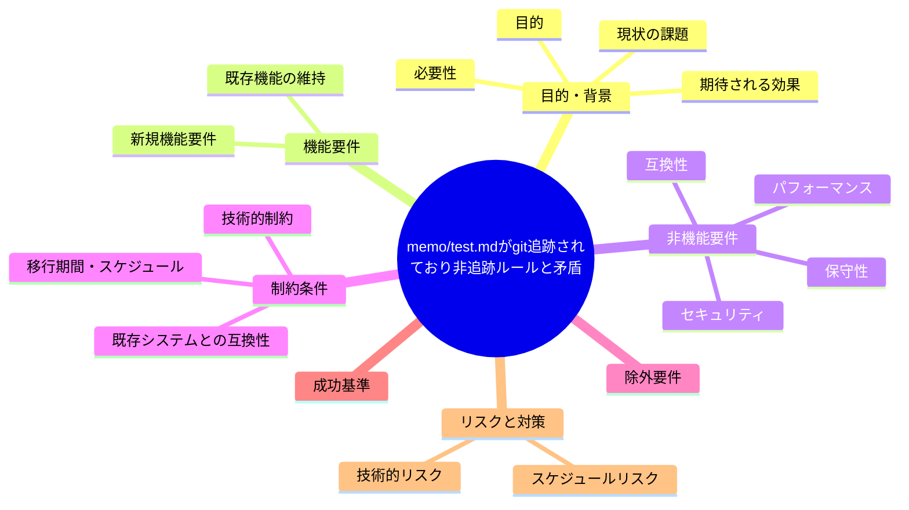

# 要求定義書: memo/test.md が git 追跡されており非追跡ルールと矛盾

**プロジェクト名**: memo/test.md が git 追跡されており非追跡ルールと矛盾
**作成日**: 2026 年 07 月 14 日
**最終更新**: 2026 年 07 月 14 日

> **重要**:
>
> - 要求定義書は、プロジェクトの全体像を把握するためのものです。詳細な技術仕様や実装方法は要件定義書以降で記載します。必要最低限の情報に収めることを心掛けてください。
> - **このドキュメントは常に更新**: 要求の変更や追加があった場合は、即座にこのドキュメントを更新してください。ドキュメントは「生きているドキュメント」として扱い、実装内容と常に同期させます。
> - **必須項目**: 以下の「必須」と明記した項目は空欄・抽象語のみ（例: 「{説明}」のまま）で提出しないこと。判定可能な形（目的は1文・成功基準は○/×で判定できる記載等）で記入すること。
>
> **用語**: [.agent-skill-chain/source/CONCEPTS.md §用語規約](../../../../../../.agent-skill-chain/source/CONCEPTS.md#用語規約) を参照。

---

## 要求定義の全体像



**注意**:

- 上記の「プロジェクト名」は例です。実際のプロジェクト名に置き換えてください。
- マインドマップは全体像を把握するためのものです。主要なセクション名程度に留め、詳細は記載しないでください。

---

## 1. 目的・背景

### 1.1 目的（必須）

ルート直下 memo/test.md の追跡を解除し非追跡ルールと整合させる。

### 1.2 背景

2026-07-14 fable による本システムの自己調査で検出。

- **現状の課題**:
  - `.gitignore` は `**/memo/*` で memo を無視し、`自己拡張ワークフロー.md` も「git 追跡する成果物は issue ドキュメント00〜04のみ・memo は非追跡」と宣言している。
  - にもかかわらず、ルートの `memo/test.md` は追跡済みである。

- **必要性**:
  - .gitignore の宣言と実際の git 追跡状態を一致させる必要がある。

### 1.3 期待される効果（必須: 1 件以上）

- **効果 1**: `git ls-files` に `memo/test.md` が出現しなくなる。

**現状と期待される状態の比較**（必要に応じて）:

```mermaid
flowchart LR
    subgraph 現状["現状"]
        A1[memo/test.mdが追跡済み]
        A2[非追跡ルール(**/memo/*)と矛盾]
    end

    subgraph 期待される状態["期待される状態"]
        B1[git rm --cached等で追跡解除]
        B2[非追跡ルールと実態が一致]
    end

    A1 -.->|解決| B1
    A2 -.->|解決| B2
```

---

## 2. 機能要件

### 2.1 既存機能の維持（該当する場合）

memo が非追跡（transient）であるという既存方針は維持する。

### 2.2 新規機能要件

{対応方針は 01 要件定義以降で検討。本書では課題の提起に留める}

---

## 3. 非機能要件

### 3.1 パフォーマンス

- {該当なし}

### 3.2 セキュリティ

- {該当なし}

### 3.3 互換性

- 既存の memo 運用方針を変えないこと。

### 3.4 保守性

- {該当なし}

---

## 4. 制約条件

### 4.1 技術的制約

- {01 要件定義以降で検討}

### 4.2 既存システムとの互換性

- 追跡解除がローカル環境の既存 memo/test.md 実体を破壊しないこと（`git rm --cached` はワーキングツリーのファイルを残す運用を想定）。

### 4.3 移行期間・スケジュール

- {未定}

---

## 5. 除外要件

対応方針の具体設計・実装（本 issue は課題の起票のみ）。

---

## 6. 成功基準（必須: 1 件以上）

- `git ls-files` の結果に `memo/test.md` が含まれなくなること。

---

## 7. リスクと対策

### 7.1 技術的リスク

- **リスク**: `memo/test.md` に何らかの参照依存がある場合、追跡解除で参照が壊れる可能性がある。
  - **対策**: 追跡解除前に参照箇所の有無を調査する。

### 7.2 スケジュールリスク

- **リスク**: {特になし}
  - **対策**: {特になし}

---

## 8. 参考資料

### プロジェクトドキュメント

- 既存プロジェクトの場合は、[`00_システム理解.md`](./00_システム理解.md) - システム理解を参照

### その他の参考資料

- `git ls-files` に `memo/test.md`
- `.gitignore:62-64`
- `.agent-skill-chain/project/自己拡張ワークフロー.md:186-187, 266`

---

## 9. 次のステップ

この要求定義書の承認後、以下のドキュメントを作成します：

- **次**: [`01_要件定義.md`](./01_要件定義.md) - 要件定義フェーズ
