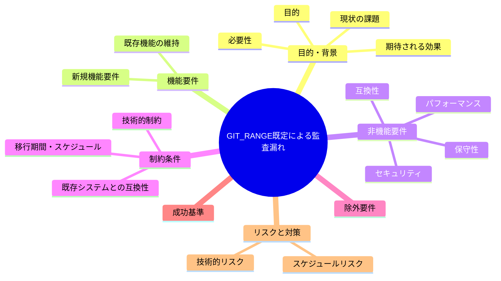

# 要求定義書: GIT_RANGE 既定 `HEAD~1..HEAD` により多コミット push の監査漏れ

**プロジェクト名**: GIT_RANGE 既定 `HEAD~1..HEAD` により多コミット push の監査漏れ
**作成日**: 2026年07月14日
**最終更新**: 2026年07月14日

---

## 要求定義の全体像

---

## 1. 目的・背景

### 1.1 目的（必須）

多コミットpush時の差分監査漏れを解消するか判断する

### 1.2 背景

出典: 2026-07-14 fableによる本システムの自己調査で検出。

- **現状の課題**:
  - `audit.sh` の差分監査は既定で `GIT_RANGE=HEAD~1..HEAD`（直近1コミットのみ）を見る設計になっている。
  - テンプレート `audit.yml` も `fetch-depth: 2` であり、push イベント時は最後のコミットしか監査できない。
  - 複数コミットをまとめて push すると、途中コミットでの成果物変更が差分監査をすり抜ける（最終コミットのみが検査対象になるため）。

- **必要性**:
  - 多コミット push は通常のローカル開発フローで頻繁に起こりうるため、監査漏れの発生頻度・実害の程度によっては対応の要否検討が必要。

### 1.3 期待される効果（必須: 1 件以上）

- **効果 1**: push イベントで複数コミットが含まれる場合でも、push 前後の全差分（push 前の HEAD から push 後の HEAD まで）が監査対象になる、または現状の1コミット限定仕様が意図的である旨が判断・記録される（○/×で判定可能）。

---

## 2. 機能要件

### 2.1 既存機能の維持（該当する場合）

- 直近1コミット単位での監査というデフォルト動作自体（PR ベースのフローでの妥当性）は維持を検討する。

### 2.2 新規機能要件

- （対応する場合）push イベントの `before`/`after` SHA を用いた `GIT_RANGE` の動的設定、および `fetch-depth` の見直し。

---

## 3. 非機能要件

### 3.1 パフォーマンス

- fetch-depth を大きくする場合、CI のチェックアウト時間への影響を考慮する。

### 3.2 セキュリティ

- 特になし。

### 3.3 互換性

- 既存の GIT_RANGE 環境変数を利用する他チェックとの整合が必要。

### 3.4 保守性

- テンプレート `audit.yml` と本リポ `self-enforce.yml` の両方を同時に見直す必要がある。

---

## 4. 制約条件

### 4.1 技術的制約

- push イベントの `before` SHA が全ゼロ（新規ブランチ作成時等）になるケースへの対応が必要。

### 4.2 既存システムとの互換性

- 既存の PR ベースの監査フロー（こちらは range 指定が別途行われている可能性がある）との整合を確認する必要がある。

### 4.3 移行期間・スケジュール

- 未定（対応要否は本 issue 起票後に判断）。

---

## 5. 除外要件

- PR イベントでの監査範囲の見直しは対象外（本課題は push イベント時の範囲に限定）。

---

## 6. 成功基準（必須: 1 件以上）

- 複数コミットをまとめて push した場合でも、全コミットの差分が監査対象に含まれる、または現状仕様の許容が判断・記録される。

---

## 7. リスクと対策

### 7.1 技術的リスク

- **リスク**: fetch-depth を大きくしすぎると CI 実行時間が増加する可能性がある。
  - **対策**: 対応する場合は `before`/`after` SHA を用いた動的な range 設定を優先し、無制限の depth 拡大は避ける。

### 7.2 スケジュールリスク

- **リスク**: 対応要否がユーザー判断待ちのため着手時期未定。
  - **対策**: 本 issue を起票済みとして保持し、優先度判断を待つ。

---

## 8. 参考資料

### プロジェクトドキュメント

- なし

### その他の参考資料

- `.agent-skill-chain/source/enforcement/ci/audit.sh:106`
- `.agent-skill-chain/runtime/templates/github/workflows/audit.yml`

---

## 9. 次のステップ

この要求定義書の承認後、対応要否をユーザーが判断し、対応する場合は以下のドキュメントを作成します：

- **次**: `01_要件定義.md` - 要件定義フェーズ
