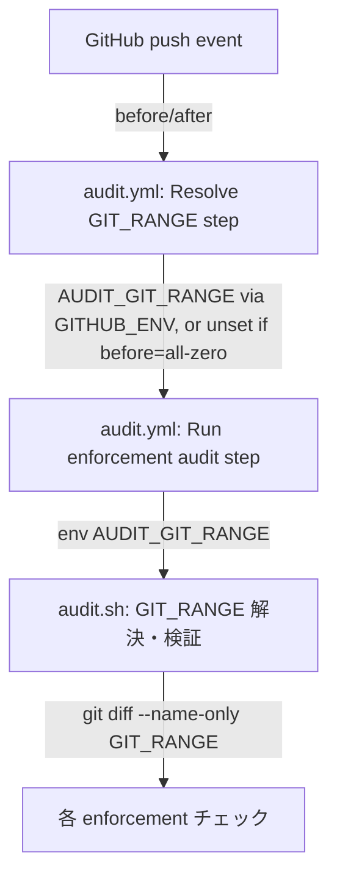

# 設計書: GIT_RANGE 既定 `HEAD~1..HEAD` により多コミット push の監査漏れ

**プロジェクト名**: GIT_RANGE 既定 `HEAD~1..HEAD` により多コミット push の監査漏れ
**作成日**: 2026年07月14日
**最終更新**: 2026年07月14日

---

## 1. 設計概要

### 1.1 設計方針

既存の `GIT_RANGE` 受け渡し経路（環境変数 `AUDIT_GIT_RANGE`）を変更せず、**呼び出し元（消費者テンプレート audit.yml）が push イベントの `before`/`after` から動的に値を組み立てて渡す**方式にする。`audit.sh` 本体には、全ゼロ SHA を含む不正な range を無害化する**防御的フォールバック**のみを追加する（単一責務・小さな変更）。

### 1.2 設計原則（本プロジェクトで適用するもの）

- **単一責務**: `audit.yml`（GitHub イベントから range を解決する責務）と `audit.sh`（渡された range を検証・実行する責務）を分離したまま維持する。
- **明確な境界**: GIT_RANGE の「動的な組み立て」は CI テンプレート側、GIT_RANGE の「検証・無害化」は audit.sh 側という既存の境界を踏襲する。

---

## 2. アーキテクチャ設計

### 2.1 責務・境界・参照関係

#### 2.1.1 責務一覧

| コンポーネント | 責務（1 文） |
| --- | --- |
| `audit.yml`（Resolve GIT_RANGE ステップ） | push イベントの before/after から `AUDIT_GIT_RANGE` を組み立てて `GITHUB_ENV` に設定する（全ゼロ SHA 時は設定しない）。 |
| `audit.sh`（GIT_RANGE 解決部） | 渡された `AUDIT_GIT_RANGE`（または既定値）を検証し、不正・解決不能な値は既定 `HEAD~1..HEAD` に無害化する。 |

#### 2.1.2 境界

- **入力**: `audit.yml` は `github.event.before`/`github.event.after`（push イベントのみ）。`audit.sh` は環境変数 `AUDIT_GIT_RANGE`。
- **出力**: `audit.yml` は `GITHUB_ENV` への `AUDIT_GIT_RANGE` 設定。`audit.sh` は `git diff --name-only $GIT_RANGE` の実行結果。
- **他責務との境界**: PR イベントの GIT_RANGE 解決（既定 `HEAD~1..HEAD` のまま）は本設計の変更対象外。

#### 2.1.3 参照関係

- `audit.yml`（Resolve GIT_RANGE ステップ）→ `GITHUB_ENV` → `audit.yml`（Run enforcement audit ステップ）→ `audit.sh`。
- 循環参照なし。

### 2.2 システムアーキテクチャ

- **採用パターン**: 既存の「CI テンプレートが環境変数経由でスクリプトへパラメータを渡す」パターンを踏襲（新規パターン導入なし）。
- **根拠**: 既に `AUDIT_GIT_RANGE` という受け渡し経路が存在するため、最小差分で要求を満たせる。

#### 2.2.2 アーキテクチャ図

### 2.5 横断設計判断（ADR）

#### ADR-1: fetch-depth を 0（全履歴）にするか、限定的な深さに留めるか

- **コンテキスト**: before..after の差分を確実に取得するには、checkout 時に before コミットが履歴に含まれている必要がある。push されるコミット数は事前に不定。
- **検討した選択肢**:
  1. `fetch-depth: 0`（全履歴取得）。
  2. `fetch-depth` を大きな固定値（例: 100）にする。
  3. `git fetch --deepen` を before が見つかるまで繰り返す。
- **決定**: 選択肢 1（`fetch-depth: 0`）を採用する。
- **根拠**: 選択肢 2 は push コミット数が固定値を超えると再び取得漏れが起きる（同種の不具合の形を変えた再発）。選択肢 3 は実装が複雑になり、小さな変更を志向する設計方針（§1.1）に反する。00 §7.1 のリスク対策は「before/after を用いた動的な range 設定を優先」であり、無制限の depth 拡大自体を全面禁止する趣旨ではないため、正確性を優先し `fetch-depth: 0` を採用する（evidence_source: human_decision、00 要求定義の制約条件に基づく判断）。
- **帰結**: CI のチェックアウト時間が増加しうるが、本リポジトリの規模では許容範囲と判断する（01 §3.1）。将来リポジトリが大規模化した場合は再検討する。

#### ADR-2: audit.sh 本体に before/after ロジックを実装するか、テンプレート側に留めるか

- **コンテキスト**: before/after から GIT_RANGE を組み立てるロジックをどこに置くか。
- **検討した選択肢**:
  1. `audit.sh` 内で `GITHUB_EVENT_BEFORE`/`GITHUB_EVENT_AFTER` 等の新環境変数を受け取り、range 組み立てもスクリプト内で行う。
  2. テンプレート `audit.yml` 側で組み立て、`audit.sh` は既存の `AUDIT_GIT_RANGE` 受け渡し経路のみを使う。
- **決定**: 選択肢 2 を採用する。
- **根拠**: `audit.sh` は消費者側で `.github/scripts/audit.sh` 等にコピーされ、GitHub Actions 以外の CI（GitLab CI 等）からも呼ばれうる汎用スクリプトである（コメント冒頭の設計意図）。GitHub 固有の `before`/`after` 概念を `audit.sh` に持ち込むと、他 CI 環境での再利用性を損なう。既存の `AUDIT_GIT_RANGE` という抽象化された受け渡し経路を保つ方が単一責務・移植性の観点で優れる。
- **帰結**: `audit.sh` の変更は「全ゼロ SHA 等の不正な range を無害化する」という既存の防御ロジックの拡張のみに留まる。

---

## 6. テスト戦略

### 6.1 対象ごとのテスト割り当て

| 対象 | 単体 | 結合/API | E2E | クリティカル観点 | バリデーション観点 | 未達理由/補足 |
| --- | --- | --- | --- | --- | --- | --- |
| audit.sh の GIT_RANGE 全ゼロ SHA フォールバック | ○ | × | × | 全ゼロ SHA でクラッシュしない・既定にフォールバックする | 不正 range 検証（既存）と非干渉 | 結合/E2E は tmp git repo でのシェルスクリプト実行で代替検証済み（03 参照） |
| audit.yml の Resolve GIT_RANGE ステップ | × | ○（YAML 構文検証） | × | before/after からの range 組み立て・全ゼロ時の未設定 | - | GitHub Actions 実行環境が無いため実 CI 実行での確認は本 PR のマージ後の実 push で代替 |

### 6.2 監査・レビューでの確認（証跡）

`03_実装計画.md` のテスト観点・単体テスト節、および実施した tmp 隔離検証（git repo でのシナリオ実行）を証跡とする。

---

## 10. 参考資料

### プロジェクトドキュメント

- [`01_要件定義.md`](./01_要件定義.md) - 要件定義

---

## 11. 前のステップ

- **前**: [`01_要件定義.md`](./01_要件定義.md) - 要件定義フェーズ

---

## 12. 次のステップ

- **次**: [`03_実装計画.md`](./03_実装計画.md) - 実装計画フェーズ
