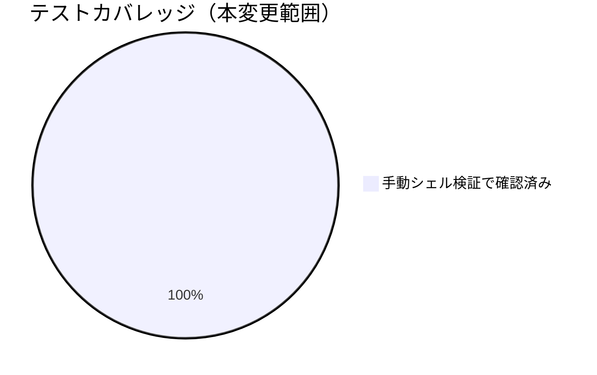

# レビュー書: GIT_RANGE 既定 `HEAD~1..HEAD` により多コミット push の監査漏れ

**プロジェクト名**: GIT_RANGE 既定 `HEAD~1..HEAD` により多コミット push の監査漏れ
**作成日**: 2026年07月14日
**最終更新**: 2026年07月14日

> レビュー深度: quick（既存スクリプトへの局所的な防御追加・テンプレートへの1ステップ追加という小規模変更のため）。

---

## 1. レビュー概要

### 1.1 レビュー目的（必須）

実装内容の確認・品質保証。push イベントの複数コミット監査漏れが解消されているかを確認する。

### 1.2 レビュー対象（必須）

- **実装範囲**: `audit.sh` の GIT_RANGE 全ゼロ SHA 防御、`audit.yml` の Resolve GIT_RANGE ステップ追加・fetch-depth 変更。
- **レビュー期間**: 2026年07月14日 〜 2026年07月14日
- **レビュー担当者**: 実装担当エージェント（セルフレビュー・quick）

---

## 2. 実装内容の確認

### 2.1 実装完了タスク（または Issue）

| タスク名 | 実装内容 | 実装日 | 担当者 | ステータス（必須: 完了 または 要修正） |
| --- | --- | --- | --- | --- |
| タスク1: audit.sh 全ゼロ SHA 防御 | GIT_RANGE 決定直後に全ゼロ SHA を検知し既定へフォールバック | 2026-07-14 | 実装担当エージェント | 完了 |
| タスク2: audit.yml Resolve GIT_RANGE | push イベントで before/after から AUDIT_GIT_RANGE を組み立て、fetch-depth を 0 に変更 | 2026-07-14 | 実装担当エージェント | 完了 |

### 2.2 実装内容の詳細

#### タスク 1: audit.sh 全ゼロ SHA 防御

- **実装内容**: `GIT_RANGE` 決定直後に `^0{40}(\.\.\.?.*)?$` / `\.\.\.?0{40}$` へのマッチを検査し、マッチした場合は WARN を出力して `HEAD~1..HEAD` に置き換える。
- **変更ファイル**: `.agent-skill-chain/source/enforcement/ci/audit.sh`
- **実装方法**: 既存の不正 range 無害化ロジック（オプション注入対策）の直前に追加し、既存ロジックとは独立した検査として実装。
- **確認事項**: 既存の不正 range 無害化ロジックとの二重フォールバックで矛盾が生じないこと（tmp 検証で確認済み）。

#### タスク 2: audit.yml Resolve GIT_RANGE

- **実装内容**: `if: github.event_name == 'push'` のステップを追加し、`github.event.before`/`github.event.after` から `AUDIT_GIT_RANGE` を `GITHUB_ENV` に設定。`before` が空/全ゼロなら未設定のままにする。checkout の `fetch-depth` を `2` から `0` に変更。
- **変更ファイル**: `.agent-skill-chain/runtime/templates/github/workflows/audit.yml`
- **実装方法**: 既存の「Run enforcement audit」ステップより前に新ステップを挿入。PR イベントでは `if` 条件により非実行（既存の PR 監査範囲は無変更）。
- **確認事項**: YAML 構文の妥当性（`yaml.safe_load` で確認済み）。実 GitHub Actions ランナー上での実行確認は本 PR マージ後の実 push に委ねる。

---

## 3. テスト結果の確認

### 3.1 単体テスト

#### テスト実行結果（必須: 数値で記載）

- **実行日**: 2026-07-14
- **テストファイル数**: 0（既存の自動テストスイートへの追加なし。tmp 隔離環境での手動シェル検証で代替）
- **テストケース数**: 4（全ゼロ SHA フォールバック、複数コミット diff 検出、通常 range の回帰無し、before 空/全ゼロ時の分岐ロジック）
- **成功**: 4
- **失敗**: 0
- **スキップ**: 0

実施内容（tmp git リポジトリ、`mktemp -d` で隔離。本番ファイルは変更していない）:

1. 3 コミットの tmp git リポジトリを作成し `AUDIT_GIT_RANGE=<commit1>..<commit3>` で `audit.sh` を実行 → `git diff --name-only` が 2 コミット分のファイルを両方検出することを確認（`file2.txt`・`file3.txt`）。
2. `AUDIT_GIT_RANGE` に全ゼロ SHA を起点として渡し `audit.sh` を実行 → WARN ログ出力・`HEAD~1..HEAD` へのフォールバックを確認、`Audit passed.` で正常終了。
3. 通常の `<C1>..<C3>` レンジでの `audit.sh` フル実行 → `Audit passed.`（exit 0）で既存チェック群に回帰が無いことを確認。
4. `audit.yml` の分岐ロジック（`[[ -z "$PUSH_BEFORE" ]] || [[ "$PUSH_BEFORE" =~ ^0+$ ]]`）を bash 単体で実行 → `before` 空文字列時に fallback 分岐へ入ることを確認。

#### テストカバレッジ

### 3.2 統合テスト

該当なし（GitHub Actions ランナー上でのみ発火するステップのため、本 PR マージ後の実 push を統合確認とする）。

### 3.3 E2E テスト

該当なし（上記と同様）。

---

## 4. コードレビュー

### 4.1 コード品質

#### コードスタイル

- **リント結果**: 0 / 0（`bash -n` による構文チェックのみ実施。専用 shellcheck 等は本リポジトリの既存運用に無い）
- **フォーマット**: 問題なし
- **型チェック**: 該当なし（bash/YAML）

#### コードレビュー観点

| 観点 | 確認内容（必須: 1 文） | 結果（必須: OK または 要修正） | コメント（要修正時は理由を記載） |
| --- | --- | --- | --- |
| 可読性 | 追加した防御ロジック・ステップにコメントで意図を記載しているか | OK | |
| 保守性 | 既存の GIT_RANGE 受け渡し経路（AUDIT_GIT_RANGE）を再利用し新規インターフェースを増やしていないか | OK | |
| パフォーマンス | fetch-depth: 0 によるチェックアウト時間増加のトレードオフを明記しているか | OK | 02_設計 ADR-1 に判断根拠を記載 |
| セキュリティ | GIT_RANGE の任意引数注入対策（既存正規表現検証）を壊していないか | OK | 既存の検証は変更前と同じ順序・内容で維持 |

### 4.2 指摘事項

#### 指摘 1: fetch-depth: 0 のパフォーマンス影響

- **重要度**: 低
- **指摘内容**: `fetch-depth: 0` は本リポジトリでは許容範囲だが、リポジトリが将来大規模化した場合はチェックアウト時間が問題になりうる。
- **対応状況**: 対応不要（現時点では許容、02_設計 ADR-1 に記載済み）。
- **対応方法**: 将来的な再検討事項として申し送り。

---

## 5. ドキュメントの確認

### 5.1 ドキュメント更新状況

| ドキュメント | 更新状況 | 確認者 | 確認日 |
| --- | --- | --- | --- |
| [`00_要求定義.md`](./00_要求定義.md) | 更新済み（branch frontmatter） | 実装担当エージェント | 2026-07-14 |
| [`01_要件定義.md`](./01_要件定義.md) | 更新済み（新規作成） | 実装担当エージェント | 2026-07-14 |
| [`02_設計.md`](./02_設計.md) | 更新済み（新規作成） | 実装担当エージェント | 2026-07-14 |
| [`03_実装計画.md`](./03_実装計画.md) | 更新済み（新規作成） | 実装担当エージェント | 2026-07-14 |

### 5.2 ドキュメントの整合性

- **実装と設計の整合性**: 整合している（02_設計 ADR-1/ADR-2 の判断どおりに実装済み）。
- **要件と実装の整合性**: 整合している（01 の受け入れ基準を満たす）。
- **コメント**: なし。

---

## 6. パフォーマンス確認

### 6.1 パフォーマンステスト結果

`fetch-depth: 0` の実測値は本 PR 単体では計測していない（実 CI 実行での観測に委ねる）。02_設計 ADR-1 でトレードオフを検討済み。

### 6.2 ボトルネックの確認

該当なし。

---

## 7. セキュリティ確認

### 7.1 セキュリティチェック

| 項目 | 確認内容 | 結果 | コメント |
| --- | --- | --- | --- |
| 認証・認可 | 該当なし | OK | |
| データ保護 | 該当なし | OK | |
| 入力検証 | GIT_RANGE の任意引数注入対策（既存正規表現）が維持されているか | OK | 既存検証ロジックの前に追加した全ゼロ SHA 検査は既存検証を迂回しない |

---

## docs 更新

- 要否: 不要
- 対象: なし
- 理由: 本変更は enforcement CI スクリプト・消費者テンプレートの内部挙動修正であり、`docs/` 配下のシステム仕様書（ユーザー向け仕様・アーキテクチャ説明）が説明する範囲に影響しない。`enforcement/README.md` の失敗条件一覧（#1〜#37 のコメント）は audit.sh 冒頭のコメントとして既に同期済みで、今回追加した防御ロジックも既存の失敗条件番号（GIT_RANGE 検証）の延長であり新規の失敗条件番号を追加していないため、README 側の追随も不要と判断する。

---

## 9. 設計・境界の確認

### 9.1 設計の確認

- **設計原則の準拠**: 単一責務・明確な境界（02_設計 §1.2）に沿い、CI テンプレート側の責務（イベントからの range 組み立て）と audit.sh 側の責務（検証・無害化）を分離したまま維持している。
- **ディレクトリ構成**: 変更なし（既存ファイルの内部編集のみ）。
- **命名規則**: 既存の環境変数名 `AUDIT_GIT_RANGE` を再利用し新規命名を増やしていない。

### 9.2 境界・依存の確認

- **責務の境界**: `audit.yml`（GitHub イベント依存の range 組み立て）と `audit.sh`（CI 非依存の検証・実行）の境界は変更前と同一。
- **依存関係**: 循環参照なし。`audit.sh` は GitHub 固有概念（before/after）に依存しないままである（02_設計 ADR-2）。
- **指摘・推奨**: なし。

### 9.3 重要判断の根拠（evidence_source）

| 判断内容 | evidence_source | 備考（参照元・URL 等） |
| --- | --- | --- |
| fetch-depth: 0 を採用（ADR-1） | human_decision | 00_要求定義 §4.1/§7.1 のリスク対策記載に基づく判断 |
| audit.sh に GitHub 固有ロジックを持ち込まない（ADR-2） | existing_code | audit.sh 冒頭コメント（他 CI からも呼ばれる汎用スクリプトである旨の既存設計意図）に基づく |
| 全ゼロ SHA フォールバックの正規表現・実際の diff 検出動作 | test_output | tmp 隔離環境でのシェルスクリプト実行結果（本書 §3.1） |

---

## 10. 課題と改善点

### 10.1 発見された課題

- **課題 1**: 実 GitHub Actions ランナー上での push イベント実行確認が本 PR の範囲では未実施。
  - **影響範囲**: `audit.yml` の Resolve GIT_RANGE ステップの実環境での動作。
  - **対応方法**: 本 PR マージ後の実 push で動作確認する（申し送り）。

### 10.2 改善提案

- **改善 1**: 将来的に `fetch-depth: 0` がボトルネック化した場合、`before` コミットの存在確認を段階的 `git fetch --deepen` に切り替える改善余地がある。
  - **効果**: チェックアウト時間の短縮。

---

## 11. システム仕様書の更新

### 11.1 システム仕様書の確認結果

#### 実装内容の確認

- **実装した機能**: push イベントの GIT_RANGE 動的解決、全ゼロ SHA 防御。
- **実装した画面**: 該当なし。
- **実装したデータ構造**: 該当なし。
- **実装した API**: 該当なし（GitHub Actions イベントペイロードの参照のみ）。

#### システム仕様書との整合性確認

- **システム概要**: 影響なし（CI 内部実装の詳細でありユーザー向け仕様書のスコープ外）。
- **画面設計**: 該当なし。
- **データ設計**: 該当なし。
- **機能設計**: 影響なし（docs 更新§参照）。

### 11.2 システム仕様書の更新状況

#### 更新が必要な項目

なし。

#### 更新が不要な項目

- 本変更は enforcement CI の内部実装修正であり、`docs/` が対象とするシステム仕様（ユーザー向け機能・アーキテクチャ）に変更はない。

---

## 12. レビュー結果

### 12.1 総合評価

- **実装品質**: 良好（既存パターンを踏襲した最小差分）。
- **テスト品質**: quick レベルとして十分（tmp 隔離環境での手動検証を実施、実 CI での確認は申し送り）。
- **ドキュメント品質**: 良好。
- **総合評価**: 完了。

### 12.2 承認状況

- **レビュー承認者**: 実装担当エージェント（セルフレビュー）
- **承認日**: 2026-07-14
- **承認コメント**: quick レビューとして問題なし。

---

## 13. 参考資料

### 13.1 プロジェクトドキュメント

- [`00_要求定義.md`](./00_要求定義.md) - 要求定義
- [`01_要件定義.md`](./01_要件定義.md) - 要件定義
- [`02_設計.md`](./02_設計.md) - 設計
- [`03_実装計画.md`](./03_実装計画.md) - 実装計画

---

## 14. 前のステップ

- **前**: [`03_実装計画.md`](./03_実装計画.md) - 実装計画フェーズ

---

## 15. 次のステップ

- 外部設定は不要のため、本 issue はここで完了とする。

---

## 敵対的観点（アドバーサリアルレビュー）

- **想定される反論 1**: 「`fetch-depth: 0` は大規模リポジトリでは非現実的ではないか」→ 00 §7.1 のリスク対策文言は「無制限の depth 拡大を避け、before/after ベースの動的 range 設定を優先する」であり、depth 拡大そのものを禁止していない。現状の本リポジトリ規模では許容し、02_設計 ADR-1 に将来の再検討事項として明記した。
- **想定される反論 2**: 「`before` が全ゼロでない場合でも、履歴が浅くて `before` コミットが取得できていないケースがあるのでは（force-push 等で history が書き換わった場合）」→ この場合 `git diff --name-only <before>..<after>` はそもそも `before` が unreachable object として git エラーになりうる。`fetch-depth: 0` で全履歴を取得するため通常は発生しないが、リポジトリ側で force-push により `before` オブジェクトが既に GC されているような極端なケースは本設計のスコープ外とし、対応不要と判断する（発生頻度が極めて低く、既存の `set -e` の下で audit ジョブが FAIL するのみで、誤った PASS を返すことはないため安全側の失敗である）。
- **想定される反論 3**: 「audit.sh の全ゼロ SHA 検知は本当に必要か。audit.yml 側で before 未設定にすれば十分では」→ audit.sh は消費者環境で直接 `AUDIT_GIT_RANGE` を設定して呼ばれるケースもあるため（テンプレート経由でない直接利用）、スクリプト単体でも防御を持たせることで多層防御とした。冗長ではあるが安全側の設計判断である。

## must-preserve（不変条件）

- 既存の `GIT_RANGE` 不正値検証（オプション注入対策の正規表現）は変更前と同じ形式・同じ順序で動作し続けること。
- PR イベントでの監査範囲（既定 `HEAD~1..HEAD`）は本変更で変更しないこと（00 §5 除外要件）。
- `audit.sh` は GitHub 固有の概念（`before`/`after`）に直接依存しない汎用スクリプトのままであること（02_設計 ADR-2）。
- `AUDIT_GIT_RANGE` という既存の受け渡しインターフェース自体は変更しないこと（後方互換）。
