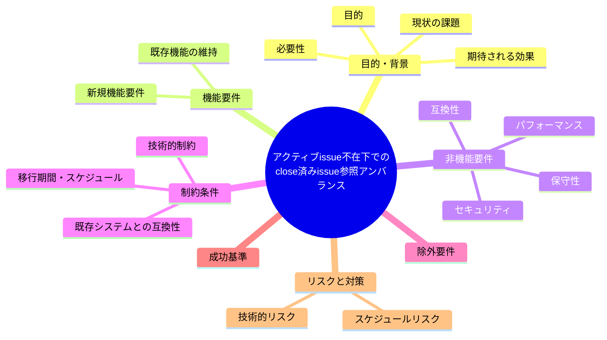
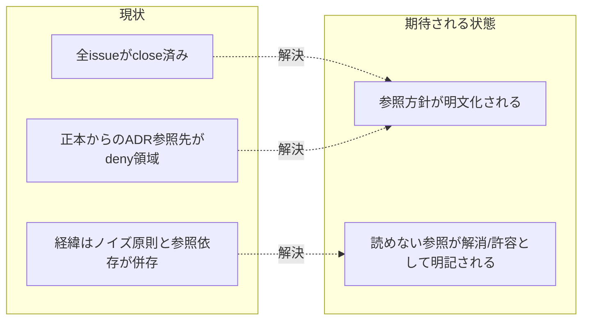

# 要求定義書: アクティブ issue 不在下での close 済み issue 参照アンバランス

**プロジェクト名**: アクティブ issue 不在下での close 済み issue 参照アンバランス
**作成日**: 2026 年 07 月 14 日
**最終更新**: 2026 年 07 月 14 日

> **重要**:
>
> - 要求定義書は、プロジェクトの全体像を把握するためのものです。詳細な技術仕様や実装方法は要件定義書以降で記載します。必要最低限の情報に収めることを心掛けてください。
> - **このドキュメントは常に更新**: 要求の変更や追加があった場合は、即座にこのドキュメントを更新してください。ドキュメントは「生きているドキュメント」として扱い、実装内容と常に同期させます。
> - **必須項目**: 以下の「必須」と明記した項目は空欄・抽象語のみ（例: 「{説明}」のまま）で提出しないこと。判定可能な形（目的は1文・成功基準は○/×で判定できる記載等）で記入すること。
>
> **用語**: [.agent-skill-chain/source/CONCEPTS.md §用語規約](../../../../../../.agent-skill-chain/source/CONCEPTS.md#用語規約) を参照。

---

## 要求定義の全体像

**注意**:

- 上記の「プロジェクト名」は例です。実際のプロジェクト名に置き換えてください。
- マインドマップは全体像を把握するためのものです。主要なセクション名程度に留め、詳細は記載しないでください。

---

## 1. 目的・背景

### 1.1 目的（必須）

正本ドキュメントから close/ 配下（deny 対象）への経緯参照依存を見直す。

### 1.2 背景

2026-07-14 fable による本システムの自己調査で検出。

- **現状の課題**:
  - 全 issue が close/ に移動済みのため、project 正本から「検討経緯・ADR」への参照はすべて deny 領域（close/）行きになる。
  - 「経緯はノイズ・現在の事実のみ」とされる一方で、正本自体が経緯参照を前提にしている箇所が残っており、参照先だけが読めなくなるアンバランスが生じている。

- **必要性**:
  - 正本文書の参照方針（経緯参照を前提にするかしないか）と、close/ の deny 設定・「経緯はノイズ」原則を整合させる必要がある。

### 1.3 期待される効果（必須: 1 件以上）

- **効果 1**: 正本文書内の close/ 配下 ADR 参照について、読めない参照を残すか・参照自体を排除するかの方針が明文化される。

**現状と期待される状態の比較**（必要に応じて）:

---

## 2. 機能要件

### 2.1 既存機能の維持（該当する場合）

close/ 配下 deny 設定・close 移動運用自体は維持する。

### 2.2 新規機能要件

{対応方針は 01 要件定義以降で検討。本書では課題の提起に留める}

---

## 3. 非機能要件

### 3.1 パフォーマンス

- {該当なし}

### 3.2 セキュリティ

- {該当なし}

### 3.3 互換性

- 既存の close 移動・deny 設定の意図を損なわないこと。

### 3.4 保守性

- {01 要件定義以降で検討}

---

## 4. 制約条件

### 4.1 技術的制約

- {01 要件定義以降で検討}

### 4.2 既存システムとの互換性

- `.claude/settings.json` の deny 設定はローカル環境固有であり、本 issue の対応方針がそれを前提にしすぎないこと。

### 4.3 移行期間・スケジュール

- {未定}

---

## 5. 除外要件

対応方針の具体設計・実装（本 issue は課題の起票のみ）。

---

## 6. 成功基準（必須: 1 件以上）

- 正本ドキュメントの close/ 配下参照について、方針（許容する／代替手段を用意する等）が明文化されていること。

---

## 7. リスクと対策

### 7.1 技術的リスク

- **リスク**: deny 設定はローカル環境固有のため、一般化した対応をすると他消費者環境で不要な変更になる可能性がある。
  - **対策**: 本リポ固有の運用注記として対応するか、正本の参照自体を見直すかを 01 以降で切り分ける。

### 7.2 スケジュールリスク

- **リスク**: {特になし}
  - **対策**: {特になし}

---

## 8. 参考資料

### プロジェクトドキュメント

- 既存プロジェクトの場合は、[`00_システム理解.md`](./00_システム理解.md) - システム理解を参照

### その他の参考資料

- `docs/maintainer/workflow/` 直下は README.md と close のみ
- `.agent-skill-chain/project/MODEL_TIER_TABLE.md:34`
- `.claude/settings.json` deny

---

## 9. 次のステップ

この要求定義書の承認後、以下のドキュメントを作成します：

- **次**: [`01_要件定義.md`](./01_要件定義.md) - 要件定義フェーズ
