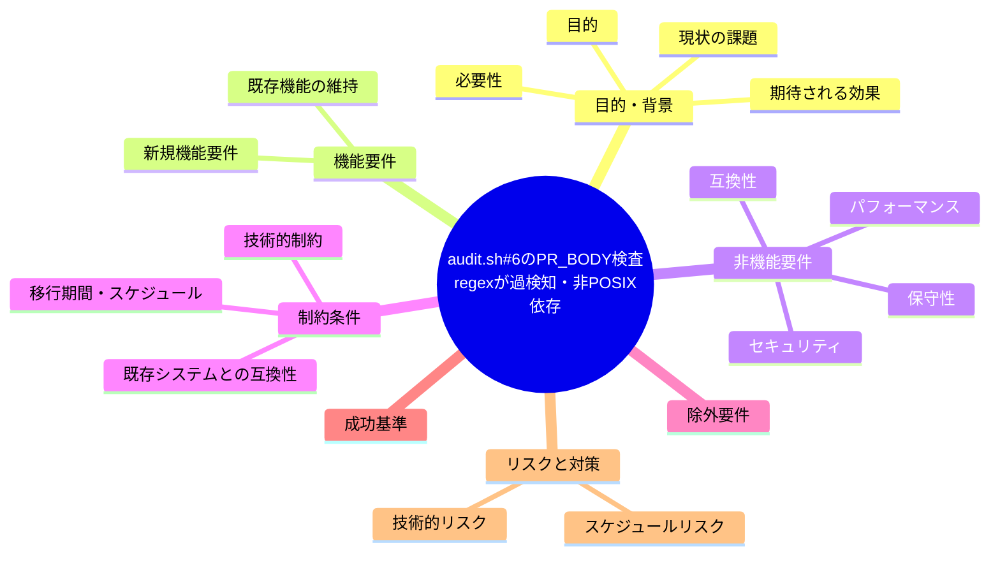

# 要求定義書: audit.sh #6 の PR_BODY 検査 regex が過検知・非 POSIX 依存

**プロジェクト名**: audit.sh #6 の PR_BODY 検査 regex が過検知・非 POSIX 依存
**作成日**: 2026 年 07 月 14 日
**最終更新**: 2026 年 07 月 14 日

> **重要**:
>
> - 要求定義書は、プロジェクトの全体像を把握するためのものです。詳細な技術仕様や実装方法は要件定義書以降で記載します。必要最低限の情報に収めることを心掛けてください。
> - **このドキュメントは常に更新**: 要求の変更や追加があった場合は、即座にこのドキュメントを更新してください。ドキュメントは「生きているドキュメント」として扱い、実装内容と常に同期させます。
> - **必須項目**: 以下の「必須」と明記した項目は空欄・抽象語のみ（例: 「{説明}」のまま）で提出しないこと。判定可能な形（目的は1文・成功基準は○/×で判定できる記載等）で記入すること。
>
> **用語**: [.agent-skill-chain/source/CONCEPTS.md §用語規約](../../../../../../.agent-skill-chain/source/CONCEPTS.md#用語規約) を参照。

---

## 要求定義の全体像



**注意**:

- 上記の「プロジェクト名」は例です。実際のプロジェクト名に置き換えてください。
- マインドマップは全体像を把握するためのものです。主要なセクション名程度に留め、詳細は記載しないでください。

---

## 1. 目的・背景

### 1.1 目的（必須）

audit.sh #6 の PR_BODY 内部参照検査 regex の過検知・移植性問題を修正する。

### 1.2 背景

2026-07-14 fable による本システムの自己調査で検出。

- **現状の課題**:
  - 内部参照禁止の grep パターンは `/docs/[^)\s]+\)` 等を含み、外部サイトの URL（例: `https://example.com/docs/page`）を含む PR 本文まで FAIL させうる。
  - ERE で `\s` を使用しており GNU grep 依存（BSD grep 等で挙動が異なる可能性がある）。

- **必要性**:
  - 過検知（false positive）を避け、grep の移植性を高める必要がある。

### 1.3 期待される効果（必須: 1 件以上）

- **効果 1**: 外部サイトの `/docs/` を含む URL を含む PR 本文が誤って FAIL しなくなる。
- **効果 2**: regex が POSIX 互換の記法になり、grep 実装差異による挙動差が解消される。

**現状と期待される状態の比較**（必要に応じて）:

```mermaid
flowchart LR
    subgraph 現状["現状"]
        A1[外部URLの/docs/を誤検知]
        A2[\sがGNU grep依存]
    end

    subgraph 期待される状態["期待される状態"]
        B1[内部リポパスのみを検知する]
        B2[POSIX互換の記法になる]
    end

    A1 -.->|解決| B1
    A2 -.->|解決| B2
```

---

## 2. 機能要件

### 2.1 既存機能の維持（該当する場合）

内部参照禁止（enforcement #6）の検査目的自体は維持する。

### 2.2 新規機能要件

{対応方針は 01 要件定義以降で検討。本書では課題の提起に留める}

---

## 3. 非機能要件

### 3.1 パフォーマンス

- {該当なし}

### 3.2 セキュリティ

- {該当なし}

### 3.3 互換性

- BSD grep（macOS 既定）・GNU grep の両方で同一の判定結果になること。

### 3.4 保守性

- {01 要件定義以降で検討}

---

## 4. 制約条件

### 4.1 技術的制約

- {01 要件定義以降で検討}

### 4.2 既存システムとの互換性

- 既存の CI（self-enforce.yml・消費者テンプレート audit.yml）での動作を壊さないこと。

### 4.3 移行期間・スケジュール

- {未定}

---

## 5. 除外要件

対応方針の具体設計・実装（本 issue は課題の起票のみ）。

---

## 6. 成功基準（必須: 1 件以上）

- 外部サイトの `/docs/` を含む URL のみを含む PR 本文が FAIL しないこと。
- regex が POSIX 準拠（`\s` 非依存）の記法になっていること。

---

## 7. リスクと対策

### 7.1 技術的リスク

- **リスク**: regex を緩めすぎると内部参照禁止の本来の検知目的（enforcement #6）を取りこぼす可能性がある。
  - **対策**: 内部パス（`docs/maintainer/workflow/` 等リポジトリ内部プレフィックス）に限定したパターンへ絞り込む方向で 01 以降で検討する。

### 7.2 スケジュールリスク

- **リスク**: {特になし}
  - **対策**: {特になし}

---

## 8. 参考資料

### プロジェクトドキュメント

- 既存プロジェクトの場合は、[`00_システム理解.md`](./00_システム理解.md) - システム理解を参照

### その他の参考資料

- `.agent-skill-chain/source/enforcement/ci/audit.sh:363-369`

---

## 9. 次のステップ

この要求定義書の承認後、以下のドキュメントを作成します：

- **次**: [`01_要件定義.md`](./01_要件定義.md) - 要件定義フェーズ
