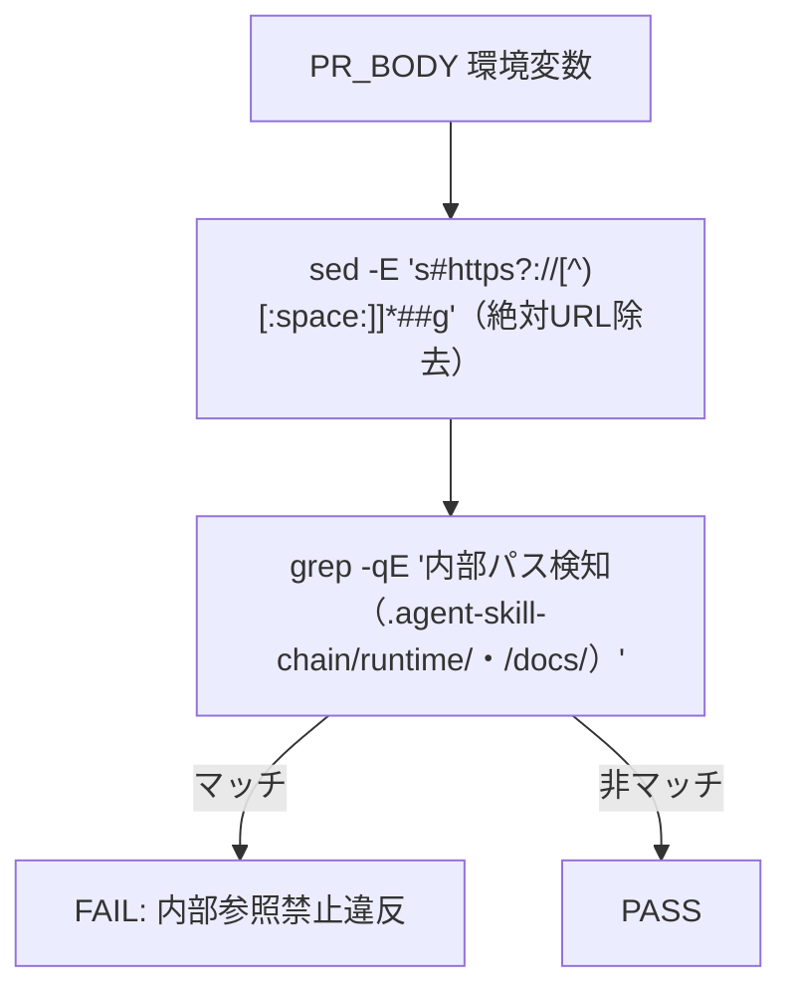

# 設計書: audit.sh #6 の PR_BODY 検査 regex が過検知・非 POSIX 依存

**プロジェクト名**: audit.sh #6 の PR_BODY 検査 regex が過検知・非 POSIX 依存
**作成日**: 2026年07月14日
**最終更新**: 2026年07月14日

---

## 1. 設計概要

### 1.1 設計方針

判定ロジックを 2 段階に分ける。(1) `PR_BODY` から絶対 URL（`http(s)://` スキーム付き）のトークンを事前に除去する、(2) 除去後の残り文字列に対して既存の内部パス検知 regex（`\s` を `[[:space:]]` に置換したもの）を適用する。これにより検知ロジック自体（内部パスの判定条件）は変えずに、外部 URL 由来の誤検知だけを構造的に排除できる。

### 1.2 設計原則（本プロジェクトで適用するもの）

- **単一責務**: 「URL 除去」と「内部パス検知」を 1 行のパイプラインで分離し、それぞれの責務を明確にする。
- **UNIX哲学**: `sed` で前処理し `grep` で判定するという、小さなツールの組み合わせに徹する（新規依存を追加しない）。

---

## 2. アーキテクチャ設計

### 2.1 責務・境界・参照関係

#### 2.1.1 責務一覧

| コンポーネント | 責務（1 文） |
| --- | --- |
| URL 除去前処理（`sed -E 's#https?://[^)[:space:]]*##g'`） | `PR_BODY` から絶対 URL トークンを取り除く。 |
| 内部パス検知（`grep -qE '...'`） | 前処理後の文字列から `.agent-skill-chain/runtime/`・`/docs/` への参照を検知する。 |

#### 2.1.2 境界

- **入力**: 環境変数 `PR_BODY`（CI から渡される PR 本文全文）。
- **出力**: enforcement #6 の PASS/FAIL 判定（`EXIT_CODE` への反映）。
- **他責務との境界**: PR_BODY が未設定（ローカル・push イベント）の場合は本チェック自体が非発火（既存仕様のまま変更しない）。

#### 2.1.3 参照関係

- `PR_BODY` → `sed`（URL 除去）→ `grep`（内部パス検知）→ `EXIT_CODE` 設定。循環参照なし。

### 2.2 システムアーキテクチャ

- **採用パターン**: 既存の「grep 一発判定」から「前処理（sed）→ 判定（grep）」の 2 段パイプラインへ変更。新規のアーキテクチャパターン導入ではなく、既存チェックの内部実装の改善に留まる。
- **根拠**: POSIX regex には後読み（lookbehind）が無いため、「`docs/` の前に `://` があるかどうか」で条件分岐する正規表現を 1 行で書くことができない。前処理でスキーム付き URL を除去してから同一の検知 regex を適用する方式が、最小差分かつ POSIX 準拠を両立できる（06_設計判断の優先順位: シンプルさ・移植性を優先）。

#### 2.2.2 アーキテクチャ図

### 2.5 横断設計判断（ADR）

#### ADR-1: 後読み無し POSIX regex での「URL 内の /docs/ を除外」実現方法

- **コンテキスト**: `grep -E`（POSIX ERE）には否定後読みが無く、「`://` の後に続く `/docs/` だけを除外する」条件を 1 本の regex で表現できない。
- **検討した選択肢**:
  1. `sed` で `https?://[^)[:space:]]*` にマッチする絶対 URL トークンを事前に除去してから、既存の内部パス検知 regex をそのまま適用する。
  2. PCRE（`grep -P`）の否定後読みを使う。
  3. Python 等の言語を呼び出して正規表現処理する。
- **決定**: 選択肢 1 を採用する。
- **根拠**: 選択肢 2 は `grep -P` が BSD grep（macOS 既定）で利用不可であり、本 issue の目的（BSD/GNU 両対応）に反する。選択肢 3 は依存を増やし `audit.sh` の「bash + POSIX ツールのみで完結する」という既存の設計方針から外れる。選択肢 1 は `sed -E`（POSIX 拡張正規表現、BSD/GNU 両対応）のみで完結し、既存の内部パス検知条件を一切変更しないため、検知漏れ（false negative）のリスクが最小である（evidence_source: existing_code、audit.sh 冒頭コメントの検知目的定義に基づく）。
- **帰結**: 内部パス検知の regex 自体（`\]\([^)]*\.agent-skill-chain/runtime/` 等）は変更せず、`\s` → `[[:space:]]` の置換のみを行う。検知ロジックの追加・削除は無い。

#### ADR-2: `\s` の置換先を `[[:space:]]` にするか、スペース・タブのみの明示列挙にするか

- **コンテキスト**: `\s` は GNU 拡張であり空白・タブ・改行等を含むが、POSIX では `[[:space:]]`（またはロケール依存の明示列挙）を使う必要がある。
- **検討した選択肢**:
  1. `[[:space:]]`（POSIX 標準文字クラス）。
  2. `[ \t]`（スペース・タブの明示列挙）。
- **決定**: 選択肢 1 を採用する。
- **根拠**: `[[:space:]]` は POSIX で規定されたロケール非依存の文字クラスであり、BSD/GNU grep 双方で同一に解釈される。`\s` の代替として意味的に最も近い（元の `\s` も空白全般を意図していた）。
- **帰結**: `.agent-skill-chain/runtime/[^)\s]+\)` → `.agent-skill-chain/runtime/[^)[:space:]]+\)` のように置換する。

---

## 6. テスト戦略

### 6.1 対象ごとのテスト割り当て

| 対象 | 単体 | 結合/API | E2E | クリティカル観点 | バリデーション観点 | 未達理由/補足 |
| --- | --- | --- | --- | --- | --- | --- |
| enforcement #6（PR_BODY 内部参照検査） | ○ | ○（audit.sh フル実行） | × | 外部URL誤検知の解消・内部パス検知の維持 | POSIX 準拠（`\s` 不使用） | E2E は実 GitHub PR での確認に委ねる（未達理由: ローカルに実 PR イベントが無い） |

### 6.2 監査・レビューでの確認（証跡）

`03_実装計画.md` のテスト観点・BDD 節、および tmp 隔離環境での `audit.sh` フル実行結果（04_review.md §3.1）を証跡とする。

---

## 10. 参考資料

### プロジェクトドキュメント

- [`01_要件定義.md`](./01_要件定義.md) - 要件定義

---

## 11. 前のステップ

- **前**: [`01_要件定義.md`](./01_要件定義.md) - 要件定義フェーズ

---

## 12. 次のステップ

- **次**: [`03_実装計画.md`](./03_実装計画.md) - 実装計画フェーズ
