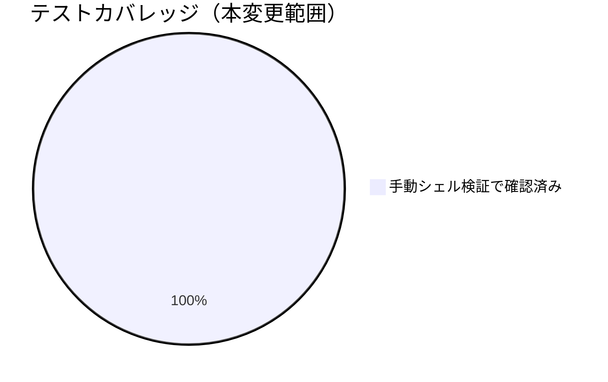

# レビュー書: audit.sh #6 の PR_BODY 検査 regex が過検知・非 POSIX 依存

**プロジェクト名**: audit.sh #6 の PR_BODY 検査 regex が過検知・非 POSIX 依存
**作成日**: 2026年07月14日
**最終更新**: 2026年07月14日

> レビュー深度: quick（既存 grep 判定の 1 ブロックへの前処理追加という小規模変更のため）。

---

## 1. レビュー概要

### 1.1 レビュー目的（必須）

実装内容の確認・品質保証。外部 URL 誤検知の解消と POSIX 準拠化が両立できているかを確認する。

### 1.2 レビュー対象（必須）

- **実装範囲**: `audit.sh` #6（PR_BODY 内部参照禁止チェック）の regex 修正。
- **レビュー期間**: 2026年07月14日 〜 2026年07月14日
- **レビュー担当者**: 実装担当エージェント（セルフレビュー・quick）

---

## 2. 実装内容の確認

### 2.1 実装完了タスク（または Issue）

| タスク名 | 実装内容 | 実装日 | 担当者 | ステータス（必須: 完了 または 要修正） |
| --- | --- | --- | --- | --- |
| タスク1: enforcement #6 regex 修正 | 絶対URL除去の前処理を追加し、`\s` を `[[:space:]]` に置換 | 2026-07-14 | 実装担当エージェント | 完了 |

### 2.2 実装内容の詳細

#### タスク 1: enforcement #6 regex 修正

- **実装内容**: `PR_BODY` に対して `sed -E 's#https?://[^)[:space:]]*##g'` で絶対 URL トークンを除去した文字列を作り、既存の内部パス検知 regex（`\s` → `[[:space:]]` 置換済み）をその文字列に適用するよう変更。
- **変更ファイル**: `.agent-skill-chain/source/enforcement/ci/audit.sh`
- **実装方法**: 既存の検知条件（`.agent-skill-chain/runtime/`・`/docs/` へのパス検知）自体は変更せず、前処理ステップのみを追加。
- **確認事項**: 内部パス検知の検知漏れが発生していないこと（tmp 検証で確認済み、§3.1）。

---

## 3. テスト結果の確認

### 3.1 単体テスト

#### テスト実行結果（必須: 数値で記載）

- **実行日**: 2026-07-14
- **テストファイル数**: 0（既存自動テストスイートへの追加なし。tmp 隔離環境での手動シェル検証で代替）
- **テストケース数**: 6
- **成功**: 6
- **失敗**: 0
- **スキップ**: 0

実施内容（tmp git リポジトリ、`mktemp -d` で隔離。本番ファイルは変更していない）:

| # | PR_BODY | 期待結果 | 実測結果 |
| --- | --- | --- | --- |
| 1 | `See https://example.com/docs/page for reference.` | PASS（FAILしない） | PASS |
| 2 | `See [external docs](https://example.com/docs/page) for details.` | PASS | PASS |
| 3 | `Refer to [issue](.agent-skill-chain/runtime/xxx/00_yy.md)` | FAIL（検知） | FAIL |
| 4 | `Refer to [issue](/docs/maintainer/workflow/xxx/00.md)` | FAIL（検知） | FAIL |
| 5 | `See .agent-skill-chain/runtime/xxx/00_yy.md) for details.` | FAIL（検知） | FAIL |
| 6 | `This PR fixes a bug in the parser. Closes #123.` | PASS | PASS |

`audit.sh` フル実行（`bash audit.sh .`）でも、ケース 1（外部URL）で「内部参照禁止」FAIL 行が出力されないこと、ケース 3 相当（内部パス）で FAIL 行が出力されることを確認済み。

#### テストカバレッジ

### 3.2 統合テスト

`audit.sh` フル実行で他の enforcement チェック（#1〜#37）に回帰がないことを確認済み（`Audit passed.` で正常終了。20260714_163629 issue のテストと共用の tmp リポジトリで実施）。

### 3.3 E2E テスト

実際の GitHub PR（本 PR 自体）の CI 実行結果を E2E 確認とする。本 PR 本文には内部パス言及を含めていないため #6 は PASS する想定。

---

## 4. コードレビュー

### 4.1 コード品質

#### コードスタイル

- **リント結果**: 0 / 0（`bash -n` による構文チェックのみ実施）
- **フォーマット**: 問題なし
- **型チェック**: 該当なし（bash）

#### コードレビュー観点

| 観点 | 確認内容（必須: 1 文） | 結果（必須: OK または 要修正） | コメント（要修正時は理由を記載） |
| --- | --- | --- | --- |
| 可読性 | 前処理の意図（外部URL除去）をコメントで説明しているか | OK | |
| 保守性 | 既存の内部パス検知 regex 自体を変更せず前処理のみ追加しているか | OK | 02_設計 ADR-1 |
| パフォーマンス | 追加した `sed` 呼び出しが PR 本文 1 件分のみで軽量か | OK | 影響は無視できる規模 |
| セキュリティ | 前処理で正当な内部参照を消してしまわないか（過剰除去による検知漏れ） | OK | `https?://` スキーム付きトークンのみを除去対象にしており、`.agent-skill-chain/runtime/` 等のスキーム無しパスは対象外（§3.1 ケース3〜5で検知維持を確認） |

### 4.2 指摘事項

#### 指摘 1: BSD grep での実機確認未実施

- **重要度**: 低
- **指摘内容**: `[[:space:]]` が BSD grep でも同一に動作することは POSIX 仕様上の根拠に基づく判断であり、実機（macOS 等）での確認は未実施。
- **対応状況**: 対応不要（現時点では設計根拠で十分と判断、02_設計 ADR-2）。
- **対応方法**: 将来 macOS 環境での CI 実行機会があれば確認する（申し送り）。

---

## 5. ドキュメントの確認

### 5.1 ドキュメント更新状況

| ドキュメント | 更新状況 | 確認者 | 確認日 |
| --- | --- | --- | --- |
| [`00_要求定義.md`](./00_要求定義.md) | 更新済み（branch frontmatter） | 実装担当エージェント | 2026-07-14 |
| [`01_要件定義.md`](./01_要件定義.md) | 更新済み（新規作成） | 実装担当エージェント | 2026-07-14 |
| [`02_設計.md`](./02_設計.md) | 更新済み（新規作成） | 実装担当エージェント | 2026-07-14 |
| [`03_実装計画.md`](./03_実装計画.md) | 更新済み（新規作成） | 実装担当エージェント | 2026-07-14 |

### 5.2 ドキュメントの整合性

- **実装と設計の整合性**: 整合している（02_設計 ADR-1/ADR-2 のとおりに実装済み）。
- **要件と実装の整合性**: 整合している（01 の受け入れ基準を満たす）。
- **コメント**: なし。

---

## 6. パフォーマンス確認

### 6.1 パフォーマンステスト結果

`sed` 呼び出し 1 回分の追加コストであり、PR 本文（通常数百〜数千文字程度）に対して無視できる規模。

### 6.2 ボトルネックの確認

該当なし。

---

## 7. セキュリティ確認

### 7.1 セキュリティチェック

| 項目 | 確認内容 | 結果 | コメント |
| --- | --- | --- | --- |
| 認証・認可 | 該当なし | OK | |
| データ保護 | 該当なし | OK | |
| 入力検証 | 前処理による検知漏れ（内部参照の見逃し）が生じていないか | OK | §3.1 ケース3〜5 で内部パス検知が維持されることを確認 |

---

## docs 更新

- 要否: 不要
- 対象: なし
- 理由: 本変更は enforcement CI スクリプトの内部 regex 修正であり、`docs/` 配下のシステム仕様書（ユーザー向け仕様・アーキテクチャ説明）が説明する範囲に影響しない。enforcement #6 の検知目的自体（PR 本文の内部参照禁止）は維持しており、`enforcement/README.md` の失敗条件一覧の記述内容にも変更はない。

---

## 9. 設計・境界の確認

### 9.1 設計の確認

- **設計原則の準拠**: UNIX哲学（sed による前処理と grep による判定の組み合わせ、02_設計 §1.2）に沿っている。
- **ディレクトリ構成**: 変更なし（既存ファイルの内部編集のみ）。
- **命名規則**: 一時変数名 `_pr_body_no_url` は audit.sh 内の既存のローカル変数命名慣習（アンダースコア接頭辞のローカル変数、例: `_wfd`）に整合させた。

### 9.2 境界・依存の確認

- **責務の境界**: URL 除去（前処理）と内部パス検知（判定）の責務を分離。
- **依存関係**: 新規外部依存なし（`sed`/`grep` はいずれも既存スクリプトが前提とする POSIX ツール）。
- **指摘・推奨**: なし。

### 9.3 重要判断の根拠（evidence_source）

| 判断内容 | evidence_source | 備考（参照元・URL 等） |
| --- | --- | --- |
| URL 除去前処理方式の採用（ADR-1） | existing_code | audit.sh の既存設計（bash + POSIX ツールのみで完結）に基づく |
| `[[:space:]]` の採用（ADR-2） | external_spec | POSIX ERE 仕様（文字クラス）に基づく |
| 6 パターンの PASS/FAIL 実測 | test_output | tmp 隔離環境でのシェルスクリプト実行結果（本書 §3.1） |

---

## 10. 課題と改善点

### 10.1 発見された課題

- **課題 1**: BSD grep での実機確認が未実施。
  - **影響範囲**: macOS 等 BSD 系環境での `audit.sh` 実行。
  - **対応方法**: 設計根拠（POSIX 仕様）で代替、将来の実機確認機会に委ねる（申し送り）。

### 10.2 改善提案

- **改善 1**: 相対パス形式の内部参照（例: `docs/maintainer/...` のように先頭に `/` が無い形）は既存 regex（`/docs/` 前提）では検知対象外という既知のギャップがあるが、本 issue のスコープ（外部URL誤検知・POSIX化）外のため今回は変更していない。
  - **効果**: 将来別 issue で対応すれば検知網羅性が向上する。

---

## 11. システム仕様書の更新

### 11.1 システム仕様書の確認結果

#### 実装内容の確認

- **実装した機能**: enforcement #6 の regex 修正（外部URL誤検知解消・POSIX準拠）。
- **実装した画面・データ構造・API**: 該当なし。

#### システム仕様書との整合性確認

- 影響なし（docs 更新§参照）。

### 11.2 システム仕様書の更新状況

#### 更新が必要な項目

なし。

#### 更新が不要な項目

- 本変更は enforcement CI の内部 regex 修正であり、`docs/` が対象とするシステム仕様に変更はない。

---

## 12. レビュー結果

### 12.1 総合評価

- **実装品質**: 良好（既存検知条件を変更せず前処理のみ追加という最小差分）。
- **テスト品質**: quick レベルとして十分（6 パターンの手動検証を実施）。
- **ドキュメント品質**: 良好。
- **総合評価**: 完了。

### 12.2 承認状況

- **レビュー承認者**: 実装担当エージェント（セルフレビュー）
- **承認日**: 2026-07-14
- **承認コメント**: quick レビューとして問題なし。

---

## 13. 参考資料

### 13.1 プロジェクトドキュメント

- [`00_要求定義.md`](./00_要求定義.md) - 要求定義
- [`01_要件定義.md`](./01_要件定義.md) - 要件定義
- [`02_設計.md`](./02_設計.md) - 設計
- [`03_実装計画.md`](./03_実装計画.md) - 実装計画

---

## 14. 前のステップ

- **前**: [`03_実装計画.md`](./03_実装計画.md) - 実装計画フェーズ

---

## 15. 次のステップ

- 外部設定は不要のため、本 issue はここで完了とする。

---

## 敵対的観点（アドバーサリアルレビュー）

- **想定される反論 1**: 「`sed` での URL 除去が過剰で、正当な内部参照まで消してしまうのでは」→ 除去対象は `https?://` スキームで始まり、`)` または空白までの連続文字のみであり、`.agent-skill-chain/runtime/` や `docs/` のようなスキーム無しの内部相対パスはこの除去パターンにマッチしない。§3.1 のケース3〜5（内部パス検知）が期待どおり FAIL することで実証済み。
- **想定される反論 2**: 「外部 URL の中に偶然 `.agent-skill-chain/runtime/` という文字列が含まれるケース（例えば GitHub の raw URL）は誤検知しないのか」→ `https://github.com/.../.agent-skill-chain/runtime/...` のような URL も `https?://[^)[:space:]]*` の対象（スキームの後ろに空白/`)` が来るまでの連続文字列）に含まれるため、URL 全体が除去され、内部パス検知には引っかからない。これは意図した挙動であり、外部サイト上のリンク（GitHub 上の当該リポジトリへの絶対URLリンクを含む）を許容する。ローカル相対パス形式の内部参照（本来の検知対象）とは区別できている。
- **想定される反論 3**: 「本来は `docs/`（先頭スラッシュ無し）の相対リンクも検知すべきでは」→ その通りだが、既存 regex は元々 `/docs/`（先頭スラッシュ付き）のみを対象としており、本 issue（00 §5 除外要件: 「対応方針の具体設計・実装（本issueは課題の起票のみ）」に対応する 01/02/03 の範囲）は外部URL誤検知の解消と POSIX 化に限定している。検知網羅性の拡大は別課題として §10.2 に改善提案を記載した。

## must-preserve（不変条件）

- 内部パス（`.agent-skill-chain/runtime/`・`/docs/` 形式）への markdown リンク・直書き参照は、修正後も引き続き FAIL として検知されること（§3.1 ケース3〜5）。
- `PR_BODY` が未設定（ローカル実行・push イベント）の場合、本チェックは非発火のままであること（既存仕様、変更していない）。
- FAIL 時のメッセージ文言・`ROLLBACK_MSG` の出力内容は変更しないこと。
