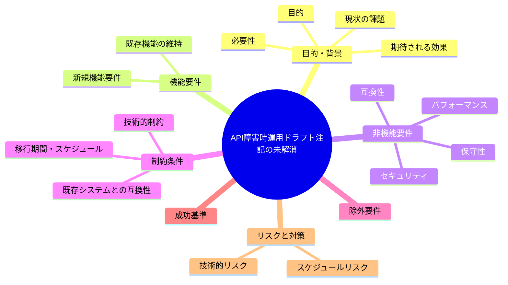
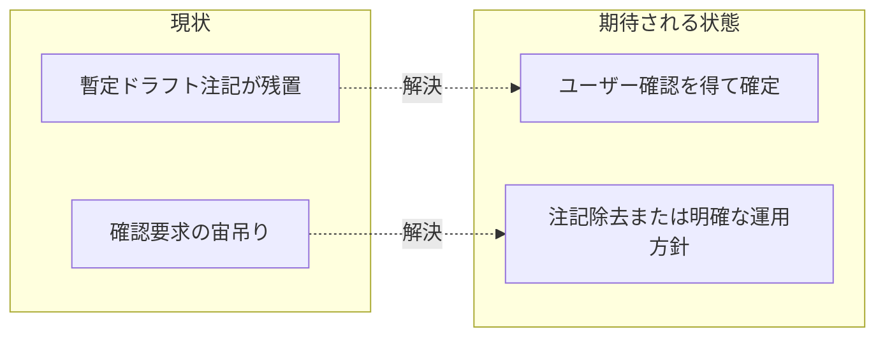

# 要求定義書: API 障害時運用ドラフト注記の未解消

**プロジェクト名**: API 障害時運用ドラフト注記の未解消
**作成日**: 2026 年 07 月 14 日
**最終更新**: 2026 年 07 月 14 日

> **重要**:
>
> - 要求定義書は、プロジェクトの全体像を把握するためのものです。詳細な技術仕様や実装方法は要件定義書以降で記載します。必要最低限の情報に収めることを心掛けてください。
> - **このドキュメントは常に更新**: 要求の変更や追加があった場合は、即座にこのドキュメントを更新してください。ドキュメントは「生きているドキュメント」として扱い、実装内容と常に同期させます。
> - **必須項目**: 以下の「必須」と明記した項目は空欄・抽象語のみ（例: 「{説明}」のまま）で提出しないこと。判定可能な形（目的は1文・成功基準は○/×で判定できる記載等）で記入すること。
>
> **用語**: [.agent-skill-chain/source/CONCEPTS.md §用語規約](../../../../../../.agent-skill-chain/source/CONCEPTS.md#用語規約) を参照。

---

## 要求定義の全体像

**注意**:

- 上記の「プロジェクト名」は例です。実際のプロジェクト名に置き換えてください。
- マインドマップは全体像を把握するためのものです。主要なセクション名程度に留め、詳細は記載しないでください。

---

## 1. 目的・背景

### 1.1 目的（必須）

正本ルールに残る「暫定ドラフト・要人間確認」節の宙吊り状態を解消する。

### 1.2 背景

2026-07-14 fable による本システムの自己調査で検出。

- **現状の課題**:
  - project 正本の「§5 API 一時障害・認証失効時の運用」（`.agent-skill-chain/project/自己拡張ワークフロー.md:104-111`）は「暫定ドラフト」「実運用に適用する前に必ずユーザーの明示確認を得ること」「確定後は本節を更新し注記を除去すること」と明記されたまま残っている。
  - 運用者・エージェントがこの節に従ってよいのか、確認済みなのか未確認なのか判断できない宙吊り状態になっている。

- **必要性**:
  - 正本ルールに未確定を示す注記が残ったままだと、実運用時の判断がぶれる、または誤って未確認のまま適用されるリスクがある。

### 1.3 期待される効果（必須: 1 件以上）

- **効果 1**: §5 の内容についてユーザー確認が得られ、確定後に「暫定ドラフト」注記が除去される（または未確定のまま運用しない方針が明確化される）。
- **効果 2**: 正本ルールの記述状態（確定/未確定）が読み手にとって一意に判断できるようになる。

**現状と期待される状態の比較**（必要に応じて）:

---

## 2. 機能要件

### 2.1 既存機能の維持（該当する場合）

§5 のリトライ回数・タイムアウト等の具体値自体は維持を前提に、確定/未確定の状態のみを整理する想定。

### 2.2 新規機能要件

- `.agent-skill-chain/project/自己拡張ワークフロー.md:104-111` の内容についてユーザーへ確認を実施する。
- 確認結果に応じて注記を除去し本文を確定するか、未確定である旨をより明確な形で維持するかを決定する。

---

## 3. 非機能要件

### 3.1 パフォーマンス

- 特になし。

### 3.2 セキュリティ

- 特になし。

### 3.3 互換性

- 既存の GitHub Issue 起票ゲート運用（§1〜§4）と矛盾しない内容にする。

### 3.4 保守性

- 今後同様の「暫定ドラフト」注記を残す場合の運用ルール（確定までの扱い）を明確にする。

---

## 4. 制約条件

### 4.1 技術的制約

- 02_設計.md ADR-4 が「本節の具体回数・具体タイムアウトは未確定事項」と明記している点を踏まえる。

### 4.2 既存システムとの互換性

- 特になし。

### 4.3 移行期間・スケジュール

- 特になし。

---

## 5. 除外要件

- §5 以外の GitHub Issue 起票ゲート関連節（§1〜§4、§6〜§8）の内容変更は対象外とする。

---

## 6. 成功基準（必須: 1 件以上）

- §5 の記述が「確定済み」または「明示的に未確定である」のいずれか一意に判断できる状態になっている。
- ユーザーへの確認実施の有無・結果が記録として残っている。

---

## 7. リスクと対策

### 7.1 技術的リスク

- **リスク**: 確認を得ずに注記だけ除去すると、未検証のドラフト値が正式ルールとして扱われてしまう。
  - **対策**: 必ずユーザーの明示確認を得てから注記を除去する。

### 7.2 スケジュールリスク

- **リスク**: ユーザー確認待ちで対応が長期化する可能性がある。
  - **対策**: 確認が得られるまでは「暫定ドラフト」である旨を維持し、宙吊り状態を明示し続ける。

---

## 8. 参考資料

### プロジェクトドキュメント

- 既存プロジェクトの場合は、[`00_システム理解.md`](./00_システム理解.md) - システム理解を参照

### その他の参考資料

- `.agent-skill-chain/project/自己拡張ワークフロー.md:104-111`

---

## ユーザー判断（記録）

- **出典**: この方針は、issue再編作業中に進行役（オーケストレーター）経由で伝達されたものであり、一次ソース（実際のユーザーとの対話記録）は本サブエージェントのコンテキストからは検証不能。
- **決定**: 暫定ドラフトの値（リトライ30秒間隔・最大3回、リトライを尽くしても解消しない場合はユーザーへエスカレーション）を正式に本採用する。
- **対応**: `.agent-skill-chain/project/自己拡張ワークフロー.md` §5「API一時障害・認証失効時の運用」の「暫定ドラフトである。実運用に適用する前に、必ずユーザーの明示確認を得ること」「確定後は本節を除去すること」という注記を、実際にこのissueの実装作業（バッチ2）で除去し、正式ルールとして確定させる。

---

## 9. 次のステップ

この要求定義書の承認後、以下のドキュメントを作成します：

- **次**: [`01_要件定義.md`](./01_要件定義.md) - 要件定義フェーズ
