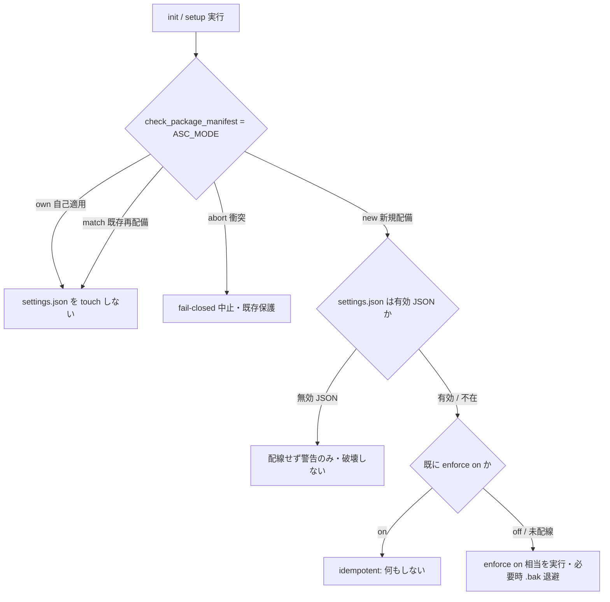

# 設計書: enforce を新規セットアップ既定 on 化し「絶対強制」の実態を記述と一致させる

**プロジェクト名**: enforce off が既定状態であり「絶対強制」の実態が宣言のみ
**作成日**: 2026年07月14日
**最終更新**: 2026年07月14日

---

## 1. 設計概要

### 1.1 設計方針

本 issue の対応は 2 本柱で構成する。

- **柱 A（挙動変更）**: `init`/`setup` の新規配備（`ASC_MODE=new`）時に限り、既存の `enforce on` 相当の配線を自動でマージする（＝新規セットアップの既定を off から on へ）。判定は既存の `check_package_manifest` が返す `ASC_MODE` を再利用し、`new` のときのみ配線する。`match`（既存の再配備・upgrade）・`own`（本パッケージ自己適用）では従来どおり `.claude/settings.json` を touch しない。安全策（無効 JSON 時中止・`.bak` 退避・ユーザー値保持・idempotent）は既存 `enforce on` ロジックを流用し新規実装しない。
- **柱 B（記述整合）**: `enforcement/README.md` の「絶対強制」宣言箇所・強制の 4 層表・ツール別強制力マトリクスに、各強制点の強制力区分（**新規既定 on の runtime 強制／opt-in／advisory のみ／CI のみ**）と有効条件を明記する。`SETUP.md` の §enforcement 節を「新規は既定 on・opt-out（`enforce off`）可」へ改め、ロックアウト復旧手順（`!enforce off`）を目立たせる。

**重要な設計判断（誠実化）**: 柱 B（記述）だけを実施し柱 A（挙動）を伴わないと、「既定 on」という記述と「実際は配線されない」実態の乖離＝本 issue が解消しようとしている問題そのものを再生産する。したがって本設計は**柱 A の挙動変更を本 issue の中核実装として含める**。ただし本タスクの委譲趣旨は記述ファイル（SETUP.md・enforcement/README.md）の更新を主眼としているため、03_実装計画で柱 A（コード変更）と柱 B（記述）を明確に分離し、スコープ確定の判断点を残す（後述 §5 スコープと申し送り）。

### 1.2 設計原則（本プロジェクトで適用するもの）

- **単一責務・重複実装の禁止**: 新規/既存の判定は既存 `ASC_MODE` を再利用し、fresh 判定を新設しない。配線処理は既存 `enforceOn`（TS）/ enforce on 相当ロジックを呼び出し、二重実装しない。
- **後方互換・安全側フォールバック**: 判定不能・無効 JSON・配線失敗時は「配線しない（＝従来の off 相当）」に倒し、既存環境・ユーザー資産を壊さないことを最優先する。
- **記述は現在の事実のみ**（[feedback_no-historical-narrative] と整合）: 「かつて off だった」等の経緯説明は正本に残さず、現在の各層強制力区分のみを明記する。
- **配置境界（コア抽象／project 具体）**: 消費者共通の既定 on 挙動・強制力区分はコア（`.agent-skill-chain/source/`）に置く。本リポ固有の CI 非ブロッキング・settings.json ローカル固有性は `.agent-skill-chain/project/` を参照する（重複させない）。

---

## 2. アーキテクチャ設計

### 2.1 責務・境界・参照関係

#### 2.1.1 責務一覧

| コンポーネント | 責務（1 文） |
| --- | --- |
| `setup.sh`（`ASC_MODE=new` 分岐） | 新規配備時のみ、既存 `enforce on` 相当の配線処理を呼び出して `.claude/settings.json` に enforcement をマージする。`match`/`own` では呼ばない。 |
| `src/agents-md.ts` の init 経路 | TS 側 init でも同一条件（新規配備相当）で `enforceOn()` を呼び、bash 版 setup.sh と同一挙動にする。 |
| `enforceOn()`（既存・`src/agents-md.ts`） | settings.json への配線マージ・`.bak` 退避・無効 JSON 時中止・nonce ローテート。**本 issue では変更しない**（呼び出し元が増えるのみ）。 |
| `enforce off`（既存） | 既定 on 後も利用者が opt-out できる解除経路。**変更しない**。 |
| `SETUP.md` §enforcement | 新規既定 on・opt-out・復旧手順の記述（正本）。 |
| `enforcement/README.md` 4 層表・ツール別マトリクス・絶対強制節 | 各強制点の強制力区分と有効条件の記述（正本）。 |

#### 2.1.2 境界

- **入力**: `ASC_MODE`（`check_package_manifest` の出力）、`.claude/settings.json` の現在値（有効/無効 JSON・enforce on/off）。
- **出力**: 新規配備時のみ enforcement 配線がマージされた `.claude/settings.json`（＋必要時 `.bak`）。記述ファイル（SETUP.md・enforcement/README.md）の更新。
- **他責務との境界**: 配線の中身（hook コマンド・env・nonce）は `settings.enforce.json` テンプレートと `enforceOn()` の既存責務であり本 issue で変更しない。CI ブロッキング化・workflow.db CI 追跡は別 issue の責務（非交差）。allowlist のツール網羅は別バッチの責務（前提）。

#### 2.1.3 参照関係

- `setup.sh`（new 分岐）→ enforce on 相当ロジック（既存）を呼ぶのみ（循環なし）。
- `src/agents-md.ts` init → `enforceOn()`（既存関数）を呼ぶのみ。
- 記述ファイル（SETUP.md ⇄ enforcement/README.md）は相互参照で重複させない（強制力区分の正本＝enforcement/README.md、CLI 手順の正本＝SETUP.md）。

### 2.2 既定 on の判定フロー

### 2.3 各層・各ツールの強制力区分（柱 B の記述設計）

enforcement/README.md に、既定 on 化後の実態として次の区分を明記する。**「既定 on の runtime 強制」は「新規配備で自動配線され、ロール等のメタデータがフックに渡る環境で exit 2 ブロックする」層**を指す。

| 強制点 | 区分（既定 on 化後） | 有効条件 | 明記先 |
| --- | --- | --- | --- |
| Layer1 プラットフォーム権限 | プラットフォーム依存 | ロール別ツール許可設定がある環境のみ | 4 層表「現状」列 |
| Layer2 PreToolUse hook | **新規既定 on の runtime 強制**（従来「opt-in で有効」→「新規は既定配線で有効・opt-out 可」） | 新規配備で自動配線され、ツール名・パス・コマンド・ロールがフックに渡る場合 exit 2。渡らない場合は案内のみ exit 0（CI 補完） | 4 層表・ツール別マトリクス（Claude Code 行）・§矯正するもの §現状の実装について |
| Layer3 Wrapper（write-workflow-log） | 常時有効（runtime 強制あり） | 常時（DB 書込はラッパー経由のみ） | 4 層表（変更なし） |
| Layer4 CI audit | CI のみ（最後の砦） | push/merge 前。ただし DB 系チェックは workflow.db 非追跡環境で構造的 SKIP（既存記載） | 4 層表・ツール別マトリクス（CI 行）・§CI 構造的 SKIP（変更なし） |
| Cursor / Gemini / Copilot / Codex | advisory のみ | ルール配布・方針適用。物理ブロックなし | ツール別マトリクス（変更なし・区分の明示は維持） |

- **絶対強制節（§絶対強制（サブ委譲））の扱い**: 「絶対強制」という表現は維持しつつ、その実効が **Layer2（新規既定 on・ただしメタデータ伝達環境で exit 2）＋ Layer4 CI（間接検出）＋ 人手レビュー**の重畳で担保されること、および「ロールが渡らない環境では案内のみ exit 0 で CI 補完」という既存の条件付き記述との整合を、区分表への相互参照で一意化する（新たな強い断定を増やさず、既存の条件付き記述を区分表に集約）。
- **SETUP.md §enforcement の見出し変更**: 「enforcement の opt-in（既定 off）」→「enforcement（新規セットアップ既定 on・opt-out 可）」に相当する記述へ改める。表の `enforce on/off/status` の説明自体は不変。「既定 install では書き込まない（off）」の一文を「新規配備（`ASC_MODE=new`）では既定で配線する（on）。既存再配備・自己適用では touch しない」に改める。

### 2.4 テスト観点（詳細は 03 §テスト仕様）

- 新規配備（`ASC_MODE=new`）で配線が入る／`match`・`own` で入らない（AC-1/2/3）。
- 無効 JSON 新規環境で配線を見送り破壊しない（AC-4）。
- enforce on 済み環境で idempotent（二重配線・二重 `.bak` を作らない）。
- bash（setup.sh）と TS（agents-md.ts）の init が同一挙動（パリティ）。
- 記述レビュー: SETUP.md・enforcement/README.md の区分表・復旧手順の存在（AC-5/6）。

---

## 3. 重要判断（ADR）

> フィジビリティ確認済み。evidence_source は各 ADR に付記。

### ADR-1: 新規/既存の判定に既存 `ASC_MODE` を再利用する

- **決定**: 既定 on の発火条件を `ASC_MODE == "new"` に限定する。`own`/`match` は非発火。
- **背景/根拠**: `setup.sh:58` は既に `check_package_manifest` で `own`/`new`/`match`/abort を判定済み（evidence_source: `.agent-skill-chain/source/scripts/setup.sh:58-85`・`lib/package-manifest.sh:54-79`）。`new` は「配備マーカー不在＝真の初回」を意味し、「新規のみ既定 on・既存は影響なし」（01 AC-1/2/3）を追加ロジックなしで満たす。`own`（自己適用＝本リポ）を除外することで、本リポ settings.json への自動適用回避（スコープ外・手動）も同時に成立する。
- **却下案**: 「settings.json に managed hook が無ければ常に配線」→ 既存環境で意図的に `enforce off` した設定を upgrade のたびに再有効化してしまい後方互換を破る。却下。

### ADR-2: 配線処理は既存 `enforceOn()` を流用し新規実装しない

- **決定**: 新規既定 on は既存 `enforceOn()`（TS）/ enforce on 相当ロジックを呼び出す。安全策（無効 JSON 中止・`.bak`・nonce ローテート・ユーザー値マージ）は流用する。
- **根拠**: `enforceOn()` は既に無効 JSON 中止・`.bak` 退避・idempotent を実装（evidence_source: `src/agents-md.ts:1041-1105`・SETUP.md:118 安全策）。重複実装は挙動ドリフトを生む。
- **含意**: setup.sh（bash）側は同ロジックを bash で持つか、`agents-md enforce on` 相当を内部呼び出しする形とし、TS 側 init と挙動一致させる（パリティテスト対象）。

### ADR-3: 本リポ自身の settings.json への適用はスコープ外（手動・ユーザー許可）

- **決定**: 本 issue の実装は「新規消費者環境の既定挙動」と「記述整合」に限る。本リポ `.claude/settings.json`（gitignore・ローカル固有）への実 enforce on 適用は行わない。
- **根拠**: 本リポ settings.json は `.gitignore` 対象・配布非含有・他消費者非継承（evidence_source: [.agent-skill-chain/project/自己拡張ワークフロー.md](../../../../../../.agent-skill-chain/project/自己拡張ワークフロー.md) §settings.json のローカル固有性）。かつ ADR-1 により `own` は自動配線されない。**このリポで enforce on を実際に有効化する場合は、別途ユーザー許可を得て orchestrator が手動で `enforce on`（または `!enforce on`）を実行する**。ロックアウト時は `!enforce off` で復旧する。

### ADR-4: 既定 on に伴う自己ロックアウト対策は「allowlist 網羅（前提）＋復旧手順の明記」で担保

- **決定**: 既定 on 化で新規環境の PreToolUse がライブになるため、(1) orchestrator allowlist がハーネス組み込みツール（`Agent`・`AskUserQuestion` 等）を網羅していること（別バッチ 163531 等で対応済みを前提）、(2) SETUP.md にロックアウト復旧（`!enforce off`）を目立つ形で記載、の 2 点で対策する。
- **根拠**: 過去に `Agent` ツール名未対応で orchestrator が完全ロックアウトした事故がある（evidence_source: [feedback_enforce-on-lockout-incident] メモリ・SETUP.md:126-143 ロックアウト復旧節）。既定 on はこのリスクの発火確率を上げるため、復旧経路の可視性を高める。
- **フィジビリティ**: 復旧節は SETUP.md に既存（126-143 行）。本 issue では §enforcement 見出し直下からの相互参照を追加し発見性を上げるのみ（新規機構は作らない）。

### ADR-5: 「絶対強制」表現は維持し、実効の区分表への集約で整合させる

- **決定**: 「絶対強制」「例外なく拒否」の表現自体は削らず、その実効が「Layer2 新規既定 on（メタデータ伝達時 exit 2）＋ Layer4 CI 間接検出 ＋ 人手レビュー」の重畳であることを区分表（§2.3）へ集約し、既存の条件付き記述（「ロールが渡らない環境では案内のみ exit 0」）と矛盾しない形にする。
- **根拠**: 表現を一律に弱めると規約遵守意識が下がる（00 §7.1 リスク）。既定 on 化により Layer2 が「opt-in で条件付き」から「新規既定で条件付き」へ強化されるため、「絶対強制」の裏付けは従来より強くなる。誇張回避は「有効条件の明記」で達成し、断定語の削除では達成しない。

---

## 4. 影響ファイル一覧

| ファイル | 変更種別 | 柱 | 概要 |
| --- | --- | --- | --- |
| `.agent-skill-chain/source/SETUP.md` | 記述更新 | B | §enforcement 見出し・既定挙動を「新規既定 on・opt-out 可」へ。復旧手順の相互参照追加。settings.json 保持契約表の init/upgrade 列を新挙動に整合。 |
| `.agent-skill-chain/source/enforcement/README.md` | 記述更新 | B | 4 層表・ツール別マトリクス・絶対強制節・§矯正するもの §現状の実装について に強制力区分と有効条件を明記。 |
| `.agent-skill-chain/source/scripts/setup.sh` | コード変更 | A | `ASC_MODE=new` 分岐で enforce on 相当を実行。 |
| `src/agents-md.ts` | コード変更 | A | init 経路で新規配備相当時に `enforceOn()` を呼ぶ。 |
| `test/e2e-install-uninstall.sh`（または `test/test-*.sh`） | テスト追加 | A | 新規=配線/既存=不変/自己適用=不変/無効JSON=見送り の回帰。 |
| （スコープ外）本リポ `.claude/settings.json` | 手動・別途 | - | ADR-3。ユーザー許可を得て orchestrator が手動実行。 |

---

## 5. スコープと申し送り（実装エージェントへの引き継ぎ）

- **柱 B（SETUP.md・enforcement/README.md の記述更新）は本 issue の確定スコープ**である。本タスクの委譲趣旨（sonnet 実装者は SETUP.md・enforcement/README.md を書き換える）に直接対応する。
- **柱 A（setup.sh・agents-md.ts の既定 on コード化）は、記述を実態と一致させるために必要**である。柱 B のみを実施し柱 A を伴わない場合、「既定 on」という記述が再び実態と乖離する（本 issue が解消しようとする問題の再生産）。したがって実装フェーズでは次のいずれかを取る:
  - **(推奨) 柱 A＋柱 B を本 issue で実装する**（記述と挙動を同時に一致させる）。
  - **(代替) 柱 A を直近の別コード issue として即時に起票し、柱 B の記述では「新規は既定 on」ではなく現時点の正確な挙動を書く**（柱 A 未実装のまま「自動で on」と書かない）。この分岐を採る場合は進行役の判断・ユーザー確認を要する。
- 本リポ `.claude/settings.json` への実適用は ADR-3 のとおりスコープ外（手動・ユーザー許可）。
- CI ブロッキング化・workflow.db CI 追跡は別 issue（`20260714_163129_...`・`20260714_163203_...`）の責務であり本 issue では扱わない。

---

## 6. 次のステップ

- **次**: [`03_実装計画.md`](./03_実装計画.md) - 実装計画フェーズ
</content>
