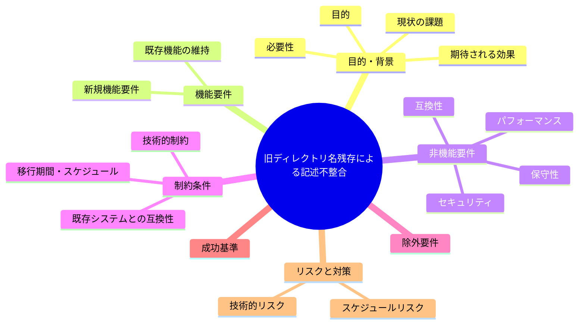
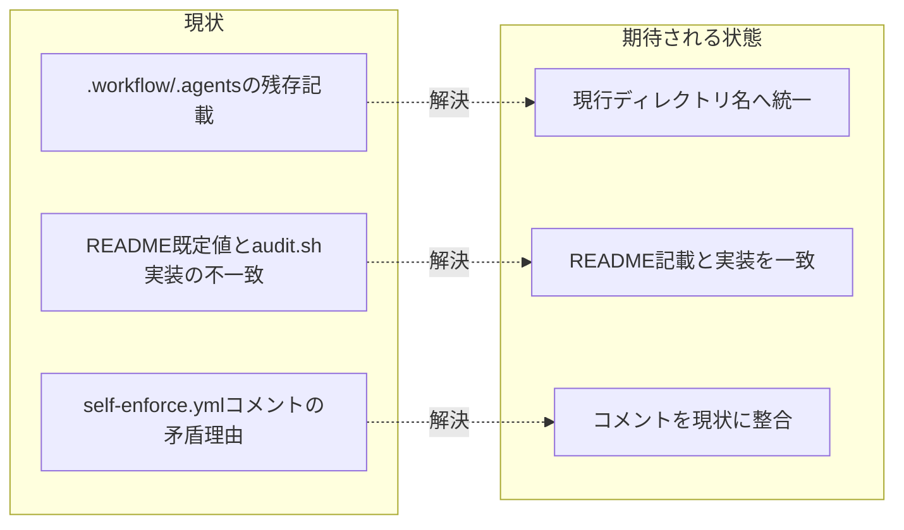

# 要求定義書: 旧ディレクトリ名残存による記述不整合

**プロジェクト名**: 旧ディレクトリ名残存による記述不整合
**作成日**: 2026 年 07 月 14 日
**最終更新**: 2026 年 07 月 14 日

> **重要**:
>
> - 要求定義書は、プロジェクトの全体像を把握するためのものです。詳細な技術仕様や実装方法は要件定義書以降で記載します。必要最低限の情報に収めることを心掛けてください。
> - **このドキュメントは常に更新**: 要求の変更や追加があった場合は、即座にこのドキュメントを更新してください。ドキュメントは「生きているドキュメント」として扱い、実装内容と常に同期させます。
> - **必須項目**: 以下の「必須」と明記した項目は空欄・抽象語のみ（例: 「{説明}」のまま）で提出しないこと。判定可能な形（目的は1文・成功基準は○/×で判定できる記載等）で記入すること。
>
> **用語**: [.agent-skill-chain/source/CONCEPTS.md §用語規約](../../../../../../.agent-skill-chain/source/CONCEPTS.md#用語規約) を参照。

---

## 要求定義の全体像

**注意**:

- 上記の「プロジェクト名」は例です。実際のプロジェクト名に置き換えてください。
- マインドマップは全体像を把握するためのものです。主要なセクション名程度に留め、詳細は記載しないでください。

---

## 1. 目的・背景

### 1.1 目的（必須）

改名済みディレクトリ名（`.workflow`/`.agents`）が正本に残存し実体と食い違う状態を解消する。

### 1.2 背景

2026-07-14 fable による本システムの自己調査で検出。

- **現状の課題**:
  - 実ディレクトリは `.agent-skill-chain/runtime|source|project` へ改名済みだが、正本の複数箇所に旧名（`.workflow` / `.agents`）が残っている。
  - `enforcement/README.md:149` は「WORKFLOW_DIR（既定 .workflow）」と記載するが、`audit.sh` の実装既定値は `.agent-skill-chain/runtime` であり（コード優先だとすれば）README の記載が誤りになる。
  - `.github/workflows/self-enforce.yml` のコメントも、現行の `audit.sh:116, 138-149` の実装と矛盾した理由で non-blocking を正当化している。
  - その他該当箇所: `enforcement/README.md:25, 275`、`boot/CORE.md:74`、`boot/LOAD_POLICY.md:13`、`AGENTS.md:125`。

- **必要性**:
  - 実体とドキュメント記載が食い違うと、設定値（既定ディレクトリ等）を誤認して運用ミスにつながる。

### 1.3 期待される効果（必須: 1 件以上）

- **効果 1**: 正本ドキュメント中の旧名称（`.workflow` / `.agents`）参照が現行の実ディレクトリ名（`.agent-skill-chain/runtime|source|project`）に統一される。
- **効果 2**: `enforcement/README.md` の WORKFLOW_DIR 既定値記載が `audit.sh` の実装既定値と一致する。

**現状と期待される状態の比較**（必要に応じて）:

---

## 2. 機能要件

### 2.1 既存機能の維持（該当する場合）

`audit.sh` の実装既定値（`.agent-skill-chain/runtime`）自体は変更せず、ドキュメント記載側を実装に合わせる方向を基本とする。

### 2.2 新規機能要件

- `enforcement/README.md:25, 149, 275`、`boot/CORE.md:74`、`boot/LOAD_POLICY.md:13`、`AGENTS.md:125` の旧名称記載を現行名称へ修正する。
- `.github/workflows/self-enforce.yml` のコメントを `audit.sh:116, 138-149` の実装内容と整合させる。

---

## 3. 非機能要件

### 3.1 パフォーマンス

- 特になし。

### 3.2 セキュリティ

- 特になし。

### 3.3 互換性

- ドキュメント修正のみであり、既存の動作（audit.sh の実装既定値）を変更しないこと。

### 3.4 保守性

- 実体（コード）とドキュメントの既定値記載が今後もずれないよう、どちらを正とするかの原則を明確にする。

---

## 4. 制約条件

### 4.1 技術的制約

- コードの実装既定値（`.agent-skill-chain/runtime`）を変更する場合は影響範囲が大きいため、原則はドキュメント側を実装に合わせる方向で検討する。

### 4.2 既存システムとの互換性

- 特になし。

### 4.3 移行期間・スケジュール

- 特になし。

---

## 5. 除外要件

- `audit.sh` の実装既定値そのものの変更は対象外とする（ドキュメント記載の是正が主眼）。

---

## 6. 成功基準（必須: 1 件以上）

- 根拠に列挙した箇所（`enforcement/README.md:25, 149, 275` 等）の旧名称記載が現行名称に修正されている。
- `enforcement/README.md:149` の WORKFLOW_DIR 既定値記載が `audit.sh` の実装既定値と一致している。
- `.github/workflows/self-enforce.yml` のコメントが `audit.sh` の現行実装と矛盾しない内容になっている。

---

## 7. リスクと対策

### 7.1 技術的リスク

- **リスク**: ドキュメント修正時に他の正しい旧名称参照（意図的な後方互換記載等）を誤って書き換えるおそれ。
  - **対策**: 修正前に該当箇所を全件洗い出し、意図的な記載か誤りかを個別に判定する。

### 7.2 スケジュールリスク

- **リスク**: 特になし。
  - **対策**: 特になし。

---

## 8. 参考資料

### プロジェクトドキュメント

- 既存プロジェクトの場合は、[`00_システム理解.md`](./00_システム理解.md) - システム理解を参照

### その他の参考資料

- `.agent-skill-chain/source/enforcement/README.md:25, 149, 275`
- `.agent-skill-chain/source/boot/CORE.md:74`
- `.agent-skill-chain/source/boot/LOAD_POLICY.md:13`
- `AGENTS.md:125`
- `.github/workflows/self-enforce.yml`
- `.agent-skill-chain/source/enforcement/audit.sh:116, 138-149`

---

## 9. 次のステップ

この要求定義書の承認後、以下のドキュメントを作成します：

- **次**: [`01_要件定義.md`](./01_要件定義.md) - 要件定義フェーズ
