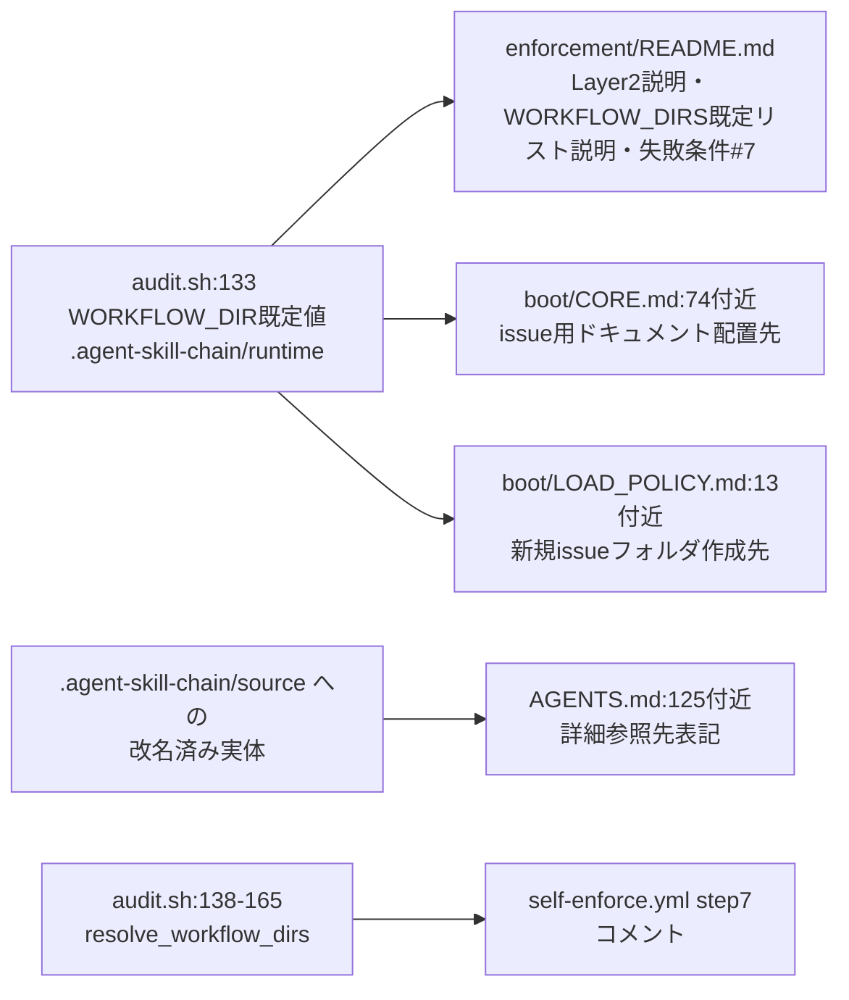

# 設計書: 旧ディレクトリ名残存による記述不整合

**プロジェクト名**: 旧ディレクトリ名残存による記述不整合
**作成日**: 2026年07月14日
**最終更新**: 2026年07月14日

---

## 1. 設計概要

### 1.1 設計方針

本 issue はコードの実装既定値を一切変更せず、ドキュメント側の記載（旧ディレクトリ名 `.workflow`／`.agents` の残存箇所）を実装（`audit.sh` の `WORKFLOW_DIR` 既定値 `.agent-skill-chain/runtime`）に合わせて是正する、テキスト置換のみの最小差分対応とする。

対象箇所は 00/01 で列挙済みの 5 ファイルに限定し、各ファイル内の該当箇所のみをピンポイントで修正する。同一ファイル内に存在する意図的な後方互換記載（`SETUP.md` のレガシー移行手順、`package-manifest.sh` の `legacy_*` 変数等、本 issue の対象ファイル外）や、フレームワークの概念呼称としての `.agents`（例: AGENTS.md 冒頭の「.agent-skill-chain/project が .agents より優先される」等の記述）は変更しない。

### 1.2 設計原則（本プロジェクトで適用するもの）

- **単一責務**: 本変更はテキスト記述の是正のみであり、`audit.sh` 等の判定ロジック・既定値には一切手を加えない。
- **最小差分**: 各ファイルの該当箇所のみを置換し、周辺の文脈・他セクションには触れない。
- **意図の個別判定**: 置換前に該当箇所ごとに「旧名称の残存（誤り）」か「意図的な後方互換・概念呼称の記載」かを判定し、後者は変更しない（00 §7.1 リスク対策）。

---

## 2. アーキテクチャ設計

### 2.1 責務・境界・参照関係

#### 2.1.1 責務一覧

| コンポーネント | 責務（1 文） |
| --- | --- |
| `enforcement/README.md` の Layer2 説明（25行目付近） | PreToolUse が拒否する直接編集対象パスを現行名称（`.agent-skill-chain/runtime`）で説明する。 |
| `enforcement/README.md` の WORKFLOW_DIRS 既定リスト説明（走査スコープ節） | `audit.sh` の `resolve_workflow_dirs` の既定値（`.agent-skill-chain/runtime`）と一致する説明を記載する。 |
| `enforcement/README.md` の失敗条件 #7 説明（TODO/FIXME 残存） | TODO/FIXME 監査の対象パスを現行の走査対象ディレクトリ表記で説明する。 |
| `boot/CORE.md`（issue 用ドキュメント作成の実作業定義） | issue 用ドキュメントの配置先を現行名称（`.agent-skill-chain/runtime`）で説明する。 |
| `boot/LOAD_POLICY.md`（トリガー表の作業依頼行） | 新規 issue フォルダ作成先を現行名称で説明する。 |
| `AGENTS.md`（末尾の詳細参照行） | 「.agents 配下」という誤解を招く表記を「.agent-skill-chain/source 配下」に是正する。 |
| `.github/workflows/self-enforce.yml` の step 7 コメント | enforcement audit が non-blocking である理由を `audit.sh` の実際の `resolve_workflow_dirs` ロジックに基づき説明する。 |

#### 2.1.2 境界

- **入力**: 各ファイルの既存テキスト（該当箇所の周辺文脈）。
- **出力**: 該当箇所のみを置換した同一ファイル。
- **他責務との境界**: `audit.sh` の実装・判定ロジックは変更対象外。同一ファイル内の他セクション（例: `enforcement/README.md` の他の失敗条件説明・系統D/E の抽象仕様等）は変更しない。

#### 2.1.3 参照関係

- 各ファイルの修正内容は `audit.sh:133`（`WORKFLOW_DIR="${WORKFLOW_DIR:-.agent-skill-chain/runtime}"`）と `audit.sh:138-165` 付近の `resolve_workflow_dirs`（WORKFLOW_DIRS 未設定時の既定リスト構成ロジック）を根拠とする。
- `self-enforce.yml` の修正はコメント外部参照禁止規約（`check-comment-refs.sh` が検査）と整合させる必要があり、章節番号・仕様ドキュメント名の直書きを避ける。

### 2.2 システムアーキテクチャ

- **採用パターン**: 既存の文書内テキストの該当箇所のみを `Edit` ツールで置換する（新規ファイル作成・構造変更は伴わない）。
- **根拠**: 00 の対応方針「ドキュメント記載側を実装に合わせる」に忠実に従い、変更範囲を最小化してレビューコストとリグレッションリスクを抑える。

#### 2.2.1 修正対象と根拠の対応図

### 2.3 横断設計判断（ADR）

#### ADR-1: `enforcement/README.md` の WORKFLOW_DIRS「後方互換」記述をどう扱うか

- **コンテキスト**: 修正前の記述は「`docs/maintainer/workflow` が存在しない汎用消費者では `.workflow` のみ＝従来と同一挙動（後方互換）」となっていたが、`.workflow` という名称自体が既に旧名称であり、かつ「従来と同一挙動」という表現はディレクトリ改名前の挙動を指す歴史的説明であり、現在の事実の記述としては不要な文脈を含む。
- **検討した選択肢**:
  1. `.workflow` を `.agent-skill-chain/runtime` に単純置換し、「従来と同一挙動（後方互換）」という文言も残す。
  2. `.workflow` を `.agent-skill-chain/runtime` に置換し、「従来と同一挙動（後方互換）」という历史的経緯の説明を削り、現在の事実（既定の単一ディレクトリ挙動）のみを記述する。
- **決定**: 選択肢 2 を採用する。
- **根拠**: 「従来と同一挙動」という表現はディレクトリ改名前の状態と比較する歴史的説明であり、現在の読者にとっては「現在の既定挙動が何か」が分かれば十分である。歴史的経緯の説明は正本ドキュメントに残すべきノイズになりうる。
- **帰結**: 該当文を「`docs/maintainer/workflow` が存在しない汎用消費者では `.agent-skill-chain/runtime` のみとなる。」という現在の事実のみの記述に是正する。

#### ADR-2: `self-enforce.yml` step 7 コメントの是正範囲

- **コンテキスト**: 現状のコメントは「audit.sh は `.workflow` を前提とするため通らない」という、実装既定値（`.agent-skill-chain/runtime`）と食い違う誤った理由付けをしている。一方、直後の詳細コメント（workflow.db が Git 非追跡であるため CI 上で構造的に SKIP される、という説明）は既に正確であり、変更不要。
- **検討した選択肢**:
  1. 誤った一文だけを `.agent-skill-chain/runtime` への単純な名称置換にとどめる。
  2. `audit.sh` の `resolve_workflow_dirs` の実際のロジック（既定 `.agent-skill-chain/runtime` に加え、`docs/maintainer/workflow` が実在時のみ追加される）を正しく説明する文に置き換える。
- **決定**: 選択肢 2 を採用する。
- **根拠**: 単純な名称置換だけでは「audit.sh は `.agent-skill-chain/runtime` を前提とするため通らない」という文になるが、実際には `docs/maintainer/workflow` も実在時は走査対象に追加されるため、依然として実装と厳密には整合しない。`resolve_workflow_dirs` の実際の挙動（既定値＋実在時追加）を正しく説明することで、00 の狙い（README/コメントを `audit.sh` の実装内容と整合させる）を満たす。
- **帰結**: step 7 コメントを「本リポの issue は docs/maintainer/workflow 配下にあり、audit.sh は既定の WORKFLOW_DIR（.agent-skill-chain/runtime）に加えて実在時のみ docs/maintainer/workflow も走査対象に含める（resolve_workflow_dirs）」という実装に忠実な説明に更新する（直後の workflow.db 非追跡による構造的 SKIP の説明は変更しない）。

---

## 3. テスト戦略

### 3.1 対象ごとのテスト割り当て

| 対象 | 単体（grep 確認） | 結合/API | E2E | クリティカル観点 | 未達理由/補足 |
| --- | --- | --- | --- | --- | --- |
| `enforcement/README.md` の 3 箇所 | ○ | × | × | 意図的な後方互換記載・対象外セクションを誤って書き換えていないこと | 実行系の変更を伴わないため結合/E2E は該当なし |
| `boot/CORE.md`・`boot/LOAD_POLICY.md` | ○ | × | × | 修正後も文の構文・箇条書き構造が壊れていないこと | 同上 |
| `AGENTS.md` | ○ | × | × | 125行目付近以外の `.agents` 概念呼称を誤って書き換えていないこと | 同上 |
| `.github/workflows/self-enforce.yml` | ○（`check-comment-refs.sh`） | ○（YAML 構文確認） | × | コメント外部参照禁止規約に抵触しないこと・YAML 構文が壊れていないこと | 実 CI 実行での確認は本 PR のマージ後に自然に得られる |

### 3.2 監査・レビューでの確認（証跡）

`03_実装計画.md` のテスト観点・単体テスト節、および実施した `grep` による残存確認・`check-comment-refs.sh` の実行結果を証跡とする。

---

## 4. 参考資料

### プロジェクトドキュメント

- [`01_要件定義.md`](./01_要件定義.md) - 要件定義

---

## 5. 前のステップ

- **前**: [`01_要件定義.md`](./01_要件定義.md) - 要件定義フェーズ

---

## 6. 次のステップ

- **次**: [`03_実装計画.md`](./03_実装計画.md) - 実装計画フェーズ
