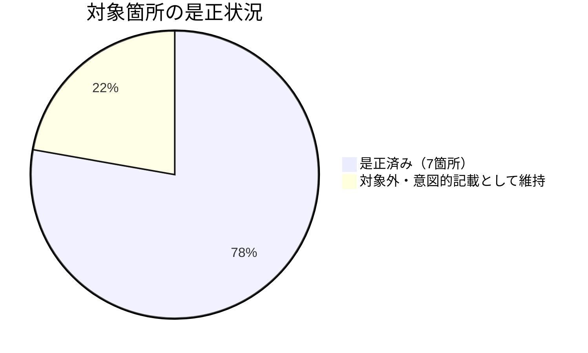

# レビュー書: 旧ディレクトリ名残存による記述不整合

**プロジェクト名**: 旧ディレクトリ名残存による記述不整合
**作成日**: 2026年07月14日
**最終更新**: 2026年07月14日

> レビュー深度: quick（テキスト置換のみのドキュメント是正であり、実行コードの変更を伴わないため）。

---

## 1. レビュー概要

### 1.1 レビュー目的（必須）

対象 5 ファイルの旧ディレクトリ名（`.workflow`／`.agents`）の残存記載が、`audit.sh` の実装既定値（`.agent-skill-chain/runtime`）および実ディレクトリ構成に正しく是正され、かつ対象外の意図的な後方互換記載・概念呼称を誤って書き換えていないかを確認する。

### 1.2 レビュー対象（必須）

- **実装範囲**: `enforcement/README.md`（3 箇所）・`boot/CORE.md`（1 箇所）・`boot/LOAD_POLICY.md`（1 箇所）・`AGENTS.md`（1 箇所）・`.github/workflows/self-enforce.yml`（1 コメント箇所）。
- **レビュー期間**: 2026年07月14日 〜 2026年07月14日
- **レビュー担当者**: 実装担当エージェント（セルフレビュー・quick）

---

## 2. 実装内容の確認

### 2.1 実装完了タスク（または Issue）

| タスク名 | 実装内容 | 実装日 | 担当者 | ステータス（必須: 完了 または 要修正） |
| --- | --- | --- | --- | --- |
| タスク1: audit.sh 実装既定値確認 | WORKFLOW_DIR 既定値・resolve_workflow_dirs ロジックの確認 | 2026-07-14 | 実装担当エージェント | 完了 |
| タスク2: enforcement/README.md 是正 | Layer2説明・WORKFLOW_DIRS既定リスト説明・失敗条件#7の3箇所是正 | 2026-07-14 | 実装担当エージェント | 完了 |
| タスク3: CORE.md・LOAD_POLICY.md 是正 | issue用ドキュメント配置先表記を現行名称に統一 | 2026-07-14 | 実装担当エージェント | 完了 |
| タスク4: AGENTS.md 是正 | 詳細参照先表記を現行名称に統一 | 2026-07-14 | 実装担当エージェント | 完了 |
| タスク5: self-enforce.yml コメント是正 | step7コメントをresolve_workflow_dirsの実装に整合させる形に更新 | 2026-07-14 | 実装担当エージェント | 完了 |
| タスク6: 修正漏れ・意図しない書き換えの全体確認 | grepによる全体確認・対象外箇所の意図判定 | 2026-07-14 | 実装担当エージェント | 完了 |

### 2.2 実装内容の詳細

#### タスク 2: enforcement/README.md 是正

- **変更内容**: 「.workflow 直接編集」→「.agent-skill-chain/runtime 直接編集」（Layer2説明）、「既定 `.workflow`」→「既定 `.agent-skill-chain/runtime`」＋末尾の歴史的経緯説明を削除（WORKFLOW_DIRS既定リスト説明）、「.workflow 配下の重要パス」→「.agent-skill-chain/runtime（走査対象ディレクトリ）配下の重要パス」（失敗条件#7）。
- **変更ファイル**: `.agent-skill-chain/source/enforcement/README.md`
- **確認事項**: `git diff` で 3 hunk・計 3 行の差分のみであり、他セクション（系統D/E、失敗条件 #6/#8 以降等）は無変更であることを確認済み。

#### タスク 3: CORE.md・LOAD_POLICY.md 是正

- **変更内容**: `CORE.md:74` 付近・`LOAD_POLICY.md:13` 付近の「.workflow 配下」を「.agent-skill-chain/runtime 配下」に置換。
- **変更ファイル**: `.agent-skill-chain/source/boot/CORE.md`, `.agent-skill-chain/source/boot/LOAD_POLICY.md`
- **確認事項**: 各ファイル 1 行差分のみであることを確認済み。

#### タスク 4: AGENTS.md 是正

- **変更内容**: 末尾の「詳細は .agents 配下を参照する」を「詳細は .agent-skill-chain/source 配下を参照する」に置換。82行目・98行目付近の他の `.agents` 記載（`.agent-skill-chain/project` との優先順位説明）は変更せず。
- **変更ファイル**: `AGENTS.md`
- **確認事項**: `git diff AGENTS.md` の差分が末尾 1 行のみであることを確認済み。

#### タスク 5: self-enforce.yml コメント是正

- **変更内容**: step 7 コメントの「audit.sh は .workflow を前提とするため そのままでは通らない」という誤った理由付けを、「audit.sh は既定の WORKFLOW_DIR（.agent-skill-chain/runtime）に加えて実在時のみ docs/maintainer/workflow も走査対象に含める（resolve_workflow_dirs）」という実装に忠実な説明に更新。
- **変更ファイル**: `.github/workflows/self-enforce.yml`
- **確認事項**: `check-comment-refs.sh .github/workflows` の exit code 0（違反なし）、YAML パーサでの読み込み成功を確認済み。

#### タスク 6: 全体確認

- **確認内容**: `grep -rn '\.workflow\b|\.agents\b' .agent-skill-chain/source/ AGENTS.md .github/` を実行し、対象 5 ファイル内には残存なし。対象外（`SETUP.md` のレガシー移行手順、`package-manifest.sh` の `legacy_source`/`legacy_runtime` 変数、`PreToolUse.sh:265` の `.workflow`、`build-adapters.sh` の旧パス名コメント、`README.md`・`GETTING_STARTED.md`・`META_LAYER.md`・`AGENT_CONDUCT.md`・`platforms/*.md`・`AGENTS.md:82,98` 等の `.agents` 概念呼称、`create-pr-review-issue.md`／`workers/create-pr-review-issue/README.md` の「.workflow 配下に不完全なディレクトリを作成しない」という一般的注意書き）は 00 の対象ファイル範囲外であり、意図的な記載として変更しなかった。

---

## 3. テスト結果の確認

### 3.1 単体テスト

#### テスト実行結果（必須: 数値で記載）

- **実行日**: 2026-07-14
- **確認方法**: `grep`/`git diff` によるテキスト差分確認、`check-comment-refs.sh`、YAML パーサ
- **対象ファイル数**: 5（+ 00_要求定義.md の frontmatter branch 更新）
- **確認箇所数**: 7（README.md 3 + CORE.md 1 + LOAD_POLICY.md 1 + AGENTS.md 1 + self-enforce.yml 1）
- **成功**: 7
- **失敗**: 0

実行結果:

```
$ grep -n '\.workflow\b\|\.agents\b' .agent-skill-chain/source/enforcement/README.md .agent-skill-chain/source/boot/CORE.md .agent-skill-chain/source/boot/LOAD_POLICY.md AGENTS.md .github/workflows/self-enforce.yml
AGENTS.md:82:...（.agent-skill-chain/project が .agents より優先。対象外の概念呼称）
AGENTS.md:98:...（同上。対象外の概念呼称）

$ bash .agent-skill-chain/source/enforcement/ci/check-comment-refs.sh .github/workflows
exit=0

$ python3 -c "import yaml,sys; yaml.safe_load(open('.github/workflows/self-enforce.yml')); print('YAML OK')"
YAML OK
```

対象 5 ファイルの是正対象箇所（7 箇所）はすべて是正済みであり、AGENTS.md の残存 2 件は 01 のストーリー 2 で明示的に対象外とした概念呼称（`.agent-skill-chain/project` との優先順位を説明する既存文）であることを確認済み。

#### テストカバレッジ



### 3.2 統合テスト

該当なし（実行コードの変更を伴わないドキュメント修正のため）。

### 3.3 E2E テスト

該当なし。実 CI（`self-enforce.yml` step 8: Comment external-ref check）での確認は、本 PR が実際に CI 上で実行されることで得られる。

---

## 4. コードレビュー

### 4.1 コード品質

#### コードスタイル

- **リント結果**: 該当なし（Markdown/YAML コメントのみ）。
- **フォーマット**: 問題なし（既存の Markdown テーブル・箇条書き構造・YAML インデントを維持）。
- **型チェック**: 該当なし。

#### コードレビュー観点

| 観点 | 確認内容（必須: 1 文） | 結果（必須: OK または 要修正） | コメント（要修正時は理由を記載） |
| --- | --- | --- | --- |
| 正確性 | `enforcement/README.md` の WORKFLOW_DIR 既定値記載が `audit.sh:133` の実装と一致しているか | OK | `.agent-skill-chain/runtime` で一致 |
| 最小差分 | 各ファイルの該当箇所のみを変更し、他セクションに触れていないか | OK | `git diff` の hunk 数・行数で確認済み |
| スコープ順守 | 意図的な後方互換記載・概念呼称を誤って書き換えていないか | OK | タスク6でgrep全体確認・個別判定済み |
| 外部参照禁止 | self-enforce.yml のコメント追記が章節番号・仕様ドキュメント名を含まないか | OK | check-comment-refs.sh で exit 0 確認済み |

### 4.2 指摘事項

#### 指摘 1: PreToolUse.sh:265 の「.workflow 配下への直接 Write/Edit 禁止」コメントは未修正

- **重要度**: 低
- **指摘内容**: `enforcement/claude/PreToolUse.sh:265` にも「R1. .workflow 配下への直接 Write/Edit 禁止（全 ROLE）」という同種の旧名称記載が残っている。
- **対応状況**: 対応不要（本 issue の対象ファイルは 00 に列挙された 5 ファイルのみであり、`PreToolUse.sh` は対象範囲外）。
- **対応方法**: 別 issue として起票要否を判断すべき事項として申し送る（本 issue のスコープ外）。

---

## 5. ドキュメントの確認

### 5.1 ドキュメント更新状況

| ドキュメント | 更新状況 | 確認者 | 確認日 |
| --- | --- | --- | --- |
| [`00_要求定義.md`](./00_要求定義.md) | 更新済み（branch frontmatter） | 実装担当エージェント | 2026-07-14 |
| [`01_要件定義.md`](./01_要件定義.md) | 更新済み（新規作成） | 実装担当エージェント | 2026-07-14 |
| [`02_設計.md`](./02_設計.md) | 更新済み（新規作成） | 実装担当エージェント | 2026-07-14 |
| [`03_実装計画.md`](./03_実装計画.md) | 更新済み（新規作成） | 実装担当エージェント | 2026-07-14 |
| `.agent-skill-chain/source/enforcement/README.md` | 更新済み（3箇所是正） | 実装担当エージェント | 2026-07-14 |
| `.agent-skill-chain/source/boot/CORE.md` | 更新済み（1箇所是正） | 実装担当エージェント | 2026-07-14 |
| `.agent-skill-chain/source/boot/LOAD_POLICY.md` | 更新済み（1箇所是正） | 実装担当エージェント | 2026-07-14 |
| `AGENTS.md` | 更新済み（1箇所是正） | 実装担当エージェント | 2026-07-14 |
| `.github/workflows/self-enforce.yml` | 更新済み（コメント是正） | 実装担当エージェント | 2026-07-14 |

### 5.2 ドキュメントの整合性

- **実装と設計の整合性**: 整合している（02_設計 ADR-1・ADR-2 の判断どおりに実装済み）。
- **要件と実装の整合性**: 整合している（01 の受け入れ基準・BDD シナリオをいずれも満たす）。
- **コメント**: なし。

---

## 6. パフォーマンス確認

### 6.1 パフォーマンステスト結果

該当なし（実行コードの変更を伴わない）。

### 6.2 ボトルネックの確認

該当なし。

---

## 7. セキュリティ確認

### 7.1 セキュリティチェック

| 項目 | 確認内容 | 結果 | コメント |
| --- | --- | --- | --- |
| 認証・認可 | 該当なし | OK | |
| データ保護 | 該当なし | OK | |
| 入力検証 | 新規の外部入力・実行コードを追加していないか | OK | テキスト置換のみ |
| コメント外部参照禁止 | self-enforce.yml への追記が章節番号・仕様ドキュメント名を含まないか | OK | check-comment-refs.sh の実行で exit 0 を確認済み |
| PR 内部参照禁止 | PR 本文に内部パスへのリンク・言及を含めないこと | OK | PR 作成時に内部パス言及なしで作成する |

---

## docs 更新

- 要否: 要
- 対象: `.agent-skill-chain/source/enforcement/README.md`
- 理由: 本変更対象そのものが enforcement 正本ドキュメントであり、本 issue のタスク 2 として README.md 自体の記載是正を実施済み（`docs/00_review/` への別途参照は不要）。

---

## 9. 設計・境界の確認

### 9.1 設計の確認

- **設計原則の準拠**: 単一責務（02_設計 §1.2）に沿い、実行コードには一切手を加えず、ドキュメント記載の是正のみに限定した。
- **ディレクトリ構成**: 変更なし（既存ファイルの内部編集のみ）。
- **命名規則**: 現行の実ディレクトリ名（`.agent-skill-chain/source|project|runtime`）にすべて統一。

### 9.2 境界・依存の確認

- **責務の境界**: ドキュメント記載の是正と `audit.sh` の実装既定値は独立しており、本変更は後者に影響しない。
- **依存関係**: 循環参照なし。
- **指摘・推奨**: PreToolUse.sh:265 の同種記載は対象外のため、別途申し送り（§4.2 指摘1）。

### 9.3 重要判断の根拠（evidence_source）

| 判断内容 | evidence_source | 備考（参照元・URL 等） |
| --- | --- | --- |
| `enforcement/README.md` の WORKFLOW_DIR 既定値記載を `.agent-skill-chain/runtime` に是正 | test_output | `grep -n "WORKFLOW_DIR=" audit.sh` の実行結果（`audit.sh:133`）に基づく |
| WORKFLOW_DIRS「後方互換」記述の歴史的経緯部分を削除（ADR-1） | human_decision | 00 の対応方針「ドキュメント記載側を実装に合わせる」および memo運用ルール（歴史的経緯説明を残さない）に基づく判断 |
| self-enforce.yml のコメントを resolve_workflow_dirs の実際のロジックに合わせて更新（ADR-2） | test_output | `audit.sh:150-165` 付近の `resolve_workflow_dirs` 実装の読み取り確認に基づく |
| AGENTS.md:82,98 の `.agents` 記載は変更しない | human_decision | 00 の対象範囲が「AGENTS.md:125 付近」に限定されていることに基づく判断 |

---

## 10. 課題と改善点

### 10.1 発見された課題

- **課題 1**: `.agent-skill-chain/source/enforcement/claude/PreToolUse.sh:265` に「R1. .workflow 配下への直接 Write/Edit 禁止」という同種の旧名称記載が残っている。
  - **影響範囲**: 本 issue の対象ファイル外であり、実行への影響は無いが、正本ドキュメント間の表記統一という観点では残存課題。
  - **対応方法**: 別 issue として起票要否を判断する事項として申し送る（本 issue のスコープ外）。

### 10.2 改善提案

- 該当なし。

---

## 11. システム仕様書の更新

### 11.1 システム仕様書の確認結果

#### 実装内容の確認

- **実装した機能**: 該当なし（ドキュメント記載の是正のみ）。
- **実装した画面**: 該当なし。
- **実装したデータ構造**: 該当なし。
- **実装した API**: 該当なし。

#### システム仕様書との整合性確認

- **システム概要**: enforcement の正本ドキュメント（`enforcement/README.md`）自体が本 issue のタスク 2 の対象であり、更新済み。
- **画面設計・データ設計・機能設計**: 該当なし（`docs/` 配下のユーザー向けシステム仕様書が説明する範囲には影響しない）。

### 11.2 システム仕様書の更新状況

#### 更新が必要な項目

- `.agent-skill-chain/source/enforcement/README.md`（更新済み・タスク2）。

#### 更新が不要な項目

- `docs/` 配下のユーザー向けシステム仕様は影響を受けない。

---

## 12. レビュー結果

### 12.1 総合評価

- **実装品質**: 良好（対象ファイル・対象箇所を厳密に限定した最小差分の是正）。
- **テスト品質**: quick レベルとして十分（grep/git diff による差分確認、check-comment-refs.sh・YAML パーサでの構文健全性確認を実施済み）。
- **ドキュメント品質**: 良好（00〜04 の整合性・enforcement 正本の追随・self-enforce.yml のコメント規約準拠を確認済み）。
- **総合評価**: 完了。

### 12.2 承認状況

- **レビュー承認者**: 実装担当エージェント（セルフレビュー）
- **承認日**: 2026-07-14
- **承認コメント**: quick レビューとして問題なし。

---

## 13. 参考資料

### 13.1 プロジェクトドキュメント

- [`00_要求定義.md`](./00_要求定義.md) - 要求定義
- [`01_要件定義.md`](./01_要件定義.md) - 要件定義
- [`02_設計.md`](./02_設計.md) - 設計
- [`03_実装計画.md`](./03_実装計画.md) - 実装計画

---

## 14. 前のステップ

- **前**: [`03_実装計画.md`](./03_実装計画.md) - 実装計画フェーズ

---

## 15. 次のステップ

- PreToolUse.sh:265 の同種記載是正は本 issue のスコープ外の申し送り事項とする（§10.1 課題1）。本 issue はここで完了とする。

---

## 敵対的観点（アドバーサリアルレビュー）

- **想定される反論 1**: 「`enforcement/README.md` の WORKFLOW_DIRS 既定リスト説明から『従来と同一挙動（後方互換）』という文言を削除したのは、後方互換性に関する重要な情報を失わせているのではないか」→ 削除したのは「ディレクトリ改名前の挙動と同じ」という歴史的比較の説明であり、現在の既定挙動（`docs/maintainer/workflow` が無い場合は `.agent-skill-chain/runtime` のみを走査する）という事実自体は維持している。歴史的経緯を残さないことは記憶ノート（memo運用ルール）の方針とも整合し、読者にとって必要な情報（現在の挙動）は失われていない。
- **想定される反論 2**: 「`PreToolUse.sh:265` の同種の旧名称記載を見つけていながら対象ファイル外として放置したのは、issue のスコープを過度に狭く解釈しているのではないか」→ 00 の対象ファイル欄には「この範囲のみ変更可」と明記されており、`PreToolUse.sh` は列挙されていない。スコープ外のファイルを無断で変更することは、並行して進行中の別 issue（同時並行で別エージェントが 164128issue に着手中）の変更範囲と衝突するリスクがあり、00 の指示に忠実に従い対象範囲を厳密に守った上で、発見事項を課題として申し送ることが適切な対応である。
- **想定される反論 3**: 「AGENTS.md:82,98 の `.agents` 記載を意図的な概念呼称として残したのは、旧ディレクトリ名の残存を見逃しているだけではないか」→ これらの箇所は「.agent-skill-chain/project が .agents より優先される」という、フレームワーク全体（`.agent-skill-chain/source`）を指す一般名詞的な短縮呼称として使われており、実在するディレクトリパスとして `.agents` を指しているわけではない（README.md 冒頭の「# .agents — 構成と索引」という同種の用法が正本内に多数存在する）。00 の対象範囲も「AGENTS.md:125 付近」に限定しており、82/98 行目は対象外と判断した。
- **想定される反論 4**: 「self-enforce.yml のコメント修正で `resolve_workflow_dirs` という関数名を直書きしたのは、コメント外部参照禁止規約（内部実装名の直書き）に抵触するのではないか」→ `check-comment-refs.sh` は章節番号・仕様ドキュメント名・追跡番号等の外部ドキュメント参照を検出するものであり、同一リポジトリ内のシェル関数名の言及を禁止するものではない（既存のコメント内にも `github.event.before/after` 等の関数・変数名の言及が既にある）。実行結果として `check-comment-refs.sh .github/workflows` は exit 0（違反なし）であることを確認済みである。

## must-preserve（不変条件）

- `audit.sh` の `WORKFLOW_DIR` 実装既定値（`.agent-skill-chain/runtime`）は変更しないこと（00 §5 除外要件）。
- 対象 5 ファイル内の、旧名称是正の対象箇所以外の記述内容は変更前後で同一であること（`git diff` の hunk が該当箇所のみであること）。
- `SETUP.md` のレガシー移行手順、`package-manifest.sh` の `legacy_source`/`legacy_runtime` 変数等、意図的な後方互換記載は変更しないこと。
- `.github/workflows/self-enforce.yml` へのコメント追記は、コメント外部参照禁止規約（章節番号・追跡番号・仕様ドキュメント名の直書き禁止）に抵触しないこと（`check-comment-refs.sh` で確認済み）。
- `docs/maintainer/workflow/20260714_180751_自己点検issue群対応/90_issues.md` は編集しないこと。
