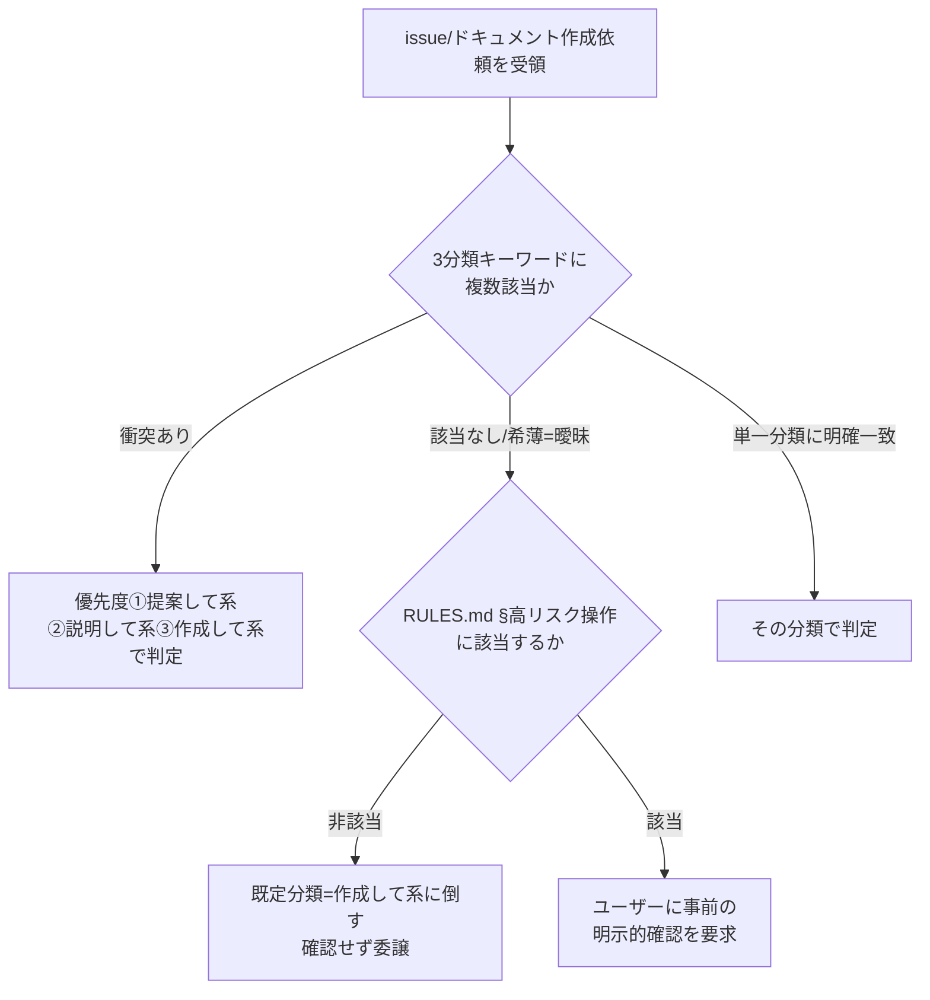

# 要件定義書: issue 依頼の分類・優先度規則のダブルバインド解消

**プロジェクト名**: issue 依頼の分類・優先度規則のダブルバインド解消
**作成日**: 2026 年 07 月 15 日
**最終更新**: 2026 年 07 月 15 日

> **重要**: **このドキュメントは常に更新**: 要件の変更や追加があった場合は、即座にこのドキュメントを更新してください。ドキュメントは「生きているドキュメント」として扱い、実装内容と常に同期させます。
>
> **用語**: [.agent-skill-chain/source/CONCEPTS.md §用語規約](../../../../../../.agent-skill-chain/source/CONCEPTS.md#用語規約) を参照。

---

## 1. 概要

### 1.1 システム概要

AGENTS.md は、issue / ドキュメント作成依頼を受けたメインエージェントの挙動を 2 か所で規定している。

- **AGENTS.md:39**（自立進行ルール）: 「メインエージェントが『サブを呼んでよいか』『この方針で進めてよいか』等を逐一ユーザーに確認してから command を実行することは、**後述の高リスク操作に該当する場合を除き**禁止とする」。
- **AGENTS.md:55-62**（issue 作成依頼時のサブ自動委譲ルール・種別判定）: 依頼を「作成して系」「提案して系」「説明して系」の 3 分類に判定し、キーワード衝突時は「①提案して系、②説明して系、③作成して系」の優先度で判定する（AGENTS.md:61 前半）。そのうえで AGENTS.md:61 後半は「**曖昧な場合はユーザーに確認する**」とだけ定めており、この「曖昧」が RULES.md §高リスク操作（外部サービス・インフラへの書き込み、大量削除・履歴改変等、不可逆または広範囲な影響を持つ操作）に該当するか否かで場合分けされていない。

この結果、「3 分類のどれにも明確に該当しない曖昧な依頼」（高リスク操作ではない、単なる分類の曖昧さ）を受けたとき、AGENTS.md:61 に従えば「ユーザーに確認する」べきだが、AGENTS.md:39・RULES.md §高リスク操作の原則に従えば「高リスクでない限り確認は禁止」であるためユーザーに確認してはならない、という二律背反（ダブルバインド）が生じる。00_要求定義.md §7.1 は、この解消方針として「高リスク操作（削除・外部送信等）に限り確認必須とし、それ以外は既定分類に倒す」方向性を示している。本 01 はこれを踏まえ、AGENTS.md:61 後半の文言修正方針を検証可能な受け入れ基準・BDD シナリオに落とし込む。

### 1.2 用語集

| 用語 | 説明 |
| -------- | ------ |
| 3 分類 | issue / ドキュメント作成依頼の種別。「作成して系」「提案して系」「説明して系」（AGENTS.md:58） |
| キーワード衝突 | 依頼文が複数分類のキーワードに同時該当する状態。優先度①提案して系②説明して系③作成して系で解決される（AGENTS.md:61 前半） |
| 分類曖昧ケース | キーワード衝突とは異なり、依頼文がどの分類のキーワードにも明確に一致しない、または該当キーワードが希薄で分類の確信が持てない状態 |
| 高リスク操作 | RULES.md §高リスク操作 の定義（外部サービス・インフラへの書き込み、リポジトリやファイル群の大量削除・履歴改変等、不可逆または広範囲な影響を持つ操作）を正本とする。issue 分類の曖昧さそのものはこの定義に該当しない |
| 既定分類 | 分類曖昧ケースで確認を省略する場合に、既定として採用する分類（本 01 では「作成して系」を既定候補とし、02 設計で確定する） |
| ダブルバインド | AGENTS.md:39/RULES.md §高リスク操作（確認原則禁止）と AGENTS.md:61 後半（曖昧時は確認）が同時に要求され、いずれを選んでも他方に違反する状態 |

---

## 2. 機能要件

### 2.1 ユーザーストーリー

#### ストーリー 1: 分類曖昧ケースでの既定挙動を一意化する

- **As a** メインエージェント（orchestrator）
- **I want to** issue / ドキュメント作成依頼が 3 分類のどれにも明確に該当しない「分類曖昧ケース」を受けたとき、確認する／既定分類に倒すのいずれを取るべきかが AGENTS.md の記載のみから一意に判定できる
- **So that** AGENTS.md:39（逐一確認禁止・高リスク操作の例外）と AGENTS.md:61（曖昧時確認）の間のダブルバインドを起こさず、自立的に phase 判定 → command 選択 → 委譲まで進められる

**受け入れ基準**:

- AGENTS.md:61 後半の「曖昧な場合はユーザーに確認する」という無条件の確認要求が、高リスク操作に該当するか否かで場合分けされた文言に修正されている。
- 修正後の文言から、「分類曖昧ケースかつ非高リスク操作」の場合に取るべき行動（既定分類に倒す）が一意に読み取れる。
- 修正後の文言から、「分類曖昧ケースかつ高リスク操作」の場合に取るべき行動（ユーザーに確認する）が一意に読み取れる。
- AGENTS.md:39 の「後述の高リスク操作に該当する場合を除き禁止」という既存の例外条件と、AGENTS.md:61 修正後の条件分岐が同一の判定基準（RULES.md §高リスク操作）を参照し、矛盾しない。

#### ストーリー 2: キーワード衝突と分類曖昧ケースを区別する

- **As a** メインエージェント（orchestrator）
- **I want to** 「キーワード衝突（複数分類に同時該当）」と「分類曖昧ケース（どの分類にも明確に該当しない）」が別々の解決規則で扱われることが AGENTS.md 上で明確である
- **So that** 既存のキーワード衝突優先度（①提案して系②説明して系③作成して系。AGENTS.md:61 前半）を変更せずに、分類曖昧ケースのみを本 issue のスコープとして修正できる

**受け入れ基準**:

- AGENTS.md:61 前半のキーワード衝突優先度（①提案して系②説明して系③作成して系）の文言・優先順位は変更しない。
- 修正後の AGENTS.md において、「キーワード衝突時」と「分類曖昧ケース（該当キーワードが希薄・不在）」が別の条件として読み分けられる。

#### ストーリー 3: 既存の高リスク操作定義を再利用し、新たな判定基準を増やさない

- **As a** 本プロジェクトの保守担当
- **I want to** 分類曖昧ケースの確認要否判定が、RULES.md §高リスク操作 という既存の単一の定義のみを参照し、AGENTS.md 側に高リスク操作の別定義・別基準を新設しない
- **So that** 高リスク操作の定義が複数箇所に分散して将来ドリフトするリスクを避けられる（00_要求定義.md §3.3 の互換性要件と整合）

**受け入れ基準**:

- 修正後の AGENTS.md:61 は、高リスク操作の判定基準を独自定義せず、RULES.md §高リスク操作 を参照する形で記述される。
- AGENTS.md:44（委譲時のユーザー確認ルール中の高リスク操作の例外規定）との重複定義が生じない（参照で統一する）。

### 2.2 BDD ユースケース

#### ユースケース 1: 分類曖昧ケース（非高リスク）は既定分類に倒す

**シナリオ 1: どの分類キーワードにも明確に一致しない依頼は確認せず既定分類で進める**

```gherkin
Feature: 分類曖昧ケースの既定挙動（非高リスク）
  Scenario: 3分類のキーワードに明確に一致しない issue 関連依頼を受ける
    Given メインエージェント（orchestrator）が依頼文を3分類（作成して系／提案して系／説明して系）のキーワードと照合している
    And 依頼文がどの分類のキーワードにも明確に一致せず、かつ RULES.md §高リスク操作 に該当しない
    When メインエージェントが AGENTS.md:61（修正後）に従って行動を決定する
    Then ユーザーに確認せず、既定分類（作成して系）としてサブへ委譲し、AGENTS.md:39 の逐一確認禁止に違反しない
```

**シナリオ 2: キーワード衝突時は既存の優先度規則が優先され、既定分類フォールバックは適用されない**

```gherkin
Feature: キーワード衝突と分類曖昧ケースの区別
  Scenario: 「提案して系」と「作成して系」のキーワードが同一依頼文に同時出現する
    Given 依頼文に「issueを作成して」（作成して系）と「プロンプト案だけ教えて」（提案して系）のキーワードが両方含まれる
    When メインエージェントが AGENTS.md:61 前半の優先度（①提案して系②説明して系③作成して系）を適用する
    Then 分類曖昧ケースの既定分類フォールバックではなく、優先度規則により「提案して系」として判定される
```

#### ユースケース 2: 分類曖昧ケースが高リスク操作を伴う場合は確認する

**シナリオ 1: 曖昧な依頼が大量削除・外部送信等の高リスク操作を含む場合は確認が必須**

```gherkin
Feature: 分類曖昧ケースの既定挙動（高リスク）
  Scenario: 分類が曖昧な依頼の内容が RULES.md §高リスク操作 に該当する
    Given メインエージェントが受けた依頼文の分類が3分類のどれにも明確に一致しない
    And 依頼内容が RULES.md §高リスク操作（外部サービスへの書き込み・大量削除・履歴改変等）に該当する
    When メインエージェントが AGENTS.md:61（修正後）に従って行動を決定する
    Then 既定分類に倒さず、ユーザーに事前の明示的な確認を要求してから進める（AGENTS.md:39・AGENTS.md:44 の高リスク操作の例外と整合）
```

**処理フロー**（分類曖昧ケースの判定フロー）:



### 2.3 ビジネスルール

- AGENTS.md:61 前半のキーワード衝突優先度（①提案して系②説明して系③作成して系）は変更しない。
- 高リスク操作の判定基準は RULES.md §高リスク操作 を唯一の正本とし、AGENTS.md 側で再定義しない。
- 分類曖昧ケース（非高リスク）の既定分類は「作成して系」を候補とし、最終確定は 02 設計で行う（3 分類のうち最も committal でない「提案して系」を既定にする案も 02 で比較検討しうる。ただしいずれの案でも「一意に判定できる」という受け入れ基準は満たすこと）。
- 本修正は AGENTS.md:39（自立進行ルール）・AGENTS.md:44（委譲時のユーザー確認ルール中の高リスク操作の例外）と矛盾しないこと。

---

## 3. 非機能要件

### 3.1 パフォーマンス要件

- 該当なし（判定ロジックはテキストルールであり、実行時オーバーヘッドは生じない）。

### 3.2 セキュリティ要件

- 高リスク操作（外部送信・大量削除等）を伴う分類曖昧ケースでの確認要求を弱めないこと（確認省略の対象は非高リスクケースに限る）。

### 3.3 ユーザビリティ要件

- 修正後の AGENTS.md:61 を読んだ AI エージェントが、分類曖昧ケースに遭遇した際に「確認する／既定分類に倒す」のどちらを取るべきか、他ファイルを参照せずとも一意に判断できること（RULES.md §高リスク操作の参照は許容するが、判定手順自体は AGENTS.md 内で完結すること）。

### 3.4 可用性要件

- 既存のキーワード衝突優先度・3 分類の基本枠組み（00_要求定義.md §2.1）は維持し、通常の依頼判定フローを壊さないこと。

---

## 4. 外部インターフェース要件

### 4.1 API 要件

- 該当なし。

### 4.2 データ形式要件

- 該当なし。

---

## 5. 制約事項

- 対応方針の具体設計・実装（AGENTS.md の実際の文言修正・行番号確定）は本 01 では行わず、02_設計・03_実装計画で扱う（00_要求定義.md §5 除外要件と整合）。
- #22/#23（逐一確認禁止・種別判定）の機械実装自体は本 issue のスコープ外（00_要求定義.md §4.1 の制約を継承）。
- AGENTS.md の該当行番号（39、55-62、特に 61）は 2026-07-15 時点の現物確認に基づく。実装フェーズ（02/03）着手時に AGENTS.md の現物を再確認し、行番号がずれていないか検証すること。

### 未検証・要人間確認事項（inference_only）

- 既定分類の最終候補（「作成して系」か「提案して系」か）は、00_要求定義.md §7.1 の方向性からの推論であり、AGENTS.md の他箇所（例: PHASES.md §一般的な issue 作成ステップ）との整合確認は本 01 では未実施。02 設計で PHASES.md 参照箇所（AGENTS.md:62）との整合を確認したうえで確定すること。RULES.md §高リスク操作 に該当しない軽量な文言修正判断であるため、EVIDENCE_POLICY.md 節4 の二段階（要注意／要人間確認）に照らせば「要注意」（非ブロッキング）に位置づけられ、この未確定のまま 02 設計へ自走を継続してよい。

---

## 6. 参考資料

### プロジェクトドキュメント

- [`00_要求定義.md`](./00_要求定義.md) - 要求定義（課題の提起・7.1 の解消方向性）

### その他の参考資料

- `AGENTS.md:39`（自立進行ルール・高リスク操作の例外）
- `AGENTS.md:44`（委譲時のユーザー確認ルール・高リスク操作の例外）
- `AGENTS.md:55-62`（issue 作成依頼時のサブ自動委譲ルール・種別判定。特に 61 行目「曖昧な場合はユーザーに確認する」）
- `.agent-skill-chain/source/RULES.md` §高リスク操作（判定基準の正本）
- `.agent-skill-chain/source/EVIDENCE_POLICY.md` 節4（inference_only の二段階顕在化。本件は「要注意」相当の軽量判断）
- `.agent-skill-chain/source/workflow/PHASES.md` §一般的な issue 作成ステップ（AGENTS.md:62 の参照先。02 設計での整合確認対象）

---

## 7. 前のステップ

この要件定義書は、以下のドキュメントを基に作成されています：

- **前**: [`00_要求定義.md`](./00_要求定義.md) - 要求定義フェーズ

---

## 8. 次のステップ

この要件定義書の承認後、以下のドキュメントを作成します：

- **次**: [`02_設計.md`](./02_設計.md) - 設計フェーズ（既定分類の最終候補・AGENTS.md 修正文言の確定）
