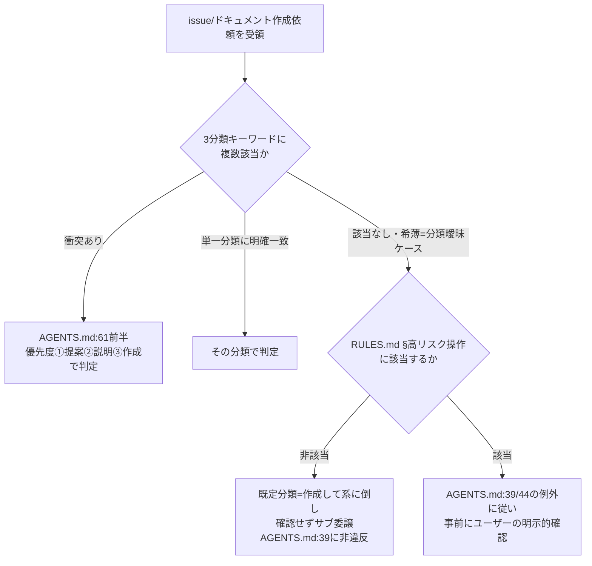

# 設計書: issue 依頼の分類・優先度規則のダブルバインド解消

**プロジェクト名**: issue 依頼の分類・優先度規則のダブルバインド解消
**作成日**: 2026 年 07 月 15 日
**最終更新**: 2026 年 07 月 15 日

> **重要**: **このドキュメントは常に更新**: 設計の変更や追加があった場合は、即座にこのドキュメントを更新してください。ドキュメントは「生きているドキュメント」として扱い、実装内容と常に同期させます。
>
> **用語**: [.agent-skill-chain/source/CONCEPTS.md §用語規約](../../../../../../.agent-skill-chain/source/CONCEPTS.md#用語規約) を参照。

---

## 1. 設計概要

**必須**: 設計方針・原則は [.agent-skill-chain/source/spec/01\_設計原則.md](../../../../../../.agent-skill-chain/source/spec/01_設計原則.md) を先に参照した上で、本プロジェクトに適用するものを選び記載する。

### 1.1 設計方針

本 issue の成果物は「コード」ではなく **AGENTS.md 中の 1 段落（行 61 付近）のテキストルール**である。設計方針は、既存の判定規則を増やさず、AGENTS.md:61 後半の無条件確認要求（「曖昧な場合はユーザーに確認する」）を、既存の高リスク操作定義（RULES.md §高リスク操作）を唯一の分岐基準とする条件付き文言へ置換することに限定する。新しい判定基準・新しい高リスク定義は一切作らない（01 §2.3 ビジネスルール・ストーリー 3 と整合）。

### 1.2 設計原則（本プロジェクトで適用するもの）

- **UNIX哲学（シンプルに保つ／組み合わせ可能）**: 高リスク判定は RULES.md §高リスク操作 に委ね、AGENTS.md:61 はそれを参照するのみとする。判定基準を重複させない。
- **単一責務**: 高リスク操作の定義は RULES.md の 1 か所に集約し、AGENTS.md:61 は「分類曖昧ケースの分岐手順」だけを責務とする。
- **AIフレンドリー設計（意図が分かる命名・明確な責務）**: 「キーワード衝突」と「分類曖昧ケース」を別条件として明示的に書き分け、AGENTS.md を読んだ AI が他ファイルを往復せずに一意判断できるようにする（01 §3.3 ユーザビリティ要件）。

> **設計判断の優先順位**（[spec/06](../../../../../../.agent-skill-chain/source/spec/06_設計判断の優先順位.md)）: ①可読性 ②単一責務 ③仕様との整合性 を上位に置く。本件では「読んだだけで一意に判定できる可読性」と「高リスク定義を一元管理する単一責務」を最優先とした。

---

## 2. アーキテクチャ設計

### 2.1 責務・境界・参照関係

#### 2.1.1 責務一覧

| コンポーネント | 責務（1 文） |
| -------------------- | -------------------- |
| AGENTS.md:61（修正対象・種別判定末尾） | 分類曖昧ケースにおける既定挙動（既定分類へ倒す／高リスク時は確認）を、RULES.md §高リスク操作 を分岐基準として一意に規定する |
| AGENTS.md:39・44（既存・自立進行／確認例外） | 「高リスク操作を除き逐一確認は禁止」という自立進行の原則を規定する（本 issue では変更しない参照先） |
| RULES.md §高リスク操作（既存・正本） | 高リスク操作の定義（外部書き込み・大量削除・履歴改変等）を単一の正本として保持する（本 issue では変更しない参照先） |
| PHASES.md §一般的な issue 作成ステップ（既存・整合先） | 「提案して／説明して」が明示された場合のみ非委譲、既定は委譲、という挙動を規定する（AGENTS.md:62 の参照先。整合を確認する対象） |

#### 2.1.2 境界

- **入力**: メインエージェント（orchestrator）が受領した issue / ドキュメント作成依頼の文面。
- **出力**: 分類曖昧ケースに対する一意な行動決定（「既定分類=作成して系でサブ委譲」または「高リスク時はユーザー確認」）。
- **他責務との境界（本 issue の範囲外）**:
  - 高リスク操作の**定義そのもの**の変更（RULES.md §高リスク操作 が正本。本 issue は参照のみ）。
  - キーワード衝突優先度（①提案②説明③作成。AGENTS.md:61 前半）の変更。
  - #22/#23 の機械実装・enforcement 判定の新設（01 §5 制約・00 §5 除外要件）。

#### 2.1.3 参照関係

- AGENTS.md:61（修正後） → RULES.md §高リスク操作（分岐基準の参照）。
- AGENTS.md:61（修正後） → AGENTS.md:39/44（自立進行・確認例外原則との整合）。
- AGENTS.md:62 → PHASES.md §一般的な issue 作成ステップ（既存の参照。整合を保つ）。
- 循環参照なし。高リスク定義は RULES.md の一方向参照のみとし、AGENTS.md 側に逆定義を持たせない。

### 2.2 システムアーキテクチャ

- **採用パターン**: 単一正本参照型のルール記述（Single-Source-of-Truth Reference）。高リスク判定を RULES.md §高リスク操作 に一元化し、AGENTS.md:61 は分岐手順の記述と参照に徹する。
- **根拠**: spec/06 の優先順位「②単一責務・③仕様との整合性」および spec/01「明確な境界」に基づく（inference_only ではなく existing_code: spec/06・spec/01 の現物確認）。

#### 2.2.1 判定フロー（本プロジェクトの構成で記載）



### 2.3 コンポーネント構成

本 issue は新規モジュールを追加しない。変更は AGENTS.md:61 のテキスト 1 か所に限定され、参照先（RULES.md §高リスク操作、AGENTS.md:39/44、PHASES.md §一般的な issue 作成ステップ）はいずれも既存資産である。境界は §2.1.2 のとおり「AGENTS.md:61 の文言」に閉じる。

### 2.4 データフロー

該当なし（永続データ・イベント発行を伴わないテキストルール変更）。判定はメインエージェントが依頼文面を読んだ時点の同期的なテキスト解釈であり、イベント駆動を導入しない（spec/06「単純な同期処理で十分な場合はイベント駆動を無理に導入しない」に従う）。

### 2.5 横断設計判断（ADR）

#### ADR-01: 分類曖昧ケースの既定分類を「作成して系」に確定する

- **コンテキスト**: 01 §2.3 ビジネスルールおよび §未検証・要人間確認事項では、分類曖昧ケース（キーワード衝突ではなく、どの分類にも明確に該当しない状態）で確認を省略する際の**既定分類**を「作成して系（既定候補）」とし、「提案して系」を代替案として 02 で比較のうえ確定する、と open にしていた。本 ADR でこれを確定する。
- **検討した選択肢**:
  - **案 A: 既定分類=作成して系**（曖昧なら委譲して実際に作成し、結果を報告する）。
  - **案 B: 既定分類=提案して系**（曖昧なら委譲せず、サブへの指示文案のみ返す。キーワード衝突優先度で最上位＝最も委譲を抑制する分類に合わせる）。
- **決定**: **案 A（既定分類=作成して系）を採用する。**
- **根拠**:
  1. **PHASES.md §一般的な issue 作成ステップ との整合（決定的根拠）**: PHASES.md:34-35 は「『この要件で issue を作成して』『issueを作成して』等の依頼は issue 作成をサブに**自動委譲する**」を既定挙動とし、「**『提案して』『説明して』と明示された場合は**委譲せず指示案・説明のみ返す」と定める。すなわち非委譲（提案して系/説明して系）は**明示キーワードが存在するときにのみ**発動する例外であり、明示キーワードが希薄・不在の分類曖昧ケースでは既定の委譲（作成して系）に倒すのが PHASES.md の設計と一貫する。案 B は「明示されていない提案意図」を勝手に補完することになり、PHASES.md:35 の「明示された場合」条件に反する。（evidence_source: existing_code — `.agent-skill-chain/source/workflow/PHASES.md:34-35` 現物確認。AGENTS.md:62 が参照する正本）
  2. **AGENTS.md:39・RULES.md §高リスク操作 の自立進行原則との整合**: RULES.md:33／AGENTS.md:39 は「高リスクに該当しない限りメインは逐一確認せず phase 判定 → command 選択 → 委譲 → 結果報告まで自立実行する」を原則とする。案 A（委譲して作成）はこの自立進行を最も忠実に実現する。案 B（委譲を止めて指示文案のみ返す）は、非高リスクの日常依頼で作業を止めることになり、この原則と逆行する。（evidence_source: existing_code — `RULES.md:33`, `AGENTS.md:39` 現物確認）
  3. **キーワード衝突優先度（①提案）との非矛盾**: AGENTS.md:61 前半の優先度①提案は「複数分類のキーワードが**同時に存在**する衝突」を解く規則であり、非高リスク依頼で明示的に提案キーワードがある場合に限りユーザーの明示意図を尊重する仕組みである。分類曖昧ケースにはその明示キーワードが無いため、優先度①提案を援用して案 B に倒す根拠は無い（別条件であることは 01 ストーリー 2 の受け入れ基準で分離済み）。（evidence_source: existing_code — `AGENTS.md:56, 61` 現物確認）
- **帰結**:
  - 分類曖昧ケース（非高リスク）は「作成して系」として確定し、確認せず委譲する。既定分類の open 事項が解消され、01 ストーリー 1 の受け入れ基準「一意に判定できる」を満たす。
  - 誤判定リスク（00 §7.1）は、(a) 高リスク操作は依然として確認必須（下記 ADR-02 の分岐で担保）、(b) issue 作成は runtime 配下のドキュメント生成であり不可逆・広範囲ではない、(c) 生成物はタイトル・概要・保存場所として報告されユーザーが是正可能、の 3 点で受容可能な水準に抑えられる。
  - **evidence_source 総括**: 本 ADR は inference_only ではなく existing_code（PHASES.md・RULES.md・AGENTS.md の現物確認）に基づく。01 §未検証・要人間確認事項が inference_only（要注意）としていた既定分類の未確定は、PHASES.md:34-35 の一次確認により existing_code に格上げされ、確定した。

#### ADR-02: 高リスク判定基準を RULES.md §高リスク操作 に一元化し、AGENTS.md に別基準を新設しない

- **コンテキスト**: 分類曖昧ケースで「確認する／既定分類に倒す」を分ける唯一の軸は「高リスク操作か否か」である。この判定基準を AGENTS.md:61 に独自定義すると、RULES.md §高リスク操作・AGENTS.md:44 と多重定義になり将来ドリフトする（01 ストーリー 3・00 §3.3 互換性要件）。
- **検討した選択肢**:
  - **案 A: RULES.md §高リスク操作 を参照するのみ**（AGENTS.md:61 は独自基準を持たない）。
  - **案 B: AGENTS.md:61 に高リスクの例（削除・外部送信等）を再掲して自己完結させる**。
- **決定**: **案 A（参照のみ）を採用する。**
- **根拠**: RULES.md:33 は高リスク操作を「外部サービス・インフラへの書き込み、リポジトリやファイル群の大量削除・履歴改変など、不可逆または広範囲な影響を持つ操作」と単一正本で定義済み。AGENTS.md:44 も同定義を参照する形で既に統一されている。EVIDENCE_POLICY.md 節4 も「危険性の判定基準は RULES.md §高リスク操作 を正本として参照し、本節で再定義しない」と同型の一元化を採る。案 B は spec/01「明確な境界」・spec/06「②単一責務」に反し、01 ストーリー 3 の受け入れ基準（AGENTS.md:44 との重複定義を生じさせない）を満たさない。（evidence_source: existing_code — `RULES.md:33`, `AGENTS.md:44`, `EVIDENCE_POLICY.md` 節4 現物確認）
- **帰結**: AGENTS.md:61（修正後）は高リスクの定義・例を再掲せず、[RULES.md §高リスク操作] へのリンク参照で分岐する。01 の受け入れ基準（新基準を作らない）を満たす。

---

## 3. 機能設計

### 3.1 機能 1: AGENTS.md:61 後半の条件付き文言への置換

#### 3.1.1 概要

AGENTS.md:61 後半「曖昧な場合はユーザーに確認する」を削除し、「キーワード衝突（前半・不変）」と「分類曖昧ケース（新規・条件分岐）」を書き分けた文言に置換する。分類曖昧ケースは RULES.md §高リスク操作 に該当するか否かで、既定分類（作成して系）へ倒すか／ユーザー確認かに一意分岐させる。

#### 3.1.2 処理フロー

§2.2.1 のフロー図のとおり。分岐の唯一の軸は「RULES.md §高リスク操作 該当か否か」。

#### 3.1.3 入力・出力

- **入力**: 現行 AGENTS.md:61（下記 §3.1.5 の Before）。
- **出力**: 修正後 AGENTS.md:61 付近（下記 §3.1.5 の After）。

#### 3.1.4 エラーハンドリング

該当なし（静的テキスト変更）。ただし実装時に AGENTS.md の行番号が 2026-07-15 時点の現物からずれていないことを再確認する（01 §5 制約・03 §2.1 で担保）。

#### 3.1.5 修正後の文言案（AGENTS.md:61 付近の置換案）

**Before（現行 AGENTS.md:61・現物確認済み）**:

```markdown
  - **キーワード衝突時の優先度**: ①提案して系、②説明して系、③作成して系。曖昧な場合はユーザーに確認する。
```

**After（置換案）**:

```markdown
  - **キーワード衝突時の優先度**: ①提案して系、②説明して系、③作成して系。これは複数分類のキーワードが同一依頼文に同時該当した場合の解決規則である。
  - **分類曖昧ケースの既定挙動（キーワード衝突とは別条件）**: 依頼文がいずれの分類キーワードにも明確に該当しない／該当が希薄な「分類曖昧ケース」では、既定分類を **作成して系** とし、ユーザーに確認せずサブへ委譲する（本 AGENTS.md の **自立進行ルール**＝高リスク操作を除き逐一確認を禁止、に従う）。**ただし当該依頼の内容が [RULES.md §高リスク操作](.agent-skill-chain/source/RULES.md) に該当する場合に限り**、既定分類に倒さず、**自立進行ルール**および **委譲時のユーザー確認ルール** の高リスク操作の例外規定に従って事前にユーザーの明示的な確認を得る。高リスク操作の判定基準は [RULES.md §高リスク操作](.agent-skill-chain/source/RULES.md) を唯一の正本として参照し、本節で別基準を定義しない。
```

> **注1（リンク記法）**: 上記の相対リンク `.agent-skill-chain/source/RULES.md` は AGENTS.md がリポジトリルート直下にあることを前提とした表記である。実装時は AGENTS.md 内の既存の RULES.md リンク記法（例: 19 行・72 行で使われている `[.agent-skill-chain/source/RULES.md](.agent-skill-chain/source/RULES.md)`）に合わせて統一すること（03 §2.2 で確認）。
>
> **注2（自己参照はルール名で記述・ドリフト回避）**: After が参照する自立進行原則・確認例外は、**行番号（例: 「AGENTS.md:39」「AGENTS.md:44」）ではなく AGENTS.md 内の耐ドリフトなルール名（**自立進行ルール**＝AGENTS.md:21 で導入・**委譲時のユーザー確認ルール**＝AGENTS.md:41）で記述する**。理由: (a) AGENTS.md 本文には行番号形式の自己参照が現状 0 件で、既存様式（他ファイルもセクション名で参照。例: 62 行「PHASES.md §一般的な issue 作成ステップ」）と不整合になる、(b) 配布物本体に行番号を埋め込むと将来の編集で行がずれた際に参照が壊れ、本 issue 自身が 01 §5・03 §5 で警戒する「行番号ドリフト」を新規に持ち込むことになり、複雑性・ドリフト削減という本 issue の趣旨に反する。issue ドキュメント（00-03）本文中で AGENTS.md:39/44 等を引用参照するのは可（追跡・監査目的）だが、AGENTS.md 本体へ**挿入するテキスト**には行番号自己参照を含めない。

この After は 01 の受け入れ基準を次のとおり満たす:

- 無条件確認 → 高リスク該当可否で場合分けした文言に修正（ストーリー 1 受け入れ基準 1）。
- 非高リスク時の行動（既定分類=作成して系）が一意に読み取れる（同 2）。
- 高リスク時の行動（ユーザー確認）が一意に読み取れる（同 3）。
- AGENTS.md:39 の「後述の高リスク操作に該当する場合を除き禁止」と同一基準（RULES.md §高リスク操作）を参照し矛盾しない（同 4）。
- キーワード衝突優先度の前半文言・順位は不変（ストーリー 2 受け入れ基準 1）、衝突と曖昧ケースが別条件として読み分けられる（同 2）。
- 高リスク基準は RULES.md §高リスク操作 の参照のみ・AGENTS.md:44 と重複定義しない（ストーリー 3 受け入れ基準 1・2）。

---

## 4. データ設計

該当なし（永続データモデル・テーブルを持たないテキストルール変更）。

---

## 5. API 設計

該当なし（プログラム API を持たない）。本 issue の「インターフェース」は AGENTS.md:61 のテキスト契約であり、その入出力契約は §3.1.5 の Before/After で規定する。

---

## 6. テスト戦略

テスト戦略の観点定義は [RULES.md のテスト戦略必須要件](../../../../../../.agent-skill-chain/source/RULES.md#テスト戦略必須要件)、BDD 形式は [TEST_BDD_FORMAT.md](../../../../../../.agent-skill-chain/source/TEST_BDD_FORMAT.md) を参照する。本 issue はコード実行を伴わないドキュメント（AGENTS.md）修正であるため、テストは**修正後 AGENTS.md 文言に対するレビュー観点の検証**（ドキュメント受け入れテスト）として実施する。

### 6.1 対象ごとのテスト割り当て

| 対象 | 単体 | 結合/API | E2E | クリティカル観点 | バリデーション観点 | 未達理由/補足 |
| --------------------------- | ----- | -------- | ----- | ---------------- | ------------------ | ------------- |
| AGENTS.md:61（修正後文言） | ○（レビュー検証） | × | ○（BDD シナリオ照合） | 分類曖昧×非高リスク→既定分類/×高リスク→確認 の一意性 | 前半優先度不変・RULES 参照のみ・44 と非重複 | 単体=文言レビュー、E2E=01 の BDD シナリオへの一意適合を人手/レビューで確認。自動テスト対象コードは存在しない |

### 6.2 監査・レビューでの確認（証跡）

本設計 §6.1 の割当と 03 §各タスクのテスト観点・BDD が揃っていることを、実装後の verify-and-close（04_review）で確認する。BDD の対応関係は 03 §2.1.4 に記載する。

---

## 7. UI 設計

該当なし。

---

## 8. セキュリティ設計

### 8.1 認証・認可

該当なし。

### 8.2 データ保護

該当なし。ただし**高リスク操作の確認弱体化防止**をセキュリティ相当の観点として扱う: 既定分類フォールバック（確認省略）の適用範囲は非高リスクケースに限定し、高リスク操作を伴う分類曖昧ケースの確認を弱めない（01 §3.2 セキュリティ要件・ADR-02）。

---

## 9. 非機能要件への対応

### 9.1 パフォーマンス

該当なし（実行時オーバーヘッドを持たないテキストルール。01 §3.1）。

### 9.2 可用性

既存のキーワード衝突優先度・3 分類の基本枠組みを不変とし、通常の依頼判定フローを壊さない（01 §3.4）。

---

## 10. 参考資料

### プロジェクトドキュメント

- [`01_要件定義.md`](./01_要件定義.md) - 要件定義

### その他の参考資料

- `AGENTS.md:39`（自立進行ルール・高リスク操作の例外。evidence_source: existing_code）
- `AGENTS.md:44`（委譲時のユーザー確認ルール・高リスク操作の例外。evidence_source: existing_code）
- `AGENTS.md:55-62`（種別判定。特に 61 行目の修正対象。evidence_source: existing_code）
- `.agent-skill-chain/source/RULES.md`:33 §高リスク操作（判定基準の正本。evidence_source: existing_code）
- `.agent-skill-chain/source/workflow/PHASES.md`:31-36 §一般的な issue 作成ステップ（AGENTS.md:62 の参照先。ADR-01 の決定的根拠。evidence_source: existing_code）
- `.agent-skill-chain/source/EVIDENCE_POLICY.md` 節4（高リスク判定の一元化の先例。evidence_source: existing_code）
- `.agent-skill-chain/source/CONCEPTS.md` §外部根拠の必須化（evidence_source 分類の正本）

---

## 11. 前のステップ

この設計書は、以下のドキュメントを基に作成されています：

- **前**: [`01_要件定義.md`](./01_要件定義.md) - 要件定義フェーズ

---

## 12. 次のステップ

この設計書の承認後、以下のドキュメントを作成します：

- **次**: [`03_実装計画.md`](./03_実装計画.md) - 実装計画フェーズ
