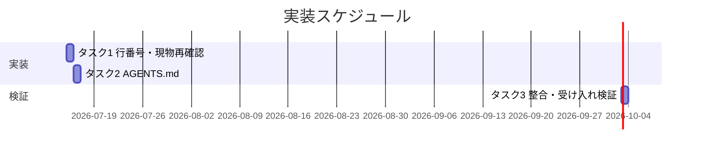
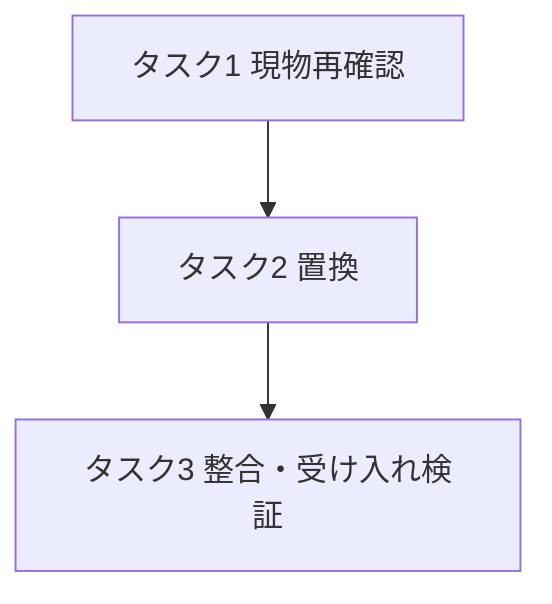

# 実装計画書: issue 依頼の分類・優先度規則のダブルバインド解消

**プロジェクト名**: issue 依頼の分類・優先度規則のダブルバインド解消
**作成日**: 2026 年 07 月 15 日
**最終更新**: 2026 年 07 月 15 日

> **重要**: **このドキュメントは常に更新**: 実装計画の変更、進捗状況の更新、バグの記録などがあった場合は、即座にこのドキュメントを更新してください。ドキュメントは「生きているドキュメント」として扱い、実装内容と常に同期させます。
> **必須項目**: 「必須」と明記した欄は空欄・抽象語のみで提出しないこと。テスト観点・BDD 仕様は具体ケースを 1 件以上記載すること。
>
> **用語**: [.agent-skill-chain/source/CONCEPTS.md §用語規約](../../../../../../.agent-skill-chain/source/CONCEPTS.md#用語規約) を参照。

---

## 1. 実装概要

### 1.1 実装方針（必須）

02_設計 §3.1.5 の Before/After に従い、AGENTS.md:61 後半「曖昧な場合はユーザーに確認する」を、キーワード衝突（前半・不変）と分類曖昧ケース（RULES.md §高リスク操作 を唯一の分岐基準とする条件分岐）を書き分けた文言に置換する。新しい判定基準・高リスク定義は新設しない（02 ADR-01・ADR-02）。

### 1.2 実装順序（必須: 1 件以上）



1. タスク 1: AGENTS.md 現物の行番号・文言の再確認。
2. タスク 2: AGENTS.md:61 の置換（02 §3.1.5 After の適用）。
3. タスク 3: 参照整合（39/44/RULES/PHASES）と 01 受け入れ基準の検証。

---

## 2. タスク分解

**必須**: 各タスクには「テスト観点」（2.x.3）と「単体テスト仕様（BDD）」（2.x.4）を記載する。本 issue はコード非実行のドキュメント修正のため、テスト＝**修正後 AGENTS.md 文言に対するレビュー検証**として扱う（02 §6）。

### 2.1 タスク 1: AGENTS.md 現物の行番号・文言の再確認

#### 2.1.1 概要（必須）

実装着手時点の AGENTS.md 現物を読み、修正対象が 61 行目「曖昧な場合はユーザーに確認する」であること、39/44 行の高リスク例外規定が存在することを確認する（01 §5 制約・02 §3.1.4）。

#### 2.1.2 実装内容（必須: 1 件以上）

- AGENTS.md を Read し、55-62 行付近と 39・44 行を現物確認する。
- 行番号が 2026-07-15 時点（01/02 記載）からずれている場合は、修正対象を「`曖昧な場合はユーザーに確認する` を含む行」でテキスト特定し、02 §3.1.5 Before と一致することを確認する。

#### 2.1.3 テスト観点（必須）

**参照**: 観点定義は [02\_設計 §6](./02_設計.md) および [RULES のテスト戦略・TEST_BDD_FORMAT](../../../../../../.agent-skill-chain/source/RULES.md#テスト戦略必須要件)。

##### 単体（本タスクの具体ケース・必須 1 件以上）

- 正常系: AGENTS.md 現物に「曖昧な場合はユーザーに確認する」を含む行が 1 か所だけ存在し、02 §3.1.5 Before と文字列一致する。
- 異常系: 当該文字列が見つからない／複数存在する場合は置換を中断し、行番号ずれ・重複として報告する（02 §3.1.4 のエラーハンドリング）。

##### 結合/API（該当時は必須）

- 該当なし（外部インターフェースなし）。

##### E2E/受け入れ（未達時は理由記載）

- タスク 3 の受け入れ検証に集約する（本タスク単体では E2E 該当なし）。

##### バリデーション（該当する場合）

- 該当なし。

#### 2.1.4 単体テスト仕様（BDD）（必須）

```gherkin
Feature: 修正対象行の同定
  Scenario: 置換対象文字列が現物に一意に存在する
    Given 実装者が AGENTS.md を Read している
    When 「曖昧な場合はユーザーに確認する」を含む行を検索する
    Then 該当行が一意に見つかり、02 §3.1.5 Before と文字列一致する
```

（本タスクはドキュメント確認でありテストコードを持たない。検証は上記 BDD に沿った目視/grep 確認とする。）

#### 2.1.5 依存関係

- なし（先頭タスク）。

#### 2.1.6 見積もり

- **工数**: 0.2h
- **優先度**: 高

### 2.2 タスク 2: AGENTS.md:61 の置換

#### 2.2.1 概要（必須）

02 §3.1.5 の After 文言で AGENTS.md:61 後半を置換し、キーワード衝突（前半・不変）と分類曖昧ケース（高リスク分岐）を書き分ける。

#### 2.2.2 実装内容（必須: 1 件以上）

- AGENTS.md:61 の「①提案して系、②説明して系、③作成して系。曖昧な場合はユーザーに確認する。」を、02 §3.1.5 After の 2 項目（キーワード衝突優先度＋分類曖昧ケースの既定挙動）に置換する。
- RULES.md §高リスク操作 へのリンクは、AGENTS.md 内の既存リンク記法（19/72 行の `[.agent-skill-chain/source/RULES.md](.agent-skill-chain/source/RULES.md)`）に合わせて統一する（02 §3.1.5 注1）。
- **挿入テキストに行番号自己参照を含めない**: 自立進行原則・確認例外の参照は、行番号（例: 「AGENTS.md:39」「AGENTS.md:44」）ではなく AGENTS.md 内の耐ドリフトなルール名（**自立進行ルール**・**委譲時のユーザー確認ルール**）で記述する（配布物本体に行番号依存を持ち込まない。02 §3.1.5 注2）。
- 前半のキーワード衝突優先度①②③の順位・文言は変更しない（01 ストーリー 2 受け入れ基準 1）。

#### 2.2.3 テスト観点（必須）

##### 単体（本タスクの具体ケース・必須 1 件以上）

- 正常系: 置換後の 61 行付近に「分類曖昧ケース」と「作成して系（既定分類）」と「RULES.md §高リスク操作 に該当する場合に限りユーザー確認」が含まれる。
- 正常系: 前半「①提案して系、②説明して系、③作成して系」の順位・文言が置換前後で不変。
- 異常系: 高リスクの定義・例（削除・外部送信等）を AGENTS.md:61 に再掲していない（RULES 参照のみ。02 ADR-02）。
- 異常系: 挿入テキストに「AGENTS.md:39」「AGENTS.md:44」等のハードコード行番号自己参照を含まない（ルール名参照のみ。02 §3.1.5 注2）。

##### 結合/API（該当時は必須）

- 該当なし。

##### E2E/受け入れ（未達時は理由記載）

- タスク 3 で 01 の全 BDD シナリオとの一意適合を検証する。

##### バリデーション（該当する場合）

- リンク記法の妥当性: 追加した RULES.md §高リスク操作 リンクが AGENTS.md の既存記法と整合し、リンク切れでない。

#### 2.2.4 単体テスト仕様（BDD）（必須）

```gherkin
Feature: AGENTS.md:61 の条件付き置換
  Scenario: 無条件確認が高リスク分岐付き文言に置換される
    Given AGENTS.md:61 後半が「曖昧な場合はユーザーに確認する」である
    When 02 §3.1.5 After の文言で置換する
    Then 61 行付近は「分類曖昧ケースは既定分類=作成して系に倒し、RULES.md §高リスク操作 該当時のみ確認する」と読め、かつ前半の優先度①②③は不変である
```

（テストコードは持たない。置換結果に対する目視/grep 検証で担保する。）

#### 2.2.5 依存関係

- タスク 1（行番号・現物再確認）に依存。



#### 2.2.6 見積もり

- **工数**: 0.3h
- **優先度**: 高

### 2.3 タスク 3: 参照整合と 01 受け入れ基準の検証

#### 2.3.1 概要（必須）

置換後 AGENTS.md が 01 の全受け入れ基準・BDD シナリオを一意に満たし、AGENTS.md:39/44・RULES.md §高リスク操作・PHASES.md §一般的な issue 作成ステップ と矛盾しないことを検証する。

#### 2.3.2 実装内容（必須: 1 件以上）

- 修正後 61 行と AGENTS.md:39/44 が同一基準（RULES.md §高リスク操作）を参照し矛盾しないことを確認（01 ストーリー 1 受け入れ基準 4・ストーリー 3 受け入れ基準 2）。
- 修正後 61 行が PHASES.md §一般的な issue 作成ステップ（既定は委譲、提案/説明の明示時のみ非委譲）と一貫することを確認（02 ADR-01 根拠 1）。
- 01 §2.2 の 3 BDD シナリオ（ユースケース 1 シナリオ 1・2、ユースケース 2 シナリオ 1）が修正後文言から一意に導けることを確認。

#### 2.3.3 テスト観点（必須）

##### 単体（本タスクの具体ケース・必須 1 件以上）

- 正常系: 「分類曖昧×非高リスク」を入力すると修正後文言から「既定分類=作成して系で確認せず委譲」が一意に導ける。
- 正常系: 「分類曖昧×高リスク」を入力すると「ユーザー確認」が一意に導ける。
- 正常系: 「作成して＋提案して」キーワード衝突は前半優先度で「提案して系」に解決され、既定分類フォールバックは適用されない。

##### 結合/API（該当時は必須）

- 該当なし。

##### E2E/受け入れ（本タスクの具体ケース・必須）

- 01 §2.2 の 3 シナリオすべてが修正後 AGENTS.md 単独（RULES.md §高リスク操作 の参照は許容）から一意判定できる（01 §3.3 ユーザビリティ要件）。

##### バリデーション（該当する場合）

- AGENTS.md:44 との高リスク定義重複が生じていない（参照で統一。01 ストーリー 3 受け入れ基準 2）。

#### 2.3.4 単体テスト仕様（BDD）（必須）— 01 の BDD シナリオとの対応

**対応表（01 §2.2 → 本タスク検証）**:

| 01 の BDD | 検証内容 |
| --- | --- |
| ユースケース1 シナリオ1（非高リスク曖昧→既定分類で委譲） | 下記 BDD-1 |
| ユースケース1 シナリオ2（キーワード衝突→優先度で提案して系） | 下記 BDD-2 |
| ユースケース2 シナリオ1（高リスク曖昧→確認） | 下記 BDD-3 |

```gherkin
Feature: 修正後 AGENTS.md による分類曖昧ケースの一意判定
  Scenario: BDD-1 非高リスクの曖昧依頼は既定分類で委譲
    Given 依頼文が3分類のキーワードに明確一致せず、RULES.md §高リスク操作 に非該当
    When 修正後 AGENTS.md:61 に従って行動を決定する
    Then ユーザー確認せず既定分類=作成して系でサブへ委譲し、AGENTS.md:39 に違反しない

  Scenario: BDD-2 キーワード衝突は既存優先度で解決
    Given 依頼文に「issueを作成して」と「プロンプト案だけ教えて」が同時に含まれる
    When 修正後 AGENTS.md:61 前半の優先度①提案②説明③作成を適用する
    Then 既定分類フォールバックではなく「提案して系」と判定される

  Scenario: BDD-3 高リスクを伴う曖昧依頼は確認必須
    Given 依頼文の分類が曖昧で、内容が RULES.md §高リスク操作 に該当する
    When 修正後 AGENTS.md:61 に従って行動を決定する
    Then 既定分類に倒さず、AGENTS.md:39・44 の例外に従い事前にユーザーの明示的確認を要求する
```

#### 2.3.5 依存関係

- タスク 2（置換）に依存。

#### 2.3.6 見積もり

- **工数**: 0.3h
- **優先度**: 高

---

## テスト観点

本実装計画全体のテスト観点は、修正後 AGENTS.md:61 が (1) 分類曖昧×非高リスク→既定分類=作成して系、(2) 分類曖昧×高リスク→確認、(3) キーワード衝突→前半優先度不変、の 3 判定を**一意**に導けること、および AGENTS.md:39/44・RULES.md §高リスク操作・PHASES.md §一般的な issue 作成ステップ と矛盾しないことに集約される。具体ケースは各タスク §2.x.3 を参照。

---

## 単体テスト

本 issue はコード非実行のドキュメント修正であり、実行可能な単体テストコードは生成しない。単体相当の検証は各タスクの §2.x.4 BDD に沿った文言レビュー（grep/目視）で行い、証跡は memo と 04_review（verify-and-close 時）に残す。

---

## BDD

BDD シナリオは §2.3.4 に集約し、01 §2.2 の 3 シナリオと 1:1 対応させた（BDD-1/2/3）。Given/When/Then 形式は TEST_BDD_FORMAT に従う。

---

## 3. 実装スケジュール

### 3.1 マイルストーン

| マイルストーン | 期日 | 成果物 |
| ------------------ | ------ | -------- |
| M1 現物再確認完了 | 実装日 | 行番号・Before 一致の確認 |
| M2 置換完了 | 実装日 | 修正後 AGENTS.md:61 |
| M3 受け入れ検証完了 | 実装日 | 01 BDD 3 シナリオの一意適合確認 |

### 3.2 実装フェーズ

#### フェーズ 1: 修正と検証

- **期間**: 実装日 1 日
- **タスク**: タスク 1 → 2 → 3

---

## 4. テスト計画

テスト観点・BDD 定義は 02_設計 §6 および RULES のテスト戦略・TEST_BDD_FORMAT を参照。本 issue では各タスク §2.x.3 に具体ケース、§2.3.4 に 01 BDD との対応を記載した。

### 4.1 テストの優先順位

- クリティカル: 分類曖昧×高リスク→確認（誤って既定分類に倒すと確認弱体化。02 §8.2）。
- 回帰: キーワード衝突優先度①②③の不変性（既存挙動を壊さない。01 §3.4）。

---

## 5. リスク管理

### 5.1 実装リスク

- **リスク**: AGENTS.md の行番号が実装時点でずれ、誤った行を置換する。
  - **対策**: タスク 1 で「曖昧な場合はユーザーに確認する」文字列一致で対象を同定し、02 §3.1.5 Before と照合してから置換する。
- **リスク**: RULES.md §高リスク操作 リンク記法が既存と不整合になりリンク切れする。
  - **対策**: タスク 2 で AGENTS.md 既存記法（39/44 周辺）に合わせ、タスク 3 §2.2.3 バリデーションで確認する。
- **リスク**: 既定分類=作成して系の誤判定でユーザー意図と齟齬（00 §7.1）。
  - **対策**: 高リスク時は確認必須（分岐で担保）、生成物は報告して是正可能、issue 作成は非破壊（02 ADR-01 帰結）。

---

## 6. 参考資料

### プロジェクトドキュメント

- [`02_設計.md`](./02_設計.md) - 設計

### その他の参考資料

- `AGENTS.md:61`（修正対象）、`AGENTS.md:39/44`（整合先）
- `.agent-skill-chain/source/RULES.md`:33 §高リスク操作
- `.agent-skill-chain/source/workflow/PHASES.md`:31-36 §一般的な issue 作成ステップ

---

## 7. 前のステップ

この実装計画書は、以下のドキュメントを基に作成されています：

- **前**: [`02_設計.md`](./02_設計.md) - 設計フェーズ

---

## 8. 次のステップ

この実装計画書の承認後、以下のいずれかのステップに進みます：

- **プロジェクトが 1 つの issue（タスク）である場合**: 実装フェーズ（execution）に直接進む（本 issue は単一 issue のためサブ分割・90_issues.md 作成は不要）。

**用語**: [.agent-skill-chain/source/CONCEPTS.md §用語規約](../../../../../../.agent-skill-chain/source/CONCEPTS.md#用語規約) を参照。
