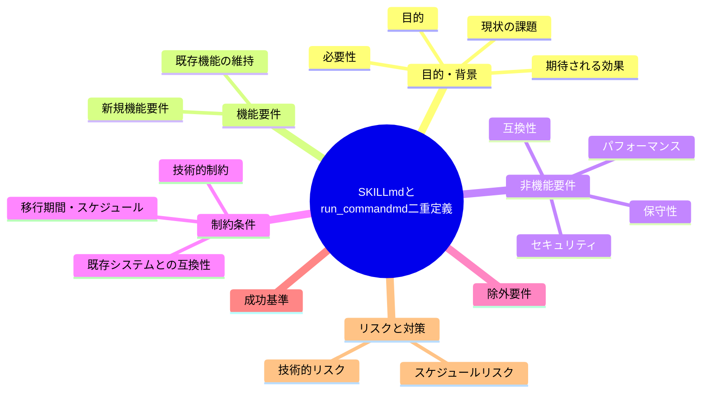
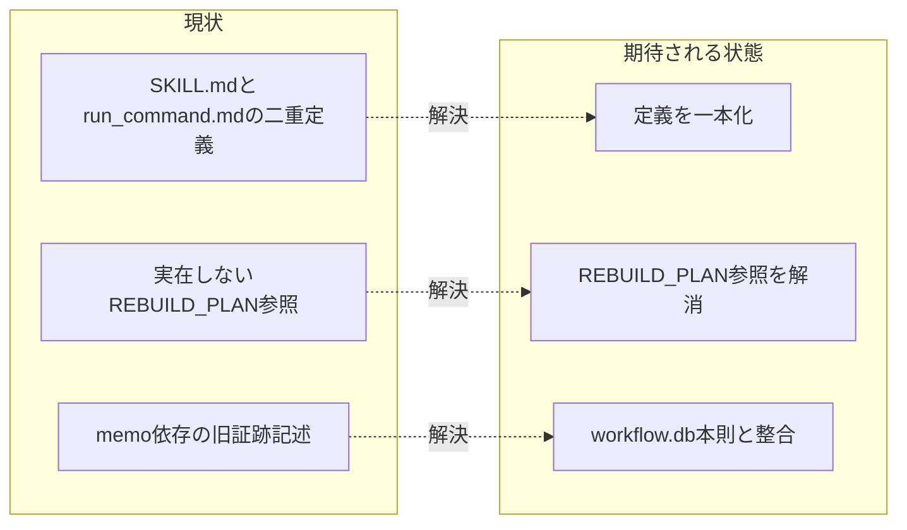

# 要求定義書: skills/agent/SKILL.md と run_command.md の二重定義・内容乖離（実在しない REBUILD_PLAN 参照を含む）

**プロジェクト名**: SKILL.md と run_command.md 二重定義及び REBUILD_PLAN 不在参照
**作成日**: 2026 年 07 月 14 日
**最終更新**: 2026 年 07 月 14 日

> **重要**:
>
> - 要求定義書は、プロジェクトの全体像を把握するためのものです。詳細な技術仕様や実装方法は要件定義書以降で記載します。必要最低限の情報に収めることを心掛けてください。
> - **このドキュメントは常に更新**: 要求の変更や追加があった場合は、即座にこのドキュメントを更新してください。ドキュメントは「生きているドキュメント」として扱い、実装内容と常に同期させます。
> - **必須項目**: 以下の「必須」と明記した項目は空欄・抽象語のみ（例: 「{説明}」のまま）で提出しないこと。判定可能な形（目的は1文・成功基準は○/×で判定できる記載等）で記入すること。
>
> **用語**: [.agent-skill-chain/source/CONCEPTS.md §用語規約](../../../../../../.agent-skill-chain/source/CONCEPTS.md#用語規約) を参照。

---

## 要求定義の全体像

**注意**:

- 上記の「プロジェクト名」は例です。実際のプロジェクト名に置き換えてください。
- マインドマップは全体像を把握するためのものです。主要なセクション名程度に留め、詳細は記載しないでください。

---

## 1. 目的・背景

### 1.1 目的（必須）

skills/agent/SKILL.md と run_command.md の二重定義・内容乖離、および実在しない REBUILD_PLAN 参照を解消する。

### 1.2 背景

2026-07-14 fable による本システムの自己調査で検出。

- **現状の課題**:
  - 同一ディレクトリの `SKILL.md` と `run_command.md` が「委譲の形」を二重定義している。run_command.md は「委譲定義は本 run_command に一本化する」と明記しているにもかかわらず、SKILL.md 側にも同種の記載が残っている。
  - SKILL.md 側は (i) 実在しない `REBUILD_PLAN` への参照（`skills/agent/SKILL.md:16, 27, 35`）、(ii) 「証跡は memo または 04_review に残す」という、workflow.db 本則ポリシー（`RULES.md:24` 等）と矛盾する旧記述を含む。
  - `grep -r REBUILD_PLAN` で source 内 5 ファイルに参照があるが、実体ファイルは存在しない。
  - この配備された SKILL.md が実行時に旧ポリシーとして適用されるリスクがある。

- **必要性**:
  - 二重定義・矛盾する記述が残っていると、エージェントがどちらの記述に従うべきか判断を誤り、旧ポリシー（memo 依存の証跡運用等）に従ってしまうリスクがある。

### 1.3 期待される効果（必須: 1 件以上）

- **効果 1**: skills/agent/SKILL.md と run_command.md の「委譲の形」定義が一本化され、重複記載が解消される。
- **効果 2**: 実在しない REBUILD_PLAN への参照が解消される（削除、または実体作成のいずれかの方針が決定・実施される）。
- **効果 3**: SKILL.md の証跡記述が workflow.db 本則ポリシー（RULES.md 等）と整合する。

**現状と期待される状態の比較**（必要に応じて）:

---

## 2. 機能要件

### 2.1 既存機能の維持（該当する場合）

run_command.md 側の「委譲定義の一本化」という既存方針自体は維持する。

### 2.2 新規機能要件

- SKILL.md と run_command.md の記載を突合し、重複・矛盾箇所を特定する。
- `skills/agent/SKILL.md:16, 27, 35` の REBUILD_PLAN 参照について、削除するか実体を作成するかを決定し反映する。
- source 内 5 ファイルの REBUILD_PLAN 参照全件を洗い出し、同様に対応する。
- SKILL.md の証跡記述（memo/04_review）を RULES.md:24 等の workflow.db 本則ポリシーに合わせて修正する。

---

## 3. 非機能要件

### 3.1 パフォーマンス

- 特になし。

### 3.2 セキュリティ

- 特になし。

### 3.3 互換性

- 配備物（`.claude/skills/agent/SKILL.md` 等）にも修正内容が反映されること。

### 3.4 保守性

- 「委譲の形」の定義は 1 か所（run_command.md）に集約し、以後 SKILL.md 側で重複定義しない運用にする。

---

## 4. 制約条件

### 4.1 技術的制約

- run_command.md 冒頭の「委譲定義は本 run_command に一本化する」という既存原則を踏まえた修正とする。

### 4.2 既存システムとの互換性

- 既存の command 実行フロー（commands/{name}.md 参照）に影響を与えないこと。

### 4.3 移行期間・スケジュール

- 特になし。

---

## 5. 除外要件

- run_command.md 自体の構成変更は対象外とする（SKILL.md 側の是正が主眼）。

---

## 6. 成功基準（必須: 1 件以上）

- `skills/agent/SKILL.md:16, 27, 35` の REBUILD_PLAN 参照が解消されている。
- `grep -r REBUILD_PLAN` の結果が実体の無い参照を含まない状態になっている。
- SKILL.md の証跡記述が RULES.md:24 の workflow.db 本則ポリシーと矛盾しない内容になっている。

---

## 7. リスクと対策

### 7.1 技術的リスク

- **リスク**: SKILL.md の記載を削除・修正した際に、配備スクリプト（setup 等）が参照している別の箇所と不整合が生じるおそれ。
  - **対策**: 修正前に SKILL.md への参照元（配備スクリプト・他ドキュメント）を洗い出す。

### 7.2 スケジュールリスク

- **リスク**: 特になし。
  - **対策**: 特になし。

---

## 8. 参考資料

### プロジェクトドキュメント

- 既存プロジェクトの場合は、[`00_システム理解.md`](./00_システム理解.md) - システム理解を参照

### その他の参考資料

- `.agent-skill-chain/source/skills/agent/SKILL.md:16, 27, 35`
- `grep -r REBUILD_PLAN`（source 内 5 ファイル・実体ファイルなし）
- `.agent-skill-chain/source/RULES.md:24`

---

## 9. 次のステップ

この要求定義書の承認後、以下のドキュメントを作成します：

- **次**: [`01_要件定義.md`](./01_要件定義.md) - 要件定義フェーズ
