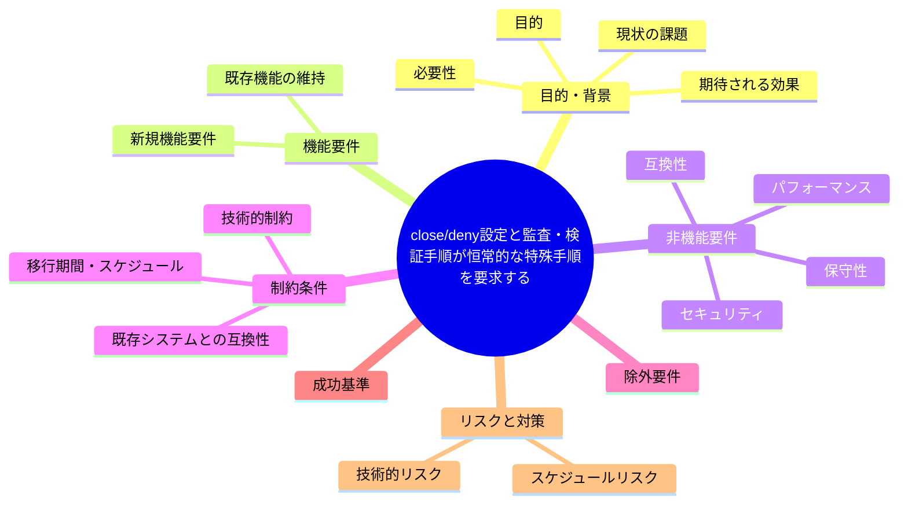

# 要求定義書: close/ deny 設定と監査・検証手順が恒常的な特殊手順を要求する

**プロジェクト名**: close/ deny 設定と監査・検証手順が恒常的な特殊手順を要求する
**作成日**: 2026 年 07 月 14 日
**最終更新**: 2026 年 07 月 14 日

> **重要**:
>
> - 要求定義書は、プロジェクトの全体像を把握するためのものです。詳細な技術仕様や実装方法は要件定義書以降で記載します。必要最低限の情報に収めることを心掛けてください。
> - **このドキュメントは常に更新**: 要求の変更や追加があった場合は、即座にこのドキュメントを更新してください。ドキュメントは「生きているドキュメント」として扱い、実装内容と常に同期させます。
> - **必須項目**: 以下の「必須」と明記した項目は空欄・抽象語のみ（例: 「{説明}」のまま）で提出しないこと。判定可能な形（目的は1文・成功基準は○/×で判定できる記載等）で記入すること。
>
> **用語**: [.agent-skill-chain/source/CONCEPTS.md §用語規約](../../../../../../.agent-skill-chain/source/CONCEPTS.md#用語規約) を参照。

---

## 要求定義の全体像



**注意**:

- 上記の「プロジェクト名」は例です。実際のプロジェクト名に置き換えてください。
- マインドマップは全体像を把握するためのものです。主要なセクション名程度に留め、詳細は記載しないでください。

---

## 1. 目的・背景

### 1.1 目的（必須）

close/ deny 設定と監査・検証作業との恒常的な衝突・非対称を見直す。

### 1.2 背景

2026-07-14 fable による本システムの自己調査で検出。

- **現状の課題**:
  - close/ 配下 Read/Grep/Glob の deny のため、close 移動は「移動前にすべての検証を完結させ、移動後は内容を一切読まない」という特殊6ステップ手順を要求する。
  - この制約は監査・調査系タスク（過去 issue の参照、リンク検証等）と根本的に相性が悪い。
  - audit.sh 自身は close/ を find で走査しており、エージェントには許されない操作をスクリプトが行うという非対称が生じている。

- **必要性**:
  - deny 設定の意図（誤操作防止等）を保ちながら、監査・調査系タスクとの相性の悪さ・非対称を解消する必要がある。

### 1.3 期待される効果（必須: 1 件以上）

- **効果 1**: close/ 配下を対象とする監査・調査系タスクについて、特殊手順に依存しない運用方法が明文化される、または現状の特殊手順で十分である根拠が示される。

**現状と期待される状態の比較**（必要に応じて）:

```mermaid
flowchart LR
    subgraph 現状["現状"]
        A1[close配下Read/Grep/Globがdeny]
        A2[移動は特殊6ステップ手順が必須]
        A3[audit.shはclose配下をfind走査(非対称)]
    end

    subgraph 期待される状態["期待される状態"]
        B1[監査・調査タスクとの相性が改善する]
        B2[非対称の理由または解消方針が明文化される]
    end

    A1 -.->|解決| B1
    A2 -.->|解決| B1
    A3 -.->|解決| B2
```

---

## 2. 機能要件

### 2.1 既存機能の維持（該当する場合）

close/ deny 設定の目的（誤って close 済み issue を編集・破壊しない）自体は維持する。

### 2.2 新規機能要件

{対応方針は 01 要件定義以降で検討。本書では課題の提起に留める}

---

## 3. 非機能要件

### 3.1 パフォーマンス

- {該当なし}

### 3.2 セキュリティ

- close 済み issue の意図しない変更防止という既存目的を損なわないこと。

### 3.3 互換性

- 既存の close 移動時の相対リンク補正手順との整合を保つこと。

### 3.4 保守性

- {01 要件定義以降で検討}

---

## 4. 制約条件

### 4.1 技術的制約

- `.claude/settings.json` の deny 設定は非追跡のローカル環境固有設定である前提を踏まえること。

### 4.2 既存システムとの互換性

- audit.sh の close/ 走査ロジックを不用意に変更しないこと。

### 4.3 移行期間・スケジュール

- {未定}

---

## 5. 除外要件

対応方針の具体設計・実装（本 issue は課題の起票のみ）。

---

## 6. 成功基準（必須: 1 件以上）

- close/ 配下を対象とする監査・調査系タスクについて、既存の特殊6ステップ手順に依存する範囲・依存しない範囲が明文化されていること。

---

## 7. リスクと対策

### 7.1 技術的リスク

- **リスク**: deny 設定を緩めると close 済み issue への誤った変更・参照リスクが増える可能性がある。
  - **対策**: 読み取り専用の許可（Read のみ許可・Edit は引き続き禁止等）の選択肢を含めて 01 以降で検討する。

### 7.2 スケジュールリスク

- **リスク**: {特になし}
  - **対策**: {特になし}

---

## 8. 参考資料

### プロジェクトドキュメント

- 既存プロジェクトの場合は、[`00_システム理解.md`](./00_システム理解.md) - システム理解を参照

### その他の参考資料

- `.claude/settings.json`
- `.agent-skill-chain/project/自己拡張ワークフロー.md:226-246`
- `.agent-skill-chain/source/enforcement/ci/audit.sh` check_verify_parent_command

---

## 9. 次のステップ

この要求定義書の承認後、以下のドキュメントを作成します：

- **次**: [`01_要件定義.md`](./01_要件定義.md) - 要件定義フェーズ
