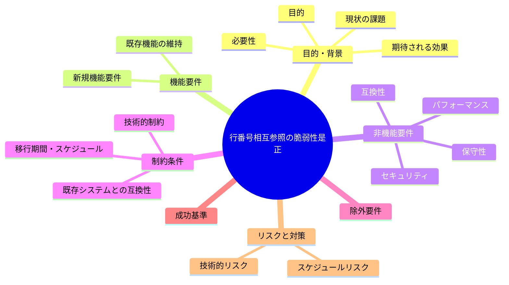
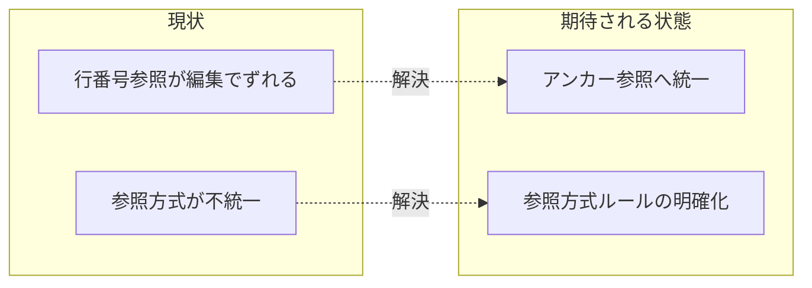

# 要求定義書: 行番号による相互参照の脆弱性是正

**プロジェクト名**: 行番号相互参照の脆弱性是正
**作成日**: 2026 年 07 月 14 日
**最終更新**: 2026 年 07 月 14 日

> **重要**:
>
> - 要求定義書は、プロジェクトの全体像を把握するためのものです。詳細な技術仕様や実装方法は要件定義書以降で記載します。必要最低限の情報に収めることを心掛けてください。
> - **このドキュメントは常に更新**: 要求の変更や追加があった場合は、即座にこのドキュメントを更新してください。ドキュメントは「生きているドキュメント」として扱い、実装内容と常に同期させます。
> - **必須項目**: 以下の「必須」と明記した項目は空欄・抽象語のみ（例: 「{説明}」のまま）で提出しないこと。判定可能な形（目的は1文・成功基準は○/×で判定できる記載等）で記入すること。
>
> **用語**: [.agent-skill-chain/source/CONCEPTS.md §用語規約](../../../../../../.agent-skill-chain/source/CONCEPTS.md#用語規約) を参照。

---

## 要求定義の全体像

**注意**:

- 上記の「プロジェクト名」は例です。実際のプロジェクト名に置き換えてください。
- マインドマップは全体像を把握するためのものです。主要なセクション名程度に留め、詳細は記載しないでください。

---

## 1. 目的・背景

### 1.1 目的（必須）

行番号（`:18` `:33` `:57` 等）による正本間の相互参照をアンカー参照へ統一し脆弱性を解消する。

### 1.2 背景

2026-07-14 fable による本システムの自己調査で検出。

- **現状の課題**:
  - CLAUDE.md・PHASES.md・`.agent-skill-chain/project/自己拡張ワークフロー.md` が、特定行番号（`CLAUDE.md:20`、`workflow/PHASES.md:34`、`project/自己拡張ワークフロー.md:179,185` 等）で他文書を参照している。
  - 行番号は編集で容易にずれるため、参照が指す実際の内容と一致しなくなる。既に `run_command.md:57` の内容は現 57 行目周辺と一致しない可能性が高いと指摘されている。
  - アンカー（見出し）参照へ統一されていない。

- **必要性**:
  - 行番号参照は編集の都度手動で追従させる必要があり、放置するとサイレントに参照先がずれ、誤誘導につながる。

### 1.3 期待される効果（必須: 1 件以上）

- **効果 1**: 該当箇所（`CLAUDE.md:20`、`workflow/PHASES.md:34`、`project/自己拡張ワークフロー.md:179,185` 等）の行番号参照が見出しアンカー参照に置き換わる、またはより頑健な参照方式に統一される。
- **効果 2**: 今後の編集で参照ズレが再発しにくい参照方式の運用ルールが定まる。

**現状と期待される状態の比較**（必要に応じて）:

---

## 2. 機能要件

### 2.1 既存機能の維持（該当する場合）

参照先ドキュメント・内容自体は変更せず、参照方式（行番号→アンカー等）のみを変更する。

### 2.2 新規機能要件

- 正本内の行番号参照箇所を洗い出す。
- 参照先に対応する見出しアンカーが存在するか確認し、無い場合は見出しの追加を検討する。
- 行番号参照をアンカー参照（または節番号等の頑健な参照）へ置き換える。

---

## 3. 非機能要件

### 3.1 パフォーマンス

- 特になし。

### 3.2 セキュリティ

- 特になし。

### 3.3 互換性

- 既存の Markdown レンダラ・GitHub 上でのアンカーリンク解決と互換性を保つこと。

### 3.4 保守性

- 今後、行番号参照を新規に追加しない運用ルール（レビュー観点等）を検討する。

---

## 4. 制約条件

### 4.1 技術的制約

- 参照先に適切な見出し粒度のアンカーが無い場合、見出し追加が必要になる可能性がある。

### 4.2 既存システムとの互換性

- 特になし。

### 4.3 移行期間・スケジュール

- 特になし。

---

## 5. 除外要件

- 「根拠として行番号を明示する」形式のコメント（本 issue の根拠欄のような監査用途の記載）は対象外とする（正本間の恒常的な参照リンクのみが対象）。

---

## 6. 成功基準（必須: 1 件以上）

- `CLAUDE.md:20`、`workflow/PHASES.md:34`、`project/自己拡張ワークフロー.md:179,185` の行番号参照がアンカー参照に置き換わっている。
- `run_command.md:57` を参照している箇所が、現在の内容と一致する参照に修正されている。

---

## 7. リスクと対策

### 7.1 技術的リスク

- **リスク**: 見出しアンカーへの置き換え時に、見出しテキストの変更で再びアンカーがずれる可能性がある。
  - **対策**: 見出しテキストの変更を伴う編集時にはアンカー参照も併せて確認する運用を明記する。

### 7.2 スケジュールリスク

- **リスク**: 特になし。
  - **対策**: 特になし。

---

## 8. 参考資料

### プロジェクトドキュメント

- 既存プロジェクトの場合は、[`00_システム理解.md`](./00_システム理解.md) - システム理解を参照

### その他の参考資料

- `CLAUDE.md:20`
- `.agent-skill-chain/source/workflow/PHASES.md:34`
- `.agent-skill-chain/project/自己拡張ワークフロー.md:179,185`
- `.agent-skill-chain/source/skills/agent/run_command.md:57`

---

## 9. 次のステップ

この要求定義書の承認後、以下のドキュメントを作成します：

- **次**: [`01_要件定義.md`](./01_要件定義.md) - 要件定義フェーズ
