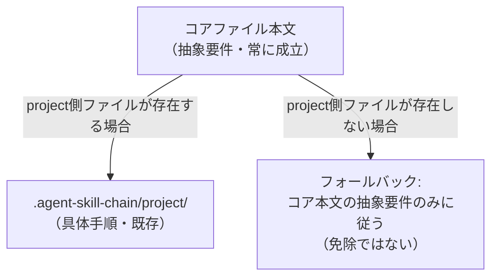
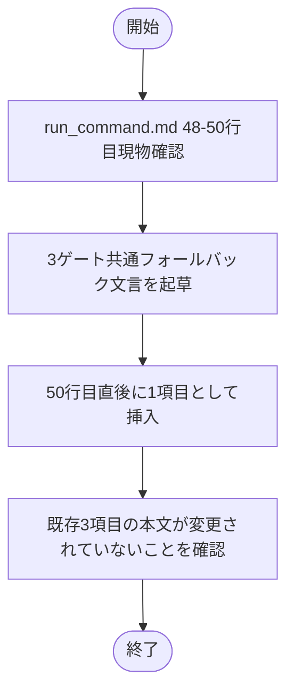
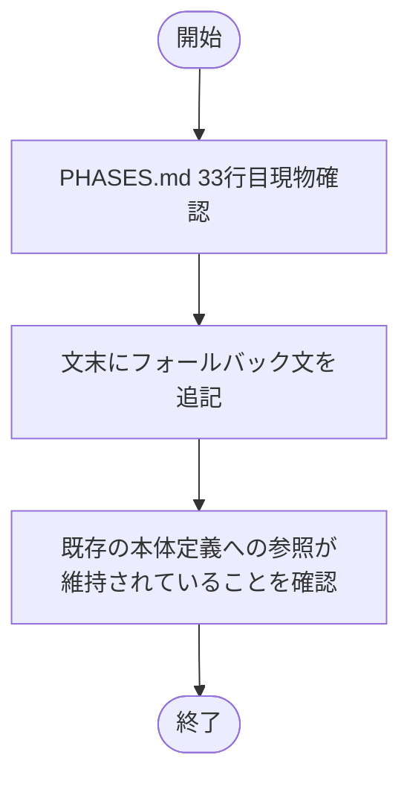
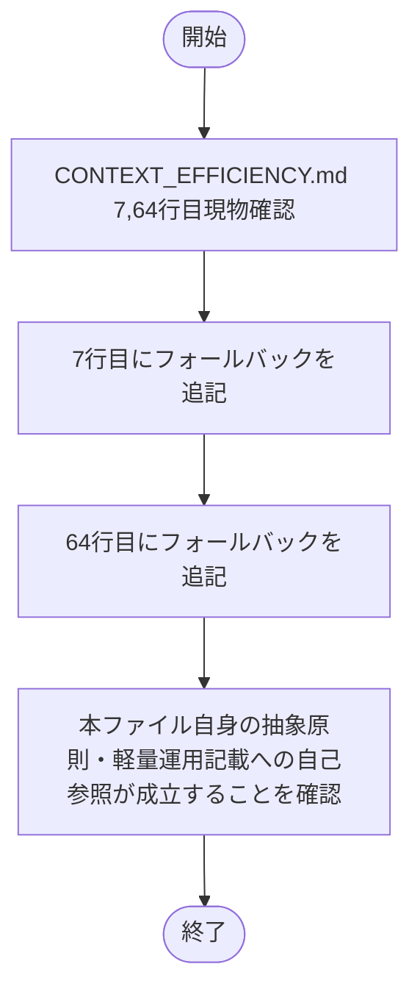

# 設計書: source 正本のリポ固有ファイル依存境界侵食

**プロジェクト名**: source 正本のリポ固有ファイル依存境界侵食
**作成日**: 2026 年 07 月 14 日
**最終更新**: 2026 年 07 月 14 日

> **用語**: [.agent-skill-chain/source/CONCEPTS.md §用語規約](../../../../../../.agent-skill-chain/source/CONCEPTS.md#用語規約) を参照。

---

## 1. 設計概要

### 1.1 設計方針

本 issue はドキュメント編集のみで、新規コンポーネント・API は発生しない。00_要求定義 §7.1 の対応方針（「具体値を書かず『project に無い場合はこの規約を適用しない』旨の条件分岐のみを記載する」）をそのまま設計方針として採用する。既存の 3 箇所（run_command.md 48–50 行目付近、PHASES.md 33 行目付近、CONTEXT_EFFICIENCY.md 7・64 行目付近）それぞれに、project 側ファイル不在時の条件分岐を **追記のみ** で挿入し、既存の抽象要件本文は変更しない。

### 1.2 設計原則（本プロジェクトで適用するもの）

- **単一責務**: 各コアファイルは「何を満たすべきか（抽象要件）」の責務のみを持ち、project 側ファイルは「どう満たすか（具体手順）」の責務を持つ、という既存の責務分離を維持する。今回の変更は、後者が不在のときに前者の責務（抽象要件）だけで自己完結させるための分岐を足す点にとどめる。
- **明確な境界**: 「project 側ファイルが存在する場合＝具体手順に従う」「存在しない場合＝コア本文の抽象要件のみに従う（免除ではない）」という境界を、各追記箇所に明示する。

---

## 2. アーキテクチャ設計

### 2.1 責務・境界・参照関係

#### 2.1.1 責務一覧

| コンポーネント（ファイル・箇所） | 責務（1 文） |
| --- | --- |
| `run_command.md` §Constraints（GitHub Issue 起票ゲート・ブランチ紐づけゲート・PR 紐づけゲートの 3 項目、48–50 行目付近） | 各ゲートの抽象要件（何を記録するか）を規定し、project 側具体化ファイル不在時は当該参照を無効化して抽象要件のみで自己完結させる |
| `PHASES.md` §一般的な issue 作成ステップ（33 行目付近） | issue 作成場所の決定手順を規定し、project 上書き・CLAUDE.md 該当節がいずれも無い場合は一般的な既定の作成場所に従わせる |
| `CONTEXT_EFFICIENCY.md`（7, 64 行目付近） | ISSUE_CREATION の汎用原理（コンテキスト効率）を規定し、project への委譲・CLAUDE.md 参照が不在の場合は本ファイル自身の抽象原則・軽量運用記載のみで完結させる |
| `.agent-skill-chain/project/自己拡張ワークフロー.md`（既存・本 issue では変更しない） | 本リポ（自己拡張元）向けの具体化ファイル。存在する環境では従来どおり具体手順の正本として参照される |

#### 2.1.2 境界

- **入力**: 上記 3 ファイルを読む消費者環境の各エージェント（オーケストレーター・サブエージェント）。
- **出力**: 各ゲート・各原理の判断（適用するか・project 側を参照するか・コア本文のみで完結させるか）。
- **他責務との境界**: `.agent-skill-chain/project/自己拡張ワークフロー.md` 自体の内容は変更しない（00 §5 除外要件）。164009・163447 issue で整理済みの run_command.md 他セクションには触れない。

#### 2.1.3 参照関係

- `run_command.md` §Constraints（3 ゲート項目）→（存在する場合のみ）`.agent-skill-chain/project/自己拡張ワークフロー.md`。存在しない場合は当該参照を発生させず、同項目内の抽象要件記述のみで完結。
- `PHASES.md` §作成場所の上書き →（存在する場合のみ）`.agent-skill-chain/project/` 上書き・CLAUDE.md 該当節。存在しない場合は command 実行主体側の一般的な既定に委ねる。
- `CONTEXT_EFFICIENCY.md` §責務・§適用のスケーリング →（存在する場合のみ）`.agent-skill-chain/project/`・CLAUDE.md。存在しない場合は本ファイル自身の記載に閉じる。
- 循環参照なし。

### 2.2 システムアーキテクチャ

- **採用パターン**: 条件分岐によるフォールバック明記（既存参照の直後に「存在しない場合」節を追加する形の局所編集）。コード変更を伴わないため、アプリケーションアーキテクチャパターンは適用外。
- **根拠**: [01_設計原則.md](../../../../../../.agent-skill-chain/source/spec/01_設計原則.md) の「明確な境界」を、コア（抽象・常に成立）と project（具体・存在しない場合がある）の間の境界として適用した。00_要求定義 §7.1 のリスク対策方針と整合する。

### 2.3 コンポーネント構成

- `run_command.md`: 3 ゲート項目の直後（50 行目末尾の次）に、3 ゲート共通のフォールバック節を 1 項目として追加する（重複回避のため個別 3 箇所には書かず 1 箇所に集約）。
- `PHASES.md`: 33 行目の「作成場所の上書き」項目の文末に、フォールバック文をインラインで追記する。
- `CONTEXT_EFFICIENCY.md`: 7 行目（責務段落）と 64 行目（軽量運用の参照文）それぞれにフォールバック文をインラインで追記する。

### 2.4 データフロー

コード変更なし。エージェントがコアファイルを読む際の判断フローが、「project 側ファイルの有無をまず確認し、無ければコア本文の抽象要件に閉じる」という分岐を明示的に持つようになる（従来は無条件にリンク先を前提としていた）。

### 2.5 横断設計判断（ADR）

#### ADR-1: フォールバックの粒度（3 ゲート共通 1 箇所 vs 各ゲート個別 3 箇所）

- **コンテキスト**: run_command.md の GitHub Issue 起票ゲート・ブランチ紐づけゲート・PR 紐づけゲートは、いずれも同一の project 側ファイル（`.agent-skill-chain/project/自己拡張ワークフロー.md`）を参照しており、フォールバック文言も実質同一になる。
- **検討した選択肢**:
  1. 3 ゲートそれぞれの行末に同じ趣旨のフォールバック文を個別に追記する（3 箇所重複）。
  2. 3 ゲート項目の直後に、3 ゲート共通のフォールバック項目を 1 つ追加する。
- **決定**: 選択肢 2。
- **根拠**: run_command.md 自身が随所で「重複記載しない・リンクで委譲する」設計方針を取っている（例: §04_review 配置ルールの相互参照）。同一参照先・同一趣旨の文言を 3 回繰り返すことは同ファイルの既存方針と矛盾する。evidence_source: `existing_code`（run_command.md 内の既存の重複回避パターンに基づく）。
- **帰結**: 3 ゲート項目自体の文言は変更せず、直後に 1 項目を追加する形で実装する（既に実装済み。§3.1 参照）。

#### ADR-2: フォールバックの適用範囲（免除か・代替経路か）

- **コンテキスト**: project 側ファイル不在時に、ゲート自体（記録の必須化）まで免除してしまうと、必須ゲートの強制力が意図せず弱まる懸念がある（00 §7.1 リスク）。
- **検討した選択肢**:
  1. project 側ファイル不在時はゲート自体も免除する（記録不要にする）。
  2. project 側ファイル不在時は「具体手順」の参照のみを無効化し、ゲート本体（記録の必須化）は維持する。
- **決定**: 選択肢 2。
- **根拠**: 00_要求定義 §7.1 の対策は「規約を適用しない」対象を具体手順の参照に限定する趣旨であり、既存の enforcement #34/#35/#36 の強制力（frontmatter への記録必須）を無効化する意図ではない。各ゲート本文には既に記録先・記録する値の抽象要件が明記されているため、具体手順の参照を切り離しても自己完結する。evidence_source: `human_decision`（00_要求定義 §7.1 の記載に基づく）。
- **帰結**: フォールバック文言は「具体手順の参照は適用しない」「ゲート自体の免除理由にはならない」の両方を明記する形にする（§3.1 実装内容参照）。

---

## 3. 機能設計

### 3.1 機能 1: run_command.md の 3 ゲート共通フォールバック追加

#### 3.1.1 概要

GitHub Issue 起票ゲート・ブランチ紐づけゲート・PR 紐づけゲート（48–50 行目付近）の直後に、project 側ファイル不在時のフォールバック項目を 1 つ追加する。

#### 3.1.2 処理フロー

#### 3.1.3 入力・出力

- **入力**: run_command.md 48–50 行目（既存本文、変更しない）。
- **出力**: run_command.md 50 行目直後（新規追加項目）。

#### 3.1.4 エラーハンドリング

該当なし（ドキュメント編集）。追加した項目が既存のリスト（箇条書き）記法から外れていないことを目視で確認する。

### 3.2 機能 2: PHASES.md の作成場所フォールバック追加

#### 3.2.1 概要

「作成場所の上書き」項目（33 行目付近）の文末に、project 上書き・CLAUDE.md 該当節がいずれも無い場合のフォールバック文をインラインで追記する。

#### 3.2.2 処理フロー

#### 3.2.3 入力・出力

- **入力**: PHASES.md 33 行目（既存本文）。
- **出力**: PHASES.md 33 行目（フォールバック文追記後）。

#### 3.2.4 エラーハンドリング

該当なし。

### 3.3 機能 3: CONTEXT_EFFICIENCY.md の 2 箇所フォールバック追加

#### 3.3.1 概要

7 行目（責務段落、project への委譲・CLAUDE.md 参照）と 64 行目（軽量運用の CLAUDE.md 参照）それぞれに、該当が無い場合のフォールバックをインラインで追記する。

#### 3.3.2 処理フロー

#### 3.3.3 入力・出力

- **入力**: CONTEXT_EFFICIENCY.md 7, 64 行目（既存本文）。
- **出力**: CONTEXT_EFFICIENCY.md 7, 64 行目（フォールバック追記後）。

#### 3.3.4 エラーハンドリング

該当なし。64 行目のフォールバック先（本ファイル §適用のスケーリング）が実在する見出しであることを確認する。

---

## 4. データ設計

該当なし（データベース・データモデルの変更はない）。

---

## 5. API 設計

該当なし。

---

## 6. テスト戦略

本 issue はドキュメント編集のみであり、単体テスト（コード）は対象外。テスト戦略の観点定義は [RULES.md のテスト戦略必須要件](../../../../../../.agent-skill-chain/source/RULES.md#テスト戦略必須要件) を参照しつつ、ドキュメント変更向けの検証観点（既存本文の非破壊・フォールバック文言の網羅・宙づり参照の解消）を用いる。

### 6.1 対象ごとのテスト割り当て

| 対象 | 単体 | 結合/API | E2E | クリティカル観点 | バリデーション観点 | 未達理由/補足 |
| --- | --- | --- | --- | --- | --- | --- |
| run_command.md 48–50 行目付近 | × | × | × | 既存 3 項目の抽象要件本文が変更されていないこと・フォールバック項目が3ゲート共通で1箇所追加されていること | project 側ファイル不在時にゲート自体（記録必須化）が免除されない旨が明記されていること | コード無しのためコードレベルの単体/結合/E2E は該当なし |
| PHASES.md 33 行目付近 | × | × | × | 既存の作成場所上書き確認の記述が変更されていないこと | フォールバック文言が「一般的な既定の作成場所に従ってよい」旨を含むこと | 同上 |
| CONTEXT_EFFICIENCY.md 7, 64 行目付近 | × | × | × | 具体値・タグ運用等のコア側への混入が無いこと（抽象原則のみで完結） | 64 行目のフォールバック先見出しが本ファイル内に実在すること | 同上 |

### 6.2 監査・レビューでの確認（証跡）

verify-and-close（04_review.md）にて、変更前後の diff 目視確認・宙づり参照の解消確認・00_要求定義 §6 成功基準の充足確認を証跡として記録する。

---

## 7. UI 設計

該当なし。

---

## 8. セキュリティ設計

該当なし。

---

## 9. 非機能要件への対応

### 9.1 パフォーマンス

該当なし。

### 9.2 可用性

- project 未整備の消費者環境でも、コアファイル本文のみを読めば必須ゲート・issue 作成ステップ・ISSUE_CREATION の原理判断が完結するようになる。

---

## 10. 参考資料

### プロジェクトドキュメント

- [`01_要件定義.md`](./01_要件定義.md) - 要件定義

### その他の参考資料

- `.agent-skill-chain/source/skills/agent/run_command.md`
- `.agent-skill-chain/source/workflow/PHASES.md`
- `.agent-skill-chain/source/CONTEXT_EFFICIENCY.md`
- `.agent-skill-chain/source/spec/01_設計原則.md`

---

## 11. 前のステップ

この設計書は、以下のドキュメントを基に作成されています：

- **前**: [`01_要件定義.md`](./01_要件定義.md) - 要件定義フェーズ

---

## 12. 次のステップ

この設計書の承認後、以下のドキュメントを作成します：

- **次**: [`03_実装計画.md`](./03_実装計画.md) - 実装計画フェーズ
