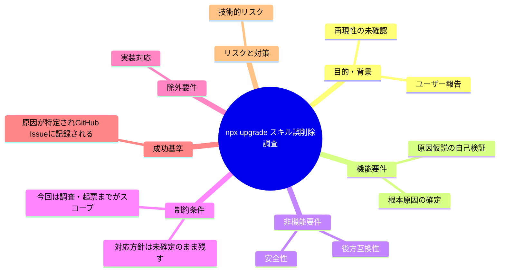
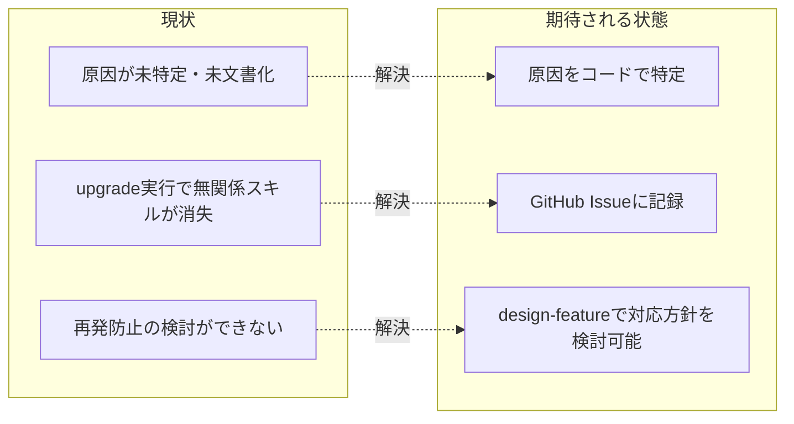

# 要求定義書: npx upgrade 実行時に無関係な自作スキルが誤って削除される事故の調査・起票

**プロジェクト名**: npx upgrade 実行時に無関係な自作スキルが誤って削除される事故の調査・起票
**作成日**: 2026 年 07 月 14 日
**最終更新**: 2026 年 07 月 14 日

> **重要**:
>
> - 要求定義書は、プロジェクトの全体像を把握するためのものです。詳細な技術仕様や実装方法は要件定義書以降で記載します。必要最低限の情報に収めることを心掛けてください。
> - **このドキュメントは常に更新**: 要求の変更や追加があった場合は、即座にこのドキュメントを更新してください。ドキュメントは「生きているドキュメント」として扱い、実装内容と常に同期させます。
> - **必須項目**: 以下の「必須」と明記した項目は空欄・抽象語のみ（例: 「{説明}」のまま）で提出しないこと。判定可能な形（目的は1文・成功基準は○/×で判定できる記載等）で記入すること。
>
> **用語**: [.agent-skill-chain/source/CONCEPTS.md §用語規約](../../../../.agent-skill-chain/source/CONCEPTS.md#用語規約) を参照。

---

## 要求定義の全体像

**注意**:

- 上記の「プロジェクト名」は例です。実際のプロジェクト名に置き換えてください。
- マインドマップは全体像を把握するためのものです。主要なセクション名程度に留め、詳細は記載しないでください。

---

## 1. 目的・背景

### 1.1 目的（必須）

npx 経由の `upgrade` 実行時にユーザーの無関係な自作スキルが誤って削除される事故の原因を特定し、GitHub Issue として記録する。

### 1.2 背景

- **現状の課題**:
  - ユーザーが `npx github:techbeansjp-free/AGENTS.md upgrade` 系統の更新コマンドを実行したところ、本パッケージとは無関係な既存の自作スキルが消失したと報告した。
  - 本パッケージの `SETUP.md` は「保持・上書き契約」として、`upgrade`/`uninstall` 時に**パッケージ所有のスキルエントリのみ**を削除・再配備し、ユーザー自作スキルは保持すると謳っている（契約違反の疑い）。

- **必要性**:
  - スキル同期ロジックが「所有物」と「ユーザー自作物」を誤判定すると、ユーザーの成果物を無警告で破壊する重大な信頼性リスクとなる。
  - 消費者リポジトリ全般に影響し得るため、原因を特定し再発防止（設計変更）を検討する土台を作る必要がある。

### 1.3 期待される効果（必須: 1 件以上）

- **効果 1**: 「無関係スキル消失」の技術的原因が、コードの直接確認により特定される（推測ではなく evidence_source 付きで裏付けられる）。
- **効果 2**: 原因と再現条件が GitHub Issue として記録され、対応方針検討（design-feature フェーズ）の土台が整う。

**現状と期待される状態の比較**（必要に応じて）:

---

## 2. 機能要件

### 2.1 既存機能の維持（該当する場合）

- スキル同期（`sync_skills_selective`）自体の「パッケージ所有エントリのみ削除→再配備」という設計意図・既存の安全策（`check_package_manifest` の fail-closed 等）は本 issue のスコープでは変更しない。原因調査と記録のみを行う。

### 2.2 新規機能要件

- 該当なし（本 issue は調査・起票のみ。対応方針の実装は design-feature 以降のスコープとする）。

---

## 3. 非機能要件

### 3.1 パフォーマンス

- 該当なし。

### 3.2 セキュリティ

- ユーザーの既存成果物（自作スキル等）を意図せず破壊しないことが本件の核心的な非機能要件である。今後の対応方針検討では、この安全性を最優先で扱うことを申し送る。

### 3.3 互換性

- 既存の「所有エントリのみ選択的に同期する」という契約自体の廃止は想定せず、判定ロジックの精度向上（衝突回避）を今後の検討対象とする。

### 3.4 保守性

- 命名規約の単一正本（`.agent-skill-chain/source/scripts/lib/deploy-skills.sh`）に関する既存のコメント・ドキュメント（`SETUP.md`、`platforms/DESIGN_SYNC_SKILLS_NAMING.md` 等）との整合を維持する。

---

## 4. 制約条件

### 4.1 技術的制約

- 本 issue では対応方針（実装の具体案）を確定させない。design-feature フェーズの検討事項として残す。
- ユーザーの実環境（実際に消失した自作スキル名・実行したコマンドの詳細ログ）は未取得であり、本調査はリポジトリ内のコード読解によるものである。実環境の再現ログが得られれば追加検証が望ましい旨を申し送る。

### 4.2 既存システムとの互換性

- 該当なし（調査・起票のみ）。

### 4.3 移行期間・スケジュール

- 該当なし。

---

## 5. 除外要件

- 対応方針（実装の具体案）の確定・実装は本 issue のスコープ外（design-feature / implement-feature フェーズで別途検討する）。
- ユーザー実環境でのピンポイント再現テストの実施は本 issue のスコープ外（コードレベルの検証に留める）。

---

## 6. 成功基準（必須: 1 件以上）

- 原因仮説（後述 §原因調査の結果）について、コードの直接確認（Read）によって裏付け・反証のいずれかが行われ、その結果が本ドキュメントに evidence_source 付きで記載されていること。
- 上記調査結果を要約した GitHub Issue が起票され、Issue 番号が本ドキュメントの frontmatter `github_issue` に記録されていること。

---

## 7. リスクと対策

### 7.1 技術的リスク

- **リスク**: コードレベルの調査のみでは、ユーザー実環境固有の要因（npx キャッシュ、OS 差異等）を見落とす可能性がある。
  - **対策**: 本ドキュメントに「他の原因候補」として検討済みの代替仮説を明記し、design-feature フェーズでの再検証余地を残す。

### 7.2 スケジュールリスク

- 該当なし。

---

## 8. 参考資料

### プロジェクトドキュメント

- [.agent-skill-chain/source/scripts/lib/deploy-skills.sh](../../../../.agent-skill-chain/source/scripts/lib/deploy-skills.sh) — スキル配備・所有エントリ算出・選択的同期の単一正本
- [.agent-skill-chain/source/scripts/setup.sh](../../../../.agent-skill-chain/source/scripts/setup.sh) — init/upgrade 共通の配備エントリポイント（本 issue で確認: 178〜223行目付近で `sync_skills` を呼び出す箇所は init/upgrade で分岐しておらず、両者に同一ロジックが適用される。単一の「setup 脚本 1 本」構成であることを `SETUP.md:375` の記載でも確認済み）
- [.agent-skill-chain/source/SETUP.md](../../../../.agent-skill-chain/source/SETUP.md) §init/upgrade/uninstall の保持・上書き契約
- [.agent-skill-chain/source/skills/](../../../../.agent-skill-chain/source/skills/) — 実際のディレクトリ構成（後述の検証結果参照）

### その他の参考資料

- ユーザー報告（本文冒頭の背景）。1 次情報として実行ログ・実際に消失したスキル名は未提供。

---

## 9. 次のステップ

この要求定義書の承認後、以下のドキュメントを作成します：

- **次**: [`01_要件定義.md`](./01_要件定義.md) - 要件定義フェーズ

---

## 付録: 原因調査の結果（自己検証・evidence_source 付き）

サブエージェントが `.agent-skill-chain/source/scripts/lib/deploy-skills.sh` および `.agent-skill-chain/source/scripts/setup.sh` を直接 Read して検証した結果を記す。**evidence_source: existing_code**（一次情報＝当該コードそのものの直接確認）。

### 検証 1: 「所有エントリ名」算出における `agent` の特異性

`list_owned_skill_names`（`deploy-skills.sh:66-90`）は、`.agent-skill-chain/source/skills/{domain}/` を走査し、次の 2 パターンで「パッケージ所有エントリ名」を算出する。

1. `{domain}/SKILL.md` が**ドメイン直下に存在**する場合 → 所有名は裸の `{domain}`（`deploy-skills.sh:77-79`）。
2. `{domain}/{capability}/SKILL.md` が存在する場合 → 所有名は `{domain}__{capability}`（`deploy-skills.sh:82-88`）。

実際に `ls .agent-skill-chain/source/skills/*/` を実行して確認したところ、7 ドメイン中、ドメイン直下に `SKILL.md` を持つのは **`agent/` のみ**（`skills/agent/SKILL.md` が存在。他の `architecture/` `implementation/` `logging/` `requirements/` `review/` `testing/` は直下に `README.md` のみで `SKILL.md` は各 capability サブディレクトリの下にのみ存在）。

したがって `list_owned_skill_names` が返す所有名集合には、他の全エントリが `__` で名前空間化されているのに対し、**`agent` だけが裸のドメイン名**として含まれることをコード・ディレクトリ構成の両面で確認した。

### 検証 2: 選択的同期が所有名を無条件削除すること

`sync_skills_selective`（`deploy-skills.sh:96-111`）は、`list_owned_skill_names` が返す各名前について、**判定なしに** `rm -rf "${dest_root:?}/$name"` を実行してから `deploy_skills_impl` で再配備する（`deploy-skills.sh:104-107`）。所有名かどうかの判定は「名前が一致するかどうか」のみであり、当該ディレクトリの中身がパッケージ由来か否かを内容で判別する仕組みは無い。

### 検証 3: init/upgrade で同一ロジックが使われること

`setup.sh` は `sync_skills` 関数（`setup.sh:169-174`、内部で `sync_skills_selective` を呼ぶ）を、`.claude/skills` と `.cursor/skills` の双方に対して**無条件に**呼び出している（`setup.sh:222-223`）。`setup.sh` 内には init/upgrade で分岐する専用コードパスは見当たらず、`SETUP.md:375` にも「導入は setup 脚本 1 本に統一した」旨の記載がある。すなわち `upgrade` 実行時も `init` 実行時と同じ `sync_skills_selective` が同じ所有名集合（`agent` を含む）で呼ばれる。

### 結論（裏付けられた仮説）

上記 3 点をコードの直接確認により裏付けた。**もしユーザーが `.claude/skills/agent/` または `.cursor/skills/agent/` に、本パッケージと無関係な自作スキルを `agent` という名前のディレクトリで置いていた場合、`upgrade`（および `init`・`uninstall` の対称除去ロジックも同様）実行時に `list_owned_skill_names` がそのディレクトリを本パッケージの所有物と誤認し、`rm -rf` してから本パッケージの `agent` スキルで上書きする**。これはユーザー報告（「本パッケージとは無関係な既存スキルが消失した」）と整合する、名前衝突による設計上のギャップである。**evidence_source: existing_code**（本項目全体）。

### 検討した代替仮説（他に見つかった可能性）

- **npx のキャッシュ/参照解決**: `bin/agents-md.js` や `package.json` の `bin` 設定自体には、キャッシュ起因でスキルディレクトリを丸ごと差し替えるような記述は見当たらなかった（`grep` で `bin` 定義のみ確認。詳細な npx キャッシュ機構自体はローカルコードの範囲外のため inference_only に留まる。要注意: 非ブロッキング）。
- **PROJECT_ROOT の誤解決**: `setup.sh` 冒頭（1-33 行目）の `PROJECT_ROOT` 解決ロジックを確認したが、`check_package_manifest`（`package-manifest.sh` に定義、fail-closed）による衝突検知が事前に走る設計になっており、既知の安全策が存在する。今回の事故の主因としては、`agent` 名前衝突説の方が具体性・再現性ともに高いと判断した。
- 上記 2 案は仮説段階（一部 inference_only を含む）であり、design-feature フェーズでユーザー実環境の詳細（実際に消えたスキル名、実行コマンドの正確な引数、npx のバージョン等）が得られれば追加検証が望ましい。

### 対応方針についての注記（未確定・design-feature へ持ち越し）

本 issue では対応方針（例: `agent` エントリの名前空間化、所有判定への内容ハッシュ導入、削除前の存在確認・警告等）を確定させない。design-feature フェーズでの検討事項として残す。
