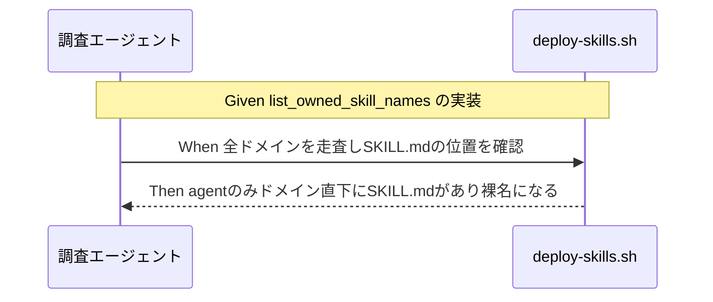

# 要件定義書: npx upgrade 実行時に無関係な自作スキルが誤って削除される事故の調査・起票

**プロジェクト名**: npx upgrade 実行時に無関係な自作スキルが誤って削除される事故の調査・起票
**作成日**: 2026 年 07 月 14 日
**最終更新**: 2026 年 07 月 14 日

> **重要**: **このドキュメントは常に更新**: 要件の変更や追加があった場合は、即座にこのドキュメントを更新してください。ドキュメントは「生きているドキュメント」として扱い、実装内容と常に同期させます。
>
> **用語**: [.agent-skill-chain/source/CONCEPTS.md §用語規約](../../../../../.agent-skill-chain/source/CONCEPTS.md#用語規約) を参照。

---

## 1. 概要

### 1.1 システム概要

本パッケージ（AGENTS.md）は `setup.sh`（init/upgrade/uninstall 共通の単一脚本）により、`.claude/skills`・`.cursor/skills` へパッケージ所有のスキルを配備する。配備・同期ロジック（`sync_skills_selective`・`list_owned_skill_names`）は `.agent-skill-chain/source/scripts/lib/deploy-skills.sh` に集約されている。本 issue は、この同期処理が「無関係な自作スキルまで削除してしまう」というユーザー報告の原因を調査し、GitHub Issue として記録するものである。

### 1.2 用語集

| 用語               | 説明                                                                                     |
| ------------------ | ---------------------------------------------------------------------------------------- |
| 所有エントリ       | `list_owned_skill_names` が算出する、パッケージが配備先に作るスキルディレクトリ名の集合   |
| 選択的同期         | `sync_skills_selective`。配備先を丸ごと削除せず、所有エントリ名のみ削除→再配備する処理    |
| ドメイン直下 SKILL | `{domain}/SKILL.md` が capability サブディレクトリを介さず直接存在するケース（例: `agent`） |

---

## 2. 機能要件

### 2.1 ユーザーストーリー

#### ストーリー 1: 原因の自己検証

- **As a** 調査を依頼されたエージェント
- **I want to** `deploy-skills.sh` と `setup.sh` を直接読んで所有エントリ算出・削除ロジックを検証する
- **So that** 伝聞（他エージェントの静的解析結果）を鵜呑みにせず、一次情報（コード自体）に基づいて原因を確定できる

**受け入れ基準**:

- `list_owned_skill_names` と `sync_skills_selective` の該当行を実際に Read し、引用できる。
- `.agent-skill-chain/source/skills/` の実ディレクトリ構成を実際に `ls` して、`agent` のみがドメイン直下に `SKILL.md` を持つことを確認する。
- 検証結果（裏付けられたか・反証されたか・他の可能性）を 00_要求定義.md に evidence_source 付きで記載する。

#### ストーリー 2: GitHub Issue への記録

- **As a** 進行役（orchestrator）
- **I want to** 調査結果が GitHub Issue として起票され、ローカル 00 の frontmatter に書き戻される
- **So that** 対応方針検討（design-feature フェーズ）を後日別タスクとして安全に引き継げる

**受け入れ基準**:

- `gh issue create` で Issue が起票される。
- Issue 番号が 00_要求定義.md の frontmatter `github_issue` に `"#<番号>"` 形式で記録される。

### 2.2 BDD ユースケース

#### ユースケース 1: 原因仮説の自己検証

事前に提示された仮説（`agent` ドメインが裸名で所有エントリ扱いされ、無条件 `rm -rf` される）を、コードの直接確認により検証する。

**シナリオ 1: 所有エントリ名の算出ロジックを確認する**

```gherkin
Feature: 原因仮説の自己検証
  Scenario: 所有エントリ名の算出ロジックを確認する
    Given deploy-skills.sh の list_owned_skill_names 関数
    When ドメイン直下に SKILL.md があるかどうかで所有名の形式が分岐する実装を確認する
    Then agent ドメインのみが capability 名前空間（__）を持たない裸のドメイン名であることが判明する
```

**処理フロー**（必要に応じて）:



**シナリオ 2: 選択的同期が無条件削除であることを確認する**

```gherkin
Feature: 原因仮説の自己検証
  Scenario: 選択的同期が無条件削除であることを確認する
    Given sync_skills_selective 関数
    When 所有エントリ名について rm -rf の実行条件を確認する
    Then 名前が一致する限り中身の由来を判定せず無条件に削除されることが判明する
```

#### ユースケース 2: GitHub Issue 起票と書き戻し

**シナリオ 1: 起票と同一タスク内での書き戻し**

```gherkin
Feature: GitHub Issue 起票と書き戻し
  Scenario: 起票と同一タスク内での書き戻し
    Given 00_要求定義.md の github_issue が null である
    When gh issue create でユーザー明示依頼に基づき起票する
    Then 発行された Issue 番号を同一タスク内で github_issue に "#<番号>" 形式で書き戻す
```

### 2.3 ビジネスルール

- 対応方針（実装の具体案）は本 issue では確定させない。design-feature フェーズへ持ち越す。
- 起票は `.agent-skill-chain/project/自己拡張ワークフロー.md` §GitHub Issue 起票ゲート（具体手順）に従う。ユーザーが明示的に「起票して」と依頼済みのため、起票要否のユーザー確認は省略し、デフォルト起票（手順 2）へ直接進む。

---

## 3. 非機能要件

### 3.1 パフォーマンス要件

- 該当なし。

### 3.2 セキュリティ要件

- 調査対象がユーザーの成果物削除という破壊的事故であるため、本 issue 自体の作業（ドキュメント作成・GitHub Issue 起票）はいずれも読み取り中心であり、破壊的操作は行わない。

### 3.3 ユーザビリティ要件

- GitHub Issue のタイトル・本文は、ユーザーが再現条件を把握しやすい表現とする。

### 3.4 可用性要件

- 該当なし。

---

## 4. 外部インターフェース要件

### 4.1 API 要件

- `gh issue create --repo techbeansjp-free/AGENTS.md` を用いて GitHub Issue を起票する。

### 4.2 データ形式要件

- 00_要求定義.md frontmatter の `github_issue` は `"#<番号>"` 形式の文字列とする。

---

## 5. 制約事項

- 実装対応（`agent` エントリの名前空間化等の具体的な修正案）は本 issue のスコープ外。design-feature フェーズの検討事項として残す。
- ユーザー実環境での再現テストは実施しない（コードレベルの検証に留める）。

---

## 6. 参考資料

### プロジェクトドキュメント

- [`00_要求定義.md`](./00_要求定義.md) - 要求定義

### その他の参考資料

- [.agent-skill-chain/source/scripts/lib/deploy-skills.sh](../../../../../.agent-skill-chain/source/scripts/lib/deploy-skills.sh)
- [.agent-skill-chain/source/scripts/setup.sh](../../../../../.agent-skill-chain/source/scripts/setup.sh)
- [.agent-skill-chain/source/SETUP.md](../../../../../.agent-skill-chain/source/SETUP.md)

---

## 7. 前のステップ

この要件定義書は、以下のドキュメントを基に作成されています：

- **前**: [`00_要求定義.md`](./00_要求定義.md) - 要求定義フェーズ

---

## 8. 次のステップ

この要件定義書の承認後、以下のドキュメントを作成します：

- **次**: [`02_設計.md`](./02_設計.md) - 設計フェーズ（本 issue のスコープでは design-feature フェーズへ進めない。将来の別タスクとして引き継ぐ）
