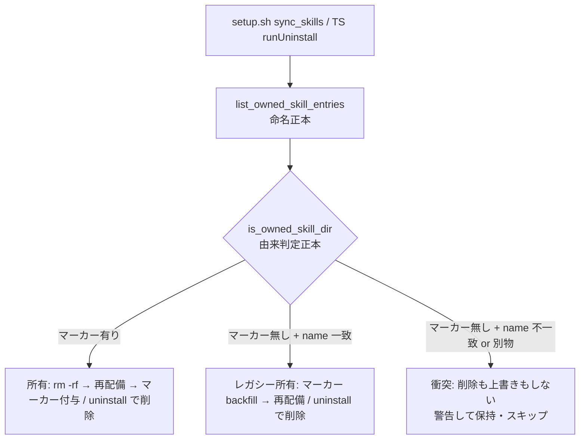
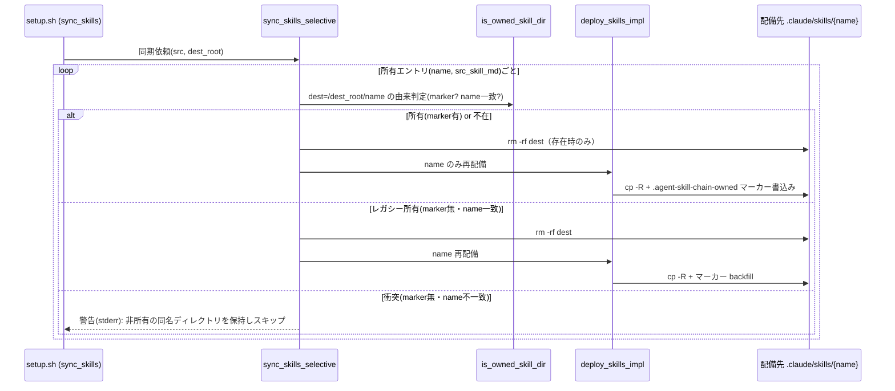
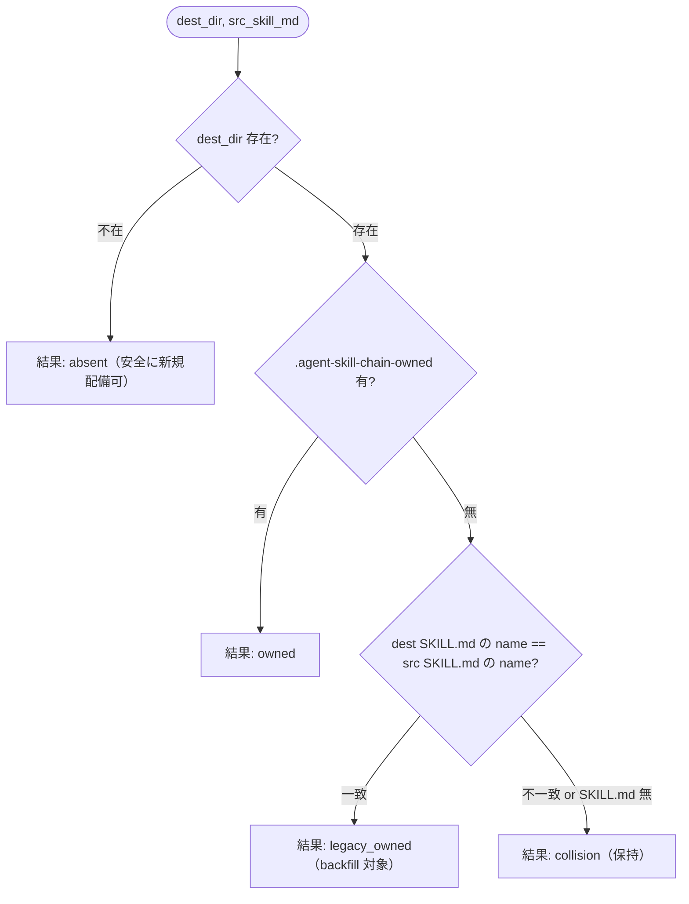

# 設計書: npx upgrade/uninstall での無関係スキル誤削除の恒久対策

**プロジェクト名**: npx upgrade/uninstall での無関係スキル誤削除の恒久対策
**作成日**: 2026 年 07 月 14 日
**最終更新**: 2026 年 07 月 14 日

> **重要**: **このドキュメントは常に更新**: 設計の変更や追加があった場合は、即座にこのドキュメントを更新してください。ドキュメントは「生きているドキュメント」として扱い、実装内容と常に同期させます。
>
> **用語**: [.agent-skill-chain/source/CONCEPTS.md §用語規約](../../../../../.agent-skill-chain/source/CONCEPTS.md#用語規約) を参照。

---

## 1. 設計概要

**必須**: 設計方針・原則は [.agent-skill-chain/source/spec/01\_設計原則.md](../../../../../.agent-skill-chain/source/spec/01_設計原則.md) を**先に参照**した上で、本プロジェクトに**適用するものを選び**記載する。

### 1.1 設計方針

「所有名（`list_owned_skill_names` の集合）と一致するディレクトリを、中身の由来を確認せず無条件に `rm -rf`・上書きする」という破壊的操作を、**配備時に書き込む所有マーカー（配備証跡）で由来を確認できた場合のみ**に限定する。破壊は fail-closed（由来不明なら削除しない）、配備は fail-open（衝突エントリはスキップして他エントリの同期は継続）に倒し、ユーザー資産の保全を最優先とする。

### 1.2 設計原則（本プロジェクトで適用するもの）

- **単一責務**: 「配備先スキルディレクトリがパッケージ所有か否か」を判定する責務を 1 か所（`deploy-skills.sh` の判定関数）に集約し、bash・TS の両経路がこれを唯一の正本として参照する。命名/所有集合の単一正本という既存方針に「安全な削除可否判定」を揃える。
- **明確な境界**: 「所有名の算出（命名規約）」「所有ディレクトリの由来判定（マーカー/フィンガープリント）」「削除・配備の実行」を境界として分離し、既存の命名正本を汚さない。
- **UNIX哲学**: マーカーは 1 行の隠しファイルという最小構造とし、判定は「存在確認 + 1 行比較」だけの小さな部品で構成する。既存の同期処理へ最小差分で組み込む。
- **AIフレンドリー設計**: 判定関数は意図が読める命名（`is_owned_skill_dir` / `isOwnedSkillDir`）とし、マーカー名・判定規則をコメントで正本参照付きで明示する。

---

## 2. アーキテクチャ設計

### 2.1 責務・境界・参照関係

#### 2.1.1 責務一覧

| コンポーネント | 責務（1 文） |
| -------------- | ------------ |
| `deploy-skills.sh` `list_owned_skill_names` / `list_owned_skill_entries`（bash） | 正本 `source/skills/` から所有エントリ名（および対応する正本 SKILL.md パス）を算出する（命名規約の単一正本）。 |
| `deploy-skills.sh` `is_owned_skill_dir`（bash・新規） | 配備先の当該ディレクトリがパッケージ配備物か否かを「所有マーカーの有無」＋「移行フォールバック（SKILL.md の `name` 一致）」で判定する唯一の正本。 |
| `deploy-skills.sh` `deploy_skills_impl`（bash・改修） | 正本を配備先へコピーする。自己インストール経路では配備直後に所有マーカーを書き込む（アダプタ生成経路ではマーカーを書かない）。 |
| `deploy-skills.sh` `sync_skills_selective`（bash・改修） | 所有名ごとに `is_owned_skill_dir` を評価し、所有と確認できた（または不在の）エントリのみ削除→再配備し、衝突エントリは削除も上書きもせず警告してスキップする。 |
| `agents-md.ts` `ownedSkillNames` / `deployedOwnedSkillEntries`（TS・内部拡張。公開返り値は不変） | uninstall 対象の所有エントリ相対パスを算出する（bash の命名規約ミラー）。正本 SKILL.md パスを引けるよう内部を拡張する。 |
| `agents-md.ts` `isOwnedSkillDir`（TS・新規） | uninstall 時に各所有エントリ実ディレクトリの由来を判定する（bash `is_owned_skill_dir` の同型ミラー）。 |
| `agents-md.ts` `runUninstall`（TS・改修） | 所有スキルエントリのうち `isOwnedSkillDir` が真のものだけを削除対象に含め、衝突エントリは保持して表示する。 |

#### 2.1.2 境界

- **入力**: 正本スキルツリー `source/skills/`、配備先ルート（`.claude/skills`・`.cursor/skills`）、および配備先に既存する同名ディレクトリの状態（マーカー有無・SKILL.md 内容）。
- **出力**: 配備先スキルディレクトリの安全な同期（所有分のみ削除→再配備＋マーカー付与）、衝突検知時の警告（stderr）、uninstall 時の所有分のみ除去。
- **他責務との境界**: **本 issue の範囲外**とするもの＝(1) 統合ルート `.agent-skill-chain/` 全体の由来検知（既存の `.package-manifest` fail-closed。本 issue は変更しない）、(2) `workflow.db` の由来検知欠如（別サブ issue）、(3) `agent` ドメインのソースツリー構造そのものの再編（案B。本 issue では採用しない＝§2.5 ADR-2）。

#### 2.1.3 参照関係

- `sync_skills_selective` → `list_owned_skill_entries` → （各エントリで）`is_owned_skill_dir` → `deploy_skills_impl`
- `setup.sh sync_skills` → `sync_skills_selective`（既存）
- `build-adapters.sh` → `deploy_skills_impl`（マーカー非書込みモードで既存どおり）
- `agents-md.ts runUninstall` → `deployedOwnedSkillEntries` → `ownedSkillNames`、および `isOwnedSkillDir`
- 循環参照なし。命名正本（`list_owned_skill_*`）と由来判定正本（`is_owned_skill_dir`）は一方向依存で、判定は命名に依存するが命名は判定に依存しない。

### 2.2 システムアーキテクチャ

- **採用パターン**: 共有ライブラリ（`deploy-skills.sh`）を単一正本とし、TS 側は同型ミラーで追随する「単一正本 + ミラー」パターン。既存の `list_owned_skill_names` ↔ `ownedSkillNames` の関係を、由来判定にもそのまま拡張する。
- **根拠**: [spec/06_設計判断の優先順位.md](../../../../../.agent-skill-chain/source/spec/06_設計判断の優先順位.md) の「再利用のために責務を曖昧にしてはならない」「docs と実装の不整合を放置してはならない」に従い、判定規則を 1 か所へ集約して bash/TS の drift を防ぐ。

#### 2.2.1 CQRS（Command/Query 分離）

- **Query（状態取得・副作用なし）**: `list_owned_skill_names` / `list_owned_skill_entries` / `is_owned_skill_dir` / `isOwnedSkillDir`。ディレクトリ・ファイルを読むだけで破壊しない。
- **Command（状態変更）**: `sync_skills_selective`（削除→再配備→マーカー書込み）、`runUninstall`（削除）。破壊的操作は Query の判定結果に**厳密に従属**させ、Query が「所有」と確定したエントリにのみ作用する。

#### 2.2.2 アーキテクチャ図



### 2.3 コンポーネント構成

- **命名層**（境界: 命名規約）: `list_owned_skill_names` / `list_owned_skill_entries`。`{domain}__{capability}`・ドメイン直下 `{domain}` の算出のみを担う。由来判定を持ち込まない。
- **由来判定層**（境界: 所有判定）: `is_owned_skill_dir` / `isOwnedSkillDir`。配備先ディレクトリの由来のみを判定する。命名は入力として受け取る。
- **実行層**（境界: 破壊的操作）: `sync_skills_selective` / `deploy_skills_impl` / `runUninstall`。判定層の結果に従って削除・配備・マーカー書込みを行う。各層は単一責務（[spec/01_設計原則.md §単一責務・§明確な境界](../../../../../.agent-skill-chain/source/spec/01_設計原則.md)）。

### 2.4 データフロー

配備証跡（所有マーカー）を「配備という事実」を表すファイルとして扱う。マーカーの生成は「パッケージがこのディレクトリを配備した」という起きた事実を記録する（[spec/01_設計原則.md §イベント駆動](../../../../../.agent-skill-chain/source/spec/01_設計原則.md#イベント駆動) の考え方を、副作用の最小記録として援用）。



### 2.5 横断設計判断（ADR）

#### ADR-1: 所有マーカー方式（案A）＋名前フィンガープリント移行フォールバックを採用する

- **コンテキスト**: 現状 `sync_skills_selective`（bash）と `runUninstall`（TS）は、`list_owned_skill_names` が返す所有名と一致する配備先ディレクトリを、中身の由来を確認せず無条件に `rm -rf`・上書きする。所有名のうち `agent` だけが裸のドメイン名（他は `{domain}__{capability}` に名前空間化）であるため、ユーザーが `.claude/skills/agent/` に無関係な自作スキルを置くと upgrade/uninstall で削除される（実機再現済み・00_要求定義 §実機再現検証、evidence_source: reproduction）。将来ドメインが増えても、また `__` 名であっても同名衝突が起きれば再発しうる**構造的問題**である。
- **検討した選択肢**:
  1. **案A（マーカー方式）**: 配備時に各配備先スキルディレクトリへ隠しマーカー `.agent-skill-chain-owned` を書き込み、削除・上書きは「マーカーが存在する場合のみ」許可。無ければ非所有の衝突とみなし保持＋警告＋スキップ。命名/所有判定の単一正本（`deploy-skills.sh`）に「安全な削除可否判定」を集約し、bash・TS 双方に反映する。
  2. **案B（名前空間化）**: `agent` の配備先名を他ドメイン同様 `agent__{capability}` へ変更し、裸名の特異性を除去する（詳細は ADR-2）。
  3. **案A のマーカーのみ（移行フォールバック無し）**: マーカーの有無だけで判定する最小案。
  4. **内容バイト一致フィンガープリント**: マーカー不在時、配備先 SKILL.md が現行正本 SKILL.md とバイト一致するかで所有判定する案。
- **決定**: **案A（マーカー方式）を主対策として採用**し、既存配備物（マーカー未付与のレガシー環境）に対しては**移行フォールバック＝配備先 SKILL.md の frontmatter `name` が正本の `name` と一致するか**でレガシー所有を判定してマーカーを backfill する。判定の優先順は (1) マーカー有り→所有（高速パス）、(2) マーカー無し・かつ配備先 `SKILL.md` の `name` が正本エントリの `name` と一致→レガシー所有（backfill）、(3) それ以外→非所有の衝突（保持・スキップ）。
- **根拠**:
  - 案A は「名前一致」ではなく「配備証跡」で由来を判定するため、`agent` に限らず**全ドメイン・将来のドメイン追加でも一律に**構造的問題を解消する（要求 §7 のリスク・非機能 §3.2 セキュリティ「ユーザー成果物を破壊しない」を最優先で満たす）。evidence_source: existing_code（現状コードが名前一致のみで削除している事実＝`deploy-skills.sh:104-107`・`agents-md.ts:873-878, 927-936`）。
  - 案A は既存の設計思想と整合する。統合ルートは既に `.package-manifest`（`name`+`version`）による fail-closed の由来検知を採用しており（SETUP.md §配備マーカーによる衝突検知）、本案はそれを**スキルディレクトリ粒度へ一貫適用**するものである。evidence_source: existing_code（`SETUP.md:202-213`・`package-manifest.sh`）。
  - 移行フォールバックの `name` 一致は**バージョン非依存**である。スキルの frontmatter `name`（例: `agent`→`run-command`、`define-boundaries`）はバージョン間で安定し、実機再現でユーザーが置いた無関係スキルは `name: my-totally-unrelated-skill` で正本と不一致だったため、衝突を正しく保護できる。evidence_source: existing_code（正本 `skills/agent/SKILL.md: name: run-command`）＋ reproduction（00 §実機再現、ユーザー SKILL.md の `name` が異なる）。
- **帰結**: bash（`deploy-skills.sh`）と TS（`agents-md.ts`）の双方に由来判定関数を新設し、削除・上書きをその結果に従属させる。マーカーファイル `.agent-skill-chain-owned` が新たな配備物となり、SETUP.md の保持・上書き契約・所有区分表に追記が必要。衝突時は破壊せず警告する（fail-open な配備・fail-closed な破壊）。テストに衝突シナリオ（同名・別内容の自作スキルが upgrade/uninstall で保持されること、レガシー所有が backfill されること）を追加する。
- **保証水準の限定（脅威モデル）**: マーカーは**セキュリティ境界ではない**。マーカーファイルを置けば誰でも「所有」を偽装でき、逆に消せば「非所有」を装える弱い保証である。本設計の脅威モデルは**偶発的な名前衝突事故の防止**（非敵対的環境）に限定する。悪意ある偽装は対象外とする——配備先へマーカーを書ける者はそもそも当該ディレクトリを直接削除できる権限を持つため、マーカー偽装は攻撃としての意味を持たない。この限定の下でも、「名前一致のみで無条件 `rm -rf`」という現行挙動に対しては**厳密に安全側への改善**（破壊条件の追加であり、破壊範囲が広がるケースは存在しない）であることが採用根拠である。
- **name 一致フォールバックの残余リスク（受容・仕様固定）**:
  - **保護される側（重要性質）**: フォールバックは配備先 SKILL.md の `name` を**配備ディレクトリ名ではなく正本 SKILL.md の frontmatter `name`**（例: `agent` エントリなら `run-command`、`architecture__define-boundaries` なら `define-boundaries`）と比較する。したがって「ユーザーが偶然ディレクトリ名と同じ値（`name: agent` 等）を frontmatter に書いていた」ケースは正本 `name` と不一致で `collision`＝保護される。ディレクトリ名の偶然一致だけでは本問題は再発しない。evidence_source: existing_code（正本 frontmatter は全エントリでディレクトリ名と別値であることを確認済み）。
  - **残る窓 (r1)**: 配備ディレクトリ名**と** frontmatter `name` の**二重一致**（例: `.claude/skills/agent/` にユーザーが `name: run-command` と書く）は `legacy_owned` と判定され上書きされる。二重一致は実質「パッケージ配備物のコピー・派生」であり、レガシー移行（マーカー無しの全既存消費者環境を救済する）便益が上回ると判断し**受容**する。
  - **残る窓 (r2)**: パッケージ配備スキルを配備先で in-place カスタムしたユーザーの変更は upgrade で失われる（マーカー有→`owned`）。これは現行挙動と同一で回帰ではなく、カスタムは正本 `.agent-skill-chain/source/skills/` 側を編集する既存契約（SETUP.md §パッケージ管理の注）に従う。
  - **改名時の挙動 (r3)**: 由来判定は実行中パッケージ（npx 取得版）の正本 `name` と比較するため、将来スキルが**改名**された場合、マーカー無しの旧配備物は `name` 不一致→`collision`＝**保持**（stale 孤児）に倒れる。削除より安全側であり仕様とする（孤児掃除は行わない）。
  - **将来の縮退余地**: フォールバックはレガシー移行用であり、マーカー付与が消費者環境へ十分普及した将来には (r1) の窓を閉じるためフォールバック自体を削除する選択肢を残す（本 issue では実施しない。実施時は別 issue で移行期間を定義する）。

#### ADR-2: 案B（`agent` の名前空間化）は主対策として採用しない（却下・将来の任意衛生化として保留）

- **コンテキスト**: 案B は `agent` 配備先を `agent__{capability}` に変え裸名の特異性を消す案。
- **検討した選択肢**: (a) 案B を単独の恒久対策とする、(b) 案A に加えて案B も同時実施、(c) 案B を採用しない。
- **決定**: (c) 採用しない（案A のみで恒久対策とする）。
- **根拠**:
  - 案B は**構造的問題を一般解決しない**。ユーザーが偶然 `architecture__define-boundaries` 等の名で自作スキルを置けば同じ衝突が起きる。要求は「`agent` に限らず将来ドメインが増えても再発しうる構造的問題の恒久解消」を求めており、名前一致依存を残す案B は要件充足に不足する。evidence_source: existing_code（削除は名前一致のみで由来を見ない＝`deploy-skills.sh:104-107`）。
  - 後方互換リスク: 既存消費者環境は `.claude/skills/agent/` を前提にしており（配備実績・利用習慣）、配備先名を変えると旧 `agent/` ディレクトリが新所有集合に含まれず upgrade で**孤児化（stale 残存）**する。孤児掃除の追加ロジックが必要になり、案A より変更範囲が広い。evidence_source: existing_code（`deploy_skills_impl` のドメイン直下分岐＝`deploy-skills.sh:37-42`、旧名掃除は未実装）。
  - `agent` はソースツリー上 `skills/agent/SKILL.md` がドメイン直下に置かれる構造で、名前空間化はソースツリー再編（`skills/agent/{capability}/` 化）とアダプタ生成・ドキュメント参照の追随を伴い、[spec/06](../../../../../.agent-skill-chain/source/spec/06_設計判断の優先順位.md) の「短期的な実装容易性より長期的な可読性」に照らしても案A（局所的・一般的）が優る。
- **帰結**: 案B は不採用。案A 導入後は裸名 `agent` もマーカーで保護されるため、名前空間化は**必須ではない**。将来ドメイン構造を整理する際の任意の衛生化候補として本 ADR に記録するに留める（本 issue のスコープ外）。

#### ADR-3: マーカーのみ（移行フォールバック無し）／内容バイト一致は却下

- **コンテキスト**: 案A の移行方式として、より単純な代替を検討した。
- **検討した選択肢**: (a) マーカーのみ、(b) 内容バイト一致フィンガープリント、(c) マーカー＋`name` 一致フォールバック（ADR-1 の採用案）。
- **決定**: (c) を採用し (a)(b) を却下。
- **根拠**:
  - (a) マーカーのみ: 既存の全消費者環境の配備物にはマーカーが無いため、本改修後の**初回 upgrade で全パッケージスキルが「非所有の衝突」と誤判定**され、削除・更新がスキップされて stale 化＋大量の誤警告となる。既存機能の維持（要求 §2.1）に反する回帰。evidence_source: inference_only（既存配備物にマーカーが存在しないことは自明だが、初回 upgrade 挙動は本改修前提の推論。要注意・非ブロッキング＝RULES §高リスク操作非該当）。
  - (b) 内容バイト一致: 旧バージョンの配備物は現行正本 SKILL.md と内容が異なるため、正当な所有物が不一致となり誤って衝突扱いされる（バージョン脆弱）。evidence_source: existing_code（`deploy_skills_impl` は正本をそのままコピーするため、正本がバージョン更新されれば旧配備物と差分が生じる＝`deploy-skills.sh:37-53`）。
  - (c) frontmatter `name` はスキルの同一性を表しバージョン間で安定するため、レガシー所有を正しく backfill しつつ、`name` が異なるユーザー自作スキルを保護できる（ADR-1 の根拠に同じ）。
- **帰結**: 由来判定は 3 段階（マーカー→`name` 一致→非所有）とする。判定・backfill の単一正本を bash に置き TS がミラーする。

---

## 3. 機能設計

### 3.1 機能 1: 由来判定（`is_owned_skill_dir` / `isOwnedSkillDir`）

#### 3.1.1 概要

配備先の 1 スキルディレクトリが「パッケージ配備物か」を判定する副作用のない Query。マーカー有無と、移行フォールバックの `name` 一致で判定する。

#### 3.1.2 処理フロー



#### 3.1.3 入力・出力

- **入力**: 配備先ディレクトリ絶対パス、対応する正本 SKILL.md パス（`name` 参照用）。
- **出力**: 判定区分（`absent` / `owned` / `legacy_owned` / `collision`）。bash では終了コード＋標準出力（区分文字列）、TS では列挙型相当の文字列。

#### 3.1.4 エラーハンドリング

- SKILL.md が読めない・frontmatter に `name` が無い場合は「一致せず」＝`collision`（保持）に倒す（fail-safe＝破壊しない側）。マーカー読取り失敗も同様に非所有側へ倒す。

### 3.2 機能 2: 選択的同期の衝突ガード（`sync_skills_selective` 改修）

#### 3.2.1 概要

所有エントリごとに `is_owned_skill_dir` を評価し、`owned`/`legacy_owned`/`absent` のみ削除→再配備＋マーカー付与、`collision` は削除も上書きもせず stderr へ警告してスキップする。

#### 3.2.2 処理フロー

§2.4 のシーケンス図に同じ。

#### 3.2.3 入力・出力

- **入力**: `src_skills`、`dest_root`。
- **出力**: 配備先の安全な同期、衝突時警告。戻り値は既存同様（0）。

#### 3.2.4 エラーハンドリング

- 衝突は致命的でない。警告を出し当該エントリのみスキップして他エントリの同期は継続する（fail-open な配備）。削除は所有確定時のみ（fail-closed な破壊）。

### 3.3 機能 3: uninstall の衝突ガード（`runUninstall` 改修）

#### 3.3.1 概要

`deployedOwnedSkillEntries()` が返す各所有エントリ実ディレクトリのうち、`isOwnedSkillDir` が `owned`/`legacy_owned` のものだけを削除対象に含める。`collision` は削除対象から除外し「保持するユーザー資産」として表示する。

#### 3.3.2 入力・出力

- **入力**: プロジェクトルート、所有エントリ相対パス集合。
- **出力**: dry-run/実削除の対象一覧（衝突は保持表示）、実削除。

#### 3.3.3 エラーハンドリング

- 既存の rmSync 失敗ハンドリング（`failed` フラグ）を踏襲。衝突エントリはそもそも対象外。

### 3.4 機能 4: マーカー書込み（`deploy_skills_impl` 改修）

#### 3.4.1 概要

自己インストール経路（`sync_skills_selective` からの呼び出し）でのみ、配備した各スキルディレクトリ直下へ `.agent-skill-chain-owned`（1 行のパッケージ識別子）を書き込む。アダプタ生成経路（`build-adapters.sh`）ではマーカーを書かない（配備先が清浄なビルドディレクトリで衝突が起こり得ず、カプセルへの混入も避けるため）。

#### 3.4.2 入力・出力

- **入力**: `src_skills`、`out_skills`、（新規）マーカー書込みフラグ／単一エントリ絞り込み名。
- **出力**: 配備件数（既存どおり標準出力）＋（自己インストール時）マーカーファイル。

#### 3.4.3 エラーハンドリング

- マーカー書込み失敗時は警告に留め配備自体は成功扱い（次回同期で `name` 一致フォールバックにより所有と再判定できるため回復可能）。

---

## 4. データ設計

### 4.1 データモデル

本件は永続 DB を持たない。唯一のデータ構造は**所有マーカーファイル**である。

| 項目 | 値 |
| ---- | -- |
| パス | `.claude/skills/{name}/.agent-skill-chain-owned`、`.cursor/skills/{name}/.agent-skill-chain-owned` |
| 内容 | パッケージ識別子（`name`。任意で `version` を併記）。1〜2 行。統合ルート `.package-manifest` と同趣旨の軽量版 |
| 判定での用途 | 存在＝所有（高速パス）。内容は将来の厳格化に備えるが、当面は**存在のみ**を所有条件とする |

### 4.2 データ構造

- マーカー例（最小）:
  ```
  agent-skill-chain
  ```
- 隠しファイルのため `cp -R "$cap_dir"/*` の対象外（`*` はドットファイルを含まない）であり、正本ツリーには存在しない。配備先にのみ生成される。

---

## 5. API 設計

本件は外部 HTTP API を持たない。内部関数インターフェース（契約）を以下に定める。

### 5.1 API（関数）一覧

| 関数 | 種別 | 説明 |
| ---- | ---- | ---- |
| `list_owned_skill_entries <src>`（bash・新規） | Query | `name<TAB>src_skill_md_path` を 1 行ずつ列挙。`list_owned_skill_names` はこの第1列（後方互換ラッパー） |
| `is_owned_skill_dir <dest_dir> <src_skill_md>`（bash・新規） | Query | 由来区分（`absent`/`owned`/`legacy_owned`/`collision`）を返す |
| `sync_skills_selective <src> <dest_root>`（bash・改修） | Command | 由来判定に従属した安全同期 |
| `deploy_skills_impl <src> <out> [only_name] [write_marker]`（bash・改修） | Command | 単一エントリ絞り込み・マーカー書込みを追加（既定は従来挙動＝全件・マーカー無し） |
| `ownedSkillNames()` / `deployedOwnedSkillEntries()`（TS・内部拡張） | Query | 命名規約ミラー。名前↔正本 SKILL.md パスの対を引けるよう内部拡張（公開返り値 `string[]` は不変＝§2.1.1 と同一方針） |
| `isOwnedSkillDir(destDir, srcSkillMd)`（TS・新規） | Query | bash `is_owned_skill_dir` の同型ミラー |
| `runUninstall(projectRoot, opts)`（TS・改修） | Command | 所有確定エントリのみ削除対象化 |

### 5.2 API 詳細（契約）

- **`is_owned_skill_dir` / `isOwnedSkillDir`**
  - 入力: 配備先ディレクトリ、正本 SKILL.md パス。
  - 出力: `absent`/`owned`/`legacy_owned`/`collision`。
  - 契約違反: 引数不足・読取り不能は**破壊しない側**（`collision` 相当）に倒す。副作用を持たない（Query）。
- **`sync_skills_selective`**
  - 契約: `collision` エントリを削除・上書きしない（不変条件）。`owned`/`legacy_owned`/`absent` のみ削除→再配備。再配備後はマーカーが存在する（`legacy_owned` は backfill）。
- **`deploy_skills_impl`**
  - 後方互換: 追加引数省略時は現行挙動（全件配備・マーカー無し）を厳守（`build-adapters.sh` の呼び出しを変更しない）。

---

## 6. テスト戦略

テスト戦略の**観点の定義**は [RULES.md のテスト戦略必須要件](../../../../../.agent-skill-chain/source/RULES.md#テスト戦略必須要件) を、**BDD 形式の定義**は [TEST_BDD_FORMAT.md](../../../../../.agent-skill-chain/source/TEST_BDD_FORMAT.md) を参照する。

### 6.1 対象ごとのテスト割り当て

| 対象 | 単体 | 結合/API | E2E | クリティカル観点 | バリデーション観点 | 未達理由/補足 |
| ---- | ---- | -------- | --- | ---------------- | ------------------ | ------------- |
| `is_owned_skill_dir`（bash） | ○ | × | ○ | 由来 4 区分を正しく判定（特に collision で保持） | SKILL.md 欠落/`name` 欠落時は collision へ | 単体は bash 関数直呼びで検証 |
| `isOwnedSkillDir`（TS） | ○ | × | ○ | bash と同一区分を返す | 同上 | ビルド後 CLI 経由でも検証 |
| `sync_skills_selective`（upgrade 相当） | × | ○ | ○ | 同名・別内容の自作 `agent` が upgrade で保持される | マーカー付き所有は更新される | e2e-install-uninstall.sh に衝突シナリオ追加 |
| レガシー移行（`name` 一致 backfill） | × | ○ | ○ | マーカー無し・`name` 一致の旧配備物が更新＋backfill される | `name` 不一致は保持 | 同上 |
| `runUninstall`（TS uninstall） | × | ○ | ○ | 同名・別内容の自作 `agent` が uninstall で保持される | 所有分は削除される | 同上（uninstall シナリオ） |
| ドメイン増加の一般性 | × | ○ | ○ | 任意 `{domain}__{cap}` 同名衝突でも保持 | — | パラメトリック確認（1 例で代表） |

### 6.2 監査・レビューでの確認（証跡）

本設計書 §6.1 の割当表と 03_実装計画のタスク別テスト観点・BDD が対応していることを確認する。既存の R1/R2/R3 保持シナリオ（SETUP.md §保証）を回帰させないことを併せて確認する。

### 6.3 review-docs 二観点リスト（実装前ドキュメントレビュー証跡・REVIEW_DUAL_LENS.md §3）

実装前ドキュメントレビュー（review-docs）で適用した二観点の両リスト。指摘の詳細・修正履歴は issue の `memo/` 配下（非追跡）に記録し、本節は git 追跡される確定リストとして保持する。

#### 敵対的観点リスト（攻めた観点と結論）

| 観点 | 結論 |
| ---- | ---- |
| マーカーは偽装可能（置けば所有・消せば非所有を装える）で保証が弱いのではないか | 弱い保証で正しい。ただし脅威モデルは偶発的衝突事故の防止に限定し、悪意ある偽装は対象外（偽装できる権限＝直接削除できる権限）。無条件 `rm -rf` に対し破壊条件を追加するだけの厳密な安全側改善であり妥当（ADR-1 §保証水準の限定に明文化） |
| name 一致フォールバックが「ユーザーが偶然 `name: agent` 等ディレクトリ名と衝突する値を書いた」場合に問題を再導入しないか | 再導入しない。比較対象は配備ディレクトリ名ではなく正本 frontmatter `name`（`run-command` 等・全エントリでディレクトリ名と別値）のため `collision`＝保護。残る窓は二重一致（`name: run-command` を自書き）のみで、レガシー救済の便益が上回ると判断し受容・仕様固定（ADR-1 §残余リスク r1） |
| スキル改名時にフォールバックが旧配備物を誤削除しないか | しない。改名後は `name` 不一致→`collision`＝保持（stale 孤児・安全側）。仕様として明記（ADR-1 r3） |
| bash と TS の二重実装が drift しないか | 判定規則の正本は bash（`deploy-skills.sh`）1 か所とし TS は同型ミラー、同一 fixture のクロステスト（03 T3）で一致を機械的に担保。frontmatter 抽出の正規化規則も両者同一と規定（03 §5.1 リスク） |
| フォールバックが恒久有効だと残余窓 r1 が永続するのではないか | 事実。将来の縮退（フォールバック削除）余地を ADR-1 に記録し、本 issue では実施しない |
| `deploy_skills_impl` の引数拡張が既存呼び出し（`build-adapters.sh:38` の 2 引数）を壊さないか | 省略時従来挙動を契約化（§5.2）し、アダプタ経路のマーカー非書込みを回帰テスト対象に含めた |
| uninstall の空ディレクトリ後片付けが collision 保持と干渉しないか | しない（collision エントリ残存時は dir が空でなく削除されない）。テスト観点として 03 T3/R5 に明記 |
| マーカーが正本ツリー・アダプタカプセル・npm 配布物へ混入しないか | 配備先にのみ生成（アダプタ経路は非書込み・`cp -R "$dir"/*` はドットファイル非対象）。混入回帰は verify-npm-pack 系で確認（03 §5.1） |

#### must-preserve リスト（不変条件と保持の確認）

| 不変条件 | 保持の確認 |
| -------- | ---------- |
| 既存 e2e シナリオ 1〜7・R1/R2/R3（配備物のみ除去・ユーザー資産保持・`__` 配備形式）の全緑 | 03 T4 で回帰確認を必須化 |
| `build-adapters.sh` の 2 引数 `deploy_skills_impl` 呼び出しの挙動不変（全件配備・マーカー非書込み・件数出力） | §5.2 後方互換契約＋03 T2 単体観点 |
| `list_owned_skill_names` の出力互換（`list_owned_skill_entries` 第 1 列と完全一致） | 03 T1 単体観点（回帰防止ケース） |
| マーカー付き所有エントリは従来どおり毎回削除→再配備で最新化（stale 化しない） | 03 T2 結合観点 |
| レガシー環境（マーカー無し既存消費者）の初回 upgrade でパッケージスキルが更新され続ける | ADR-3 (a) 却下根拠＋03 T2/R6 backfill シナリオ |
| 統合ルート `.package-manifest` の fail-closed 由来検知は変更しない | §2.1.2 境界（スコープ外）に明記 |
| 命名規約 `{domain}__{capability}`・ドメイン直下 `{domain}` の単一正本は `deploy-skills.sh` のまま | §2.3 命名層の責務分離（由来判定を持ち込まない） |
| uninstall 安全策（配備痕跡なしは中止）・空ディレクトリ後片付けの保持側挙動 | 03 T3 で既存ロジック不変を明記 |
| `setup.sh` の `sync_skills` I/F 不変 | 03 T2（改修不要・コメント追記のみ） |

---

## 7. UI 設計

該当なし（CLI/ライブラリのみ。衝突時の警告メッセージ文言は 03 で規定）。

---

## 8. セキュリティ設計

### 8.1 認証・認可

該当なし。

### 8.2 データ保護

- 本件の中核。ユーザー資産（同名の自作スキル）の保護を最優先とし、破壊操作（`rm -rf`・上書き）は由来が確定したエントリにのみ限定する（fail-closed）。判定不能・読取り失敗は常に保持側へ倒す。
- マーカーの保証水準はセキュリティ境界ではなく偶発的衝突事故の防止に限定する（正本の分析は ADR-1 §保証水準の限定を参照。再定義しない）。

---

## 9. 非機能要件への対応

### 9.1 パフォーマンス

- 追加コストはエントリごとの「マーカー存在確認」と、フォールバック時のみ「SKILL.md 先頭数行の読取り」。スキル数は十数件規模で無視できる。

### 9.2 可用性

- 衝突時も他エントリの同期・他成果物の配備は継続する（部分的 fail-open）。upgrade 全体を停止させない。

---

## 10. 参考資料

### プロジェクトドキュメント

- [`00_要求定義.md`](./00_要求定義.md) - 要求定義（原因調査・実機再現）
- [`01_要件定義.md`](./01_要件定義.md) - 要件定義

### その他の参考資料

- [.agent-skill-chain/source/scripts/lib/deploy-skills.sh](../../../../../.agent-skill-chain/source/scripts/lib/deploy-skills.sh)
- [src/agents-md.ts](../../../../../src/agents-md.ts)
- [.agent-skill-chain/source/SETUP.md](../../../../../.agent-skill-chain/source/SETUP.md) §保持・上書き契約／配備マーカーによる衝突検知
- [test/e2e-install-uninstall.sh](../../../../../test/e2e-install-uninstall.sh)

---

## 11. 前のステップ

- **前**: [`01_要件定義.md`](./01_要件定義.md) - 要件定義フェーズ

---

## 12. 次のステップ

- **次**: [`03_実装計画.md`](./03_実装計画.md) - 実装計画フェーズ
