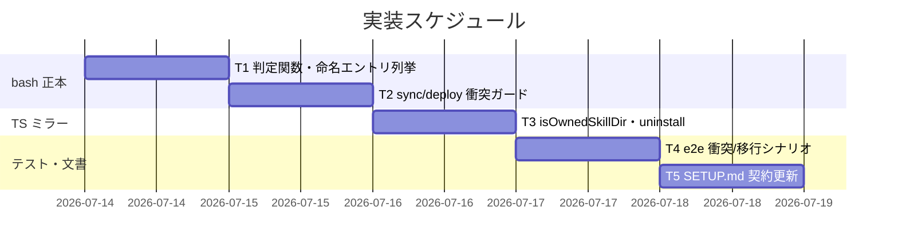

# 実装計画書: npx upgrade/uninstall での無関係スキル誤削除の恒久対策

**プロジェクト名**: npx upgrade/uninstall での無関係スキル誤削除の恒久対策
**作成日**: 2026 年 07 月 14 日
**最終更新**: 2026 年 07 月 14 日

> **重要**: **このドキュメントは常に更新**: 実装計画の変更、進捗状況の更新、バグの記録などがあった場合は、即座にこのドキュメントを更新してください。
> **必須項目**: 「必須」と明記した欄は空欄・抽象語のみで提出しないこと。テスト観点・BDD 仕様は具体ケースを 1 件以上記載すること。
>
> **用語**: [.agent-skill-chain/source/CONCEPTS.md §用語規約](../../../../.agent-skill-chain/source/CONCEPTS.md#用語規約) を参照。

---

## 1. 実装概要

### 1.1 実装方針（必須）

02_設計 ADR-1 に従い、由来判定の単一正本を bash（`deploy-skills.sh`）に新設し TS（`agents-md.ts`）へ同型ミラーする。破壊操作（`rm -rf`・上書き・uninstall 削除）を由来判定に従属させ、衝突は保持＋警告に倒す。既存の R1/R2/R3 保持シナリオを回帰させない最小差分で実装する。

### 1.2 実装順序（必須: 1 件以上）



実装順: T1（bash 判定・列挙）→ T2（bash 衝突ガード）→ T3（TS ミラー・uninstall）→ T4（テスト）→ T5（ドキュメント）。

---

## 2. タスク分解

**必須**: 各タスクには **「テスト観点」（2.x.3）** と **「単体テスト仕様（BDD）」（2.x.4）** を必ず記載する。

### 2.1 タスク 1: bash 由来判定・所有エントリ列挙（`deploy-skills.sh`）

#### 2.1.1 概要（必須）

配備先スキルディレクトリの由来を判定する `is_owned_skill_dir` と、名前↔正本 SKILL.md を対にする `list_owned_skill_entries` を新設する。

#### 2.1.2 実装内容（必須: 1 件以上）

- マーカー名定数を定義（例: `ASC_SKILL_OWNED_MARKER=".agent-skill-chain-owned"`。コメントで SETUP.md の正本参照を記す）。
- `list_owned_skill_entries <src>`: 既存 `list_owned_skill_names` と同一走査で、`name<TAB>src_skill_md_path` を列挙する（ドメイン直下 `agent` は `agent<TAB>.../agent/SKILL.md`、capability は `{domain}__{cap}<TAB>.../{cap}/SKILL.md`）。
- `list_owned_skill_names` を `list_owned_skill_entries "$1" | cut -f1` の薄いラッパーへ変更（後方互換・命名の単一正本維持。他呼び出し元＝`agents-md.ts` ミラーや `build-adapters.sh` の出力互換を壊さない）。
- `is_owned_skill_dir <dest_dir> <src_skill_md>`: (1) `dest_dir` 不在→`absent`、(2) `dest_dir/$ASC_SKILL_OWNED_MARKER` 有→`owned`、(3) `dest_dir/SKILL.md` の frontmatter `name`（`grep -m1 '^name:'` 相当で抽出・トリム）が `src_skill_md` の `name` と一致→`legacy_owned`、(4) それ以外→`collision`。読取り不能/`name` 欠落は `collision`（保持側）。標準出力へ区分文字列を返す。

#### 2.1.3 テスト観点（必須）

**参照**: 観点の定義は [02_設計 §6](./02_設計.md) および [RULES のテスト戦略・TEST_BDD_FORMAT](../../../../.agent-skill-chain/source/RULES.md#テスト戦略必須要件)。

##### 単体（本タスクの具体ケース・必須 1 件以上）

- マーカーを置いた `dest_dir` で `owned` を返す。
- マーカー無し・`SKILL.md` の `name` が正本と一致で `legacy_owned` を返す。
- マーカー無し・`name` 不一致（`name: my-totally-unrelated-skill`）で `collision` を返す。
- マーカー無し・`name` が**配備ディレクトリ名と同値だが正本 name とは不一致**（例: `agent/` に `name: agent`。正本は `run-command`）で `collision` を返す＝フォールバックはディレクトリ名でなく正本 frontmatter `name` と比較するため、ディレクトリ名の偶然一致だけでは誤削除されない（02 ADR-1 §残余リスクの保護性質を仕様固定）。
- マーカー無し・`name` が正本と二重一致（例: `agent/` にユーザーが `name: run-command` を自書き）で `legacy_owned` を返す＝受容済み残余リスク r1 の仕様固定（02 ADR-1）。
- `dest_dir` 不在で `absent` を返す。
- `SKILL.md` 無し／`name:` 行無しで `collision`（保持側）を返す。
- `list_owned_skill_entries` の第1列が従来の `list_owned_skill_names` と完全一致する（回帰防止）。

##### 結合/API（該当時は必須 1 件以上）

- `list_owned_skill_names` を通じた既存呼び出し（`agents-md.ts` の所有名集合、`build-adapters.sh`）の出力が不変であること。

##### E2E/受け入れ

- 本タスク単独では E2E 未達（T4 で統合検証）。理由: 判定関数は下流の sync/uninstall に組み込んで初めて挙動が観測される。

##### バリデーション

- frontmatter 抽出は先頭マッチ・前後空白トリム（`name: "run-command"` の引用符も許容）。

#### 2.1.4 単体テスト仕様（BDD）（必須）

```gherkin
Feature: 配備先スキルディレクトリの由来判定
  Scenario: 同名だが別内容の自作スキルを衝突と判定する
    Given .claude/skills/agent/ にマーカーが無く SKILL.md の name が my-totally-unrelated-skill
    And 正本 skills/agent/SKILL.md の name が run-command
    When is_owned_skill_dir を評価する
    Then collision を返し破壊対象にしない
```

```bash
# Given: マーカー無し・name 不一致の配備先ディレクトリを用意する
mkdir -p "$dest/agent"; printf -- '---\nname: my-totally-unrelated-skill\n---\n' > "$dest/agent/SKILL.md"
# When: 由来判定を実行する
result="$(is_owned_skill_dir "$dest/agent" "$src/skills/agent/SKILL.md")"
# Then: collision（保持側）を返す
[ "$result" = "collision" ] || { echo "FAIL: expected collision, got $result"; exit 1; }
```

#### 2.1.5 依存関係

- なし（最初のタスク）。

#### 2.1.6 見積もり

- **工数**: 2–3h / **優先度**: 高

### 2.2 タスク 2: 選択的同期・配備の衝突ガード（`deploy-skills.sh` / 呼び出し `setup.sh`）

#### 2.2.1 概要（必須）

`sync_skills_selective` を由来判定に従属させ、`deploy_skills_impl` に単一エントリ絞り込みとマーカー書込みを追加する。

#### 2.2.2 実装内容（必須: 1 件以上）

- `deploy_skills_impl <src> <out> [only_name] [write_marker]` に拡張:
  - `only_name` 指定時は当該エントリのみ配備（ドメイン直下/capability の両分岐で名前一致判定）。省略時は従来どおり全件。
  - `write_marker` 真時は配備した各 dest 直下へマーカーを書込む。省略/偽時は書込まない（`build-adapters.sh` の既存呼び出し `deploy_skills_impl "$AGENTS/skills" "$out_skills"` は 2 引数のまま＝マーカー無しで不変）。
- `sync_skills_selective <src> <dest_root>` を改修:
  - `list_owned_skill_entries` を回し、各 `(name, src_skill_md)` について `dest=$dest_root/$name` を `is_owned_skill_dir` で評価。
  - `owned`/`legacy_owned`/`absent` → `rm -rf`（存在時）後に `deploy_skills_impl "$src" "$dest_root" "$name" 1`（単一エントリ配備＋マーカー付与。`legacy_owned` は結果的に backfill）。
  - `collision` → `rm` せず配備せず、`stderr` に警告（下記文言）を出しスキップ。
  - 警告文言例: `警告: {dest_root}/{name} はパッケージ所有マーカーが無く、正本スキルと name も一致しません（ユーザー自作スキルの可能性）。誤削除防止のため保持し、この名前のパッケージスキルは配備しません。競合を解消するには当該ディレクトリをリネームしてください。`（`{dest_root}` は実際の配備先＝`.claude/skills`・`.cursor/skills` の双方があるため決め打ちにしない）
- `setup.sh` の `sync_skills`/呼び出し（`setup.sh:169-174, 222-223`）は I/F 不変のため改修不要（内部委譲先の挙動のみ変わる）。コメントの契約記述（「所有エントリのみ削除→再配備」）に「由来マーカーで所有を確認したエントリのみ」を追記。

#### 2.2.3 テスト観点（必須）

##### 単体（本タスクの具体ケース・必須 1 件以上）

- `deploy_skills_impl src out agent 1` が `out/agent/SKILL.md` と `out/agent/.agent-skill-chain-owned` のみを生成する（他エントリを触らない）。
- `deploy_skills_impl src out`（2 引数）はマーカーを生成しない（アダプタ経路の回帰防止）。

##### 結合/API（該当時は必須 1 件以上）

- `sync_skills_selective`: マーカー付き所有 `agent` を最新化しマーカーを再付与する。
- `sync_skills_selective`: マーカー無し・`name` 不一致の `agent`（自作）を保持し、warning を stderr に出す。
- `sync_skills_selective`: マーカー無し・`name` 一致の旧配備物を更新しマーカーを backfill する。

##### E2E/受け入れ

- T4 の e2e シナリオで upgrade 相当を検証。

##### バリデーション

- 隠しマーカーが `cp -R "$cap_dir"/*` の対象外である（正本に混入しない）ことを確認。

#### 2.2.4 単体テスト仕様（BDD）（必須）

```gherkin
Feature: 選択的同期の衝突ガード
  Scenario: upgrade で同名の自作スキルを保持する
    Given .claude/skills/agent/ にマーカー無し・name 不一致の自作 SKILL.md と unrelated.txt がある
    When sync_skills_selective を実行する（upgrade 相当）
    Then agent/unrelated.txt と自作 SKILL.md は保持され、警告が stderr に出る
```

```bash
# Given: 同名の自作スキル（マーカー無し・name 不一致）を配置する
mkdir -p "$dest/agent"; printf -- '---\nname: my-totally-unrelated-skill\n---\n' > "$dest/agent/SKILL.md"
: > "$dest/agent/unrelated.txt"
# When: 選択的同期を実行する
sync_skills_selective "$src/skills" "$dest" 2> "$err"
# Then: 自作物が保持され警告が出る
[ -f "$dest/agent/unrelated.txt" ] && grep -q '警告' "$err" || { echo FAIL; exit 1; }
```

#### 2.2.5 依存関係

- タスク 1（`is_owned_skill_dir` / `list_owned_skill_entries`）。

#### 2.2.6 見積もり

- **工数**: 2–3h / **優先度**: 高

### 2.3 タスク 3: TS ミラー・uninstall 衝突ガード（`src/agents-md.ts`）

#### 2.3.1 概要（必須）

bash `is_owned_skill_dir` の同型 `isOwnedSkillDir` を新設し、`runUninstall` の所有スキルエントリ削除を由来判定に従属させる。

#### 2.3.2 実装内容（必須: 1 件以上）

- マーカー定数を定義（`.agent-skill-chain-owned`。bash と同一。コメントで単一正本 `deploy-skills.sh` を参照）。
- `isOwnedSkillDir(destDir: string, srcSkillMd: string): "absent"|"owned"|"legacy_owned"|"collision"`:
  - `!existsSync(destDir)` → `absent`、マーカー存在 → `owned`、`destDir/SKILL.md` の `name` frontmatter が `srcSkillMd` の `name` と一致 → `legacy_owned`、他 → `collision`。読取り例外は `collision`。
- `ownedSkillNames()` を、bash `list_owned_skill_entries` 同様に**名前と正本 SKILL.md パスの対**も得られる形へ内部拡張（既存の返り値 `string[]` は維持しつつ、`deployedOwnedSkillEntries` が正本 SKILL.md パスを引けるようにする。命名規約は現状ロジックを流用＝drift 無し）。
- `runUninstall`: `deployedOwnedSkillEntries()` 由来の各所有スキルエントリについて、実ディレクトリを `isOwnedSkillDir` で評価し、`owned`/`legacy_owned` のみ `targets` に含める。`collision` は除外し「保持するユーザー資産」欄に列挙表示（`保持: .claude/skills/{name}（非所有の同名ディレクトリ）`）。既存の hooks/owned files 等の削除ロジックは不変。
- `npm run build` で `bin/agents-md.js` を再生成できることを確認（配布物）。

#### 2.3.3 テスト観点（必須）

##### 単体（本タスクの具体ケース・必須 1 件以上）

- `isOwnedSkillDir` が bash と同一区分（`owned`/`legacy_owned`/`collision`/`absent`）を返す（同一 fixture で bash とクロス確認）。

##### 結合/API（該当時は必須 1 件以上）

- `uninstall --yes`: マーカー付き所有 `agent` を削除する。
- `uninstall --yes`: マーカー無し・`name` 不一致の自作 `agent` を保持し、dry-run 一覧の削除対象に出さず保持欄に出す。
- `uninstall --yes`: collision エントリ保持時、既存の空ディレクトリ後片付け（`agents-md.ts` の `.claude/skills` 等の空判定）が発火せず `.claude/skills/` ディレクトリ自体も残る（保持エントリがあるため空でない）。既存後片付けロジック自体は変更しない。

##### E2E/受け入れ

- T4 の uninstall シナリオで検証。

##### バリデーション

- frontmatter `name` 抽出は bash と同一規則（先頭一致・引用符/空白許容）。

#### 2.3.4 単体テスト仕様（BDD）（必須）

```gherkin
Feature: uninstall の衝突ガード
  Scenario: uninstall で同名の自作スキルを保持する
    Given .claude/skills/agent/ がマーカー無し・name 不一致
    When agents-md uninstall --yes を実行する
    Then .claude/skills/agent は削除されず保持される
```

```typescript
// Given: マーカー無し・name 不一致の配備先ディレクトリを用意する
writeFileSync(join(dest, ".claude/skills/agent/SKILL.md"), "---\nname: my-totally-unrelated-skill\n---\n");
// When: 由来判定を評価する
const verdict = isOwnedSkillDir(join(dest, ".claude/skills/agent"), join(pkgSrc, "skills/agent/SKILL.md"));
// Then: collision（保持）を返す
if (verdict !== "collision") throw new Error(`expected collision, got ${verdict}`);
```

#### 2.3.5 依存関係

- タスク 1・2（判定規則の正本確定後にミラー）。

#### 2.3.6 見積もり

- **工数**: 2–3h / **優先度**: 高

### 2.4 タスク 4: E2E テスト追加（`test/e2e-install-uninstall.sh` 他）

#### 2.4.1 概要（必須）

同名衝突の保持・レガシー移行 backfill を bash（upgrade 相当）・TS（uninstall）両経路で再現検証するシナリオを追加する。

#### 2.4.2 実装内容（必須: 1 件以上）

- 新シナリオ R4「同名衝突保持（upgrade）」: install 後に `.claude/skills/agent/` へマーカー無し・`name` 不一致の自作 SKILL.md と `unrelated.txt` を置き、再 init（upgrade 相当）で両者が保持され警告が出ることを assert（`.cursor/skills/agent` も同様）。
- 新シナリオ R5「同名衝突保持（uninstall）」: 上記状態で `uninstall --yes` を実行し、自作 `agent` が保持されること、および保持エントリが残るため `.claude/skills/` ディレクトリ自体が空ディレクトリ後片付けで削除されないことを assert。
- 新シナリオ R6「レガシー移行 backfill」: install 後にマーカーを削除（旧配備物を模擬）し、再 init でマーカーが再生成（backfill）され SKILL.md が最新化されることを assert。
- 併せて既存 R1/R2/R3・`install: skills が domain__capability 形式で配備される`（`e2e-install-uninstall.sh:97-101`）が回帰しないことを確認。
- 単体レベルの bash 関数テスト（タスク 1・2 の関数直呼び）を新規テストスクリプト（例 `test/test-deploy-skills-owned-guard.sh`）に追加し、`test/run-all.sh` へ登録。
- **テスト隔離厳守**: すべて `mktemp -d` 隔離環境で実行し、本リポの `.claude/.cursor/.agent-skill-chain/runtime/` を変更しない（[.agent-skill-chain/project/自己拡張ワークフロー.md §テストの tmp 隔離](../../../../.agent-skill-chain/project/自己拡張ワークフロー.md)）。

#### 2.4.3 テスト観点（必須）

##### 単体（本タスクの具体ケース・必須 1 件以上）

- 新規 `test-deploy-skills-owned-guard.sh` が判定 4 区分・sync ガード・マーカー書込みを網羅する。

##### 結合/API（該当時は必須 1 件以上）

- `run-all.sh` に新スクリプトが登録され緑になる。

##### E2E/受け入れ

- R4/R5/R6 が緑。R1/R2/R3 と `__` 配備 assert が回帰しない。

##### バリデーション

- 隔離ディレクトリのみを対象にした破壊操作であること（対象 dir 明示）。

#### 2.4.4 単体テスト仕様（BDD）（必須）

```gherkin
Feature: E2E 同名衝突の保持
  Scenario: R4 upgrade で自作 agent スキルが保持される
    Given install 済み dir の .claude/skills/agent に自作 SKILL.md と unrelated.txt を置く
    When 再 init（upgrade 相当）を実行する
    Then unrelated.txt が保持され、install の __ 配備 assert も緑のまま
```

```bash
# Given: 同名の自作スキルを配置する（隔離 dest）
mkdir -p "$dest/.claude/skills/agent"; printf -- '---\nname: mine\n---\n' > "$dest/.claude/skills/agent/SKILL.md"; : > "$dest/.claude/skills/agent/unrelated.txt"
# When: 再 init（upgrade 相当）を実行する
node "$CLI" init "$dest" >/dev/null 2>&1
# Then: 自作物が保持される
assert_exists "$dest/.claude/skills/agent/unrelated.txt" "R4: 自作 agent スキルが upgrade で保持される"
```

#### 2.4.5 依存関係

- タスク 1・2・3。

#### 2.4.6 見積もり

- **工数**: 3–4h / **優先度**: 高

### 2.5 タスク 5: ドキュメント更新（`SETUP.md` 他）

#### 2.5.1 概要（必須）

保持・上書き契約とマーカーの存在を SETUP.md に正確に反映する（docs と実装の不整合を残さない＝spec/06 原則）。

#### 2.5.2 実装内容（必須: 1 件以上）

- `SETUP.md §init/upgrade/uninstall の保持・上書き契約` の所有区分表・パッケージ管理表（`SETUP.md:187-227`）に、`.claude/skills/{name}/.agent-skill-chain-owned`・`.cursor/skills/{name}/.agent-skill-chain-owned`（配備マーカー・パッケージ所有）と、「所有スキルの削除・上書きは由来マーカー（無い場合は SKILL.md の name 一致）で確認したエントリに限定し、同名の非所有ディレクトリは保持する」旨を追記。
- 命名/所有の単一正本コメント（`deploy-skills.sh` 冒頭・`agents-md.ts` の該当関数コメント・`SETUP.md:227` の注）に、由来判定も同ファイルへ集約した旨を追記。
- 「現在の事実のみを記述」（歴史説明を残さない）方針に従い、経緯ではなく現契約として記述する。
- 関連参照（`platforms/DESIGN_SYNC_SKILLS_NAMING.md`・`platforms/SKILLS.md`）にマーカーへの言及が必要か確認し、必要時のみ最小追記。

#### 2.5.3 テスト観点（必須）

##### 単体（本タスクの具体ケース・必須 1 件以上）

- `test/test-audit.sh` 等のドキュメント整合監査（存在する場合）が緑。該当なしなら「該当なし」。

##### 結合/API

- 該当なし（ドキュメントのみ）。

##### E2E/受け入れ

- 該当なし。SETUP.md の記述が実装（マーカー生成・保持挙動）と一致することをレビューで確認。

##### バリデーション

- リンク・パス表記がルート相対で正しいこと。

#### 2.5.4 単体テスト仕様（BDD）（必須）

```gherkin
Feature: 契約ドキュメントの整合
  Scenario: SETUP.md がマーカーと保持契約を記述する
    Given 実装でマーカー .agent-skill-chain-owned を配備する
    When SETUP.md の所有区分表を参照する
    Then マーカーの記載と「同名非所有ディレクトリは保持」の契約が存在する
```

```bash
# Given/When: SETUP.md を参照する
# Then: マーカーと保持契約の記述が存在する
grep -q '.agent-skill-chain-owned' .agent-skill-chain/source/SETUP.md || { echo "FAIL: marker not documented"; exit 1; }
```

#### 2.5.5 依存関係

- タスク 1〜4（実装確定後に文書化）。

#### 2.5.6 見積もり

- **工数**: 1–2h / **優先度**: 中

---

## テスト観点

各タスク §2.x.3 に具体ケースを記載済み。要約: (1) 由来判定 4 区分（bash/TS 同値）、(2) 同名衝突の保持（upgrade・uninstall）、(3) レガシー移行の backfill、(4) アダプタ経路・`__` 命名・R1/R2/R3 の非回帰。クリティカル観点はユーザー資産保持（破壊しないこと）。

## 単体テスト

- bash: `is_owned_skill_dir` の 4 区分、`list_owned_skill_entries` の第1列 == 旧 `list_owned_skill_names`、`deploy_skills_impl` の単一エントリ＋マーカー書込み（新規 `test/test-deploy-skills-owned-guard.sh`）。
- TS: `isOwnedSkillDir` の 4 区分（bash とクロス確認）。

## BDD

各タスク §2.x.4 の Gherkin/コード例に集約。Given/When/Then インラインコメントは [TEST_BDD_FORMAT.md](../../../../.agent-skill-chain/source/TEST_BDD_FORMAT.md) に従う。01_要件定義の BDD（原因の自己検証）は本 issue で確定済みで、本実装計画の衝突保持シナリオはその原因（名前一致無条件削除）を恒久是正する対応に対応する。

---

## 3. 実装スケジュール

### 3.1 マイルストーン

| マイルストーン | 期日 | 成果物 |
| -------------- | ---- | ------ |
| M1: bash 正本完成 | T1+T2 | `deploy-skills.sh` 判定・ガード＋単体緑 |
| M2: TS ミラー完成 | T3 | `agents-md.ts` uninstall ガード＋ビルド緑 |
| M3: 検証・文書完了 | T4+T5 | e2e R4/R5/R6 緑・SETUP.md 更新 |

### 3.2 実装フェーズ

#### フェーズ 1: 正本とミラー

- **タスク**: T1, T2, T3

#### フェーズ 2: 検証と文書

- **タスク**: T4, T5

---

## 4. テスト計画

テスト観点・レベル・BDD 形式の定義は 02_設計 §6 および RULES のテスト戦略・TEST_BDD_FORMAT を参照。各タスク §2.x.3 に具体ケース、§2.x.4 に BDD を記載済み。

### 4.1 テストの優先順位

- クリティカル（ユーザー資産保持）は厚くテスト: 同名衝突の upgrade/uninstall 保持を bash・TS 両経路で必須化。
- 回帰必須: R1/R2/R3・`__` 配備 assert・アダプタ生成（`build-adapters.sh` 経路のマーカー非書込み）。

---

## 5. リスク管理

### 5.1 実装リスク

- **リスク**: レガシー移行フォールバック（`name` 一致）の抽出が frontmatter 表記揺れ（引用符・前後空白・大文字）で誤判定する。
  - **対策**: bash/TS で同一の正規化（先頭一致・トリム・引用符除去）を実装し、両者クロステストで一致を担保。判定不能時は保持側（`collision`）に倒す。
- **リスク**: `deploy_skills_impl` の引数拡張が既存呼び出し（`build-adapters.sh` の 2 引数呼び）を壊す。
  - **対策**: 追加引数は省略可能・省略時は従来挙動を厳守。アダプタ経路のマーカー非書込みを E2E で回帰確認。
- **リスク**: 隠しマーカーが正本ツリーやアダプタカプセルへ混入する。
  - **対策**: マーカーは配備先にのみ生成（`cp -R "$dir"/*` はドットファイル非対象）。アダプタ経路はマーカー非書込み。verify-npm-pack 系テストで配布物への非混入を確認。

---

## 6. 参考資料

### プロジェクトドキュメント

- [`02_設計.md`](./02_設計.md) - 設計
- [`00_要求定義.md`](./00_要求定義.md) - 原因調査・実機再現

### その他の参考資料

- [.agent-skill-chain/source/scripts/lib/deploy-skills.sh](../../../../.agent-skill-chain/source/scripts/lib/deploy-skills.sh)
- [src/agents-md.ts](../../../../src/agents-md.ts)
- [test/e2e-install-uninstall.sh](../../../../test/e2e-install-uninstall.sh)
- [.agent-skill-chain/source/SETUP.md](../../../../.agent-skill-chain/source/SETUP.md)

---

## 7. 前のステップ

- **前**: [`02_設計.md`](./02_設計.md) - 設計フェーズ

---

## 8. 次のステップ

- 本 issue は 1 つの issue として扱う（サブ分割なし）。実装着手前に **review-docs（実装前ドキュメントレビュー）** を必須ゲートとして経る（別途指示）。
