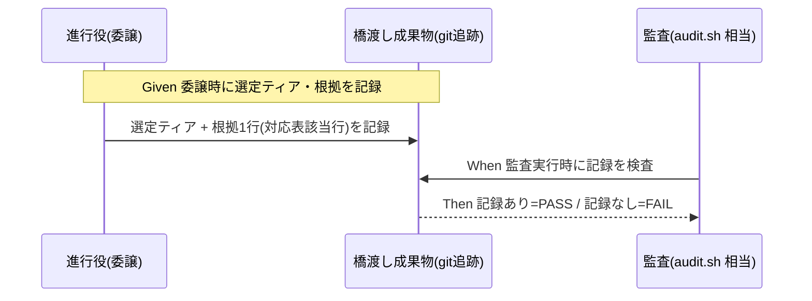

# 要件定義書: モデルティア明記義務の機械強制欠如の是正

**プロジェクト名**: モデルティア明記義務の機械強制欠如の是正
**作成日**: 2026 年 07 月 14 日
**最終更新**: 2026 年 07 月 14 日

> **重要**: **このドキュメントは常に更新**: 要件の変更や追加があった場合は、即座にこのドキュメントを更新してください。
>
> **用語**: [.agent-skill-chain/source/CONCEPTS.md §用語規約](../../../../.agent-skill-chain/source/CONCEPTS.md#用語規約) を参照。

---

## 1. 概要

### 1.1 システム概要

サブ委譲時のモデルティア明記義務（`MODEL_SELECTION.md §2`）と役割→ティア対応表（`MODEL_TIER_TABLE.md`）は正式ドキュメントとして存在するが、その遵守を検証・監査する機械的手段が `audit.sh` を含めどこにも存在しない。本 issue は、既存方針を書き直すことなく、委譲時の選定ティア・根拠を git 追跡成果物へ記録し、それを監査経路が検査する「橋渡し＋検証層」を新設して、実効性のギャップを閉じることを要件化する。

### 1.2 用語集

| 用語 | 説明 |
| ---- | ---- |
| ティア明記義務 | サブ委譲時に選定ティアと根拠 1 行を委譲パケットに明示する義務（`MODEL_SELECTION.md §2`） |
| 役割→ティア対応表 | 設計/レビュー/監査=opus、実装=原則 sonnet（複雑箇所 opus）、書記=haiku、fable=原則禁止 の対応（`MODEL_TIER_TABLE.md`） |
| fable 例外 | ユーザーが個別 issue を最重要と明示指定した場合のみ fable を許容する規定（日常運用化しない） |
| 実効性のギャップ | 方針は文書化されているが、それを機械検証する手段が無い状態 |
| 橋渡し成果物 | 実行時イベント（`model` パラメータ）を静的検査可能にするために選定ティア・根拠を記録する git 追跡先（03/memo/workflow.db 等の候補） |
| 対象外環境 | ティア選択の概念が無い/解決できないランタイム。強制は非発火 |

---

## 2. 機能要件

### 2.1 ユーザーストーリー

#### ストーリー 1: ティア未明記の委譲を機械検知する

- **As a** リポジトリ保守者（進行役の委譲品質を担保したい）
- **I want to** サブ委譲時にティア・根拠が明記されていないケースを監査で検知したい
- **So that** 今回のような「全フェーズ一括委譲・ティア未明記」の違反が、目視ではなく機械的に発覚し、品質ゲートが形骸化しない

**受け入れ基準**:

- 監査経路（audit.sh 等）に tier 関連の検査が 1 件以上存在する。
- ティア未明記を模したケースで FAIL、正しく明記されたケースで PASS する。

#### ストーリー 2: fable 例外運用を壊さず、例外申告も検証する

- **As a** ユーザー（特定 issue を最重要として fable を明示指定することがある）
- **I want to** 例外として fable を指定した委譲が、例外申告の記録によって正当に許容されること
- **So that** 既存の fable 例外規定（`MODEL_TIER_TABLE.md`）が機械強制の導入で壊れず、かつ無申告の fable 濫用は検知される

**受け入れ基準**:

- fable をユーザーが最重要指定した委譲は、例外申告の記録があるとき FAIL しない。
- 例外申告の記録が無い fable 使用は検知対象となる（設計で確定する検知粒度に従う）。

#### ストーリー 3: 既存方針を書き直さずに実効性を付与する

- **As a** リポジトリ保守者
- **I want to** MODEL_SELECTION.md・MODEL_TIER_TABLE.md の記述を変更せずに検証層のみを追加したい
- **So that** 妥当な既存方針の再策定コストや退行リスクを負わずに、実効性のギャップだけを閉じられる

**受け入れ基準**:

- 両ファイルの方針記述が diff 上変更されていない。
- 追加されるのは記録の橋渡しと監査チェックのみである。

#### ストーリー 4: 対象外環境ではロックアウトしない

- **As a** 非 Claude ランタイム等の消費者
- **I want to** ティア選択の概念が無い環境で本強制が発火せず SKIP されること
- **So that** マルチ PF 中立性を保ち、ティア概念の無い環境で作業が止まらない

**受け入れ基準**:

- ティア選択概念なし／DB・GitHub 非採用相当の環境で新チェックが SKIP する。
- SKIP がログ上明示され、ロックアウトしない。

### 2.2 BDD ユースケース

#### ユースケース 1: 委譲時のティア明記の監査

**シナリオ 1: ティア未明記で FAIL**

```gherkin
Feature: モデルティア明記義務の機械検証
  Scenario: ティア・根拠が記録されていない委譲が検知される
    Given ティア選択が可能なランタイムで或る phase の委譲が行われた
    And 選定ティアと根拠が橋渡し成果物に記録されていない
    When 監査（audit.sh 相当）を実行する
    Then ティア未明記として FAIL する
```

**シナリオ 2: ティア明記済みで PASS**

```gherkin
Feature: モデルティア明記義務の機械検証
  Scenario: 選定ティアと根拠が記録された委譲は通過する
    Given 或る phase の委譲で選定ティアと対応表該当行を根拠として橋渡し成果物へ記録した
    When 監査を実行する
    Then 当該項目は FAIL しない
```

**処理フロー**:



#### ユースケース 2: fable 例外の申告検証

**シナリオ 1: 申告ありの fable は許容**

```gherkin
Feature: fable 例外の申告検証
  Scenario: ユーザー最重要指定に基づく fable 使用は許容される
    Given ユーザーが当該 issue を最重要と明示指定した記録がある
    And その issue の委譲で fable を選定しティアと例外根拠を記録した
    When 監査を実行する
    Then fable 使用は例外申告の記録により FAIL しない
```

**シナリオ 2: 無申告の fable は検知**

```gherkin
Feature: fable 例外の申告検証
  Scenario: 例外申告の記録がない fable 使用が検知される
    Given fable を選定したが例外申告(ユーザー最重要指定)の記録が無い
    When 監査を実行する
    Then 無申告の fable 使用として検知対象になる
```

#### ユースケース 3: 対象外環境でのフォールバック

**シナリオ 1: ティア概念なし環境で SKIP**

```gherkin
Feature: 対象外環境フォールバック
  Scenario: ティア選択概念が無い環境では強制が発火しない
    Given ティア選択の概念が無い/解決できないランタイムである
    When 監査を実行する
    Then tier 検証チェックは SKIP し、ロックアウトしない
```

### 2.3 ビジネスルール

- ティア選定は非裁量であり、対応表該当行を根拠として明記する（`MODEL_SELECTION.md §2`・§裁量の禁止と形骸化防止）。
- fable は原則禁止。ユーザーが個別 issue を最重要と明示指定した場合のみ都度例外として許容し、日常運用化しない（`MODEL_TIER_TABLE.md`）。
- 品質ゲート（設計・レビュー・監査=opus 等）はコスト都合で下げない（`MODEL_SELECTION.md §3`）。
- 既存 audit チェックと検知対象・判定内容が重複しないこと（非交差）。

---

## 3. 非機能要件

### 3.1 パフォーマンス要件

- 新チェック追加による audit.sh 実行時間の悪化は既存チェックと同等オーダーに留める。

### 3.2 セキュリティ要件

- トークン等の秘匿情報を橋渡し成果物・memo・workflow.db・ログへ残さない（既存方針踏襲）。

### 3.3 ユーザビリティ要件

- FAIL メッセージは違反内容（どの委譲がティア未明記か等）を判別可能な形で出力する。

### 3.4 可用性要件

- 対象外環境・DB/GitHub 非採用環境で SKIP し、ロックアウト・黙認通過のいずれもしない（既存 enforcement のフォールバック原則に整合）。

---

## 4. 外部インターフェース要件

### 4.1 API 要件

- 記録の橋渡し先の候補（`03_実装計画.md`・memo・`workflow.db` のログスキーマ拡張等）と、audit.sh の検査インターフェースは design-feature で確定する。本要件では特定の実装形式を指定しない。

### 4.2 データ形式要件

- 選定ティア（opus/sonnet/haiku/fable 等）と根拠 1 行（対応表該当行の引用）を記録できる形式であること。fable の場合は例外申告（ユーザー最重要指定）を併記できること。

---

## 5. 制約事項

- 実行時イベント（Agent の `model` パラメータ）と静的ファイル検査の構造ギャップを、git 追跡成果物への記録で橋渡しする必要がある（本 issue の核心的難所）。
- MODEL_SELECTION.md・MODEL_TIER_TABLE.md の方針内容は書き直さない（検証層の新設のみ）。
- 発効日 grandfather 等により既存 issue の遡及一斉 FAIL を避ける。
- 対応表を単一情報源とし audit 側に二重管理しない設計を志向する（詳細は設計判断）。

---

## 6. 参考資料

### プロジェクトドキュメント

- [`00_要求定義.md`](./00_要求定義.md) - 要求定義
- [.agent-skill-chain/source/MODEL_SELECTION.md](../../../../.agent-skill-chain/source/MODEL_SELECTION.md)
- [.agent-skill-chain/project/MODEL_TIER_TABLE.md](../../../../.agent-skill-chain/project/MODEL_TIER_TABLE.md)
- [.agent-skill-chain/source/enforcement/ci/audit.sh](../../../../.agent-skill-chain/source/enforcement/ci/audit.sh)

### その他の参考資料

- Issue #56（npx upgrade スキル誤削除）対応時の全フェーズ一括委譲・ティア未明記の目視発覚事例

---

## 7. 前のステップ

- **前**: [`00_要求定義.md`](./00_要求定義.md) - 要求定義フェーズ

---

## 8. 次のステップ

- **次**: [`02_設計.md`](./02_設計.md) - 設計フェーズ
