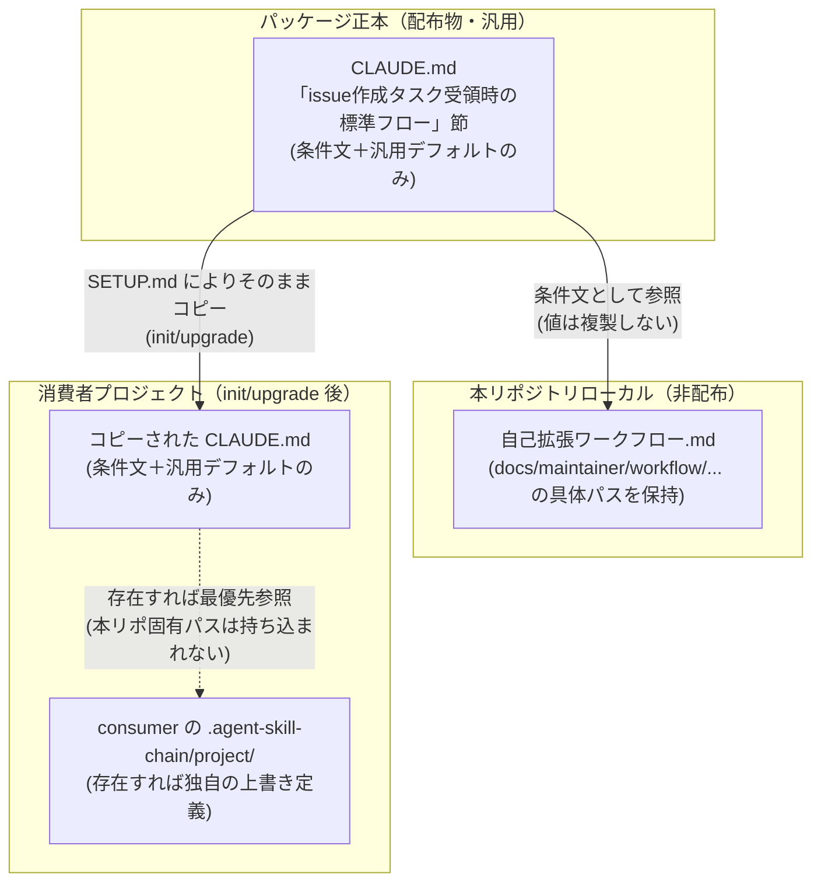
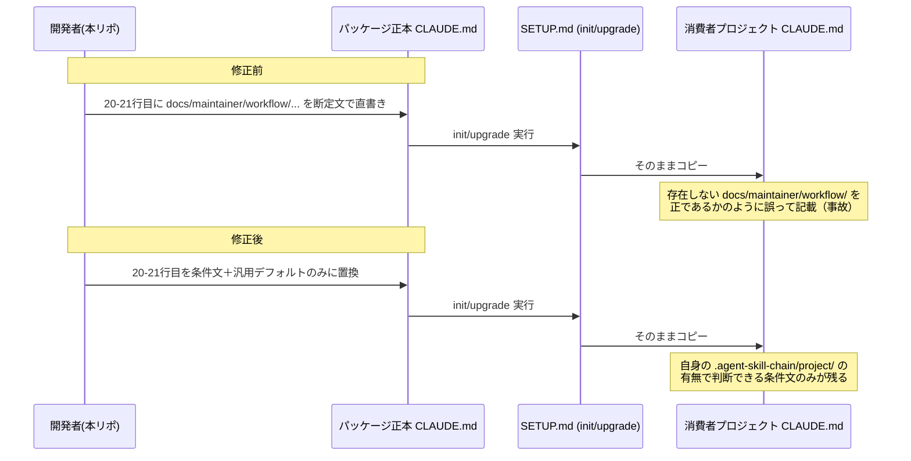
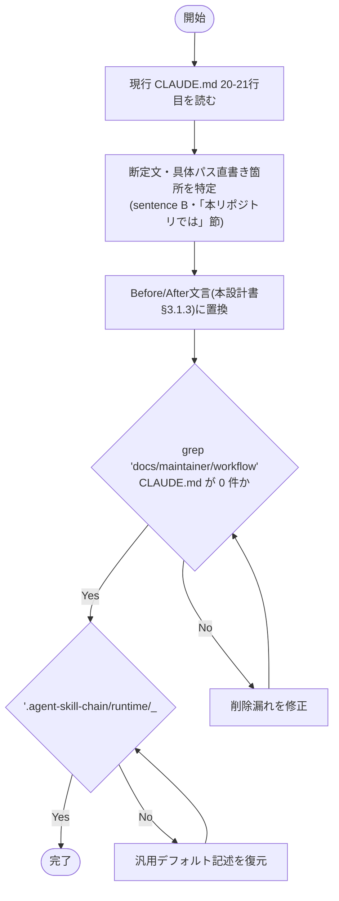

# 設計書: CLAUDE.md配布物メンテナンス限定記述混入の是正

**プロジェクト名**: CLAUDE.md配布物メンテナンス限定記述混入の是正
**作成日**: 2026 年 07 月 14 日
**最終更新**: 2026 年 07 月 14 日

> **重要**: **このドキュメントは常に更新**: 設計の変更や追加があった場合は、即座にこのドキュメントを更新してください。ドキュメントは「生きているドキュメント」として扱い、実装内容と常に同期させます。
>
> **用語**: [.agent-skill-chain/source/CONCEPTS.md §用語規約](../../../../.agent-skill-chain/source/CONCEPTS.md#用語規約) を参照。

---

## 1. 設計概要

**必須**: 設計方針・原則は [.agent-skill-chain/source/spec/01_設計原則.md](../../../../.agent-skill-chain/source/spec/01_設計原則.md) を**先に参照**した上で、本プロジェクトに**適用するものを選び**記載すること。

### 1.1 設計方針

CLAUDE.md（配布物・パッケージ正本）と `.agent-skill-chain/project/`（プロジェクトローカルの上書き定義）の**名前空間・責務を分離**し、CLAUDE.md 側には「上書きメカニズムの存在」という条件文のみを残し、本リポジトリ固有の具体パス（`docs/maintainer/workflow/...`）は `.agent-skill-chain/project/自己拡張ワークフロー.md` 側の 1 箇所のみに一元化する。これにより `init`/`upgrade` で消費者プロジェクトへ配布された際に、当該プロジェクトに存在しないパスへの言及が混入しないようにする。

### 1.2 設計原則（本プロジェクトで適用するもの）

01_設計原則の全項目のうち、本プロジェクトで適用するものを選んで記載すること。以下は記載枠（最低 1 件は採用すること）。

- **単一責務**: CLAUDE.md（配布物）は「上書きメカニズムの案内（条件文）＋汎用デフォルト値」のみを責務とする。本リポ固有の具体パス値の保持は `.agent-skill-chain/project/自己拡張ワークフロー.md` の責務とし、CLAUDE.md 側にその責務を重複させない。
- **明確な境界**: 「パッケージ正本（配布物・汎用）」と「project ローカル定義（本リポ固有・非配布）」の境界を CLAUDE.md 本文の記述レベルでも一致させる（既に `.agent-skill-chain/project/自己拡張ワークフロー.md` 冒頭が定義している境界を、CLAUDE.md 側の文言にも反映させるのみで、境界自体を新設するものではない）。

> **AIフレンドリー設計**: 本プロジェクトでは適用しない（ドキュメント 1 節の文言修正であり、ファイル構造・命名規則の変更を伴わないため）。

---

## 2. アーキテクチャ設計

### 2.1 責務・境界・参照関係

[01_設計原則 §明確な境界・§単一責務](../../../../.agent-skill-chain/source/spec/01_設計原則.md) に従い、コンポーネントの責務・境界・参照関係を明示すること。

#### 2.1.1 責務一覧

| コンポーネント | 責務（1 文） |
| --- | --- |
| `CLAUDE.md`「## issue 作成タスク受領時の標準フロー」節（20〜21 行目相当） | 上書きメカニズムの存在（条件文）と、汎用（消費者ランタイム既定）のデフォルトパスのみを示す。具体的な本リポ限定パスは持たない。 |
| `.agent-skill-chain/project/自己拡張ワークフロー.md` §issue の作成場所（標準フローの上書き） | 本リポジトリ固有の具体パス（`docs/maintainer/workflow/...`）を保持する唯一の場所（変更なし・本 issue のスコープ外）。 |
| `.agent-skill-chain/source/SETUP.md`（31・227・252 行目） | `init`/`upgrade` 時に CLAUDE.md をそのまま消費者へコピーする配布ロジック（変更なし・本 issue のスコープ外）。 |

#### 2.1.2 境界

- **入力**: 現行 `CLAUDE.md` の「## issue 作成タスク受領時の標準フロー」節、特に「作成場所の上書き最優先」ブロックと「作成先（2パターン）」ブロック（現行 20〜21 行目付近）。
- **出力**: 上記 2 ブロックを、本リポ固有の具体パスを含まない条件文＋汎用デフォルトのみの文言に置き換えた `CLAUDE.md`。
- **他責務との境界**: `.agent-skill-chain/project/自己拡張ワークフロー.md` 自体の内容変更、`SETUP.md` のコピーロジック変更、既にコピー済みの消費者側 `CLAUDE.md` の遡及修正は、いずれも本責務の範囲外（00 §5 除外要件・§4 制約条件のとおり）。

#### 2.1.3 参照関係

- CLAUDE.md（配布物）→ `.agent-skill-chain/project/`（プロジェクトローカル・存在すれば最優先参照）: 変更後も維持する。ただし CLAUDE.md 側は「そのようなファイルが存在すれば参照する」という**メカニズムの案内**に留め、`.agent-skill-chain/project/` 配下の**具体的な中身**（本リポで言えば `自己拡張ワークフロー.md` が持つ `docs/maintainer/workflow/...` というパス値）には踏み込まない。
- `.agent-skill-chain/project/自己拡張ワークフロー.md`（本リポローカル・非配布）→ 具体パス値の唯一の保持者。CLAUDE.md からこのファイルへの参照は「存在すれば従う」という間接参照のみであり、値の複製（重複記述）は行わない。
- 循環参照はない。他 issue・他サービスとの参照境界も無い（1 リポジトリ内の 2 ドキュメント間の役割分担のみ）。

### 2.2 システムアーキテクチャ

**必須**: 設計判断は [.agent-skill-chain/source/spec/](../../../../.agent-skill-chain/source/spec/)（[00_spec概要.md](../../../../.agent-skill-chain/source/spec/00_spec概要.md)、[01_設計原則.md](../../../../.agent-skill-chain/source/spec/01_設計原則.md)、[06_設計判断の優先順位.md](../../../../.agent-skill-chain/source/spec/06_設計判断の優先順位.md)）を**先に**参照すること。テンプレートは特定のアーキテクチャパターンを列挙しない。

- **採用パターン**: 配布物（パッケージ正本）とプロジェクトローカル定義の**名前空間分離**（`.agent-skill-chain/project/自己拡張ワークフロー.md` 冒頭が既に定義している設計方針を、CLAUDE.md 本文の記述にも一貫適用する）。
- **根拠**: [06_設計判断の優先順位.md](../../../../.agent-skill-chain/source/spec/06_設計判断の優先順位.md) の優先順位「1. 可読性」「3. 仕様との整合性」「5. 保守性」に基づく。具体パスを条件文の中に埋め込む現行の書き方は、消費者環境で読んだときに意味が通らず可読性を損ない、`.agent-skill-chain/project/` 側の既存定義（仕様）と重複・矛盾しており整合性を欠く。責務を CLAUDE.md／`.agent-skill-chain/project/` の 1 箇所ずつに分離することで、二重管理を解消し保守性を高める。

#### 2.2.1 CQRS（Command/Query 分離）

該当なし（ドキュメント文言の置換のみであり、状態変更／状態取得の分離という概念が適用対象ではない）。

#### 2.2.2 アーキテクチャ図（本プロジェクトの構成で記載）

配布物とプロジェクトローカル定義の責務分離、および `init`/`upgrade` による伝播経路を示す。



### 2.3 コンポーネント構成

上記 2.1 の責務一覧を踏まえたコンポーネントの配置・説明を行う。**境界・単一責務**: 明確な境界（例: UI / API / Domain / Infrastructure）を記述し、各コンポーネント・モジュールは**単一責務**を満たすよう構成すること。[01_設計原則 §明確な境界・§単一責務](../../../../.agent-skill-chain/source/spec/01_設計原則.md) を参照。

変更対象は `CLAUDE.md`（リポジトリルート）1 ファイルの「## issue 作成タスク受領時の標準フロー」節に閉じる。同節内の 4 ブロック（コンテキスト効率注記／作成場所の上書き最優先／作成先／作成・更新するファイル／Orchestrator への返却フォーマット）のうち、修正対象は**「作成場所の上書き最優先」**と**「作成先（2パターン）」**の 2 ブロックのみ。他の 2 ブロック（作成・更新するファイル、Orchestrator への返却フォーマット）は変更しない。

### 2.4 データフロー

**イベント駆動**: 該当なし（本変更はイベント発行を伴わない静的ドキュメントの文言修正であり、UserCreated 等に相当する「起きた事実」のイベントは発生しない）。

`init`/`upgrade` 実行時に `CLAUDE.md` が消費者プロジェクトへどのように伝播するかを示す（修正前後の対比）。



### 2.5 横断設計判断（ADR）

本プロジェクトの**重要判断**（採否が成果物の構造・実現可能性・後続フェーズを左右する判断。例: 技術選定・外部依存の採用・既存資産の変更方針・要件の除外・greenfield プロジェクトのアーキテクチャ/コーディング規約/ディレクトリ構成の決定）は、[EVIDENCE_POLICY.md](../../../../.agent-skill-chain/source/EVIDENCE_POLICY.md) の ADR 形式（コンテキスト・検討した選択肢・決定・根拠[evidence_source 付き]・帰結）で記録すること。

#### ADR-1: 「作成場所の上書き最優先」ブロックの断定文（本リポ限定の正）を削除する

- **コンテキスト**: 現行 20 行目は「`.agent-skill-chain/project/` に上書き定義があれば最優先で参照する」という条件文（汎用・維持すべき）と、「本リポジトリの単一 issue / サブ issue の正は `docs/maintainer/workflow/...`」という断定文（本リポ限定・配布物に不適切）の 2 文が混在している。
- **検討した選択肢**:
  1. 断定文をそのまま維持する（現状維持）。
  2. 断定文のみ削除し、条件文（＋既存の括弧書き例示 `.agent-skill-chain/project/自己拡張ワークフロー.md`）は維持する。
  3. 条件文中の括弧書き例示（`（本リポでは .agent-skill-chain/project/自己拡張ワークフロー.md）`）も含めて削除し、純粋な条件文のみに絞る。
- **決定**: 選択肢 3（括弧書き例示も含めて削除し、条件文のみに絞る）を採用する。
- **根拠**: 括弧書き例示もまた「本リポでは」という形で本リポ固有のファイル名（`自己拡張ワークフロー.md`）を配布物に直書きするものであり、00 の必要性（1.2 節）が定める「パッケージ正本には本リポ固有の具体的な運用詳細を一切含めない」という原則、および 01 の受け入れ基準（ストーリー 2）に照らして、選択肢 2 より一貫性が高い。01_要件定義 2.3 ビジネスルールにも「CLAUDE.md（配布物）には、本リポジトリ固有の具体パス・具体的な運用詳細を一切含めない」と明記されており、ファイル名も運用詳細の一部とみなす。evidence_source: internal（00_要求定義.md §1.2 必要性・01_要件定義.md §2.3 ビジネスルール）。
- **帰結**: CLAUDE.md 側は「`.agent-skill-chain/project/` に上書き定義があるかどうか」だけを判断材料とし、上書き定義の実体（ファイル名・パス内容）は各プロジェクトの `.agent-skill-chain/project/` 側を実際に開いて確認する運用になる。本リポジトリでの動作は `.agent-skill-chain/project/自己拡張ワークフロー.md` が既に存在し続けるため変わらない（§2.1.3 参照関係のとおり）。

#### ADR-2: 「作成先（2パターン）」ブロックから本リポ限定の具体パスを削除し、汎用デフォルトのみを残す

- **コンテキスト**: 現行 21 行目は「下記は汎用パッケージ標準（消費者ランタイムの既定）である」と前置きしながら、直後で「本リポジトリでは...`docs/maintainer/workflow/...`が最優先」と本リポ限定の具体パスを断定的に書き、さらに「定義は重複させず `.agent-skill-chain/project/` を参照」と述べつつ直後で具体パスそのものを書き出しており、文章として自己矛盾している。
- **検討した選択肢**:
  1. 「本リポジトリでは...」の一文をそのまま維持する（現状維持）。
  2. 「本リポジトリでは...」の一文を削除し、「`.agent-skill-chain/project/` に上書き定義が無い場合」という条件を明示した上で、既存の汎用デフォルト記述（`.agent-skill-chain/runtime/<timestamp>_<title>/` 等）のみを残す。
  3. ブロック自体を丸ごと削除する。
- **決定**: 選択肢 2 を採用する。
- **根拠**: 00 §6 成功基準・01 ストーリー 1 の受け入れ基準は、いずれも「本リポ限定パスの削除」と「汎用デフォルトの維持」の両方を要求しており、選択肢 3（丸ごと削除）は汎用デフォルトの記述まで失われ受け入れ基準を満たさない。選択肢 2 は「定義は重複させず参照する」という自己矛盾も解消する（重複させない＝具体パスを一切書かない、を文字どおり実行する）。evidence_source: internal（00_要求定義.md §6 成功基準・01_要件定義.md §2.1 ストーリー 1）。
- **帰結**: `CLAUDE.md` から文字列 `docs/maintainer/workflow` が完全に消える。汎用デフォルト（`.agent-skill-chain/runtime/<timestamp>_<title>/` 等）はそのまま消費者プロジェクトでも有効な記述として残る。

#### ADR-3: `.agent-skill-chain/project/自己拡張ワークフロー.md` 側は変更しない

- **コンテキスト**: 同ファイル §issue の作成場所（標準フローの上書き）（7〜17 行目）に、既に `docs/maintainer/workflow/...` の具体パス定義が存在することを確認済み（本エージェントによる読了で確認）。CLAUDE.md 側から重複箇所を削除しても、この情報は失われない。
- **検討した選択肢**:
  1. `.agent-skill-chain/project/自己拡張ワークフロー.md` 側にも手を入れ、CLAUDE.md との整合性を明示的に相互参照させる。
  2. `.agent-skill-chain/project/自己拡張ワークフロー.md` 側は一切変更しない。
- **決定**: 選択肢 2 を採用する。
- **根拠**: 00 §4.2・§5（制約条件・除外要件）、01 §5（制約事項）がいずれも「`.agent-skill-chain/project/自己拡張ワークフロー.md` 自体の内容は変更しない」と明記しており、本 issue のスコープを CLAUDE.md 側の記述に限定している。同ファイルは既に「CLAUDE.md / `.agent-skill-chain/source/` の標準では issue を `.agent-skill-chain/runtime/<timestamp>_<title>/` に作るが、本リポジトリでは下記に作成する」という、上書きである旨を明示した記述になっており、CLAUDE.md 側の修正と矛盾しない。evidence_source: internal（00_要求定義.md §4.2/§5、01_要件定義.md §5、`.agent-skill-chain/project/自己拡張ワークフロー.md` 7〜17 行目の実読）。
- **帰結**: 本 issue の変更範囲は `CLAUDE.md` 1 ファイルのみに閉じる。情報の欠落は発生しない（重複解消であり、正本は `.agent-skill-chain/project/自己拡張ワークフロー.md` に一元化される）。

---

## 3. 機能設計

### 3.1 機能 1: CLAUDE.md「issue 作成タスク受領時の標準フロー」節の書き換え

#### 3.1.1 概要

`CLAUDE.md` の「## issue 作成タスク受領時の標準フロー」節にある「作成場所の上書き最優先」ブロックと「作成先（2パターン）」ブロック（現行 20〜21 行目相当）を、本リポ限定の具体パス直書きを含まない条件文＋汎用デフォルトのみの文言に置き換える。

#### 3.1.2 処理フロー



#### 3.1.3 入力・出力

- **入力**: 現行 `CLAUDE.md` 20〜21 行目（Before、下記）。

```markdown
- **作成場所の上書き最優先**: `.agent-skill-chain/project/`（本リポでは `.agent-skill-chain/project/自己拡張ワークフロー.md`）に issue 作成場所の上書き定義がある場合は、下記の汎用標準より**それを最優先で参照**する。本リポジトリの単一 issue / サブ issue の正は `docs/maintainer/workflow/...`（`.agent-skill-chain/runtime/` ではない）。
- **作成先（2パターン）**: 下記は**汎用パッケージ標準（消費者ランタイムの既定）**である。**本リポジトリでは :18 のとおり `.agent-skill-chain/project/自己拡張ワークフロー.md` の上書き（単一 issue＝`docs/maintainer/workflow/<timestamp>_<title>/`、サブ issue＝`docs/maintainer/workflow/{parent}/90_issues/{ディレクトリ名}/`）が最優先**であり、そちらに作成する（定義は重複させず `.agent-skill-chain/project/` を参照）。汎用標準では **単一 issue** は `.agent-skill-chain/runtime/<timestamp>_<title>/`、**サブ issue**（PR 指摘対応等）は `.agent-skill-chain/runtime/{parent}/90_issues/{ディレクトリ名}/` に作成する（例: `{parent}` = `20260314_064719_PR4指摘対応`、`{ディレクトリ名}` = `20260314_PR4_PR指摘対応`）。`<timestamp>` は実行環境の現在時刻（JST）を取得して付与（例: `TZ=Asia/Tokyo date +%Y%m%d_%H%M%S`）。`<title>` は issue 名に相当する短い識別子。
```

- **出力**: 修正後の `CLAUDE.md` 20〜21 行目相当（After、下記）。実装フェーズ（implement-feature）はこの文言をそのまま適用する。

```markdown
- **作成場所の上書き最優先**: `.agent-skill-chain/project/` に issue 作成場所の上書き定義がある場合は、下記の汎用標準より**それを最優先で参照**する（上書き定義の有無・具体的な内容はプロジェクトごとに異なるため、本ファイルには具体パスを記載しない）。
- **作成先（汎用標準・消費者ランタイムの既定）**: `.agent-skill-chain/project/` に上書き定義が無い場合、**単一 issue** は `.agent-skill-chain/runtime/<timestamp>_<title>/`、**サブ issue**（PR 指摘対応等）は `.agent-skill-chain/runtime/{parent}/90_issues/{ディレクトリ名}/` に作成する（例: `{parent}` = `20260314_064719_PR4指摘対応`、`{ディレクトリ名}` = `20260314_PR4_PR指摘対応`）。`<timestamp>` は実行環境の現在時刻（JST）を取得して付与（例: `TZ=Asia/Tokyo date +%Y%m%d_%H%M%S`）。`<title>` は issue 名に相当する短い識別子。
```

- **変更点の要約**:
  - 「作成場所の上書き最優先」ブロック: 括弧書き例示 `（本リポでは .agent-skill-chain/project/自己拡張ワークフロー.md）` と断定文「本リポジトリの単一 issue / サブ issue の正は `docs/maintainer/workflow/...`（`.agent-skill-chain/runtime/` ではない）」を削除。条件文本体（「`.agent-skill-chain/project/` に上書き定義がある場合は最優先で参照する」）は維持。
  - 「作成先」ブロック: 見出しを「（2パターン）」から「（汎用標準・消費者ランタイムの既定）」に変更（「2パターン」は本来「単一 issue／サブ issue」の 2 種別を指すが、現行文では「汎用/本リポ」の 2 パターンとも読める曖昧さがあったため、汎用標準であることを見出しで明確化）。「本リポジトリでは...が最優先であり、そちらに作成する（定義は重複させず参照）」という自己矛盾する一文を丸ごと削除。「汎用標準では」という前置きも、他に汎用/本リポの対比が無くなるため削除し、汎用デフォルトの記述（`.agent-skill-chain/runtime/<timestamp>_<title>/` 等・具体例・`<timestamp>`/`<title>` の説明）はそのまま維持。

#### 3.1.4 エラーハンドリング

- **リスク**: 具体パスを削除しすぎて、本リポジトリ自身が CLAUDE.md の条件文だけからは自身の上書きファイルの存在に気づけなくなる（00 §7.1 技術的リスク）。
  - **対策**: 「作成場所の上書き最優先」の条件文（`.agent-skill-chain/project/` を最優先参照する旨）は削除せず維持する（After 文言 1 行目）。`.agent-skill-chain/project/自己拡張ワークフロー.md` 自体は本 issue で変更しないため、本リポでの実際の issue 作成時にはこのファイルが参照され、`docs/maintainer/workflow/...` への作成が引き続き機能する（§2.1.3・ADR-3 参照）。
- **リスク**: 見出し変更（「2パターン」→「汎用標準・消費者ランタイムの既定」）が、既存の他ファイルからの節見出し参照（アンカーリンク等）を壊す可能性。
  - **対策**: 実装計画（03_実装計画.md）で `grep -rn "作成先（2パターン）" .` 等により CLAUDE.md 以外からの見出し参照有無を確認する（テスト観点として後述 §6 に記載）。

### 3.2 機能 2: {機能名}

該当なし（本 issue の変更対象は §3.1 の 1 箇所のみ）。

---

## 4. データ設計

該当なし（本 issue はデータモデル・テーブル・DB を持たない、Markdown ドキュメント 1 節の文言修正のみである）。

---

## 5. API 設計

該当なし（本 issue は API・エンドポイントを持たない）。

---

## 6. テスト戦略

テスト戦略の**観点の定義**は [RULES.md のテスト戦略必須要件](../../../../.agent-skill-chain/source/RULES.md#テスト戦略必須要件) を、**BDD 形式の定義**は [TEST_BDD_FORMAT.md](../../../../.agent-skill-chain/source/TEST_BDD_FORMAT.md) を参照すること。本ドキュメントでは**対象ごとのテスト割当**のみ記載する。

### 6.1 対象ごとのテスト割り当て

本 issue はコードを持たないドキュメント修正であるため、自動テスト（単体・結合/API・E2E）は該当せず、grep ベースの静的確認と目視レビューで受け入れ基準の充足を確認する。

| 対象 | 単体 | 結合/API | E2E | クリティカル観点 | バリデーション観点 | 未達理由/補足 |
| --- | --- | --- | --- | --- | --- | --- |
| `CLAUDE.md`「issue 作成タスク受領時の標準フロー」節 | × | × | × | `docs/maintainer/workflow` 文字列が CLAUDE.md 本文に一切残っていないこと | 「作成場所の上書き最優先」規定・汎用デフォルト（`.agent-skill-chain/runtime/<timestamp>_<title>/` 等）の記述が維持されていること | ドキュメント文言修正のためコードテストは未達（対象外）。grep による静的確認（下記）で代替する。 |

### 6.2 監査・レビューでの確認（証跡）

証跡の確認観点は RULES §テスト戦略必須要件および workflow/PHASES.md の監査観点を参照。本設計書 §6.1 の割当表と 03_実装計画のタスク別テスト観点・BDD が揃っていることを確認する。

**具体的な確認方法（review-docs・verify-and-close で使用）**:

1. `grep -c "docs/maintainer/workflow" CLAUDE.md` の結果が `0` であること（01 のシナリオ 1・00 §6 成功基準に対応）。
2. `grep -n "\.agent-skill-chain/runtime/<timestamp>_<title>/" CLAUDE.md` が該当行を返し、汎用デフォルトの記述が維持されていること（00 §6 成功基準・01 ストーリー 1 受け入れ基準に対応）。
3. `grep -n "作成場所の上書き最優先" CLAUDE.md` が該当行を返し、既存規定（`.agent-skill-chain/project/` を最優先参照する旨）が引き続き存在すること（00 §6・01 ストーリー 2 受け入れ基準に対応）。
4. 本リポジトリでの回帰確認: `.agent-skill-chain/project/自己拡張ワークフロー.md` が変更されていないこと（`git diff` に当該ファイルの変更が含まれないこと）を確認し、本リポの issue 作成動作（`docs/maintainer/workflow/` への作成）が継続することを担保する（01 ユースケース 2・00 §6 成功基準「本リポジトリ自身の issue 作成時の実際の動作」に対応）。

---

## 7. UI 設計

該当なし（本 issue は UI・画面遷移を持たない）。

---

## 8. セキュリティ設計

該当なし（本 issue はドキュメント文言の修正のみであり、認証・認可・データ保護は対象外）。

---

## 9. 非機能要件への対応

### 9.1 パフォーマンス

該当なし（00 §3.1・01 §3.1 のとおりドキュメント記述の修正のみ）。

### 9.2 可用性

該当なし（00 §3.4 のとおり、対応する非機能要件は「保守性」であり、§2.5 ADR-1〜3 に記載のとおり具体パスの正本を `.agent-skill-chain/project/` 側に一元化することで対応する）。

---

## 10. 参考資料

### プロジェクトドキュメント

- [`01_要件定義.md`](./01_要件定義.md) - 要件定義

### その他の参考資料

- `CLAUDE.md`（本文。特に「## issue 作成タスク受領時の標準フロー」節、現行 18〜23 行目付近）
- `.agent-skill-chain/source/SETUP.md`（31・227・252 行目 — CLAUDE.md がパッケージ正本としてルートへコピーされる配布ロジックの定義）
- `.agent-skill-chain/project/自己拡張ワークフロー.md` §issue の作成場所（標準フローの上書き）（7〜17 行目 — 本リポ固有の具体パス定義。本 issue では変更しないが、CLAUDE.md 側の記述削減後もここに情報が残ることを確認済み）

---

## 11. 前のステップ

この設計書は、以下のドキュメントを基に作成されています：

- **前**: [`01_要件定義.md`](./01_要件定義.md) - 要件定義フェーズ

---

## 12. 次のステップ

この設計書の承認後、以下のドキュメントを作成します：

- **次**: [`03_実装計画.md`](./03_実装計画.md) - 実装計画フェーズ
